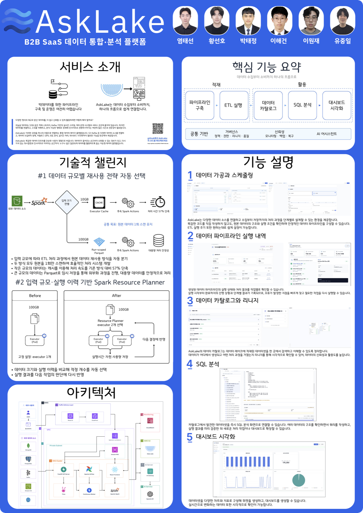
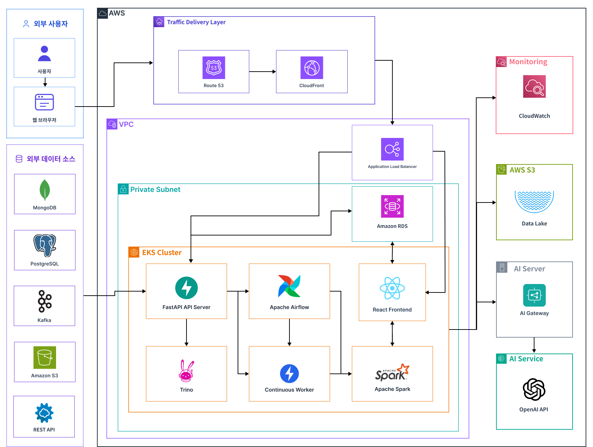

# AskLake

> **분산된 대규모 데이터를 데이터 레이크에 통합해 신뢰할 수 있는 분석과 AI 활용까지 연결하는 데이터 플랫폼**


AskLake는 파일·데이터베이스·스트림·API에 흩어진 데이터를 수집해 스키마와 품질 규칙을 적용합니다. 정제한 데이터는 Iceberg 테이블에 적재한 뒤 카탈로그, SQL, 시맨틱 모델, 대시보드, AI 기능으로 연결합니다.

이 저장소는 화면만 구현한 프로젝트가 아닙니다. React 프론트엔드, FastAPI Control Plane, Airflow/Spark 실행 계층, Iceberg/S3 데이터 레이크, Trino 쿼리 엔진, PostgreSQL 메타데이터 DB, 내부 AI Gateway, AWS 인프라·배포 코드와 검증 자동화를 함께 관리합니다.

## 목차

- [프로젝트 영상과 포스터](#프로젝트-영상과-포스터)
- [AskLake 한눈에 보기](#asklake-한눈에-보기)
- [시스템 아키텍처](#시스템-아키텍처)
- [핵심 기술 설계](#핵심-기술-설계)
- [핵심 기능](#핵심-기능)
- [빠른 시작](#빠른-시작)
- [API 사용 예시](#api-사용-예시)
- [API 엔드포인트 (Router 18개)](#api-엔드포인트-router-18개)
- [기술 스택](#기술-스택)
- [프로젝트 구조](#프로젝트-구조)
- [검증과 근거](#검증과-근거)
- [현재 구현 범위와 추가 검증](#현재-구현-범위와-추가-검증)
- [문서 안내](#문서-안내)

## 프로젝트 영상과 포스터

### 프로젝트 영상

[](https://youtu.be/XllTGJGXppc?si=EykqFclDAOjh30PY)

이미지를 클릭하면 AskLake의 문제 정의, 주요 사용자 흐름과 데이터 처리 과정을 확인할 수 있습니다.

### 서비스 소개 포스터

[](docs/assets/asklake-service-poster.pdf)

[서비스 소개 포스터 PDF 원본 보기](docs/assets/asklake-service-poster.pdf)

## AskLake 한눈에 보기

| 구분 | 내용 |
| --- | --- |
| 주요 사용자 | 데이터 엔지니어, 데이터 분석가, 플랫폼 운영자 |
| 소스 | 파일/S3, PostgreSQL, MongoDB, REST API, Kafka, 기존 데이터 레이크 데이터셋 |
| 처리 | 스키마 추론, 레코드 파싱, 변환·품질 규칙, Spark 배치·Continuous 처리 |
| 저장 | Amazon S3 또는 MinIO, Apache Iceberg |
| 활용 | 카탈로그, 리니지, 읽기 전용 SQL, 시맨틱 모델, 대시보드 |
| 거버넌스 | 세션 인증, 리소스 권한, 관리자 제어, 감사 로그 |
| AI 경계 | 내부 AI Gateway와 사용자 권한으로 범위를 제한한 MCP 카탈로그 컨텍스트 |
| 배포 | Docker Compose, EC2 운영 정의, Terraform·Helm 기반 AWS EKS |

### 전체 데이터 흐름

```text
소스 연결·탐색
  → 제한된 미리보기와 스키마 추론
  → 레코드 파싱·변환·품질 규칙
  → 스케줄·권한·대상 설정
  → Job 생성
  → Run 요청
  → Airflow DAG
  → Spark 데이터 처리
  → Iceberg 스냅샷 + S3 객체
  → Catalog 반영·리니지
  → Trino SQL
  → 시맨틱 모델·대시보드·AI 어시스턴트
```

AskLake는 `jobId → runId → datasetId → queryRunId → dashboardId`의 식별자 연결을 유지합니다. Airflow의 종료 상태만으로 성공을 확정하지 않고 Spark 산출물, Iceberg 스냅샷, Catalog 반영 결과가 모두 일치해야 하나의 실행이 완료됩니다.

## 시스템 아키텍처



위 이미지는 AskLake의 전체 서비스 구성을 나타냅니다. 저장소에서 직접 정의하고 검증하는 AWS 범위와 외부 트래픽 전달 설계 범위는 다음처럼 구분합니다.

| 계층 | 구현 구성 | 책임 |
| --- | --- | --- |
| 웹 | React, Vite, TypeScript | ETL 구성 화면, Job, 카탈로그, SQL, 시맨틱 모델, 대시보드, 관리자 화면 |
| Control Plane API | FastAPI, Pydantic, SQLAlchemy | 인증·권한, 리소스 API, 실행 명령, 상태 관리, 감사 로그 |
| AI 보안 경계 | 별도 FastAPI AI Gateway, 비공개 MCP | AI Provider 인증 정보 격리, 사용자 권한으로 제한한 카탈로그 컨텍스트, 요청 크기·재사용 제한 |
| 오케스트레이션 | Apache Airflow | 스케줄, DAG 실행, Spark Job과 Catalog reconciliation |
| 데이터 처리 | Apache Spark, Continuous Worker | 배치 스냅샷, Kafka Continuous 처리, 규칙 적용 |
| 테이블·저장소 | Apache Iceberg, Amazon S3·MinIO | 스냅샷 메타데이터, 데이터 파일, 쿼리 결과 페이지 저장 |
| 쿼리 | Trino, DuckDB, SQLGlot | 분산 SQL, 제한된 Preview, SQL 구문·권한 검증 |
| 메타데이터 | PostgreSQL·Amazon RDS | Job, Run, 카탈로그, 권한, 대시보드, 감사 메타데이터 |
| 스트리밍 | Redpanda·Amazon MSK, 선택형 ClickHouse 프로필 | Kafka 소스와 Continuous 처리, 선택형 ClickHouse serving path |
| AWS 플랫폼 | EKS Auto Mode, ALB, VPC, RDS, S3, MSK Serverless, ECR | 네트워크, 워크로드, 데이터 계층, 이미지 배포 |
| 운영 | CloudWatch, External Secrets, GitHub Actions | 로그·메트릭, Secret 전달, 빌드·회귀·배포 검증 |

`infra/eks`는 VPC, EKS, ALB Ingress, RDS, S3, MSK Serverless, ECR, IAM/Pod Identity, CloudWatch와 Secret 전달 경계를 Terraform·Helm으로 관리합니다. 아키텍처 이미지의 Route 53과 CloudFront는 외부 트래픽 구간의 목표 아키텍처입니다. 현재 저장소의 Terraform이 해당 리소스를 직접 생성하지는 않습니다.

## 핵심 기술 설계

AskLake의 핵심은 화면 수보다 데이터와 실행 상태를 어디에서 확정하는지에 있습니다.

| 문제 | 설계 | 효과 |
| --- | --- | --- |
| 대규모 S3 Prefix를 통째로 내려받는 비용 | 대표 파일을 먼저 검사하고 나머지는 기본 worker 8개가 처리합니다. 각 worker는 64 KiB range read로 시작해 필요한 만큼만 범위를 넓힙니다. | 연결 확인 단계의 메모리·네트워크 사용을 제한하면서 파일 간 스키마 호환성을 검증 |
| Preview와 실제 적재 범위 혼동 | Preview는 일부 행만 보여주지만 PostgreSQL 적재는 `REPEATABLE READ READ ONLY`와 server-side cursor로 선택한 테이블 전체를 스냅샷 처리합니다. | 화면의 샘플을 전체 적재 범위로 오해하지 않도록 두 동작을 분리 |
| 중복 요청과 worker 재시도 | `runId`, `lease`, `generation`, `fencing token`과 Run별 출력/checkpoint Prefix 사용 | 하나의 논리적 Run에 외부 실행, SparkApplication, Iceberg 스냅샷, Materialization이 중복 생성되지 않도록 방지 |
| Airflow 성공 상태와 실제 데이터 상태 불일치 | Airflow 상태, Spark 실행 보고서, Iceberg 스냅샷, Catalog 공개 여부를 각각 확인한 뒤 reconciliation | 산출물 없이 성공 처리되거나 Catalog만 먼저 공개되는 상태 방지 |
| 대용량 SQL 결과 응답 | Preview는 최대 100행으로 제한합니다. 전체 결과는 별도 Run에서 생성해 객체 저장소에 페이지 단위로 저장합니다. | API 응답 크기를 제한하고 커서 기반 페이지 조회, CSV 내보내기, 보존 기간을 독립적으로 관리 |
| AI가 권한 밖 데이터를 참조할 위험 | 배포 환경의 AI Provider API 키는 AI Gateway에만 보관합니다. 백엔드가 서명한 일회성 컨텍스트로 비공개 MCP를 조회합니다. | 사용자 권한을 통과한 데이터셋 스키마와 컨텍스트만 AI 요청에 포함 |
| AI 생성 SQL의 직접 실행 위험 | 생성 결과를 백엔드에서 다시 읽기 전용·데이터셋 범위·권한 기준으로 검증 | 모델 응답과 실제 쿼리 실행 권한을 분리 |
| 대시보드 편집 중 게시본 손상 | Draft revision과 Published revision을 분리 | 편집 저장과 사용자 공개 시점을 독립적으로 관리 |
| 데이터셋 삭제의 연쇄 영향 | 삭제 영향과 차단 조건을 먼저 계산하고 이름 재확인, 비동기 `deletion receipt`, `fencing token`을 적용 | 물리 삭제에 실패해도 메타데이터를 보존하고 중간 상태를 추적 |
| 스트림 consumer의 이중 소유 | active consumer owner를 하나로 제한하고 feature flag와 generation을 함께 전환 | Iceberg와 선택형 serving path가 같은 메시지를 중복 소비하지 않도록 차단 |

### 스냅샷 처리 원칙

- 새 스냅샷이 성공하면 해당 데이터셋의 현재 데이터 뷰를 교체합니다.
- 이전 Materialization 결과와 Iceberg 스냅샷은 실행 이력으로 보존합니다.
- Catalog는 실제 데이터 파일과 스냅샷을 확인한 뒤 공개합니다.
- 소스·처리·대상의 lineage 정보를 저장하고 화면에는 컬럼 단위 소스 → 대상 연결선으로 표시합니다.

### 쿼리 결과 수명주기

```text
검증·비용 추정
  → Preview Run
  → 사용자가 전체 결과 요청
  → 전체 결과 Run
  → 커서 페이지 수집
  → CSV 내보내기
  → 보존 기간 만료
```

PostgreSQL에는 쿼리, 실행 상태, 페이지 manifest 같은 메타데이터만 저장합니다. 전체 결과는 S3 호환 객체 저장소에 페이지 단위로 보관합니다.

## 핵심 기능

### 1. 소스 연결과 스키마

| 데이터 소스 | 탐색·검증 범위 | 적재 방식 |
| --- | --- | --- |
| 파일 / S3 | 버킷, 객체, Prefix 탐색과 일부 샘플 | 파일 하나 또는 Prefix 전체를 스냅샷으로 적재 |
| PostgreSQL | 스키마·테이블 탐색과 샘플 조회 | 선택한 테이블 전체를 일관된 읽기 전용 스냅샷으로 적재 |
| MongoDB | 데이터베이스·컬렉션 탐색과 문서 샘플 | 선택한 컬렉션을 스냅샷으로 적재 |
| REST API | 엔드포인트 응답과 최상위 데이터 확인 | 응답 레코드 적재 |
| 스트림 / Kafka | 브로커·토픽 연결과 샘플 메시지 | 스냅샷 또는 Continuous 방식으로 적재 |
| 데이터 레이크 | 권한이 있는 기존 데이터셋 탐색 | 기존 Iceberg 데이터셋을 그대로 사용 |

지원 파일 형식은 CSV·TSV, JSON·JSONL, TXT·LOG, Parquet입니다. 헤더가 없는 공백 구분 텍스트는 별도 레코드 파싱 단계에서 예상 필드 수, 컬럼 이름·타입과 잘못된 행을 검증합니다.

스키마 단계에서는 소스 필드를 대상 컬럼으로 매핑하고 NULL 허용 여부, 데이터 타입, 대상 포함 여부와 schema fingerprint를 저장합니다. S3 Prefix는 대표 파일을 먼저 검사한 뒤 나머지 파일의 fingerprint 호환성을 확인합니다.

### 2. ETL 구성 단계와 규칙 계약

```text
소스
  → 조건부 레코드 파싱
  → 스키마
  → 변환·품질 규칙
  → 스케줄
  → 권한
  → 대상
  → 최종 검토
```

- 변환·품질 규칙을 `Canonical Rule Contract 1.0`으로 정규화하고 컴파일합니다.
- 규칙은 입력·출력 컬럼, 매개변수, 출력 타입, 심각도, 오류 정책을 명시합니다.
- 컴파일 결과는 `pass` 또는 `fail`과 필드·규칙 단위 문제를 반환합니다.
- 스케줄은 수동·반복·Kafka Continuous 실행 방식과 재시도, 지수 백오프, timeout 정책을 저장합니다.
- 대상 설정에서 데이터베이스, layer(`RAW`·`BRONZE`·`SILVER`·`GOLD`), 파일 형식, 파티션, 압축, 권한을 함께 확정합니다.
- 최종 검토 API가 연결 상태, 규칙 컴파일 결과, 저장 대상, 권한을 모두 다시 확인해야 Job을 생성할 수 있습니다.

Job을 생성할 때 실제 Catalog 데이터셋을 성공 상태로 미리 등록하지 않습니다. API는 `{ job, catalogTarget }`을 반환하고 대상은 `pending_run` 상태를 유지합니다. 첫 Run이 성공하고 Iceberg 스냅샷과 Catalog reconciliation까지 끝나야 데이터셋으로 공개됩니다.

### 3. 작업·실행·오케스트레이션

Job 명령은 실행 방식과 현재 상태에 따라 다음 값을 사용합니다.

| 명령 | 동작 |
| --- | --- |
| `run`, `retry` | 스냅샷 적재 또는 SQL Materialization 실행·재시도 |
| `pause` | Job 일시정지 |
| `cancelRun` | 진행 중인 Run 취소 |
| `stopSchedule`, `resumeSchedule` | 반복 스케줄 중지·재개 |
| `startContinuous`, `pauseContinuous`, `resumeContinuous`, `stopContinuous` | Kafka Continuous 런타임 제어 |

각 Run은 시작·종료 시각, 입력·출력 행과 바이트, 출력 경로, Airflow DAG Run, 실패 단계, 오류 요약, DAG 단계 상태를 기록합니다. DAG 단계는 `pending`, `running`, `success`, `failed`, `blocked`를 사용합니다.

Continuous 런타임은 세션, 배치, 파티션 offset, lag, throughput, quarantine/replay, file compaction, Iceberg maintenance 이력을 별도 리소스로 관리합니다.

### 4. 카탈로그·리니지·거버넌스

- 데이터셋 목록과 상세: 계층, 소유자, 태그, 최신성, 품질, 크기, 행 수, 저장 형식·위치
- 실제 행 조회: `limit`·`offset` 기반 제한 조회
- 리니지: 소스·처리·대상 노드와 컬럼 연결선
- 고유 키: 데이터셋 컬럼 조합 검증 후 등록
- 파생 데이터셋: 성공한 Trino Run으로 SILVER·GOLD 데이터셋 생성
- Materialization Run 관리: Run 단위 조회·삭제와 원본 Run 추적
- 데이터셋 삭제: 영향 확인 → 차단 조건 재검사 → `confirmName` 확인 → 비동기 상태 조회
- 권한 작업: `view`, `query`, `run`, `manage`, `delete`, `share`, `publish`

프론트엔드는 카탈로그 데이터셋 ID를 SQL, 시맨틱 모델, 대시보드의 공통 데이터 식별자로 사용합니다.

### 5. 읽기 전용 SQL과 시맨틱 모델

SQL 요청은 다음 순서로 처리됩니다.

1. 요청 사용자가 기준 데이터셋과 참조 데이터셋을 조회하고 쿼리할 수 있는지 확인합니다.
2. SQLGlot 기반으로 읽기 전용 SQL과 데이터셋 범위를 검증합니다.
3. SQL AST가 참조한 컬럼과 Iceberg 메타데이터로 예상 스캔량과 실행 시간을 계산합니다. 위험도가 높은 쿼리는 `confirmationToken`을 요구합니다.
4. Trino Preview Run을 비동기로 제출하고 실행 통계와 첫 결과가 준비됐는지 확인합니다.
5. 사용자가 요청한 경우에만 Full-result Run을 만들고 커서 기반 페이지 조회와 CSV 내보내기를 제공합니다.

시맨틱 모델은 데이터셋, 지표, 차원, 관계, 용어집, 권한을 버전별로 관리합니다. `validate → publish → versions → rollback` API로 semantic layer의 수정 시점과 실제 공개 시점을 분리합니다.

### 6. 대시보드 런타임

대시보드는 카드 메타데이터와 Draft/Published revision을 분리합니다. Draft에 페이지, 위젯, 레이아웃을 저장한 뒤 사용자가 명시적으로 게시합니다.

지원하는 위젯 타입은 10종입니다.

| 범주 | 위젯 타입 |
| --- | --- |
| 값·표 | `metric`, `table` |
| 비교·추세 | `bar_chart`, `line_chart`, `area_chart` |
| 비율 | `donut_chart`, `pie_chart`, `radial_bar_chart` |
| 분포·계층 | `heatmap_chart`, `treemap_chart` |

위젯 쿼리를 실행할 때마다 저장된 데이터셋 권한을 다시 확인합니다. 데이터셋 최신성, 필터, batch result cache와 request ownership을 따로 관리해 늦게 도착한 응답이 최신 화면을 덮어쓰지 않도록 합니다.

### 7. 인증·관리·감사

- 이메일·비밀번호 로그인과 HttpOnly 세션 쿠키
- 로컬 환경 회원가입과 배포 환경의 관리자 계정 생성을 분리
- 사용자·그룹·역할·리소스 단위 권한 부여
- 주체 제한과 리소스 잠금을 포함한 거버넌스 제어
- 로그인 성공·실패, Job·데이터셋·쿼리·대시보드·관리자 작업의 감사 이벤트
- 모든 오류 응답과 구조화 로그를 연결하는 `X-Correlation-ID`

### 8. AI 게이트웨이와 어시스턴트

SQL 생성, 대시보드 어시스턴트, ETL 변환, 리뷰 분석은 모두 내부 AI Gateway를 거칩니다.

- 배포 환경에서는 AI Provider API 키를 AI Gateway에만 보관합니다. 백엔드에는 `service token`과 `context signing secret`만 전달합니다.
- AI Gateway는 Bearer service token, request body 크기, 프롬프트·컨텍스트·도구 개수와 timeout을 제한합니다.
- 쿼리와 대시보드 요청은 백엔드가 서명한 `scoped context`를 비공개 MCP에서 조회합니다.
- 컨텍스트에는 TTL과 request ID를 넣어 같은 컨텍스트를 다시 사용하지 못하게 합니다.
- AI 응답에는 Provider, 모델, 토큰 사용량, latency를 남기지만 인증 정보와 민감한 원본 row는 기록하지 않습니다.
- 생성된 SQL이나 대시보드 작업은 백엔드와 프론트엔드의 기존 검증을 통과해야 적용됩니다.

## 빠른 시작

### 사전 준비

- Node.js `22.23.1`
- Python `3.13`
- Docker와 Docker Compose
- macOS 또는 Linux 셸

### 1. 저장소와 메타데이터 DB 실행

```bash
git clone https://github.com/JUNGLE-TEAM1/AskLake.git
cd AskLake
docker compose up -d postgres
```

로컬 PostgreSQL은 기본적으로 `127.0.0.1:54328`에서 열립니다.

### 2. 백엔드

```bash
cd backend
python3.13 -m venv .venv
source .venv/bin/activate
pip install -r requirements.txt
npm ci
npm run dev
```

- API: `http://127.0.0.1:8080`
- OpenAPI 문서: `http://127.0.0.1:8080/docs`
- Health check: `http://127.0.0.1:8080/api/health`

백엔드는 FastAPI 기반 Control Plane과 소스 커넥터, Spark/Kafka 연동을 담당하는 Node.js 런타임을 함께 사용하므로 Python과 Node.js 의존성이 모두 필요합니다.

### 3. 프론트엔드

새 터미널에서 실행합니다.

```bash
cd frontend
npm ci
npm run dev
```

- 웹 화면: `http://127.0.0.1:5174`
- `/api` 요청은 기본적으로 `http://127.0.0.1:8080`으로 프록시됩니다.
- 다른 백엔드를 사용할 때만 `VITE_DEV_PROXY_TARGET`을 지정합니다.

로컬 환경에서는 회원가입 화면을 사용할 수 있습니다. 배포 환경은 기본적으로 공개 회원가입을 닫고 `BOOTSTRAP_ADMIN_EMAIL`과 16자 이상의 `BOOTSTRAP_ADMIN_PASSWORD`를 함께 설정합니다.

### 4. Trino Query Runtime

백엔드 `.venv`와 Node.js 의존성을 준비한 뒤, 기존 백엔드를 종료하고 실행합니다.

```bash
cd backend
npm run dev:query-runtime
```

이 명령은 PostgreSQL, MinIO, Trino와 객체 저장소를 초기화한 뒤 FastAPI와 Trino 결과 수집기를 함께 실행합니다. Airflow·Spark·Kafka까지 포함한 전체 검증 절차는 [개발 가이드](docs/04-development-guide.md)를 따릅니다.

### 5. 빌드와 기본 검증

```bash
cd frontend
npm run build
```

```bash
cd backend
pip install -r requirements-test.txt
PYTHONPATH=. .venv/bin/python -m pytest -q
```

```bash
curl http://127.0.0.1:8080/api/health
```

### 주요 환경 변수

| 위치 | 변수 | 목적 |
| --- | --- | --- |
| 프론트엔드 | `VITE_DEV_PROXY_TARGET` | 로컬 `/api` 프록시 대상 |
| 백엔드 | `DATABASE_URL` | 메타데이터 PostgreSQL 연결 |
| 백엔드 | `AIRFLOW_API_BASE_URL` | Airflow API 연결 |
| 백엔드 | `TRINO_ENABLED`, `TRINO_BASE_URL` | Trino Query Runtime 활성화·주소 |
| 백엔드 | `ASKLAKE_OBJECT_STORAGE_PROVIDER` | `minio` 또는 `aws` 저장소 선택 |
| 백엔드 | `AI_GATEWAY_BASE_URL`, `AI_GATEWAY_SERVICE_TOKEN` | 비공개 AI 게이트웨이 호출 |
| AI Gateway | `PROVIDER_API_KEY` | OpenAI 호환 AI Provider API key |
| 실시간 처리 | `REALTIME_EVENTS_ENABLED`, `DASHBOARD_SYNC_MODE` | SSE 이벤트와 대시보드 동기화 방식 |

전체 기본값과 배포용 Secret 정의는 `backend/.env.example`, `ai-server/.env.example`, `deploy/.env.example`에서 확인합니다.

## API 사용 예시

아래 예시는 FastAPI가 현재 사용하는 `camelCase` API 규격을 기준으로 합니다. 인증이 필요한 API는 HttpOnly 세션 쿠키를 사용합니다.

```bash
ASKLAKE_API_BASE_URL=http://127.0.0.1:8080
```

### 1. 로컬 계정과 세션

로컬 환경에서 계정을 만들고 쿠키를 저장합니다.

```bash
curl -c asklake.cookies \
  -X POST "$ASKLAKE_API_BASE_URL/api/auth/signup" \
  -H "Content-Type: application/json" \
  -d '{
    "email": "engineer@example.com",
    "password": "local-only-password",
    "displayName": "Data Engineer"
  }'
```

기존 계정 로그인:

```bash
curl -c asklake.cookies \
  -X POST "$ASKLAKE_API_BASE_URL/api/auth/login" \
  -H "Content-Type: application/json" \
  -d '{
    "email": "engineer@example.com",
    "password": "local-only-password"
  }'
```

세션 확인:

```bash
curl -b asklake.cookies \
  "$ASKLAKE_API_BASE_URL/api/auth/session"
```

### 2. 파이프라인 생성

```bash
curl -b asklake.cookies \
  -X POST "$ASKLAKE_API_BASE_URL/api/etl/jobs" \
  -H "Content-Type: application/json" \
  -d '{
    "id": "draft_customer_review",
    "jobName": "customer_review_daily_ingest",
    "sourceType": "File / S3",
    "sourceLabel": "MinIO",
    "sourceConfig": [
      ["Bucket", "asklake-raw"],
      ["Prefix", "reviews/daily/"]
    ],
    "schemaColumns": [],
    "scheduleLabel": "수동 실행",
    "permissionSummary": "analytics group",
    "targetDataset": "customer_review_silver",
    "targetLayer": "SILVER",
    "targetFormat": "Parquet",
    "owner": "Data Platform Team"
  }'
```

응답 핵심 구조:

```json
{
  "job": {
    "id": "job_...",
    "name": "customer_review_daily_ingest",
    "status": "scheduled",
    "target": "customer_review_silver"
  },
  "catalogTarget": {
    "id": "dataset_...",
    "layer": "SILVER",
    "name": "customer_review_silver",
    "status": "pending_run"
  }
}
```

`catalogTarget`은 생성 예정인 데이터셋입니다. 실제 Catalog에는 Run이 성공하고 스냅샷과 Materialization을 확인한 뒤 공개됩니다.

### 3. 작업 실행 명령

```bash
curl -b asklake.cookies \
  -X POST "$ASKLAKE_API_BASE_URL/api/etl/jobs/job_123/commands" \
  -H "Content-Type: application/json" \
  -d '{"command":"run"}'
```

응답은 `action`, `apiPath`와 변경된 `job`, 생성된 `run`, `dagSteps`를 가능한 범위에서 함께 반환합니다.

### 4. 읽기 전용 SQL 실행

#### 쿼리 검증

```bash
curl -b asklake.cookies \
  -X POST "$ASKLAKE_API_BASE_URL/api/query/validate" \
  -H "Content-Type: application/json" \
  -d '{
    "baseDatasetId": "dataset_customer_review",
    "referenceDatasetIds": [],
    "query": "SELECT review_id, rating FROM customer_review_silver LIMIT 100"
  }'
```

#### Preview 실행

```bash
curl -b asklake.cookies \
  -X POST "$ASKLAKE_API_BASE_URL/api/query/runs" \
  -H "Content-Type: application/json" \
  -d '{
    "baseDatasetId": "dataset_customer_review",
    "referenceDatasetIds": [],
    "query": "SELECT review_id, rating FROM customer_review_silver LIMIT 100",
    "resultPageSize": 200
  }'
```

Trino가 활성화되어 있으면 `202 Accepted`와 `runId`, `status`, `stats`, `result`를 반환합니다. 이 API는 요청의 `mode`와 관계없이 최대 100행만 Preview로 생성합니다.

#### 전체 결과

미리보기가 성공한 뒤 별도 Run을 생성합니다.

```bash
curl -b asklake.cookies \
  -X POST "$ASKLAKE_API_BASE_URL/api/query/runs/trino_preview_123/full-results" \
  -H "Content-Type: application/json" \
  -d '{"clientRequestId":"full-result-20260729-001"}'
```

결과 페이지와 CSV:

```bash
curl -b asklake.cookies \
  "$ASKLAKE_API_BASE_URL/api/query/runs/trino_full_456/results"
```

```bash
curl -b asklake.cookies \
  "$ASKLAKE_API_BASE_URL/api/query/runs/trino_full_456/results?cursor=opaque_cursor"
```

```bash
curl -b asklake.cookies \
  -o result.csv \
  "$ASKLAKE_API_BASE_URL/api/query/runs/trino_full_456/exports/csv"
```

### 5. 카탈로그·행·리니지

데이터셋 목록 API는 별도의 검색 query parameter를 받지 않습니다. 현재 사용자가 조회할 수 있는 데이터셋을 모두 반환합니다.

```bash
curl -b asklake.cookies \
  "$ASKLAKE_API_BASE_URL/api/catalog/datasets"
```

```bash
curl -b asklake.cookies \
  "$ASKLAKE_API_BASE_URL/api/catalog/datasets/dataset_customer_review/rows?limit=100&offset=0"
```

```bash
curl -b asklake.cookies \
  "$ASKLAKE_API_BASE_URL/api/catalog/datasets/dataset_customer_review/lineage"
```

### 6. 오류 응답 형식

모든 공통 오류는 `X-Correlation-ID` 헤더와 같은 `diagnosticId`를 반환합니다.

```json
{
  "error": {
    "code": "VALIDATION_ERROR",
    "message": "targetDataset is required",
    "details": {
      "field": "targetDataset"
    },
    "stage": "api",
    "retryable": false,
    "operatorMessage": "targetDataset is required",
    "userMessage": "targetDataset is required",
    "diagnosticId": "01J..."
  }
}
```

주요 오류 코드에는 `UNAUTHORIZED`, `FORBIDDEN`, `NOT_FOUND`, `CONFLICT`, `INVALID_JOB_STATE`, `SQL_SYNTAX_ERROR`, `RATE_LIMITED`, `SERVICE_UNAVAILABLE`, `RESULT_EXPIRED`, `RESULT_PAGE_NOT_READY`, `QUERY_CONFIRMATION_REQUIRED`, `INTERNAL_ERROR`가 있습니다.

## API 엔드포인트 (Router 18개)

`backend/app/api/router.py`가 모든 환경에서 등록하는 Router 모듈은 18개입니다. 비공개 MCP는 별도 ASGI 애플리케이션으로 마운트합니다. 개발·테스트 환경에서만 조건부로 등록하는 보조 Router도 이 숫자에서 제외했습니다.

### Router 구성

| # | Router 모듈 | 기본 경로 | 책임 |
| ---: | --- | --- | --- |
| 1 | `health` | `/api/health*` | 생존·준비 상태, 지표, AI·실시간 처리 상태 |
| 2 | `auth` | `/api/auth` | 회원가입, 로그인, 세션, 로그아웃 |
| 3 | `users` | `/api/users` | 현재 사용자와 권한 정보 조회 |
| 4 | `admin` | `/api/admin` | 사용자, 그룹, 권한, 거버넌스, 감사 |
| 5 | `ai` | `/api/ai` | 권한 검증을 거친 SQL 생성 요청 |
| 6 | `airflow_execution` | `/api/internal/airflow` | Spark 실행과 Catalog reconciliation |
| 7 | `etl` | `/api/etl` | 소스, 스키마, 최종 검토, Job, Run, Continuous 런타임 제어 |
| 8 | `catalog` | `/api/catalog` | 데이터셋, 행, 리니지, Materialization, 삭제 |
| 9 | `continuous_sql` | `/api/query/continuous-jobs` | 연속 SQL 검증, Job, 배치 |
| 10 | `sql` | `/api/query` | SQL 검증·추정, 미리보기·전체 결과, AI 제안 |
| 11 | `sql_test` | `/api/sql` | SQL 연결·실행 검사 |
| 12 | `dashboard_card` | `/api/dashboards` | 대시보드 카드 목록·생성·수정·삭제 |
| 13 | `dashboard_runtime` | `/api/dashboards` | Draft revision, 페이지, 위젯, 레이아웃, 게시 |
| 14 | `dashboard_live` | `/api/datasets`, `/api/dashboards` | 최신성과 위젯 데이터 쿼리 |
| 15 | `dashboard_assistant` | `/api/dashboards` | 대시보드 어시스턴트 작업 |
| 16 | `realtime` | `/api/realtime` | 기능 설정, 상태, SSE 이벤트, 수집 제어 |
| 17 | `integration` | 여러 `/api` 경로 | 대상 DB, S3, 리뷰 분석, 카탈로그 모델 |
| 18 | `semantic_models` | `/api/semantic-models` | 시맨틱 모델 생성·조회·수정·삭제, 검증, 버전, rollback |

### 시스템·인증·관리자

| 메서드 | 엔드포인트 | 설명 |
| --- | --- | --- |
| `GET` | `/api/health`, `/api/health/live`, `/api/health/ready` | 서비스·데이터베이스 상태 |
| `GET` | `/api/health/metrics`, `/api/health/ai`, `/api/health/realtime` | 메트릭과 하위 런타임 상태 |
| `POST` | `/api/auth/signup`, `/api/auth/login`, `/api/auth/logout` | 계정과 세션 쿠키 |
| `GET` | `/api/auth/session`, `/api/users/me` | 세션·현재 사용자 |
| `GET` | `/api/admin/users`, `/groups`, `/permissions` | 관리자 식별 정보 조회 |
| `POST/PATCH/DELETE` | `/api/admin/permissions...` | 권한 부여 관리 |
| `GET/PATCH` | `/api/admin/governance...` | 주체·리소스 잠금 관리 |
| `GET` | `/api/admin/audit-logs` | 감사 로그 조회 |

### ETL·작업·Airflow

| 메서드 | 엔드포인트 | 설명 |
| --- | --- | --- |
| `POST` | `/api/etl/sources/test` | 소스 연결과 일부 샘플 검증 |
| `POST` | `/api/etl/sources/assets` | 버킷·객체, 스키마·테이블, 컬렉션 탐색 |
| `POST` | `/api/etl/schema-inference` | 스키마 초안 생성 |
| `POST` | `/api/etl/record-parsing/preview` | 원본 텍스트 레코드 구조 검증 |
| `POST` | `/api/etl/review` | Job 생성 전 전체 설정 재검증 |
| `POST` | `/api/etl/jobs` | 파이프라인 Job 생성 |
| `POST` | `/api/etl/sql-jobs` | Trino SQL Materialization Job 생성 |
| `GET` | `/api/etl/jobs`, `/api/etl/jobs/{jobId}` | Job 목록·상세 |
| `PATCH/DELETE` | `/api/etl/jobs/{jobId}` | Job 수정·삭제 |
| `POST` | `/api/etl/jobs/{jobId}/commands` | Run·스케줄·Continuous 런타임 명령 |
| `GET` | `/api/etl/jobs/{jobId}/continuous/sessions...` | 세션과 배치 이력 |
| `GET/POST` | `/api/etl/jobs/{jobId}/continuous/quarantine...` | 격리 데이터 조회·재처리 |
| `POST` | `/api/etl/jobs/{jobId}/continuous/compactions` | 데이터 파일 병합 |
| `POST` | `/api/etl/jobs/{jobId}/continuous/iceberg-maintenance` | 스냅샷·orphan file 관리 |
| `POST` | `/api/internal/airflow/spark-runs/{runId}/execute` | Airflow가 요청하는 Spark 실행 |
| `POST` | `/api/internal/airflow/spark-runs/{runId}/catalog` | Spark 실행 결과를 Catalog에 반영 |

### 카탈로그·Materialization

| 메서드 | 엔드포인트 | 설명 |
| --- | --- | --- |
| `GET` | `/api/catalog/datasets` | 현재 권한으로 조회할 수 있는 데이터셋 목록 |
| `GET` | `/api/catalog/datasets/{datasetId}` | 데이터셋 상세 |
| `GET` | `/api/catalog/datasets/{datasetId}/rows` | 제한 행 조회 |
| `POST` | `/api/catalog/datasets/{datasetId}/filter-values/query` | 대시보드 필터 값 조회 |
| `GET` | `/api/catalog/datasets/{datasetId}/lineage` | 리니지 그래프 |
| `POST` | `/api/catalog/datasets/{datasetId}/unique-keys/verify-and-register` | 고유 키 검증·등록 |
| `POST` | `/api/catalog/derived-datasets` | 파생 데이터셋 생성 |
| `POST/GET` | `/api/catalog/trino-runs/{runId}/materializations`, `/trino-materializations/{id}` | Trino 결과 Materialization |
| `GET` | `/api/catalog/datasets/{datasetId}/deletion-impact` | 삭제 영향과 차단 조건 |
| `DELETE` | `/api/catalog/datasets/{datasetId}?confirmName=...` | 데이터셋 비동기 삭제 요청 |
| `GET` | `/api/catalog/dataset-deletions/{deletionId}` | 비동기 삭제 작업 상태 |

### SQL·연속 SQL·시맨틱 모델

| 메서드 | 엔드포인트 | 설명 |
| --- | --- | --- |
| `POST` | `/api/query/validate`, `/api/query/estimates` | SQL 범위 검증과 비용 추정 |
| `POST` | `/api/query/runs` | Preview Run 생성 |
| `GET` | `/api/query/runs`, `/api/query/runs/{runId}` | 쿼리 이력·상태 |
| `POST` | `/api/query/runs/{runId}/full-results` | 전체 결과 Run 생성 |
| `GET` | `/api/query/runs/{runId}/results` | cursor 기반 결과 페이지 |
| `GET` | `/api/query/runs/{runId}/exports/csv` | CSV 내보내기 |
| `POST` | `/api/query/runs/{runId}/cancel` | 쿼리 취소 |
| `POST` | `/api/query/ai-suggestions` | 데이터셋 컨텍스트 기반 SQL 제안 |
| `POST` | `/api/query/continuous-jobs/validate` | 연속 SQL 실행 계획 검증 |
| `POST/GET` | `/api/query/continuous-jobs` | 연속 SQL Job 생성·목록 |
| `POST` | `/api/query/continuous-jobs/{jobId}/commands` | 연속 SQL 실행 제어 |
| `GET` | `/api/query/continuous-jobs/{jobId}/batches` | 배치 결과 |
| `GET/POST/PATCH` | `/api/semantic-models...` | 모델 조회·생성·수정 |
| `PUT` | `/api/semantic-models/{id}/{datasets|metrics|dimensions|relationships|vocabulary|permissions}` | 시맨틱 모델 구성 교체 |
| `POST` | `/api/semantic-models/{id}/validate`, `/publish`, `/rollback` | 검증·게시·rollback |
| `GET` | `/api/semantic-models/{id}/versions` | 버전 이력 |

### 대시보드·실시간·연동

| 메서드 | 엔드포인트 | 설명 |
| --- | --- | --- |
| `GET/POST` | `/api/dashboards` | 대시보드 목록·생성 |
| `PATCH/DELETE` | `/api/dashboards/{dashboardId}` | 카드 메타데이터 수정·삭제 |
| `POST` | `/api/dashboards/{dashboardId}/draft/ensure` | Draft revision 생성·확인 |
| `POST/PATCH/DELETE` | `/api/dashboards/{dashboardId}/draft/pages...` | 초안 페이지 관리 |
| `POST/PATCH/DELETE` | `/api/dashboards/{dashboardId}/draft/widgets...` | 초안 위젯 관리 |
| `PATCH` | `/api/dashboards/{dashboardId}/draft/layouts` | 배치 저장 |
| `POST` | `/api/dashboards/{dashboardId}/publish` | 초안 게시 |
| `GET` | `/api/dashboards/{dashboardId}/published` | Published runtime 조회 |
| `POST` | `/api/dashboards/{dashboardId}/widgets/query` | 위젯 데이터 실행 |
| `GET/POST` | `/api/datasets/{datasetId}/freshness`, `/api/datasets/freshness/query` | 데이터셋 최신성 |
| `POST` | `/api/dashboards/assistant` | 대시보드 변경 제안 |
| `GET` | `/api/realtime/config`, `/status`, `/events` | 실시간 설정·상태·SSE |
| `GET` | `/api/target/databases`, `/api/s3/buckets`, `/api/s3/prefixes` | 대상·객체 저장소 탐색 |

전체 요청·응답 스키마와 상태 전이는 [API 레퍼런스](docs/03-api-reference.md), [상세 API 계약](docs/api-contract.md), 실행 중인 백엔드의 `/docs`를 기준으로 확인합니다.

## 기술 스택

### 애플리케이션·데이터 플랫폼

| 영역 | 기술·버전 | 역할 |
| --- | --- | --- |
| 런타임 | Node.js `22.23.1`, Python `3.13` | 프론트엔드·커넥터와 FastAPI 실행 기준 |
| 프론트엔드 | React, Vite `5.4.11`, TypeScript `5.6.3` | 애플리케이션 구조와 타입 안정성을 갖춘 UI |
| UI | Tailwind CSS `4.3.2`, Radix UI, Base UI, Lucide | 디자인 토큰과 접근성을 고려한 기본 UI 컴포넌트 |
| 데이터 UI | TanStack Table·Virtual, XYFlow, React Grid Layout | 대용량 테이블, 리니지, 대시보드 레이아웃 |
| 차트 | ApexCharts, Recharts | 대시보드 시각화 |
| 백엔드 | FastAPI `0.116.0`, Uvicorn `0.35.0`, Pydantic `2.11.7` | REST·SSE·내부 API와 스키마 검증 |
| DB·마이그레이션 | SQLAlchemy `2.0.41`, psycopg `3.2.13`, Alembic | 메타데이터 트랜잭션과 스키마 마이그레이션 |
| 오케스트레이션 | Apache Airflow `3.3.0` | 스케줄과 DAG 실행 |
| 데이터 처리 | Apache Spark `4.0.1` | 배치·연속 데이터 처리 |
| 테이블 형식 | Apache Iceberg `1.11.0` | 스냅샷, 스키마, 데이터 파일 메타데이터 |
| 쿼리 | Trino `482`, DuckDB, SQLGlot | 분산 SQL, 로컬 제한 조회, SQL 검증 |
| 메타데이터 DB | PostgreSQL `16`, Amazon RDS | Control Plane 메타데이터 |
| 객체 저장소 | Amazon S3, MinIO | 데이터 레이크, 쿼리 결과 페이지, 산출물 |
| 스트리밍 | Redpanda `24.3.1`, Amazon MSK Serverless | Kafka 소스와 오프셋·소비자 그룹 |
| 실시간 처리 옵션 | ClickHouse, Kafka Connect | ClickHouse 기반 저지연 조회 경로 |
| AI | 별도 FastAPI Gateway, OpenAI 호환 Provider, MCP `1.28.1` | AI Provider 격리와 사용자 권한으로 제한한 컨텍스트 |

### 플랫폼·배포

| 영역 | 기술 | 저장소 내 책임 |
| --- | --- | --- |
| 로컬 | Docker Compose | PostgreSQL, Airflow, MinIO, Trino, Redpanda와 선택형 프로필 |
| AWS 인프라(IaC) | Terraform | VPC, EKS Auto Mode, RDS, S3, MSK, ECR, IAM, CloudWatch |
| Kubernetes | Helm, Spark Operator, HPA | 웹·데이터 워크로드, 자동 확장, SparkApplication |
| Ingress | AWS Load Balancer Controller | ALB 기반 웹·API 진입점 |
| Secret 관리 | AWS Secrets Manager, External Secrets | 런타임에 Secret 전달 |
| Observability | CloudWatch 로그·메트릭·알람, 구조화 로그 | Correlation ID, 서비스 상태, 워크로드 모니터링 |
| CI | GitHub Actions | UI, 리팩터링, 실시간 처리, 벤치마크, 배포 준비도, 이미지 배포 |
| EC2 | Caddy·Nginx, systemd, Compose | 단일 노드 운영과 rollback 경로 |

### 런타임 프로필

| 기능 | 기본값 | 활성화 방식 |
| --- | --- | --- |
| 대시보드 동기화 | Polling | `DASHBOARD_SYNC_MODE` |
| Persistent SSE | 비활성 | `REALTIME_EVENTS_ENABLED=true` |
| Continuous SQL Join | 비활성 | `CONTINUOUS_SQL_JOIN_ENABLED=true` |
| Continuous result serving | Iceberg | `CONTINUOUS_SQL_SERVING_MODE` |
| ClickHouse 실시간 처리 V2 | 비활성 | ClickHouse·Kafka Connect·consumer owner 관련 flag를 함께 전환 |

선택형 프로필은 Compose 서비스만 실행한다고 활성화되지 않습니다. consumer owner와 관련 feature flag를 함께 바꿔야 합니다. consumer owner는 한 번에 하나만 활성화할 수 있습니다.

## 프로젝트 구조

```text
AskLake/
├── frontend/                         # React·Vite 웹 애플리케이션
│   ├── src/
│   │   ├── assets/                   # 프론트엔드 자산
│   │   ├── components/               # 배치, 공통 UI, 기능 컴포넌트
│   │   ├── config/                   # 프론트엔드 런타임 설정
│   │   ├── data/                     # 탐색 메뉴와 정적 정의
│   │   ├── hooks/                    # 감사 로그·기능별 Hook
│   │   ├── lib/                      # 공통 라이브러리 어댑터
│   │   ├── pages/
│   │   │   ├── auth/                 # 로그인·회원가입
│   │   │   ├── ingest/               # Job 목록·상세·Run 이력
│   │   │   ├── etl/                  # 소스부터 최종 검토까지 구성 단계
│   │   │   ├── catalog/              # 데이터셋·리니지·시맨틱 보기
│   │   │   ├── sql/                  # SQL 편집기·실행 흐름·결과
│   │   │   ├── dashboard/            # Draft·Published 대시보드 런타임
│   │   │   ├── admin/                # 사용자·권한·거버넌스·감사
│   │   │   └── profile/              # 사용자 프로필
│   │   ├── services/                 # 도메인별 타입 지정 API 클라이언트
│   │   ├── state/                    # Workspace 상태와 request ownership
│   │   ├── styles/                   # 토큰·배치·기능별 스타일
│   │   ├── types/                    # API·도메인 타입
│   │   ├── utils/                    # 검증·projection 유틸리티
│   │   ├── App.tsx                   # URL·세션·페이지 구성
│   │   └── main.tsx                  # React 진입점
│   ├── scripts/                      # UI 계약·회귀 테스트
│   ├── package.json
│   └── vite.config.ts
├── backend/                          # FastAPI Control Plane + 데이터 실행 어댑터
│   ├── app/
│   │   ├── api/                      # 상시 Router 모듈 18개
│   │   ├── application/              # 업무 흐름과 state reconciliation
│   │   ├── core/                     # 설정, 인증 컨텍스트, 오류, DB, Observability
│   │   ├── domain/                   # 감사·권한·실행 도메인
│   │   ├── infrastructure/           # 외부 런타임 어댑터
│   │   ├── mcp/                      # 비공개 카탈로그 컨텍스트 서버
│   │   ├── migrations/               # 시작 시 메타데이터·대시보드 스키마
│   │   ├── models/                   # SQLAlchemy 모델
│   │   ├── ports/                    # Control Plane 인터페이스
│   │   ├── realtime/                 # 이벤트·Continuous 처리
│   │   ├── repositories/             # 메타데이터 저장소
│   │   ├── schemas/                  # Pydantic API 계약
│   │   ├── services/                 # ETL·SQL·카탈로그·대시보드 서비스
│   │   ├── main.py                   # FastAPI 진입점
│   │   └── continuous_worker.py      # 별도 Continuous Worker
│   ├── alembic/versions/             # 버전별 마이그레이션
│   ├── scripts/                      # 커넥터·런타임·복구 검증
│   ├── src/                          # Node.js 커넥터·Spark 어댑터
│   ├── tests/                        # Python·Node.js 단위·계약·통합 테스트
│   ├── requirements.txt
│   ├── package.json
│   └── Dockerfile
├── ai-server/                        # 비공개 AI 게이트웨이
│   ├── app/                          # 인증, AI Provider·MCP 클라이언트, 스키마
│   ├── evals/                        # SQL 생성 평가 사례
│   ├── tests/                        # Gateway·컨텍스트·grounding 테스트
│   └── Dockerfile
├── airflow/
│   ├── dags/asklake_etl_job.py       # ETL 오케스트레이션 DAG
│   └── Dockerfile
├── deploy/                           # Compose, Caddy, Trino, ClickHouse, Kafka Connect 배포 정의
├── infra/eks/
│   ├── terraform/                    # AWS 네트워크·EKS·데이터 계층·IAM·Observability
│   ├── helm/                         # 기반·웹·워크로드·Ingress chart
│   ├── secrets/                      # 외부 Secret 연동 규격
│   ├── smoke/                        # S3·Trino data plane, Spark admission smoke test
│   └── delivery/                     # 이미지 배포·복구 검증 receipt 예시
├── ops/                              # EC2 systemd·Nginx·환경 정의
├── scripts/                          # 배포·E2E·감사·근거 자동화
├── tests/                            # 저장소·배포 회귀 검증
├── docs/                             # 제품·설계·API·운영·검증 문서
├── .github/workflows/                # CI와 배포 흐름
├── docker-compose.yml                # 로컬 데이터 플랫폼
└── README.md
```

## 검증과 근거

### 품질 검증 항목

| 범위 | 대표 명령 |
| --- | --- |
| 프론트엔드 계약·회귀 | `cd frontend && npm run verify:ui-regressions` |
| 프론트엔드 타입·번들 | `cd frontend && npm run build` |
| 백엔드 단위·계약 | `cd backend && PYTHONPATH=. .venv/bin/python -m pytest -q` |
| 백엔드 호환성 | `cd backend && npm run verify:backward-compatibility` |
| Trino Preview·전체 결과 | `cd backend && npm run verify:trino-preview-full-flow` |
| ETL 복구 | `cd backend && npm run verify:etl-e2e-recovery` |
| 실시간 처리 품질 | `cd backend && npm run verify:realtime-quality-gates` |
| 배포 회귀 | `bash tests/deploy/deploy-scripts-regression.sh` |
| 배포 준비도 | `bash scripts/verify-deploy-readiness.sh` |

GitHub Actions는 프론트엔드 UI, 리팩터링 품질, E2E 복구, 실시간 처리, SQL 벤치마크, 배포 준비도, EKS 워크로드, 이미지 배포, 브랜치 정책을 분리해 실행합니다.

런타임·복구·배포 검증 명령은 필요한 Docker 서비스, 인증 정보, 환경 변수를 준비한 뒤 실행합니다. 각 명령의 전제 조건은 [개발 가이드](docs/04-development-guide.md)에 정리되어 있습니다.

### 통합 검증 기록

아래 수치는 문서에 기록된 실행 일자와 격리된 `dev` EKS 환경을 기준으로 합니다. 일반적인 운영 SLA로 확대 해석하지 않습니다.

| 검증 | 기록된 결과 | 근거 |
| --- | --- | --- |
| FastAPI 자동 확장 | HPA `2 → 6 → 2` | [17일 차 통합 근거](docs/eks-day17-final-integrated-evidence.md) |
| 읽기 전용 API 부하 | 요청 `114,494`건, non-2xx/5xx `0/0` | [17일 차 통합 근거](docs/eks-day17-final-integrated-evidence.md) |
| 동일 Run 경쟁 | 외부 실행·SparkApplication·스냅샷·Materialization `1/1/1/1` | [17일 차 통합 근거](docs/eks-day17-final-integrated-evidence.md) |
| Spark 동시 실행 | 격리 Run 3개, Spark 노드 `0 → 1 → 2 → 0` | [17일 차 통합 근거](docs/eks-day17-final-integrated-evidence.md) |
| 데이터 정합성 | 예상·Spark 입력·Spark 출력·Trino `300/300/300/300` | [17일 차 통합 근거](docs/eks-day17-final-integrated-evidence.md) |
| 배포 복구 | immutable candidate 승격 → rollback → 같은 candidate 재승격 통과 | [18일 차 결과](docs/eks-day18-phase7-8-result.md) |
| 장애 복구 | MSK 인증 실패·Spark driver 삭제 후 같은 논리 Run의 bounded retry 통과 | [18일 차 결과](docs/eks-day18-phase7-8-result.md) |
| 정적 검증 | 당시 백엔드 `873 passed, 4 skipped` | [18일 차 결과](docs/eks-day18-phase7-8-result.md) |

18일 차 기술 검증은 `LIVE PASS`로 기록됐습니다. 다만 해당 EKS 검증 범위에 한정된 판정이며 실제 운영 트래픽 전환 완료를 뜻하지는 않습니다. 같은 제한이 근거 문서에도 명시되어 있습니다.

## 현재 구현 범위와 추가 검증

- **트래픽 전환**: EKS 장애 복구와 데이터 경로까지 검증했습니다. 전체 운영 트래픽 전환과 장시간 soak test는 별도 승인 항목입니다.
- **실시간 처리 기본값**: 대시보드는 Polling을 사용합니다. Persistent SSE와 ClickHouse 프로필은 기본적으로 비활성 상태입니다.
- **AWS 외부 경계**: ALB Ingress까지는 IaC 범위지만 Route 53·CloudFront 리소스 생성은 현재 Terraform 범위 밖입니다.
- **AI 설정 호환성**: 배포 프로필은 내부 AI Gateway를 사용합니다. Backend 설정에 남아 있는 AI Provider 직접 연동용 호환 필드는 배포 설정의 source of truth가 아니며 정리 대상입니다.
- **리팩터링**: 서비스 책임 집중, 호환 계층 정리, 프론트엔드 번들 분할은 [최종 리팩터링 감사](docs/refactor-2026/final-audit.md)의 추적 항목입니다.
- **근거 해석**: 성능·테스트 수치는 기록된 커밋과 환경의 결과입니다. 현재 `HEAD`에서는 위 품질 검증 항목을 다시 실행해 회귀 여부를 판단합니다.

## 문서 안내

| 문서 | 내용 |
| --- | --- |
| [제품 기획](docs/01-product-planning.md) | 사용자, 제품 범위, 전체 흐름 |
| [아키텍처](docs/02-architecture.md) | 구성 요소, 데이터 소유권, 실행 경계 |
| [API 레퍼런스](docs/03-api-reference.md) | 엔드포인트, 상태, 공통 규칙 |
| [개발 가이드](docs/04-development-guide.md) | 로컬 실행, 빌드, 테스트, 배포 검증 |
| [상세 API 계약](docs/api-contract.md) | 요청·응답·오류·상태 전이 |
| [백엔드 연동 기준](docs/backend-integration-readiness.md) | 프론트엔드·백엔드 계약과 통합 점검 |
| [시스템 가드레일](docs/system-guardrails.md) | 저장소, CI, 배포 안전 규칙 |
| [Airflow 운영 기준](docs/airflow-orchestration-sot.md) | DAG와 실행 완료 기준 |
| [소스 커넥터 가이드](docs/source-connector-test-guide.md) | 커넥터별 실제 검증 절차 |
| [Trino 쿼리 결과 계약](docs/trino-query-result-storage-contract.md) | Preview, 전체 결과, 페이지 저장, 보존 기간 |
| [AI Gateway와 MCP](docs/ai-gateway-mcp-rollout.md) | AI Provider 격리와 권한 컨텍스트 |
| [배포 개요](docs/deployment-overview.md) | EC2·EKS 배포 구성과 운영 경계 |

문서 간 내용이 다르면 제품 기획 → 아키텍처 → API 레퍼런스 → 개발 가이드 → 시스템 가드레일 → README → 상세 구현 문서 순으로 우선합니다. 실제 동작은 현재 API 스키마와 실행 코드로 다시 확인합니다.
