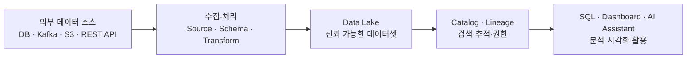
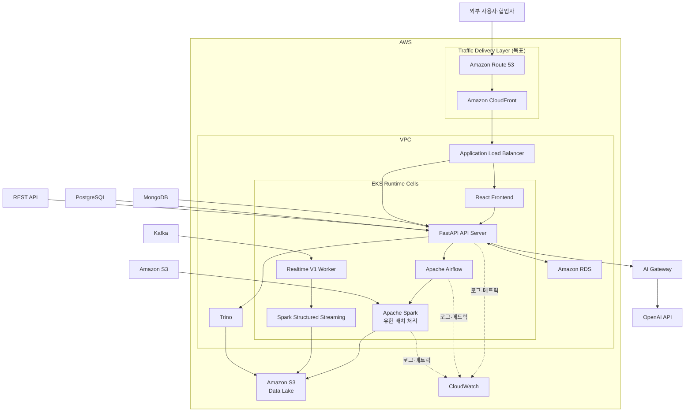

# AskLake

> **분산된 대규모 데이터를 Data Lake에 통합하고, 분석과 AI 활용까지 연결하는 기업용 데이터 플랫폼**

AskLake는 기업 안팎에 흩어진 데이터를 수집·처리·저장하고, 신뢰할 수 있는 데이터셋으로 검색·분석·시각화·AI 활용까지 이어 주는 B2B SaaS를 지향합니다. 현재 저장소는 AWS 환경에서 이 핵심 흐름과 처리 경계를 검증하는 MVP이며, 실제 기업 도입에 필요한 네트워크 격리와 tenant 운영 정책은 별도 상용화 범위입니다.

## 시연 영상

- [AskLake 시연 영상 보기](https://youtu.be/LC8-Sm4BhDI)

## 목차

- [시연 영상](#시연-영상)
- [문제 정의](#문제-정의)
- [AskLake의 데이터 흐름](#asklake의-데이터-흐름)
- [데모 시나리오](#데모-시나리오)
- [시스템 아키텍처](#시스템-아키텍처)
- [핵심 구성 요소](#핵심-구성-요소)
- [기술적 챌린지](#기술적-챌린지)
- [프로젝트 문서](#프로젝트-문서)

## 문제 정의

기업의 서비스 운영과 의사결정은 데이터를 기반으로 이뤄지며, AI 활용이 더해지면서 준비된 데이터를 필요한 순간에 활용하는 능력이 더욱 중요해졌습니다.

하지만 실제 기업 데이터는 규모가 크고 형식이 다양하며, 데이터베이스·메시지 브로커·객체 스토리지·외부 API 등 여러 시스템에 분산되어 있습니다. 데이터를 일관된 기준으로 연결하고 신뢰할 수 있는 분석 결과로 만드는 데이터 파이프라인의 구축과 운영은 여전히 어려운 과제입니다.

AskLake는 이 문제를 **수집부터 소비까지 하나의 흐름**으로 연결해 해결합니다.

## AskLake의 데이터 흐름

1. 다양한 외부 데이터 소스를 연결하고 원본 데이터를 탐색합니다.
2. Schema, 변환·품질 규칙, 권한, 저장 방식을 설정해 Pipeline을 구성합니다.
3. ETL 실행을 거쳐 데이터를 Data Lake에 적재하고 실행 상태를 추적합니다.
4. Catalog에서 데이터셋의 스키마, 샘플, Lineage를 확인합니다.
5. SQL 분석, Dashboard, AI Assistant로 검증된 데이터를 활용합니다.

## 데모 시나리오

이커머스 쇼핑몰 운영자가 실시간 관심 상품의 구매 전환율이 이전 30일과 비교해 유의미하게 달라졌는지 확인하는 상황을 예로 듭니다.

| 입력 | 처리 | 결과 |
| --- | --- | --- |
| 과거 30일의 10GB 클릭 로그 | 로그 구조화·변환 후 1GB 상품 데이터와 결합 | 구매 전환율 분석 데이터와 Dashboard 차트 |

> 10GB 클릭 로그와 1GB 상품 데이터는 발표 데모의 시나리오 규모이며, 아래 성능 benchmark와는 별개입니다.

AskLake에서는 다음 순서로 진행합니다.

1. AWS S3에 저장된 과거 클릭 로그를 Source로 연결하고, Preview로 원본 일부를 확인합니다.
2. 텍스트 로그를 구조화하고 필요한 Schema, 변환 규칙, 권한, Target을 설정해 Pipeline을 생성합니다.
3. ETL을 실행해 처리 결과를 Data Lake와 Catalog에 등록하고, Lineage로 생성 과정을 확인합니다.
4. SQL 분석에서 상품 데이터와 클릭 로그 데이터를 결합해 분석용 데이터셋을 만듭니다.
5. 구매 전환율 Dashboard에 분석 데이터셋을 연결하고, 상품별·기간별 지표를 시각화합니다.

## 시스템 아키텍처

아래 그림의 EKS web·finite batch와 Realtime V1 worker는 현재 canonical ownership을 나타냅니다. Route 53·CloudFront·ALB와 Amazon RDS는 발표용 목표 구성이며, EC2 Compose Continuous worker는 rollback standby이자 호환 운영 경로입니다. 실제 owner와 배포 lane은 [ownership manifest](deploy/control-plane-ownership.json)와 [아키텍처 문서](docs/02-architecture.md)를 따릅니다.

## 핵심 구성 요소

| 영역 | 구성 요소 | 역할 |
| --- | --- | --- |
| 사용자 접점 | Route 53, CloudFront, ALB, React | 목표 traffic layer와 데이터 플랫폼 UI |
| API·메타데이터 | FastAPI, PostgreSQL | Pipeline·Catalog·권한·실행 상태를 관리하는 API와 메타데이터 저장소 |
| 데이터 처리 | Apache Airflow, Apache Spark, EKS Realtime V1 Worker | 유한 배치 ETL과 Kafka Continuous·Continuous SQL 처리 |
| 분석 | Trino, Dashboard | Data Lake 데이터의 SQL 분석과 시각화 |
| 저장 | Amazon S3 | 원본·처리 결과·Data Lake 저장 |
| AI | AI Gateway, OpenAI API | 데이터셋 컨텍스트를 활용한 AI 보조 기능 |
| 관측성 | CloudWatch | 서비스 로그와 메트릭 모니터링 |

## 기술적 챌린지

### 원본 데이터 재스캔 감소

ETL의 Schema·Transform·Quality 단계에서 이미 계산한 row count를 후속 단계에 재사용해 불필요한 원본 재스캔을 줄였습니다. AWS S3·EC2 환경의 약 1GB 클릭 로그 단일 cast Snapshot benchmark에서 raw full scan을 7회에서 3회로 줄였고, Spark 처리 시간은 101.997초에서 70.538초로 약 30.8%, NetworkIn은 약 6.83GiB에서 2.92GiB로 약 57.3% 감소했습니다.

이 결과는 해당 입력과 규칙 조합에서 측정한 값이며, 10GB·100GB 처리 성능을 보장하지 않습니다. 측정 조건과 증거는 [AWS 배포·E2E 플레이북](docs/job-a-aws-deployment-e2e-playbook.md#7-증거-기록-템플릿)에서 확인할 수 있습니다.

### 검증된 결과만 Catalog에 공개

Airflow의 완료 상태만으로 Dataset을 공개하지 않습니다. 동일 Run의 Spark manifest와 물리 결과를 검증한 뒤에만 Catalog materialization과 Lineage를 반영하고, 검증 실패 시 부분 공개를 차단합니다. 상세 경계는 [아키텍처 문서](docs/02-architecture.md#검증된-물리-결과만-catalog에-공개)를 따릅니다.

## 프로젝트 문서

- [문서 포털](docs/README.md): 목적별 문서 탐색과 현재·역사 문서 구분
- [제품 기획](docs/01-product-planning.md): 문제 정의, 사용자 흐름, MVP와 후속 범위
- [아키텍처](docs/02-architecture.md): 시스템·데이터·런타임 경계
- [API Reference](docs/03-api-reference.md): 공개 API 범위와 공통 규칙
- [개발 가이드](docs/04-development-guide.md): 로컬 실행, 검증, 개발 절차
- [시스템 가드레일](docs/system-guardrails.md): 저장소·CI·플랫폼 검증 기준
