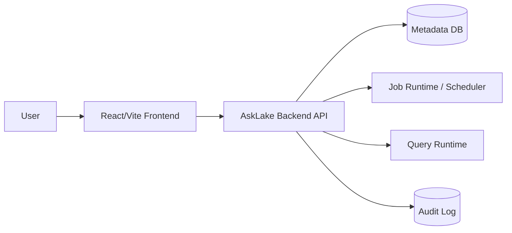

# 02. Architecture

이 문서는 AskLake의 현재 frontend baseline과 목표 backend architecture를 함께 기록한다.

## 1) 현재 구조

현재 repository는 React/Vite frontend와 local Node backend app으로 구성된다.

```text
AskLake/
├─ backend/
│  ├─ src/
│  ├─ scripts/
│  └─ package.json
├─ frontend/
│  ├─ src/
│  │  ├─ components/
│  │  ├─ data/
│  │  ├─ hooks/
│  │  ├─ pages/
│  │  ├─ services/
│  │  ├─ styles/
│  │  └─ types/
│  ├─ package.json
│  └─ vite.config.ts
├─ docs/
│  ├─ api-contract.md
│  └─ backend-integration-readiness.md
└─ README.md
```

## 2) 기술 스택

| 영역 | 현재 선택 | 상태 | 메모 |
| --- | --- | --- | --- |
| Frontend | React + Vite + TypeScript | implemented | `frontend/` |
| UI icons | lucide-react | implemented | package dependency |
| Dashboard grid | react-grid-layout + react-resizable | implemented | draft editor drag/resize canvas |
| Lineage graph | React Flow (`@xyflow/react`) | implemented | catalog lineage modal renders `LineageGraph` contract data with column-level handles and selected-column emphasis |
| State | React hooks/local state | implemented | `useAskLakeData`, `useAuditLogs` |
| API client | fetch wrapper | partial | `frontend/src/services/apiClient.ts` |
| Backend | Node HTTP demo API | partial | `backend/src/server.mjs`, source connector and ETL metadata API |
| Database | PostgreSQL metadata DB | partial | `docker-compose.yml`, backend-owned JSONB tables for ETL jobs/catalog/sql runs plus dashboard revision tables |

## 3) 목표 시스템 구성



현재는 `FE`, local `API`, Postgres metadata `DB` 일부가 구현되어 있고, production runtime/scheduler는 planned 상태다.

## 4) Frontend Layer

주요 책임:

- navigation과 화면 composition: `frontend/src/App.tsx`
- layout: `frontend/src/components/layout/`
- ingest/job 화면: `frontend/src/pages/ingest/`
- ETL creation flow: `frontend/src/pages/etl/`
- catalog 화면과 lineage graph modal: `frontend/src/pages/catalog/`
- lineage graph API/mock boundary: `frontend/src/services/mockApi.ts`
- SQL 화면: `frontend/src/pages/sql/`
- dashboard 화면: `frontend/src/pages/dashboard/`
- dashboard runtime shell: `frontend/src/pages/dashboard/runtime/`
- mock data: `frontend/src/data/mockData.ts`
- domain state: `frontend/src/hooks/useAskLakeData.ts`
- audit/toast state: `frontend/src/hooks/useAuditLogs.ts`
- API boundary: `frontend/src/services/mockApi.ts`, `frontend/src/services/apiClient.ts`
- dashboard list/runtime API adapters: `frontend/src/services/dashboardApi.ts`, `frontend/src/services/dashboardRuntimeApi.ts`

라우팅은 아직 React Router가 아니라 `frontend/src/App.tsx`의 상태 기반 navigation이 중심이다.
Dashboard redesign Phase 01부터 `/dashboards`, `/dashboards/:dashboardId`, `/dashboards/:dashboardId/edit`는 `App.tsx`의 browser history/path parser가 처리한다.
수집/처리 목록은 TanStack Table 기반 표형 목록을 기본 화면으로 사용하며, 작업명, 타깃 데이터셋, 소유자, 최근 실행 결과, 마지막 실행, 상태별 액션을 같은 ETL job state에서 표시한다. 기존 표형 검토 화면은 `/jobs-table-demo` route에서도 직접 열 수 있다.
수집/처리의 작업 진행 순서 시각화는 독립 메뉴가 아니라 실행 이력의 `실행 단계 보기` 모달에서 표시한다. 화면에서는 `실행 단계`로 표현하고, 내부 데이터는 기존 job/run evidence의 DAG step state를 재사용한다.

## 5) Backend Target Boundary

백엔드가 소유할 책임:

- ETL job 생성과 상태 전이
- dataset catalog hydrate
- SQL query run 생성과 결과 반환
- dashboard 저장/게시/삭제
- audit log 저장
- 인증/권한이 도입될 경우 actor와 access policy 판정

프론트가 계속 소유할 책임:

- 화면 상태와 사용자 interaction
- loading/error 표시
- optimistic update 또는 rollback UX
- mock/live 전환 adapter
- live mode에서 마지막으로 성공한 ETL job/catalog hydrate 결과를 브라우저 localStorage에 보관해, job 실행 중 새로고침해도 수집/처리 shell과 직전 job 목록을 먼저 렌더링한다.
- live mode에서 run/retry 명령 응답의 `running` 상태를 즉시 반영하고, `GET /api/etl/jobs/{jobId}` polling으로 Spark 완료 후 최종 상태를 반영한다.

## 6) 데이터 모델 초안

상세 타입은 `docs/api-contract.md`와 `frontend/src/types/`를 기준으로 한다.

핵심 리소스:

| Resource | 현재 위치 | 백엔드 목표 |
| --- | --- | --- |
| ETL Job | `JobRowData` mock | persisted job resource |
| Dataset | `CatalogDataset` mock | catalog dataset resource |
| Dataset Lineage | `LineageGraph` mock/fallback | column-level lineage graph resource |
| SQL Run | `SqlResultDraft` runtime state | query run resource |
| Dashboard | `DashboardEntry`, list adapter, draft/published runtime response | dashboard resource with revision/page/widget snapshots |
| Audit Log | `useAuditLogs` local/localStorage state | audit log resource |

현재 local backend는 `etl_jobs`, `catalog_datasets`, `sql_runs` 테이블에 API response payload를 JSONB로 저장한다. 이 방식은 현재 계약 변경 없이 persistence를 제공하기 위한 중간 단계이며, 장기적으로는 run history, DAG step, Spark log, audit log를 별도 테이블과 object storage로 분리한다.

## 7) API Boundary

현재 live mode 진입점:

- `VITE_USE_MOCK_API=false`
- `VITE_API_BASE_URL=http://localhost:8080`
- `frontend/src/services/mockApi.ts`
- `frontend/src/services/apiClient.ts`

P0 API:

- `POST /api/etl/jobs`
- `POST /api/etl/jobs/{jobId}/commands`
- `POST /api/query/runs`

P1 hydrate API:

- `GET /api/etl/jobs`
- `GET /api/etl/jobs/{jobId}`: 수집/처리 상세 hydrate와 실행 중 job 최종 상태 polling에 사용한다.
- `GET /api/catalog/datasets`
- `GET /api/catalog/datasets/{datasetId}`
- `GET /api/catalog/datasets/{datasetId}/lineage`

Dashboard runtime API:

- `GET /api/dashboards`
- `POST /api/dashboards`
- `POST /api/dashboards/query`
- `PATCH /api/dashboards/{dashboardId}`
- `GET /api/dashboards/{dashboardId}/published`
- `POST /api/dashboards/{dashboardId}/draft/ensure`
- `POST /api/dashboards/{dashboardId}/draft/pages`
- `PATCH /api/dashboards/{dashboardId}/draft/pages/{pageId}`
- `DELETE /api/dashboards/{dashboardId}/draft/pages/{pageId}`
- `POST /api/dashboards/{dashboardId}/draft/pages/{pageId}/widgets`
- `PATCH /api/dashboards/{dashboardId}/draft/layouts`
- `POST /api/dashboards/{dashboardId}/publish`

랜딩 페이지의 새 대시보드 생성은 `POST /api/dashboards`로 dashboard card를 `draft` 상태로 먼저 저장하고, 프론트는 응답받은 id로 `/dashboards/{dashboardId}` 조회 화면에 진입한다. Draft editor는 DB-backed draft revision을 편집하고, page 추가/삭제, widget 생성/수정/삭제, widget layout 저장을 API로 반영한다. Published viewer는 published revision만 읽으며, draft 변경사항은 `POST /api/dashboards/{dashboardId}/publish` 이후 새 published revision으로 보인다.
Draft editor에서 dashboard title은 `PATCH /api/dashboards/{dashboardId}`로 dashboard card payload에 저장하고, page tab title은 `PATCH /api/dashboards/{dashboardId}/draft/pages/{pageId}`로 현재 draft revision의 page row에 저장한다.
Phase 06 runtime UX는 별도 share API 없이 프론트에서 공유 링크를 복사한다. Published revision이 있으면 `/dashboards/{dashboardId}`를, draft만 있으면 `/dashboards/{dashboardId}/edit`를 복사하며, publish 성공 후 목록 상태도 다시 갱신한다.
Dashboard draft editor shell은 화면 높이 안에서 상단 바, 페이지 탭, 필터 행, 왼쪽 dataset sidebar, 오른쪽 inspector를 고정 흐름으로 유지하고, 위젯이 많아질 때 중앙 canvas 영역 안에서만 스크롤한다.
Dataset 기반 위젯 생성 준비 단계에서는 draft editor가 transient `selectedDatasetId`를 소유하며, Gold dataset 목록은 `useDashboardDatasets` mock hook을 통해 공급한다. 이 hook은 이후 `GET /api/catalog/datasets` hydrate로 교체할 경계다.
Dataset 기반 widget 생성 폼은 `metric`, `table`, `bar_chart`, `line_chart`, `donut_chart` 5개 runtime type으로 고정한다. `POST /api/dashboards/{dashboardId}/draft/pages/{pageId}/widgets`는 `datasetId`와 type별 `config`를 함께 전송하며, config 계약은 `MetricWidgetConfig`, `TableWidgetConfig`, `BarChartWidgetConfig`, `LineChartWidgetConfig`, `DonutChartWidgetConfig`를 기준으로 한다.
Dashboard widget 생성 API는 `datasetId`가 있고 명시적 `data`가 없을 때 catalog dataset의 rows 또는 sample rows를 column name 기반 object row로 변환해 widget `data` snapshot에 저장한다. Draft runtime 조회는 이 `widget.data`를 그대로 반환하며, chart 계산/렌더링 레이어는 이미 내려온 `widget.data`를 소비하는 책임만 가진다.
Runtime widget renderer는 `widget.data`를 그대로 그리지 않고, type별 `config`와 `aggregation`을 기준으로 표시용 값을 계산한다. `metric`은 단일 집계값, `table`은 컬럼/정렬, `bar_chart`/`line_chart`/`donut_chart`는 label key 기준 grouping과 `sum`/`avg`/`count`/`min`/`max` 집계를 프론트에서 처리한다.
Draft grid는 위젯 카드 전체에서 drag를 시작할 수 있게 유지하되, no-reflow collision guard로 다른 위젯이 과하게 아래로 밀리는 layout을 막는다. 새 위젯은 현재 page layout에서 충돌하지 않는 첫 빈 위치에 배치하고, drag/resize stop 시 충돌 layout은 draft state와 `PATCH /api/dashboards/{dashboardId}/draft/layouts`에 저장하지 않고 되돌린다.
Dashboard runtime 프론트 구조는 `DashboardPage.tsx`가 목록/생성/삭제/런타임 진입 같은 상위 흐름을 소유하고, `runtime/DashboardRuntimeView.tsx`가 runtime shell, page tab, dataset sidebar, canvas, inspector 조립을 담당한다. Dataset 기반 위젯 생성 API 흐름은 `runtime/useDraftWidgetCreator.ts`, draft widget layout 저장과 collision 실패 처리는 `runtime/useDraftWidgetLayouts.ts`가 담당한다.

## 8) 설계 원칙

- Mock data는 demo baseline이며, 최종 persistence model로 간주하지 않는다.
- API response shape는 프론트 타입과 문서가 함께 바뀌어야 한다.
- API, mock fixture, frontend internal state의 status 값은 영어 canonical value로 유지하고 UI label mapper에서 한국어 표시로 변환한다.
- Backend 연결은 생성/명령/SQL 실행 같은 P0 vertical slice부터 시작한다.
- SQL runtime은 read-only guard를 가져야 한다.
- 감사 로그는 사용자에게 보이는 제품 기능이면서 backend integration evidence로도 쓰일 수 있다.

## 9) 운영/배포 메모

- 현재 실행은 frontend dev server 기준이다.
- backend dev server, DB, migration, container strategy는 아직 정하지 않았다.
- CI가 생기면 최소 required check 후보는 frontend build다.
