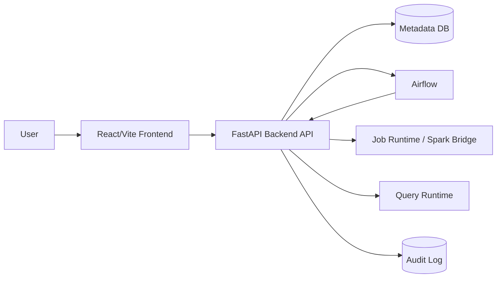

Warning: truncated output (original token count: 48962)
Total output lines: 918

# 02. Architecture

AI Gateway/MCP 경계와 파일별 변경 계획은 [ai-gateway-mcp-rollout.md](./ai-gateway-mcp-rollout.md)를 따른다. 공개 Query AI route는 FastAPI가 소유하고, Gateway는 내부 Compose network에서만 접근한다.

이 문서는 AskLake의 현재 frontend baseline, FastAPI 전환 경계, 그리고 Pair별 backend ownership을 함께 기록한다.

## 1) Current Pair A Live Boundary

현재 Pair A 브랜치의 기준 경계는 다음과 같다.

- Source, Schema, Create, Run은 기본적으로 같은 출처의 `/api`를 통해 live backend를 호출한다. `VITE_API_BASE_URL`은 다른 API origin이 필요한 경우에만 사용한다.
- 생성 wizard는 Source 결과의 `requiresRecordParsing`에 따라 `Source -> Record Parsing -> Schema` 또는 `Source -> Schema`로 분기한다. `requiresRecordParsing`은 선택한 MinIO/S3 `.txt`/`.log` 또는 Kafka raw text 메시지가 이름 없는 `line_number + value` 샘플로 반환될 때 활성화한다.
- Record Parsing Preview와 File/S3 batch, Kafka Snapshot, Kafka Continuous runtime은 Job에 저장된 동일 `recordParsing` 계약을 사용한다. Preview는 제한 샘플을, runtime은 전체 입력을 검증하며 어느 쪽도 부족한 필드를 null로 채우거나 초과 필드를 버리지 않는다. Kafka replay producer의 `raw_text` 모드는 입력 파일의 비어 있지 않은 각 줄을 JSON envelope 없이 메시지 value 그대로 전송한다.
- File / S3 source는 단일 object와 prefix 데이터셋을 구분한다. Prefix 선택은 `Path / Prefix`와 `__Selection Kind=prefix`를 Job의 `sourceConfig`에 저장하고 개별 object 배열은 저장하지 않는다. Backend는 prefix를 재귀 조회해 `_SUCCESS`, `manifest.json`, basename이 `_` 또는 `.`으로 시작하는 객체와 선택 형식이 아닌 객체를 제외한다. Preview는 사전식 첫 데이터 파일을 대표 파일로 사용하고 모든 데이터 파일의 bounded schema fingerprint가 호환될 때만 Schema 단계로 진행한다.
- Prefix Spark runtime은 저장된 prefix를 다시 열거해 Preview와 같은 제외 규칙을 적용하고 모든 대상 경로를 DataFrame reader에 전달한다. Run manifest의 `inputFileCount`, `inputBytes`, `inputRows`, `outputFileCount`, `outputRows`가 실제 다중 파일 처리 근거다. 입력 파일이 여러 개면 writer는 실행 가능한 범위에서 복수 output partition을 유지하되 출력 파일의 정확한 byte 크기는 계약하지 않는다. Iceberg target의 `outputFileCount`는 DataFrame의 `inputFiles()`가 아니라 commit된 exact snapshot summary의 `total-data-files`이며, Catalog가 같은 snapshot에서 읽은 값과 다르면 성공으로 확정하지 않는다.
- PostgreSQL Source의 연결 테스트와 Schema 단계는 제한 Preview를 사용하지만 Snapshot `run`/`retry`는 `__Schema Sample Scope`와 무관하게 선택한 기본 테이블 전체를 읽는다. backend는 `REPEATABLE READ READ ONLY` transaction 안의 server-side cursor를 배치 fetch해 Run 전용 JSONL을 만들고, Spark는 그 파일 전체를 처리한다. 고정 행 상한은 두지 않으며 한 번에 메모리에 보관하는 행 수만 `ASKLAKE_POSTGRES_EXECUTION_BATCH_ROWS`로 제한한다.
- 초기 ETL job과 Catalog dataset은 backend hydrate 결과를 따른다. 둘 다 비어 있을 수 있다.
- 파이프라인 생성은 Job과 pending `catalogTarget`을 만들고, Catalog dataset은 실행 성공 후 생성 또는 갱신한다.
- 같은 Job 또는 표시명이 정확히 같은 `targetDataset`으로 다시 생성/실행한 결과는 기존 Catalog row의 `materializationRuns` history에 run-keyed로 누적한다. 일반 ETL/SQL full-refresh Run은 `materializationMode=snapshot`, Kafka의 새 offset/micro-batch Run은 `materializationMode=delta`다. 현재 Dataset은 newest-first 성공 history에서 첫 snapshot까지의 active segment만 사용하므로 새 snapshot은 이전 snapshot을 논리적으로 교체하고, snapshot 이후 delta만 누적한다. 다른 표시명은 ASCII slug가 같더라도 별도 Job/dataset identity를 가져야 한다. backend는 안전한 소문자 ASCII 이름에는 기존 `ds_<name>`을 유지하고, 한글·공백·특수문자·대소문자 변환처럼 slug에서 정보가 손실되는 이름에는 원문 기반 안정 해시 suffix를 붙인다. backend가 storage path를 자동 생성할 때도 같은 충돌 방지 key를 사용한다. Catalog 검색 목록은 dataset row를 하나만 유지하며 이전 snapshot의 물리 파일과 Run metadata는 history로 보존한다.
- ETL 컬럼 리니지는 source와 target에 같은 스키마를 복제하지 않는다. source node는 실제 입력/transform input 컬럼만 가지며, transform step의 `input -> output`을 source-to-job edge로, 실제 output column 이름 일치를 job-to-target edge로 저장한다. source engine은 파일 확장자나 connector type을, 가운데 Spark job은 dataset layer가 아닌 `PROCESS` node를, target engine은 현재 Spark runner가 실제 저장한 physical output format(`PARQUET`)을 사용한다. `_asklake_*` 실행 메타데이터는 Spark job에서 생성되므로 source edge를 만들지 않는다. Catalog UI는 이 저장 graph를 수정하지 않고 `PROCESS` node의 동일 컬럼으로 이어지는 두 edge를 source→target edge로 축약해 표시한다.
- Run state는 `runId` 기준으로 관리한다. Airflow가 호출하는 Spark 실행과 Catalog reconciliation은 `etl_runs`의 owner, lease 만료 시각, generation을 원자적으로 선점한다. lease를 잃은 이전 FastAPI replica는 Spark/Catalog 결과를 저장하지 못하며, 만료 뒤 새 replica만 같은 `runId`를 복구한다.
- 일반 Snapshot Spark runtime은 확정 schema projection과 지원되는 row-preserving transform 선두 prefix를 run 전용 Parquet materialization 경로에 먼저 기록한다. 이 write가 raw source 전체를 한 번 읽는 경계이며, schema count/required-null, 나머지 Rule/Quality, sample과 target publish는 원본 lineage나 executor DataFrame cache가 아니라 새로 읽은 staged DataFrame을 기준으로 실행한다. 같은 Spark type의 `String`/`Long`/`Boolean` identity cast·copy·rename 또는 직접 컬럼 복사와 `TRIM(CAST(<input> AS STRING))`으로만 구성된 canonical 선두 prefix는 staging 전에 적용하고 `preMaterializedTransformCount`로 남긴다. canonical Quality counter가 유효하면 최종 행 수를 재사용하고, counter fallback과 legacy Quality도 executor 전체-frame cache를 만들지 않은 채 staging을 다시 읽는다. 품질 실패 전에는 Iceberg current snapshot이나 Catalog를 변경하지 않으며, 성공·품질 실패·schema 예외 경로는 run 전용 materialization 경로를 정리한다.
- Spark manifest는 `phaseTimings`로 Source 검증, Parquet materialization, Rule 평가, Quality 집계, source 사후 검증, Target publish 시간을 분리한다. `sparkResources`에는 driver/executor core, executor 수, default parallelism, shuffle partition과 함께 `cacheStorageLevel=NONE`, `materializationMode=run_scoped_parquet_staging`, staged file 수, cleanup 상태와 `outputFrameCacheMode=staged_parquet_reuse`를 남긴다. 이 값은 실행 증거이며 scheduler나 autoscaler의 권장 설정을 자동 결정하지 않는다.
- 일반 File/Data Lake/PostgreSQL Snapshot Run은 `Frontend -> FastAPI command -> Airflow DAG -> token-authenticated FastAPI internal execution -> source export 또는 direct object read -> Spark runner -> Run/Catalog transaction` 순서다. Airflow에는 Job 전체나 source credential을 넘기지 않고 `jobId`, `runId`, `command`만 전달한다.
- 내부 `Data Lake` 소스는 Catalog의 `Source Dataset ID`를 권한과 가용 상태 기준으로 검증한 뒤, 등록된 Iceberg table identity를 Spark catalog 입력으로 사용한다. 외부 object-storage 경로를 직접 읽는 `Data Lake Parquet` 소스는 기존 S3 path 계약을 유지한다.
- Airflow의 terminal `success`만으로 데이터 처리를 성공 처리하지 않는다. 같은 `runId`의 실제 Spark output metadata와 Catalog materialization이 모두 저장되어야 Run이 `success`가 된다.
- 실행 흐름/DAG는 별도 top-level 화면이 아니라 Run History에서 선택한 `runId`의 단계 흐름으로 표시한다.
- Dashboard card/list와 draft/published runtime API는 FastAPI 응답만 source of truth로 사용한다. Catalog 기반 runtime widget은 `sampleRows` snapshot 대신 성공한 물리 materialization을 DuckDB로 제한 집계하거나 최대 500행 preview로 읽는다.

### Catalog Dataset Deletion Ownership

### Text Structuring Model Artifact Ownership

- text structuring model artifact는 Catalog dataset이 아니라 ETL 변환 실행에 사용하는 재사용 가능한 runtime artifact다.
- artifact 원본과 검증 metadata는 `model_artifacts` 저장소 및 `/api/catalog/models`, `/api/text-structuring/models` 호환 endpoint에 보존한다. 현재 endpoint 이름에 `catalog`가 포함되어도 dataset resource로 취급하지 않는다.
- 모델 선택 정책과 선택 artifact는 ETL 변환 설정이 소유한다. 특정 Run에서 실제 사용한 모델, fallback, 검증 행, invalid row는 Run의 `textStructuringExecution`이 실행 근거의 source of truth다.
- Catalog 목록은 model artifact 전역 inventory를 렌더링하지 않는다. Dataset materialization run에는 해당 dataset이 어떤 모델 기반 변환으로 생성됐는지와 quarantine 행을 compact provenance로만 표시한다.
- 독립 Model Registry가 제품 범위에 들어오기 전에는 model artifact를 Catalog dataset 또는 별도 top-level 탐색 자산으로 승격하지 않는다.

## 2) Repository Structure

```text
AskLake/
  backend/
    app/                 # FastAPI app
    scripts/             # source, spark, validation bridge scripts
    src/                 # existing Node validation/runtime helpers
  frontend/
    server/              # Node demo API, Dashboard persistence reference
    src/
      components/
      data/
      hooks/
      pages/
      services/
      styles/
      types/
  docs/
```

## 3) 기술 스택

### Continuous Control Plane Ownership

Continuous runtime report, command, Catalog ACK는 `ASKLAKE_CONTINUOUS_RUNTIME_DOCUMENT_PREFIX`가 비어 있으면 Compose의 mounted local report directory를 사용한다. 값이 `s3://` 또는 `s3a://` URI이면 FastAPI/worker는 S3 object adapter로, Spark driver는 Hadoop S3A filesystem으로 같은 JSON object를 읽고 쓴다. 따라서 API pod와 Spark driver pod가 서로 다른 local volume을 공유하지 않아도 status hydration과 pause/stop command를 전달할 수 있다. S3 object replacement는 reader 관점에서 atomic하지만, 이 문서는 lock이 아니며 command ordering/fencing의 authority는 PostgreSQL `stateRevision`과 worker attempt token이다.

EKS Continuous 실행은 `ASKLAKE_CONTINUOUS_SPARK_RUNNER=kubernetes`일 때 전용 SparkApplication gateway가 Spark Operator API로 `Python` cluster-mode application을 생성한다. application은 Job ID와 worker attempt ID label을 갖고, digest-pinned `ASKLAKE_SPARK_KUBERNETES_IMAGE`, service account, private runtime-document S3 prefix를 모두 요구한다. JDBC URL/user/password는 SparkApplication spec에 평문으로 넣지 않고 `ASKLAKE_SPARK_KUBERNETES_RUNTIME_SECRET_NAME`의 `secretKeyRef`로만 전달한다. pause/stop command도 worker attempt token을 포함해 새 attempt가 이전 command를 적용하지 않게 하며, SparkApplication `COMPLETED`는 공통 runtime의 정상 종료 상태 `exited`로 정규화한다. 이 모드는 일반 유한 Spark batch runner의 `ASKLAKE_SPARK_RUNNER`와 분리되어 있다.

유한 EKS Spark batch는 RDS execution generation과 Spark attempt generation을 분리한다. FastAPI 응답 유실이나 process 교체처럼 기존 application이 terminal이 아니면 저장된 namespace/name/UID를 그대로 복구한다. 저장된 application이 terminal failure이면 같은 logical `runId` 아래에서만 다음 attempt generation을 허용하고, deterministic `-gN` application identity와 새 UID를 사용한다. 기본 상한은 두 attempt이며 최대 3을 넘길 수 없다. 이전 attempt identity는 RDS `kubernetesAttempts`에 보존하고 현재 identity와 섞지 않는다. 성공 Spark result와 Catalog materialization은 여전히 logical `runId` 하나를 key로 사용하므로 attempt가 늘어도 snapshot/materialization을 중복 확정하지 않는다.

Day 18 MSK authorization fault는 별도 public Run을 만들지 않는다. 기존 EKS bounded fixture Run에 대해 internal bearer 경계가 정확히 한 번의 write 시도, `AUTHORIZATION`, acknowledgement 0과 private evidence SHA-256을 검증한 뒤 RDS execution lease generation에 `faultAttempts`를 기록한다. 이후 정상 Spark 실행은 같은 Run의 다음 RDS generation을 claim한다. 이 adapter는 기존 Describe-only identity의 실제 deny evidence를 연결할 뿐 IAM, RBAC 또는 NodePool을 변경하지 않는다.

Day 18 Phase 8 운영 runner는 이 제품 경계를 바꾸는 새 실행 엔진이 아니라 승인된
dev fault/E2E campaign을 순서대로 조정하는 fail-closed adapter다. Run D는 새 logical
Run을 Airflow 호출 없이 먼저 예약하고 Describe-only identity의 실제 MSK deny를 기록한
뒤 같은 Run을 Airflow에 제출한다. Run E는 새 logical Run의 첫 Spark attempt를 internal
경계로 직접 시작하고 exact SparkApplication owner UID가 확인된 driver Pod 하나만
삭제한다. 첫 attempt가 제품의 terminal failure 상태가 된 뒤에만 같은 예약 Run을
Airflow에 제출해 attempt generation 2를 만든다. 따라서 Airflow DAG retry 설정이나
runtime image를 바꾸지 않으며, Run D/E 모두 RDS owner/generation과 logical `runId`가
중복 snapshot/materialization을 막는 최종 authority로 남는다.

runner의 checkpoint는 승인 contract, live input, candidate receipt와 target-selection
hash에 묶인 private mode-`0600` state다. 재시작은 완료된 deny, driver delete 또는
Airflow submit을 다시 실행하지 않고 다음 검증 단계만 수행한다. checkpoint와 실제
SparkApplication 상태가 모호하면 추측 복구하지 않는다. Kubernetes Event와 CloudWatch는
같은 campaign window의 type/reason/kind별 count만 state에 보존하고 raw Run, Pod,
Application, log message와 endpoint는 저장하지 않는다. cleanup은 runner가 만든 exact
temporary Job만 UID precondition으로 삭제하고 RDS, S3, Iceberg, Catalog와
SparkApplication durable evidence는 보존한다.

브라우저는 `/api/etl/jobs/statuses`의 persisted `continuousRuntime`을 일반 Job status polling과 같은 경로로 읽는다. 따라서 새로고침 후에도 frontend memory가 아니라 metadata DB의 Job/detail/runtime 상태로 hydrate한다. SSE는 dashboard domain event에만 사용하며 Continuous 상태의 canonical source는 status API다.

| 영역 | 현재 선택 | 상태 | 메모 |
| --- | --- | --- | --- |
| Frontend | React + Vite + TypeScript | implemented | `frontend/` |
| UI icons | lucide-react | implemented | package dependency |
| Lineage graph | React Flow (`@xyflow/react`) | implemented | Catalog lineage modal |
| Dashboard grid | react-grid-layout + react-resizable | implemented | draft editor canvas |
| Dashboard charts | ApexCharts (`apexcharts`, `react-apexcharts`) | partial | runtime chart renderer and 8-type widget contract |
| State | React hooks/local state | implemented | `useAskLakeData`, `useAuditLogs` |
| API client | fetch wrapper | partial | `frontend/src/services/apiClient.ts` |
| FastAPI backend | FastAPI + SQLAlchemy | partial | `backend/app/` |
| Node demo API | Node HTTP + pg | reference/demo | `frontend/server/` |
| Database | PostgreSQL metadata DB | partial | ETL/Catalog/Dashboard metadata in FastAPI, Node demo API is reference/demo |

## 4) 목표 시스템 구성



현재 FastAPI가 직접 소유하는 영역은 ETL, Run, Catalog hydrate, Catalog lineage fallback, SQL query compatibility runtime, Trino Query Run, SQL derived dataset 저장, Dashboard card/list, Dashboard draft/published runtime이다. Trino Query Run은 두 mode로 나뉜다. 기본 `preview`는 서버가 원본 SQL을 최대 100행 subquery로 감싸고 작은 결과 page를 PostgreSQL JSONB에 저장한다. `전체 보기` 또는 `CSV 다운로드`가 요청한 `run`만 원본 SQL 전체를 실행해 private object storage의 gzip page에 저장하고 PostgreSQL에는 page metadata/checksum/manifest를 둔다. `TrinoQueryRunService`는 기존 API·worker 호출을 보존하는 호환 façade이며, 실제 책임은 접근 검사(`trino_query_access`), 제출·estimate(`trino_query_submission`), 조회·취소(`trino_query_lifecycle`), continuation 수집(`trino_query_collector`), result page·CSV·retention(`trino_query_results`), linked full-result 정책(`trino_full_result`), 상태 변환(`trino_query_run_state`), 실행 payload 저장(`trino_query_run_store`)으로 나눈다. `trino-result-collector` worker가 두 Query Run과 1회성 Iceberg CTAS, 반복 SQL Job CTAS continuation을 수집하므로 browser polling과 상태 GET은 persisted state만 읽는다.

EKS에서는 `trino-result-collector`를 `asklake-web` release의 별도 `Deployment`로 실행한다. FastAPI와 같은 immutable Backend image·runtime ConfigMap/Secret·Pod Identity를 사용하지만 HTTP server, Service, Ingress, Kubernetes API token은 갖지 않는다.

DB 접근도 `SqlRepository` 호환 façade 뒤에서 실행 기록(`sql_run_repository`), result page(`sql_result_page_repository`), collector lease·fencing(`trino_collector_repository`)으로 분리한다. 기존 service와 script는 같은 `SqlRepository` 메서드를 계속 사용하므로 공개 동작은 바뀌지 않으며, schema 호환 준비와 공용 반환 type은 각각 `sql_repository_schema`, `sql_repository_types`가 소유한다.

Collector claim은 DB lease와 증가하는 generation을 사용한다. `preview` inline page와 `run` object page 모두 source continuation으로 retry 중 duplicate 생성을 막고, `run` object는 generation별 attempt key와 owner fence를 추가로 사용한다. Query result API page size는 submit의 `resultPageSize`로 고정하며 signed cursor가 storage page index와 row offset을 감춘다. Frontend는 preview와 on-demand full run을 분리하고 각 현재 page와 이전/다음 cursor만 유지하며 전체 결과를 memory에 누적하지 않는다. terminal result cleanup은 keyset batch worker가 retention에 따라 수행한다.

Query submit은 `(actorKey, clientRequestId)` unique reservation과 actor별 PostgreSQL advisory lock을 사용한다. fingerprint에는 mode, preview limit, source preview run을 포함한다. `POST /api/query/runs/{previewRunId}/full-results`는 성공한 preview만 source로 허용하고, 같은 source의 active 또는 보관 중인 성공 full run을 재사용한다. run 재열기, 결과 조회, 취소, 전체 결과 생성은 현재 Dataset 권한·principal block·resource lock을 다시 검사한다.

EKS Collector는 정상 상태 1 replica다. 다중 replica에서도 lease/generation이 correctness를 보장하지만 MVP 처리량에는 이점이 없으므로 불필요한 동시 claim을 만들지 않는다. Pod 또는 process가 종료되면 Kubernetes가 같은 Deployment의 새 Pod를 만들고, 새 worker는 만료된 lease 뒤 동일 `runId`와 continuation을 이어받는다. Collector 부재나 일시 장애는 Run을 성공으로 바꾸지 않으며 PostgreSQL의 `queued`/`running` 상태와 `nextUri`를 복구 근거로 남긴다.

반복 SQL Job은 `jobKind=trino_sql_materialization`과 `sqlRecipe`를 ETL Job에 저장한다. `sqlRecipe`에는 생성 당시 role/group/email snapshot 대신 `runAsUserId`만 남긴다. `run`/`retry`와 scheduler tick은 Airflow/Spark가 아니라 Trino SQL Job service로 분기되고, production에서는 실행 시점의 active auth user와 principal block을 다시 조회해 현재 role/group으로 권한을 판정한다. 삭제·비활성·차단 사용자는 실행 전에 `403`으로 차단한다. AuthUser row가 없는 로컬 header-auth 호환 경로만 저장된 user id를 유지한 `viewer`/빈 group actor로 제한하며 과거 admin/group snapshot을 신뢰하지 않는다. 각 Run은 고유 Iceberg table에 full-refresh CTAS를 수행하고 `DESCRIBE` 뒤에만 안정적인 논리 Dataset mapping을 교체한다. 실패·취소·collector 재시작 중에는 마지막 정상 mapping을 유지하고, 같은 `runId`의 Catalog 확정은 멱등이다.

Estimate & Guardrail은 SQL AST가 참조한 컬럼과 Iceberg `$files.readable_metrics`를 결합해 실행 전 스캔량을 계산하고, metadata가 없을 때만 Trino plan/Catalog heuristic을 fallback으로 사용한다. submit 시 estimate snapshot은 Query Run에 저장하지만 confirmation token은 저장하지 않는다. Collector는 continuation fetch 중 backend-only QueryInfo를 읽기 전용으로 샘플링해 progress, driver/split, elapsed/queued/CPU, processed rows/bytes, peak memory를 단조 증가 방식으로 보강한다. QueryInfo 실패는 실행 실패로 승격하지 않는다. Query 완료, 수집 시작, 첫 durable page, manifest 완료 milestone은 최초 관측 시각을 유지한다. 상세 lifecycle은 [Trino Query Run Contract](trino-query-run-contract.md), storage·retention은 [Trino Query Result Storage Contract](trino-query-result-storage-contract.md)를 따른다.
Node demo API는 기존 동작 비교용 reference로 남긴다.

### ETL runtime infrastructure port boundary

- ETL application/service는 Node subprocess, runtime report 파일, Continuous manifest의 boto3 응답을 직접 해석하지 않는다.
- `app.ports.runtime_io`가 `NodeBridgePort`, `RuntimeDocumentStore`, `ObjectManifestPort`, `AirflowGateway`의 최소 application 계약을 소유한다.
- `app.infrastructure.runtime_io`가 subprocess timeout/error mapping, JSON 문서 상태, atomic ACK write, object listing pagination/byte decoding을 소유한다.
- 기존 `run_node_bridge`, `build_airflow_client`와 report/manifest helper signature는 compatibility facade로 유지한다. 따라서 API, DB schema, Job/checkpoint/report/manifest 형식은 바뀌지 않는다.
- 의존성은 facade의 기본 production adapter 또는 함수 인자의 fake/spy로 전달한다. 새 global mutable singleton이나 DI framework는 추가하지 않는다.
- 상세 호출 방향과 오류·rollback 계약은 [Runtime 외부 I/O Port·Adapter 계약](refactor-2026/contracts/runtime-io-ports.md)을 따른다.

### Object storage provider boundary

- 로컬 root Compose는 `ASKLAKE_OBJECT_STORAGE_PROVIDER=minio`를 기본값으로 사용하고 MinIO endpoint, 로컬 전용 access key/secret, path-style URL을 사용한다.
- EC2 production Compose는 `ASKLAKE_OBJECT_STORAGE_PROVIDER=aws`를 사용하며 MinIO service나 장기 AWS access key/secret을 포함하지 않는다. Backend, Spark S3A, DuckDB, Trino warehouse/result storage는 EC2 instance profile IAM Role의 default credential chain을 공유한다.
- 현재 production 경로는 사전 생성한 Raw bucket을 읽고 Output bucket에 쓴다. Raw/Output은 여러 기존 Dataset top-level prefix를 담는 전용 bucket이므로 EKS IAM도 승인된 해당 bucket 전체를 object resource 경계로 사용할 수 있다. Warehouse와 Query Result는 각각 `warehouse`, `query-results` prefix로 더 좁힌다. `aws-s3-readiness`가 Raw list와 Output put/head/delete를 통과해야 backend가 시작된다.
- frontend는 provider build variable에 따라 local에서는 MinIO 연결 필드를 실제 연결값으로 사용한다. AWS Source 화면도 발표용 호환 레이아웃을 위해 Endpoint URL, Access Key, Secret Key 입력을 표시하지만 세 값은 선택 입력이며 API payload와 pipeline draft에는 빈 값으로 정규화한다. 실제 Source 연결은 region, bucket/prefix와 EC2 instance profile IAM Role만 사용한다. Target 기본 bucket은 production build에서 `ASKLAKE_SPARK_OUTPUT_BUCKET`을 `VITE_SPARK_OUTPUT_BUCKET`으로 주입하고, 화면 진입 시 `GET /api/s3/buckets`의 첫 번째 bucket으로 다시 맞춘다. Target S3 browser는 backend writer의 `ASKLAKE_SPARK_OUTPUT_BUCKET`을 allowlist보다 앞에 반환하므로 browser와 writer가 같은 Output bucket을 사용한다. AWS credential은 browser 밖으로 전송하거나 저장하지 않는다.
- AWS mode에서 `ASKLAKE_SPARK_OUTPUT_BUCKET`과 `S3_ALLOWED_BUCKETS`가 모두 비어 있으면 Target S3 browser는 `asklake-output`으로 조용히 대체하지 않고 설정 오류를 반환한다. `asklake-output` fallback은 local MinIO demo에만 허용한다.
- 저장된 legacy `s3a://asklake-output/...` Target은 실행과 Catalog 확정 시 현재 `ASKLAKE_SPARK_OUTPUT_BUCKET`으로 정규화한다. 사용자가 명시한 다른 S3 bucket 경로는 바꾸지 않는다.
- Warehouse와 Query Result bucket은 `TRINO_ENABLED=true`에서 Iceberg table data와 private result page에 사용한다. 로컬 root Compose는 MinIO를 쓰고 production은 사전 생성한 AWS S3 bucket과 EC2 instance profile 또는 EKS Pod Identity default credential chain을 사용한다. Production에는 MinIO service나 장기 AWS access key/secret을 두지 않는다. Query Result writer는 prefix-scoped `ListBucket`을 bucket-wide 권한으로 넓히지 않기 위해 AWS의 사전 생성 bucket에 `HeadBucket`을 호출하지 않고, Run attempt prefix의 `PutObject`/`CopyObject`/`HeadObject`와 checksum 검증으로 실제 가용성을 판정한다. 별도 readiness가 두 bucket의 최소 권한 round trip을 확인한다.
- Production Compose는 `TRINO_ENABLED=true`와 `COMPOSE_PROFILES=trino`를 함께 설정할 때만 coordinator, PostgreSQL bootstrap, collector, cleanup service를 포함한다. `false`에서는 profile을 비워 기존 DuckDB 호환 배포가 Trino bucket/secret/TLS file 없이 기동한다. Trino는 backend/PostgreSQL용 internal network와 AWS S3·IMDS default credential chain에 접근하는 전용 outbound network를 함께 사용하며 public port는 열지 않는다.
- 로컬 root Compose는 매 기동 시 idempotent PostgreSQL bootstrap service를 거쳐 기존 volume에도 Iceberg JDBC catalog table/권한을 보정한 뒤 Trino를 시작한다. `docker-entrypoint-initdb.d`는 새 volume 초기화만 담당한다.

### Airflow batch execution

일반 배치 Job의 `run`/`retry`는 `FastAPI -> Airflow DAG Run -> token-authenticated FastAPI internal execution API -> PySpark -> Iceberg JDBC catalog commit -> MinIO/S3 warehouse` 순서로 실행한다. warehouse의 실제 data file은 Parquet이고 Iceberg metadata/snapshot이 논리 테이블 상태를 결정한다. Airflow는 orchestration 상태의 source of truth이고 FastAPI/PostgreSQL은 Job 설정과 사용자-facing Run metadata의 source of truth다.

Kafka Snapshot Job은 기본적으로 Airflow를 거치지 않고 `FastAPI -> durable offset snapshot -> fixed-range Kafka consume -> canonical transform/quality -> PySpark Iceberg append -> Trino physical verification -> AskLake Catalog -> Kafka offset commit` 순서로 실행한다. 단, EKS MVP 전용 topic/group 또는 내부 fixture receipt 필드가 있는 Snapshot Job은 별도 bounded fixture 실행 의도로 분류해 Airflow 경로로 보낸다. fixture 의도가 감지됐는데 exact topic/group, batch ID, expected count, IAM 9098 또는 Kubernetes runner 계약이 맞지 않으면 기존 Kafka 경로로 fallback하지 않고 command를 거부한다. 이 예외는 기존 Kafka Snapshot의 offset/commit 순서와 EC2 소유 Continuous 경로를 변경하지 않는다.

dev 모듈화 이후에도 이 예외를 `etl_service.py`에 다시 합치지 않는다. fixture 판별·slot·immutable source boundary는 `services/etl/eks_fixture.py`, Kubernetes 실행과 owner/generation Catalog fence는 `application/eks_airflow_execution.py`, terminal retry 상태 계산은 `application/eks_spark_retry.py`, deny-only evidence 기록은 `application/eks_msk_fault_execution.py`가 소유한다. Spark Kubernetes 이름·attempt annotation 계산도 `src/sparkKubernetesIdentity.mjs`에 격리한다. `etl_service.py`는 application/service adapter를 조합하는 compatibility façade이며 일반 Kafka Snapshot과 Continuous 경로는 이 EKS 전용 모듈을 실행하지 않는다. 2026-07-18 통합 기준과 검증 결과는 [pair1·dev 통합 기록](pair1-dev-integration-2026-07-18.md)에 남긴다.

EKS MVP fixture Run은 Airflow 외부 호출 전에 `etl_runs.task_states.eksMvpFixture`에 `runId`, producer `fixtureBatchId`/`expectedCount`, exact broker/topic/group, 선택된 `icebergTable`, Run 전용 output/checkpoint path를 함께 저장한다. 이 RDS row가 boundary와 slot target의 source of truth다. Airflow DAG Run conf와 내부 Spark 실행 요청은 같은 `sourceBoundary`를 운반하지만 값을 새로 계산하지 않으며, FastAPI는 요청 boundary가 RDS와 정확히 같고 현재 slot mapping이 예약 시 table과 같을 때만 lease를 획득하고 Spark payload를 만든다. SparkApplication은 RDS boundary에서 만든 manifest와 driver env, `asklake.io/fixture-batch-id` annotation을 받는다. Job 설정, Airflow 요청 또는 runtime slot mapping이 나중에 바뀌면 SparkApplication 제출 전에 fail-closed한다. contract version 1의 과거 Run은 기존 default group/table에 한해서만 읽기 호환한다.

`asklake-runtime` ConfigMap은 workload chart와 분리된 `asklake-runtime-config` Helm release가 단독 소유한다. 전환은 기존 live data와 새 render의 canonical hash가 정확히 같은 경우에만 Helm ownership annotation을 인수하며, workload release가 같은 ConfigMap을 다시 렌더하거나 별도 field manager가 수정하는 것을 금지한다. 이 분리는 이미지·endpoint 같은 공용 non-secret runtime 값의 변경 수명주기를 Frontend/FastAPI/Airflow/Trino release와 분리한다. `ASKLAKE_SPARK_KUBERNETES_EXECUTOR_INSTANCES`는 정수 `1..4`만 허용하고, dev 성능 실험은 `1`, `2`, `4`만 사용한다. ConfigMap 변경은 실행 중 process에 자동 반영되지 않으므로 FastAPI와 Collector의 동일 `runtimeConfigRevision` rollout 뒤 새 SparkApplication spec에서 적용값을 다시 확인한다.

EKS의 AI runtime은 `gateway`다. 이전 MVP `direct` profile은 rollback 호환 계약으로만 남고 사용자 AI surface의 정상 runtime으로 사용하지 않는다. `asklake-web` release가 단일 replica `ai-gateway` Deployment와 private ClusterIP Service를 소유하며, public Ingress·LoadBalancer·NodePort를 만들지 않는다. FastAPI는 `AI_GATEWAY_BASE_URL`, service token, MCP token과 context signing secret만 소비하고 provider key를 받지 않는다. provider key는 별도 `asklake-ai-gateway-runtime` ExternalSecret을 통해 `ai-server`의 `PROVIDER_API_KEY`에만 주입한다. Gateway는 Backend `/internal/mcp`와 provider HTTPS로만 egress하고 Backend Pod에서 오는 8090/TCP ingress만 허용한다. MCP transport host allowlist는 로컬 Compose의 `backend:8080`과 EKS ClusterIP Service의 `fastapi:8080`을 명시적으로 허용하며 public host는 허용하지 않는다. 프로세스 메모리 replay guard를 공유 저장소로 옮기기 전에는 replica를 정확히 1개로 유지하며, provider/MCP를 확인하는 HTTP readiness와 provider 장애로 재시작하지 않는 TCP liveness를 분리한다.

EKS MVP fixture의 동적 Spark 실행은 다른 Kafka Job과 달리 승인된 exact fixture slot을 사용한다. 설정이 없으면 목요일 단일 slot `asklake-eks-mvp-spark-v1 → iceberg.asklake.eks_mvp_fixture`만 허용한다. 동시 scale 검증은 `ASKLAKE_EKS_MVP_FIXTURE_SLOTS_JSON`에 이 기본 slot과 A가 IAM 범위를 승인한 group/table 쌍만 등록하며 총 5개, 즉 기본 1개와 scale 4개를 넘길 수 없다. group과 table은 각각 유일해야 하고 임의 prefix·클라이언트 지정 table은 허용하지 않는다. FastAPI는 group으로 table을 서버에서 선택하고 PostgreSQL advisory transaction lock 아래 같은 slot의 active Run을 `409 EKS_MVP_FIXTURE_SLOT_ACTIVE`로 차단한다. 서로 다른 slot의 Run만 동시에 예약할 수 있다.

각 fixture target은 `replace` mode로 고정한다. SparkApplication 생성 전 Node runner와 driver runtime이 같은 slot JSON, persisted consumer group, Iceberg target의 exact mapping을 다시 검증한다. Spark는 Kafka를 읽은 뒤 `raw.fixture_batch_id`가 RDS boundary의 값인 행만 남기고, 그 행 수가 `expectedCount`와 다르면 Iceberg commit 전에 실패한다. 성공 report를 받은 FastAPI도 `sourceBoundary`, input/output count, Job/Run identity, mapped target, snapshot ID와 commit boundary를 다시 대조한 뒤에만 `sparkResult` 성공을 RDS에 저장한다. 따라서 driver Pod의 `Succeeded`만으로 데이터 처리 성공을 인정하지 않는다.

일반 SparkApplication의 성공 후 TTL은 1시간이다. promotion 증거용으로 명시적으로 실행한 bounded E2E만 완료 상태, persisted identity와 현재 image가 모두 일치할 때 TTL을 7일로 늘리고 evidence label을 붙인다. 검증 Job과 fixture host는 삭제하지만 이 완료 SparkApplication은 해당 기간 동안 live identity 대조 대상으로 보존한다.

기존 Kafka Snapshot의 `sourceBoundary`는 snapshot ID와 partition별 exclusive offset range를 Iceberg commit evidence에 결합한다. Iceberg/Catalog 뒤 offset 확정이 실패하면 같은 durable snapshot을 retry하며, table의 snapshot marker와 Catalog의 `kafkaSnapshot.snapshotId`로 물리 append와 materialization을 각각 deduplicate한다. 따라서 retry가 새 Kafka 메시지를 현재 범위에 섞거나 이미 commit된 행을 다시 append하지 않는다. Job의 최종 data file은 warehouse Parquet이고, snapshot별 JSON metadata와 quarantine JSONL은 진단/오류 보존용 보조 object일 뿐 target Dataset data가 아니다.

Airflow task는 Docker socket이나 object-storage credential을 직접 받지 않는다. `spark_process_write` task가 `AIRFLOW_EXECUTION_API_TOKEN`으로 FastAPI 내부 API를 호출하면 FastAPI가 저장된 Job/Run identity를 재검증한다. 로컬 개발은 기존 Docker launcher를 사용할 수 있지만 production Compose는 backend에 Docker socket/CLI를 제공하지 않고 내부 `spark-master:6066` Standalone REST API로 cluster-mode driver를 제출하고 상태를 확인한다. 데이터 읽기·변환·품질 검사와 Iceberg DataFrameWriterV2 commit은 Spark worker의 PySpark가 수행하며 report/sample/Ivy 경로는 UID 185 bind mount로 공유한다. JDBC catalog credential은 driver 환경에만 전달하고 executor 환경으로 복제하지 않는다.

Spark manifest의 input/output file count와 byte/row count, output path, schema, quality, failure stage, Iceberg commit 증거는 `etl_runs.task_states.sparkResult`와 Run summary에 보존한다. Prefix Job의 입력 파일 수와 바이트 수는 Preview metadata가 아니라 실제 Spark 입력 파일을 기준으로 기록한다.

CSV source와 source inspect는 `quote="`와 `escape="`를 명시해 RFC 4180의 quoted comma와 doubled quote를 같은 field로 해석한다. 예를 들어 `"안녕, 나는 ""해건"""`은 `안녕, 나는 "해건"`이라는 리뷰 하나로 유지된다.

Spark manifest의 input/output row count, 논리 `outputPath`, schema, quality, failure stage와 `icebergCommit` evidence는 `etl_runs.task_states.sparkResult`와 Run summary에 보존한다. `icebergCommit`은 Job/Run identity, target, snapshot ID, warehouse location, schema/rule fingerprint와 source boundary를 포함한다.

DAG의 마지막 `publish_run_result` task는 `POST /api/internal/airflow/spark-runs/{runId}/catalog`를 호출한다. FastAPI는 요청 body의 결과값을 신뢰하지 않고 저장된 Job/Run identity와 `taskStates.sparkResult`를 다시 읽는다. 일반 Spark batch는 persisted `icebergTarget`과 reported snapshot/fingerprint를 Trino의 실제 table/snapshot/data-file evidence와 대조한다. EKS bounded fixture는 여기에 RDS Run에 고정한 `expectedCount`와 같은 snapshot의 `_asklake_run_id=runId` 행 수도 정확히 일치해야 한다. 검증 뒤 `catalog_datasets.payload`와 같은 Run의 `taskStates.catalogResult`를 하나의 DB transaction으로 저장한다. 이 transaction이 완료되어야 `publish_run_result`와 Airflow DAG Run이 `success`가 될 수 있으므로 AskLake terminal success는 Iceberg commit, 물리 검증, Catalog 반영을 모두 뜻한다.

Catalog reconciliation의 상태 소유권은 다음과 같다.

- Iceberg JDBC catalog와 MinIO/S3 warehouse: 현재 metadata location, snapshot, Parquet data file의 source of truth
- `etl_runs.task_states.sparkResult`: Spark 실행 결과의 source of truth
- `catalog_datasets.payload`: dataset metadata, `materializationRuns`, lineage의 source of truth
- Airflow Task Instance/DAG Run: orchestration 성공·실패의 source of truth

같은 `runId` 재호출은 기존 materialization을 교체하고, 다른 Run은 같은 dataset row의 history 앞에 추가한다. 일반 Snapshot의 성공 materialization은 `snapshot`, Kafka append segment는 `delta`로 기록한다. 부모 `rows`, `size`, `storageSizeBytes`는 전체 history 합이 아니라 최신 성공 snapshot과 그보다 최신인 성공 delta만 합산하며 `sourceRunId`는 active history의 head를 가리킨다. mode가 없는 legacy Kafka Run만 `delta`, 그 외 legacy Run은 `snapshot`으로 해석한다. target dataset row는 read-modify-write 동안 lock해 동시 갱신 손실을 막는다. Spark commit 직후 report 단계가 실패하면 writer가 이전 Iceberg snapshot으로 rollback한다. 검증된 commit 뒤 Catalog transaction만 실패하면 committed snapshot과 `sparkResult`를 복구 증거로 남기고 `publish_run_result`가 실패한다. `publish_run_result`는 30초 간격으로 최대 2회 재시도하며 upstream Spark task를 다시 실행하지 않고 같은 DAG Run의 저장된 manifest로 Catalog 단계만 재호출한다. polling sync는 Airflow 상태를 읽은 뒤 persisted Run을 다시 읽고 lock한 상태에서 task snapshot을 교체해, 동시에 저장된 `sparkResult`/`catalogResult`를 오래된 snapshot으로 지우지 않는다. `catalogResult=failed`는 Airflow가 success를 반환해도 AskLake Run 실패가 우선하며, 성공 `catalogResult` 또는 같은 Run의 성공 materialization이 없으면 Spark 경로·행 수만으로 성공 처리하지 않는다. frontend는 같은 Run id를 queued/running으로 관찰한 뒤 terminal success로 전환됐을 때만 Catalog 목록을 한 번 다시 hydrate한다. 이 재조회만 실패하면 서버의 Run/Catalog 성공을 되돌리지 않고 현재 화면 데이터를 유지하며 수동 새로고침 안내를 표시한다.

### Kafka Snapshot Direct Target 전환 계획

Kafka source의 현재 구현은 `persist partition offset snapshot -> fixed-range consume -> configured transform/quality -> Iceberg append -> Trino/Catalog 검증 -> offset commit` 경로를 사용한다. Issue #455는 대용량 처리 지연을 줄이기 위해 중간 RAW landing을 제거했다. Job 실행은 확정된 `schemaColumns`가 있으면 범용 JSON object를 그 스키마와 Rule 계약으로 처리하고, Job identity가 없는 legacy direct endpoint만 기존 review event 정규화를 적용한다. direct write는 그 결과를 backend-owned Iceberg table에 저장하며, 사용자가 설정한 processing rule과 target layer를 서로 독립된 Job 설정으로 그대로 사용한다. 실패한 Job은 durable snapshot과 실패 단계를 Run/DAG에 보존하고 offset을 이동시키지 않아 같은 범위를 재시도할 수 있으며, capture 이후 새 메시지는 다음 snapshot에 남는다.

이 전환에서 snapshot은 메시지 본문을 복사한 landing 파일이 아니라, run 시작 시점의 partition별 offset 경계 metadata다. 기본 경로는 중간 RAW landing을 만들지 않고 선택한 `RAW`, `BRONZE`, 또는 `SILVER` target의 Iceberg snapshot에 한 번만 저장한다. 실제 data file은 S3/MinIO warehouse의 Parquet이며 `GOLD` join/aggregation 실행과 선택형 장기 RAW archive는 별도 범위다.

상세 계약과 성공/실패 순서는 [Kafka Snapshot Direct Target Contract](kafka-snapshot-direct-target-contract.md)를 따른다. 현재 기본 target은 `BRONZE`이며, 중간 `kafka-landing/...` object를 만들지 않는다.

### Kafka Continuous Ingestion

Continuous 수동 검증용 입력은 `seed-kafka-review-fixture.mjs` replay producer가 책임진다. producer는 finite replay와 `--loop`를 모두 지원하며, loop의 각 cycle에는 고유 `event_id`와 단조 증가 `offset`을 부여한다. 배포 환경에서는 FastAPI의 admin-only replay producer endpoint가 subprocess를 소유해 시작/상태 조회/graceful stop을 제공한다. producer는 Kafka source의 durable offset이나 Continuous checkpoint를 직접 변경하지 않는다.

Continuous control plane은 사용자 intent인 `desiredState`, 현재 worker 증거인 `observedState`, 기존 화면/API용 `status` projection을 분리한다. PostgreSQL command transaction만 desired state와 단조 증가 `stateRevision`을 쓰고, reconciler만 active worker attempt의 report/container 증거를 observed state로 정규화한다. API와 frontend는 더 작은 revision 또는 이전 worker fencing token의 결과를 적용하지 않는다. checkpoint, manifest, Catalog와 Dashboard의 성공 여부는 각 durable 저장소가 소유하며 runtime은 이를 대신하지 않고 단계별 진단만 투영한다. 전체 writer/reader/recovery 표는 [Continuous runtime 상태·오류 소유권](refactor-2026/contracts/runtime-state-ownership.md)을 따른다.

Continuous command와 reconciliation orchestration은 `app.application.continuous_commands`와 `app.application.continuous_reconciliation`이 소유한다. 명령 use case는 desired state와 revision을 먼저 commit한 뒤 외부 worker side effect를 수행하고, 응답 유실은 deterministic worker identity 조회로 복구한다. reconciler는 immutable evidence에서 순수 decision을 만들며 report 부재를 실패로 추측하지 않는다. `etl_service.py`의 기존 함수는 production dependency와 legacy hook을 조립하는 compatibility facade로만 남는다. 상세 transaction, fencing, 증거 우선순위는 [Continuous 명령·Reconciliation Application 계약](refactor-2026/contracts/continuous-command-reconciliation.md)을 따른다.

Continuous micro-batch 발행은 `app.application.continuous_publication`이 output 검증, durable manifest, Catalog materialization, Dashboard revision을 독립 단계로 조정한다. object storage/Trino 검증 중에는 DB publication lock을 잡지 않고 Catalog와 Dashboard를 별도 transaction으로 commit한다. 따라서 Catalog 성공 뒤 Dashboard가 실패해도 적재나 Catalog Run을 되돌리지 않으며, 같은 batch/run/manifest fingerprint의 재시도는 기존 output과 Catalog Run에서 실패 단계만 재개한다. 단계별 증거와 legacy backfill은 [Continuous Materialization·Catalog·Dashboard 발행 계약](refactor-2026/contracts/continuous-publication-workflow.md)을 따른다.

Continuous worker report는 모든 과거 publication을 메모리에 누적하지 않는다. durable batch manifest가 복구 source of truth이고 report에는 Catalog가 아직 확인하지 않은 가장 오래된 publication을 `ASKLAKE_CONTINUOUS_PUBLICATION_WINDOW` 크기만큼만 노출한다. Backend가 ack cursor를 전진시키면 worker는 durable manifest에서 다음 window를 채운다. worker가 이미 종료돼 report window가 바뀌지 않는 경우에도 backend는 ack 이후 S3의 완료된 manifest ID를 다시 나열하고, report의 마지막 publication `_SUCCESS`가 확인된 경우에만 복구를 계속한다. 따라서 장기 실행 중 Catalog 장애나 terminal report 축약이 있어도 메모리는 bounded되고 미반영 snapshot은 유실되지 않는다.

Catalog row 조회와 Dashboard 물리 widget 조회는 `storageFormat=iceberg`, `queryEngineStatus=available`, 완전한 `queryEngineTable`이 모두 확인된 Dataset을 Trino table로 읽는다. Iceberg warehouse의 Parquet object를 직접 glob하지 않는다. Catalog row API는 `$refs`의 `main` snapshot을 요청당 한 번 고정해 count/page를 같은 snapshot에서 읽고, Catalog 사용자 schema를 명시 projection해 `_asklake_*` 내부 marker를 숨긴다. Dashboard full 계산도 Catalog의 `icebergSnapshotId`에 `FOR VERSION AS OF`를 적용하고, revision delta는 같은 snapshot에서 `_asklake_run_id`로 해당 Run만 고른다. offset pagination은 preview 용도이며 별도 sort key가 없으므로 요청 간 안정 순서를 보장하지 않는다. Dashboard는 Catalog schema와 물리 `DESCRIBE` 교집합만 집계하고 전체 wall-clock timeout 뒤 Trino query를 취소한다. 전환 전 CSV/JSON/JSONL/Parquet Dataset만 기존 DuckDB compatibility reader를 사용한다. Materialization history는 `icebergCommittedAt`, fallback `createdAt` 기준 newest-first이며 늦게 복구된 과거 snapshot은 history/합계만 보강하고 현재 schema, sample, quality와 physical mapping을 되돌리지 않는다.

Issue #567은 현재 차단을 즉시 제거하지 않고 일반 Snapshot, Kafka Snapshot, Kafka Continuous가 공유할 canonical Rule과 타입 계약을 먼저 확정한 뒤 지원 operation을 단계적으로 Continuous에 연결한다. Kafka offset capture/commit과 checkpoint 책임은 각 입력 경로에 유지하고 Transform/Quality 의미와 단계 결과만 통일한다. 구현 및 검증 순서는 [Transform/Quality 공통 실행 통합 계획](transform-quality-unification-plan.md)을 따른다.

Phase 4부터 Schema Transform 화면은 원본 `sourceType`과 target `type`을 분리하고, 필드 편집을 `rename -> cast -> portable transform -> default_value -> null_guard` canonical Rule 순서로 직렬화한다. Schema Transform 내부의 별도 실행 엔진 Preview는 처리 단계의 결과 미리보기와 중복되므로 제공하지 않는다. canonical Rule은 review/create와 실제 Snapshot 또는 Continuous 실행 경로에서 compiler와 runtime 검증을 거친다. Portable Rule은 bounded Node runtime을 사용하고 일반 Snapshot의 SQL expression은 bounded Spark runtime으로 분기한다. Target layer는 Transform/Quality 적용 여부와 독립된 사용자 선택으로 노출한다. Kafka Snapshot의 `RAW/BRONZE/SILVER + JSONL`과 Kafka Continuous의 `Parquet` draft 값은 기존 UI/저장값 호환이며 두 Job writer 모두 backend-owned Iceberg target으로 승격한다. Output schema의 `nullable: false`, Quality `not_null`, Transform `null_guard`는 서로 다른 계약이며 UI 요약도 실제 canonical Quality Rule만 검사 건수로 센다.

새 Source 연결 또는 레코드 파싱 결과는 원본 스키마를 `BEFORE (SOURCE)`에만 적재하고 `AFTER (TARGET)` 선택은 비어 있는 상태로 시작한다. 사용자가 명시적으로 이동한 필드만 target schema에 포함하며, 저장된 Job을 다시 여는 수정 흐름은 기존 `included` 선택을 유지한다. 출력 필드명은 편집 중 빈 문자열을 임시 상태로 보존하되 스키마 확정 시 비어 있는 이름을 거절한다.

Rule 계약의 API와 저장 source of truth는 versioned `rules[]`다. Frontend는 현재 편집기의 transform/quality draft를 canonical Rule로 컴파일해 create/update/review에 보내고, backend는 실행 전에 operation 지원 범위와 출력 스키마를 다시 검증한다. 새로 생성하거나 수정한 Job은 nullable `rule_contract_version`과 `rules` 컬럼에 canonical payload를 그대로 저장하며, `transformSteps`와 `qualityRules`는 현재 Spark/Kafka runner와 이전 client를 위한 파생 호환 표현으로만 유지한다. 두 canonical 컬럼이 비어 있는 기존 행만 저장된 legacy 표현에서 Rule을 재구성하고, `rule_contract_version="1.0"`과 `rules=[]`가 저장된 행은 legacy 필드가 남아 있어도 명시적인 pass-through로 읽는다.

Source 설정 기본값은 backend runtime이 소유한다. Frontend는 `GET /api/etl/sources/defaults`로 Kafka broker/topic과 S3 bucket/prefix의 비밀이 아닌 기본값을 읽고 새 빈 Source draft에 한 번만 채운다. 저장된 Source 설정, 사용자가 편집한 값, access key와 secret은 이 응답으로 덮어쓰거나 전달하지 않는다.

Phase 3부터 일반 Spark Snapshot과 Kafka Snapshot은 실행 직전에 저장된 canonical Rule을 다시 compile한다. 공통 operation은 같은 conformance fixture로 검증하며 Spark는 portable/SQL transform 순서를 보존하고 quality disposition을 run별 staging output에 적용한 뒤 성공한 결과만 최종 Parquet 경로로 publish한다. 따라서 `fail_batch`는 target을 만들지 않고, `quarantine`, `drop_row`, `set_null`은 실제 출력 행과 실행 근거에 반영된다. Kafka는 같은 의미를 JSON event에 적용한 뒤 compiled output schema로 정확히 projection하지만 partition offset capture와 성공 후 commit 책임은 기존 Kafka bridge에 남는다. 일반 Spark의 text analysis와 classifier처럼 공통 범위를 벗어난 operation은 기존 전용 실행 경로를 유지한다.

Phase 5부터 Kafka Continuous도 같은 공통 Spark Rule runtime을 bounded micro-batch에 적용한다. Worker 시작 시 `_asklake_contract` checkpoint metadata에 configured schema, canonical Rule, output schema와 source/target identity의 결합 fingerprint를 기록하며 불일치 checkpoint 재사용을 거절한다. Worker report와 Catalog materialization은 Rule fingerprint와 누적 Fail/Quarantine/Warn 근거를 보존한다. 초기화된 checkpoint…18962 tokens truncated…는 준비 상태에서 제외한다.
- Target 화면은 출력 데이터셋 이름, 파일 형식, 저장 경로와 파티션처럼 사용자가 결정할 저장 명세만 노출한다. `targetLayer`는 기존 실행·저장 계약 호환을 위해 source/execution별 내부 기본값으로 유지하지만 사용자 설정이나 Review 요약에는 노출하지 않는다.
- 권한 준비 상태는 담당자 누락, 대상 식별자 누락, 허용 작업이 없는 grant를 경고한다. 저장 위치 준비 상태는 출력 데이터셋 이름·형식과 source/execution별 target 계약을 검증한다.

- 사용자 후보는 `auth_users`를 우선 사용하지만 그룹 후보는 현재 `DEMO_GROUPS` 고정 정의다. 실서비스 조직/그룹 디렉터리 연동은 후속 범위다.
- `permissionTemplate`은 과거 request 호환을 위한 요약 필드이며 실제 권한 판정은 `permissionGrants`만 사용한다.

## 13) Kafka Continuous 대시보드 자동 갱신 경계

```text
Kafka Continuous micro-batch
↓
S3/MinIO Parquet + _SUCCESS + manifest
↓
Catalog materialization
↓
dataset_revision_commits + dataset_freshness transaction
↓
published Dashboard freshness polling
↓
변경된 widget result만 교체
```

데이터 소유권은 다음과 같다.

- S3/MinIO: 전체 event 행과 완료된 batch의 source of truth
- `catalog_datasets.payload.materializationRuns`: active snapshot/delta 물리 구성의 source of truth
- `dataset_freshness`: 데이터셋별 최신 공개 revision
- `dataset_revision_commits`: revision에 포함된 Run/Iceberg table, 완료 manifest, commit 종류와 Kafka topic·partition·offset 범위 fingerprint 연결
- `dataset_kafka_partition_cursors`: stream dataset·topic·partition별 다음 offset watermark. 과거 commit 전체를 다시 훑지 않고 역순·중복 범위를 막음
- `dashboard_widget_results`: 위젯의 현재 계산 버전 result, merge state, applied revision의 source of truth. 새 버전 저장 성공 시 같은 위젯의 이전 버전은 삭제
- Browser: 작은 위젯 결과만 유지하며 S3 전체 행을 합치지 않음

`latestRevision`은 완료된 `manifestPath`의 `_SUCCESS`, 유효한 `[startOffset, endOffset)` 범위, 일치하는 `sourceBoundary`와 exact Iceberg snapshot/table, 그리고 그 snapshot의 해당 Run 행 수가 `storedCount`와 같음을 모두 확인하고 Trino 검증까지 끝낸 batch만 Catalog와 같은 transaction으로 반영한 뒤 증가한다. manifest의 batch/run identity도 서로 일치해야 한다. 같은 `runId`를 다른 근거로 재사용하면 오류로 처리한다. 같은 offset fingerprint를 다른 `runId`로 다시 보내도 같은 commit 종류에서는 한 번만 반영하며, stream offset이 partition watermark보다 과거이거나 일부 겹치면 거절한다. 배포 전 legacy Kafka backfill도 현재 worker report의 manifest·Iceberg commit 근거를 다시 검증한 뒤 watermark를 한 번만 seed한다. 0행 batch는 새 revision을 만들지 않지만 committed manifest와 source range를 확인한 뒤 stream watermark는 전진시킨다. 첫 Catalog row가 없어도 dataset advisory transaction lock으로 동시 publication을 직렬화하고 잠금 순서는 Catalog row 다음 freshness row를 유지한다. quarantine replay는 자체 완료 manifest와 offset 근거를 만들고 원본 stream과 별도 commit 종류로 구분한다. replay에서 새 Iceberg commit 뒤 manifest 게시가 실패하면 그 새 snapshot을 rollback하고, 이미 존재해 재사용한 snapshot은 rollback하지 않는다. manifest 도입 전 replay output은 Catalog에 성공 run으로 등록된 run ID만 maintenance worker의 신뢰 가능한 migration 입력으로 전달한다. replay worker result를 Catalog보다 먼저 복구 가능한 형태로 저장하며 backend 종료나 terminal runtime 뒤에도 background reconciliation이 같은 결과를 다시 반영하고, 성공한 뒤에만 runtime replay 카운터를 한 번 더한다. 로컬 result가 사라졌어도 `runId`에 해당하는 S3 replay `_SUCCESS`와 payload를 직접 검증해 복구한다. 명시적인 object 404만 "없음"으로 취급하고 접근·파싱·identity 불일치는 실패 상태로 유지한다. start/resume은 이 복구를 먼저 수행하며 미반영 replay가 남으면 `409`로 막아 replay 행을 다음 stream revision에 중복 합산하지 않는다. 주기 동기화는 Job마다 별도 DB session/transaction을 사용해 한 Job의 복구 실패가 다른 Job의 revision 반영을 막지 않는다.

Worker의 Catalog ACK는 이미 메모리에 보유한 bounded publication window에서 승인된 batch만 제거하고, 숨은 backlog가 있을 때 부족해진 다음 구간만 manifest에서 채운다. ACK 또는 heartbeat마다 전체 `_batch-manifests` 이력을 다시 Spark query로 읽지 않는다. Worker 재시작의 durable state 복구는 committed manifest를 한 번의 bulk read로 읽고, Continuous 전용 shuffle 폭은 `ASKLAKE_CONTINUOUS_SPARK_SHUFFLE_PARTITIONS` 기본 4를 사용해 일반 대용량 batch 설정과 분리한다. 기존 Structured Streaming checkpoint가 과거 SQL 설정을 복원할 수 있으므로 worker는 각 `foreachBatch` 시작에서도 이 값을 다시 적용한다.

Dashboard 계산은 Catalog row → freshness row 순서로 잠그며 ETL commit도 같은 순서를 사용한다. 따라서 한 계산에서 Catalog의 고정 Iceberg snapshot과 적용 revision이 서로 다른 commit 시점으로 섞이지 않는다. 도입 전 Catalog run의 첫 revision backfill은 snapshot rebaseline으로 기록해 revision 0 전체 계산과 중복 합산하지 않는다.

`calculationVersion`은 `contractVersion + datasetId + widgetType + sourceConfig + schemaIdentity`를 canonical JSON으로 만든 SHA-256이다. schema identity는 `schemaFingerprint`를 우선하고 없으면 schema 전체를 사용한다. 버전이 바뀌면 예전 aggregate state를 이어 쓰지 않는다.

전체 누적 기준 `count`/`sum`/`avg` 집계는 새 widget에서 Catalog의 `icebergSnapshotId`에 고정한 전체 데이터로 기준값을 한 번 만든다. 이후에는 revision을 한 개씩 읽되 `_asklake_run_id = commit.run_id`인 행만 Trino 집계해 기존 계산 상태에 합치고, 성공한 revision까지만 PostgreSQL에 저장한다. row가 존재하는 commit의 delta 집계가 비어 있으면 revision만 전진시키지 않고 같은 Catalog snapshot 전체 재계산으로 fallback한다. backfill/legacy/non-delta revision, revision gap, 내부 run ID가 없는 과거 table, `min`/`max`, table widget, aggregate group 10,000개 초과는 같은 Catalog snapshot의 전체 재계산으로 fallback한다. Iceberg full 계산은 Trino query timeout 경계를 적용하므로 매우 큰 최초 baseline에는 별도 aggregate snapshot/bootstrap이 필요하다. 전환 전 file-backed Dataset은 기본 256 objects, 512 MiB, 15초 원격 scan 경계를 적용한다. 미게시 data-only 경로가 섞일 수 있어 raw `_batches` root wildcard로 우회하지 않는다. 최근 N분·슬라이딩 시간창과 만료 행 차감은 이번 범위에서 구현하지 않는다. chart/metric 응답은 최대 500 group이다. table의 backend 안전 상한은 500행이며 현재 UI는 기본 10행, 최대 100행을 설정한다.

Frontend는 published `/dashboards/:dashboardId`에서 Continuous dataset만 polling한다. 같은 dataset을 쓰는 여러 widget은 freshness를 한 번만 확인하고 `latestRevision > appliedRevision`인 widget만 재조회한다. 한 revision이라도 실제로 전진했지만 아직 최신 revision보다 뒤라면 250ms 뒤 다음 chunk를 요청한다. 계산 실패처럼 `appliedRevision`이 전진하지 않으면 빠른 재시도를 하지 않고 backend 권장 주기로 돌아간다. 일반 주기는 backend가 `clamp(triggerIntervalSeconds × 500, 1,000, 60,000)`으로 계산한 `nextCheckAfterMs`를 사용하고, 동시 요청을 흩뜨리기 위해 dataset ID 기반 0~10% deterministic jitter를 더한다. hidden tab에서는 중지하고, route unmount 시 timer/request를 정리하며, 실패하면 이전 위젯 결과를 유지한다.

상세 사용·운영·검증 절차는 [Kafka PostgreSQL Dashboard Sync](kafka-postgresql-dashboard-sync.md)를 따른다.

## 14) EKS MVP 애플리케이션 런타임 경계

EKS 애플리케이션 workload는 `infra/eks/helm/asklake-workloads` chart가 소유한다. chart는 `asklake-dev` namespace에 Frontend/FastAPI 2 replica, Airflow API server/scheduler/DAG processor, Trino coordinator를 `Deployment`로 배포하고 외부에 직접 노출하지 않는 `ClusterIP` Service를 만든다. Airflow DB migration은 Helm pre-install/pre-upgrade hook Job으로 실행한다. namespace, Spark operator, EKS Pod Identity ServiceAccount/RBAC, RDS/MSK/S3/ECR과 External Secrets Operator 전달 기반은 EKS foundation 범위가 제공한다. 이미 A의 `asklake-web` release가 Frontend/FastAPI를 소유하는 전환 기간에는 `frontend.enabled=false`, `backend.enabled=false`, `trino.enabled=false`인 별도 Airflow component release만 허용한다. 비활성 component는 Deployment, Service, ConfigMap을 전혀 렌더하지 않아 기존 web resource의 Helm ownership을 가져가지 않는다.

일반 설정은 `ConfigMap`으로 전달한다. credential과 TLS 파일은 chart가 만들지 않으며 `asklake-backend-runtime`, `asklake-ai-gateway-runtime`, `asklake-airflow-runtime`, `asklake-spark-runtime`, `asklake-trino-runtime`의 확정된 key만 참조한다. 기존 dev의 네 data-runtime target 검증은 유지하지만 Gateway source/target과 provider-key-free Backend 전환은 Issue #1045의 별도 live gate다. workload image는 모두 `repository@sha256:digest`로 고정하고 static AWS access key는 허용하지 않는다. `asklake-runtime`은 단일 Helm owner와 exact receipt/config 계약을 유지하며 `AI_QUERY_PROVIDER=gateway`, `AI_GATEWAY_BASE_URL=http://ai-gateway:8090`이 아니면 web apply를 막는다. FastAPI와 Spark driver의 최소 권한 RBAC는 foundation chart가 단독 소유하고, AI Gateway ServiceAccount는 Kubernetes API token을 mount하지 않는다. public Service는 `frontend:80`, `fastapi:8080`만 유지하며 `ai-gateway:8090`은 cluster-private다.

dev Trino data plane은 `asklake-trino` 전용 Pod Identity와 Warehouse/Query Result 두 S3 prefix만 허용하는 policy를 사용한다. identity smoke로 STS role session, RDS `iceberg_catalog` TLS login, 두 S3 prefix의 put/get/list/delete와 계약 밖 list 거부, namespace DNS를 검증했다. 이후 Trino coordinator와 최종 Service TLS, Backend CA 검증 query, bounded Iceberg snapshot의 exact row/file 조회까지 통과했다. 실제 endpoint·bucket·image와 실행 식별자는 Git 제외 private 입력·증거에만 둔다. [16일차 Phase 3 Trino data plane 검증](eks-day16-a-trino-data-plane.md)은 당시 기반 검증 기록이며 최종 상태는 [Phase 5 current-runtime E2E](eks-day16-phase5-current-runtime-e2e.md)를 따른다.

Trino 분산 구조는 같은 component-scoped Helm owner 안에서 기존
`Deployment/asklake-trino` coordinator 1개와 opt-in
`Deployment/asklake-trino-worker`를 분리한다. 기본값은 단일 process와 localhost discovery를
그대로 유지한다. 분산 모드에서는 coordinator의 task scheduling을 끄고 두 role 모두 coordinator
전용 headless `Service/asklake-trino-discovery`를 HTTPS discovery에 사용한다. Trino 482의 automatic
internal TLS discovery filter는 이 DNS를 실제 coordinator Pod IP로 해석한 뒤 인증서가 지원하는
IP-encoded hostname으로 요청을 변환한다. virtual ClusterIP는 discovery 주소로 사용하지 않는다.
client용 `Service/asklake-trino`는 기존 `component=trino` coordinator만 선택하고 worker는 별도
`component=trino-worker`를 사용해 Backend client와 discovery endpoint를 worker와
분리한다. 두 role은 동일 digest image, node environment, internal shared secret, JKS/password DB,
JDBC Iceberg catalog, Warehouse 설정과 `asklake-trino` ServiceAccount/Pod Identity를 사용한다.
기존 Iceberg data privilege는 유지하고 분산 live evidence를 위해 내부 materializer에만 read-only
system information과 `system.runtime.nodes|tasks` SELECT만 허용한다. 다른 system table,
	write/graceful-shutdown 권한은 허용하지 않는다. dev live의 분산 모드는 worker replica를 정확히
	`2`개로 고정하며 SQL 요청·UI와 HPA가 이를 바꾸지 않는다. chart의 비활성 기본값은 rollback용
	단일 process를 유지한다. worker `2`개는 기존 General node의 4 vCPU 사양을 바꾸지 않는 Pod 수이며 물리 서버 수나 성능 보장이 아니다. resources,
placement와 Kubernetes termination grace도 opt-in private input이고 HPA/PDB/PVC/별도 NodePool은
근거가 생기기 전 chart가 만들지 않는다. 상세 수용·rollback 경계는
[EKS Trino 분산 Phase 0](eks-trino-distributed-phase0.md)을 따른다.

coordinator Deployment는 `Recreate` 전략으로 old/new coordinator가 동시에 Service 뒤에 서는 것을
금지한다. coordinator 변경 중 짧은 query downtime을 수용하며, 배포 후 FastAPI의 인증된
	`system.runtime.nodes` 조회가 coordinator 1개와 worker 2개를 확인하기 전에는 promotion을
진행하지 않는다. distributed apply 전에 같은 chart의 단일 coordinator `Recreate` 상태를 먼저
검증해 안전 rollback revision으로 기록한다. active-node gate만으로 promotion을 완료하지 않으며
	non-empty Iceberg worker task, exact-UID 장애 복구와 안전 rollback evidence가 모두 필요하다.
	최초 2-worker campaign의 `2→1→2` 결과는 역사적 scale evidence로만 보존한다.

Airflow MVP는 `LocalExecutor`와 image에 bake한 DAG를 사용하고 metadata를 RDS `airflow_metadata`에 저장한다. API server, scheduler, DAG processor는 각각 1 replica이며 EFS/PVC와 shared DAG/log volume은 만들지 않는다. RDS URL은 `sslmode=verify-full`과 region CA ConfigMap mount를 사용한다. pre-install/pre-upgrade migration hook은 FAB AuthManager를 명시해 API 사용자를 멱등 생성/reset한다. dev API 인증은 ClusterIP 내부 username/password이며 password·execution/internal token은 Backend와 Airflow target Secret의 공유 binding이다. 따라서 Pod-local task log의 재시작 후 보존이나 cross-Pod 공유는 보장하지 않는다. 이 제한은 MVP에서 수용하고 durable log, scheduler HA 또는 동적 DAG 배포가 필요할 때 storage/executor 설계를 다시 연다. 실제 revision 2와 양방향 smoke는 [목요일 Pair B Airflow 실환경 검증 기록](eks-day16-b-airflow-live-evidence.md)을 따른다.

MVP에서 Kafka Continuous control-plane은 EC2에 남는다. EKS FastAPI의 `ASKLAKE_CONTINUOUS_CONTROL_PLANE=external_ec2`는 Continuous 생성·상세·수정·삭제·명령·전용 runtime 조회뿐 아니라 Continuous dataset freshness와 dashboard widget data 조회도 `409 CONTINUOUS_CONTROL_OWNED_BY_EC2`로 거절하고 일반 Job 목록에서는 Continuous Job을 숨긴다. EKS process는 Continuous background sync도 시작하지 않는다. 따라서 EKS와 EC2가 같은 Continuous worker나 상태 DB를 동시에 제어하거나 EKS가 stale Continuous 결과를 읽는 shared mode는 허용하지 않는다.

FastAPI singleton은 별도 lease table을 만들지 않는다. 기존 `etl_runs` row의 `execution_owner`, `execution_lease_expires_at`, `execution_generation`을 사용해 같은 `runId`의 Spark/Catalog 외부 실행을 한 generation만 소유하게 한다. 기본 lease는 60초이고 20초마다 갱신한다. lease는 최대 작업 시간을 제한하지 않으며 `ASKLAKE_SPARK_RUN_TIMEOUT_SECONDS`와 독립적이다. 정상 작업은 heartbeat로 계속 연장되고, process 또는 heartbeat가 멈추면 마지막 갱신 후 최대 약 60초에 다음 generation이 takeover할 수 있다. lease를 잃은 이전 generation은 결과를 저장할 수 없다.

EKS의 `ASKLAKE_SPARK_RUN_TIMEOUT_SECONDS=7200`은 SparkApplication 자체의 절대 polling 제한이다. heartbeat는 lease만 갱신하므로 2시간 제한을 늘리지 않으며, timeout에 도달하면 provider가 해당 SparkApplication을 삭제하고 Run을 실패 처리한다.

`ASKLAKE_SPARK_RUNNER=kubernetes`는 FastAPI의 Node bridge가 in-cluster Kubernetes API를 호출하는 provider다. provider는 `runId`에서 결정적인 `SparkApplication` 이름을 만들고 run/job/image digest annotation을 함께 저장한다. 최초 create 응답 유실 또는 `409`가 발생하면 같은 이름을 조회해 annotation과 image가 모두 일치할 때만 기존 실행을 복구하므로 다른 실행을 오인하지 않는다. Kubernetes create/recover 직후 application namespace/name/UID와 run/job/image identity를 Pod-local progress file로 내보내고 FastAPI watcher가 이를 같은 generation의 `etl_runs.task_states.sparkExecution.kubernetesExecution`에 즉시 저장한다. progress file은 process 간 전달용일 뿐 복구 기준은 RDS이며 bridge 종료 시 삭제한다. 예외 확정 세션은 watcher가 별도 transaction으로 저장한 identity를 다시 읽고 병합해야 하며 stale task state로 UID를 지우면 안 된다.

새 generation에 RDS UID가 있으면 provider는 `POST` 전에 결정적 namespace/name을 `GET`한다. 실제 object가 같은 UID/run/job/image일 때만 복구하고, object가 사라졌거나 같은 이름의 UID가 바뀌었으면 대체 SparkApplication을 만들지 않고 실패한다. 이미 `sparkResult.status=success`인 같은 `runId` 요청은 lease generation도 올리지 않고 저장된 manifest를 즉시 반환한다. terminal state까지 polling한 뒤 driver Pod phase/termination reason과 log의 `ASKLAKE_SPARK_JOB_RESULT` marker를 같은 identity에 합치고, 성공 marker 또는 API/RDS/Kubernetes identity가 맞지 않으면 Run을 성공 처리하지 않는다. timeout이면 해당 application을 삭제한다.

배포용 opt-in smoke는 두 단계다. MSK smoke Job은 `asklake-msk-smoke` Pod Identity로 TLS/OAUTHBEARER metadata 조회만 확인한다. Spark smoke는 `asklake-spark` Pod Identity로 fixture topic의 `earliest`부터 실행 시점 `latest`까지 bounded read하고 전용 `iceberg.asklake.eks_mvp_fixture` table을 RDS JDBC catalog와 S3 warehouse에 replace commit한다. fixture marker가 있는 실행은 topic `asklake.eks-mvp.fixture.v1`, group `asklake-eks-mvp-spark-v1`, `eks-mvp/output/<runId>`, `eks-mvp/checkpoints/<runId>`, IAM `9098`, runtime/manifest expected count 일치를 Spark read 전에 fail-closed로 검사하고, filter 후 count가 receipt와 다르면 Iceberg publication 전에 실패한다. 같은 persisted Kafka snapshot boundary가 target table에 이미 있으면 append/replace mode와 무관하게 writer를 다시 호출하지 않고 현재 Iceberg snapshot을 `reuse`한다. 따라서 commit 뒤 FastAPI result 저장 전에 process가 중단돼 driver를 다시 관찰하더라도 새 snapshot을 만들지 않는다. fixture marker가 없는 기존 local/EC2 Kafka Snapshot에는 이 EKS 전용 gate를 적용하지 않는다. replay producer와 Continuous worker는 chart에 포함하지 않는다. 15일차 MVP는 Spark driver/executor가 `asklake-spark`를 공유하므로 executor도 Kubernetes API token과 driver RBAC을 받는 잔여 과권한을 수용한다. 운영 전에는 driver를 token/RBAC 사용 ServiceAccount, executor를 token/RBAC 없는 별도 ServiceAccount로 분리하되 양쪽의 Spark MSK/S3 Pod Identity 권한은 유지한다. 실제 Secret 값과 image digest가 주입된 live smoke는 별도 배포 gate다.

ServiceAccount, IAM, Secret consumer, Spark와 Continuous의 7월 15일 A/B 대조 결과는 [7월 15일 A foundation / B workload 계약 대조](eks-day15-b-workload-contract-review.md)를 따른다.

## 15) Realtime 2026 전환 아키텍처

```text
Spark/Iceberg commit
→ Catalog 검증
→ dataset revision + durable event를 한 DB transaction으로 기록
→ PostgreSQL NOTIFY wake-up
→ SSE cursor replay
→ resource identity 기반 targeted REST refetch
→ published Dashboard 교체
```

결정 근거와 race-free 계약은 docs/realtime-2026/adr, event/wire 계약은 docs/realtime-2026/contracts/realtime-event-v1.md, docs/realtime-2026/contracts/continuous-sql-v1.md와 docs/realtime-2026/sse-operations.md에 있다. 4개 stacked PR의 범위는 docs/codex-realtime-pr-pack/STACKED_PR_PLAN.md를 따른다.

## 16) Pipeline·Snapshot·SQL·Catalog application 경계

Pipeline 생성·수정은 `pipeline_contract`의 순수 validation과 `pipeline_mapping`의 persisted Job mapper를 거친다. `etl_service.py`는 actor 권한, source capability, repository transaction과 외부 runtime adapter를 조정하는 compatibility facade이며 필수값·target·permission 규칙과 draft 직렬화를 중복 구현하지 않는다.

Job 목록·상세·상태 조회는 `etl_job_queries` application module이 repository hydrate, actor permission projection과 filter/facet 순서를 소유한다. 세 GET 모두 외부 runtime을 확인하거나 상태를 쓰지 않는다. 목록은 persisted Job·Job별 최신 Run 1개·Continuous runtime·permission/governance 자료를 종류별로 일괄 조회하고, 상세는 저장된 전체 Run history를 hydrate한다. 경량 상태 조회는 요청한 최대 100개 Job의 상태·진행률·최신 Run·DAG 단계만 반환한다. `etl_service.list_jobs`, `etl_service.list_job_statuses`, `etl_service.get_job`은 router signature와 production hook 조립만 유지한다. 상세 계약은 [ETL Job 조회·Hydrate Application 경계](refactor-2026/contracts/etl-job-query-boundary.md)를 따른다.

일반 Snapshot Run의 Airflow 동기화는 FastAPI lifespan에서 시작하는 backend reconciliation loop가 기본 5초마다 수행한다. PostgreSQL session advisory lock으로 배포 전체에서 한 process만 한 cycle을 소유하고, Job별 독립 transaction으로 실패를 격리한다. 이 loop가 저장한 상태를 모든 GET이 읽으므로 사용자가 Jobs 화면을 닫아도 실행 상태가 계속 최신화된다. Continuous runtime은 기존 별도 sync loop를 유지한다.

Job 삭제는 `etl_job_commands` application module이 row lock 이후 governance·permission, active workload 보호, 종속 레코드와 audit를 포함한 단일 transaction을 소유한다. `etl_service.delete_job`은 기존 router signature와 hook 조립만 유지한다. 상세 계약은 [ETL Job 삭제 Command·Transaction 경계](refactor-2026/contracts/etl-job-command-boundary.md)를 따른다.

일반 Pipeline 생성·수정도 `etl_job_commands`가 Rule validation, persisted identity, mapper, permission과 repository write 순서를 소유한다. `etl_service.create_pipeline/update_pipeline`은 공개 signature와 production hook 조립만 유지하고 SQL Job 생성·실행·발행은 별도 경계로 남긴다. 상세 계약은 [ETL Pipeline 생성·수정 Write Application 경계](refactor-2026/contracts/etl-job-write-boundary.md)를 따른다.

Snapshot Airflow Spark 실행과 Catalog reconciliation은 `airflow_execution` application module이 persisted Job/Run identity, 실행 lease claim/finalize, 성공 결과 멱등성, physical 검증 이후 Dataset·Run evidence transaction과 실패 기록 순서를 소유한다. `etl_service.execute_airflow_spark_run/reconcile_airflow_catalog`은 기존 공개 signature와 production runner·verifier hook 조립만 유지한다. 상세 계약은 [Airflow Spark 실행·Catalog 발행 Application 경계](refactor-2026/contracts/airflow-execution-publication-boundary.md)를 따른다.

ETL schedule 계산, Job/Run 표현·정규화, whitespace record preview는 각각 `etl_schedule`, `etl_job_projection`, `etl_record_parsing` application module이 소유한다. 증분 source identity, Airflow·Spark·Kafka Run projection, Catalog·lineage projection, Pipeline validation 정책과 공통 runtime helper도 각각 `etl_source_window`, `etl_run_projection`, `etl_catalog_projection`, `etl_pipeline_policy`, `etl_runtime_support`로 분리한다. Side-effect orchestration은 `app.services.etl` 아래 API·snapshot·Airflow·source runtime·Continuous maintenance/session/publication·replay/schedule fragment가 소유한다. `etl_service.py`는 순수 함수 re-export와 signature-preserving runtime binding으로 router, 기존 verifier, monkeypatch import를 보존하며 추출 모듈은 façade를 역참조하지 않는다. 단일 파일 LOC와 dependency 방향은 [ETL Service 모듈 경계](refactor-2026/contracts/etl-service-module-layout.md)로 고정한다.

Snapshot command는 종료되는 finite Run 정책으로 분리한다. `snapshot_commands`가 command/state/schedule evidence로 실행 경로를 먼저 결정한 뒤 Kafka Snapshot, Airflow Spark, Trino SQL adapter 중 하나를 호출한다. Continuous command/state machine과 checkpoint lifecycle은 이 경로에 섞지 않는다.

SQL과 ETL의 Catalog write는 `CatalogWriterPort`의 payload 계약을 사용한다. Dataset identity는 논리 `datasetId/name`, materialization version, physical `storageLocation`, 검증된 query-engine table mapping을 함께 묶는다. 같은 version/location/table의 재시도는 멱등으로 취급하며 terminal publication에 version evidence가 없으면 공개하지 않는다. 상세 경계와 rollback 조건은 [Pipeline·Snapshot·SQL·Catalog Application 경계](refactor-2026/contracts/pipeline-snapshot-sql-catalog-boundaries.md)를 따른다.

## 17) Spark/Kafka runtime과 Python·Node 경계

배포 command가 참조하는 `spark_job_run.py`와 `kafka_continuous_stream.py` 경로는 compatibility façade로 고정한다. 실제 Spark/Kafka 구현은 `backend/scripts/runtime/`의 typed config, atomic document contract, cursor state, Spark text-analysis 모듈로 분리한다. report/checkpoint/manifest는 additive schema version을 가지며 이전 필드 없는 문서를 계속 읽는다.

EKS control-plane ownership, Spark 실행 lease heartbeat, Kubernetes immutable identity 정규화와 fenced progress persistence는 `app/services/eks_execution_contract.py`가 소유한다. `etl_service.py`는 이 계약을 호출해 Run transaction과 Catalog reconciliation을 조정하며, EKS 전용 실행 규칙을 다시 인라인으로 확장하지 않는다.

production control-plane과 metadata의 권위는 FastAPI/Python이다. Source connector는 Python application이 request/response schema use case를 소유하고 `SourceConnectorGateway` port 뒤의 Node adapter만 기존 script·marker transport를 소유한다. Node는 connector probe 구현, Spark/Kafka launcher, review analysis처럼 production evidence가 있는 use case만 명시적 adapter 뒤에서 유지한다. 새 review analysis 호출은 allow-list 기반 versioned JSON bridge를 사용하고, 기존 marker script는 호환 기간 동안 `SubprocessNodeBridge`만 거쳐 호출한다. Python application 코드는 Node script/module URI, stdout marker나 inline JavaScript command를 조립하지 않는다.

상세 authority matrix, Kafka 보장 범위, bridge error/rollback 계약은 [Spark/Kafka Runtime Script·Python/Node 경계](refactor-2026/contracts/runtime-scripts-node-boundary.md)를, Source connector operation mapping은 [Source Connector Python·Node 권위 경계](refactor-2026/contracts/source-connector-authority-boundary.md)를 따른다.

## 18) Frontend 상태 소유권과 ETL Wizard 경계

Frontend 서버 상태의 application composition은 `useAskLakeWorkspace`를 직접 사용하며 요청 순서는 `LatestRequestGate`가 소유한다. `useAskLakeData`는 이전 import reader를 위한 비활성 re-export façade로만 유지한다. resource/session/version/params 기반 query key와 revision lease로 route 진입 hydrate, 현재 route refresh, Job filter의 stale completion을 차단한다. 생성 mutation은 `idle`, `pending`, `accepted`, `reconciled`, `failed` 단계를 additive 상태로 노출하며 API 응답과 후속 목록 reconciliation을 구분한다.

ETL 편집 draft는 versioned browser document로 normalize·serialize·hydrate한다. legacy unversioned 문서는 읽되 credential 계열 값은 평문으로 저장하지 않는다. 이 draft는 편집 복구용이며 backend Job, API validation, Catalog 상태를 대체하지 않는다.

ETL 화면은 단계별 page와 model/panel module로 분리하고 `EtlPages.tsx`는 기존 import용 re-export façade만 유지한다. `stepRegistry.ts`가 기존 `/etl/*` route, optional 레코드 구조화 단계, Continuous Kafka의 schedule 생략을 단일 규칙으로 제공한다. 상세 ownership, 호환 경로, 검증과 rollback은 [Frontend 상태 소유권과 ETL Wizard 경계](refactor-2026/contracts/frontend-state-etl-wizard.md)를 따른다.

## 19) Frontend Job 화면과 데이터 Hook 경계

`JobsPages.tsx`는 기존 세 public page export만 유지하는 비활성 compatibility façade다. `App.tsx`와 신규 source는 `pages/ingest/jobs/`의 독립 feature module을 직접 import한다. 목록, 상세, Continuous session/batch, Snapshot Run/DAG의 route, query/filter 의미, class name과 접근성 계약은 유지하며 화면 모듈이 backend fetch ownership을 새로 만들지 않는다.

`useAskLakeData.ts`는 이전 import 호환만 위한 비활성 façade로 유지하고 `App.tsx`는 `useAskLakeWorkspace`를 직접 사용한다. 서버 상태는 `useAskLakeWorkspaceState`, Job 목록·필터 조회는 `useJobsHydration`, Catalog 목록 조회는 `useCatalogHydration`, ETL·SQL 생성은 `usePipelineMutations`, Job command와 Continuous polling은 `useJobController`, Snapshot 일괄 상태 조회는 `useSnapshotJobStatusPolling`, Catalog mutation/navigation은 `useCatalogController`가 소유한다. `routeDataRequirements`가 현재 `FlowId`에 필요한 목록을 정하고 `useAskLakeWorkspace`가 해당 domain hook만 활성화한 뒤 기존 반환 shape로 조합한다.

Jobs·Job 상세·실행 이력 route는 Job 목록만 요청한다. Catalog·Catalog 상세·SQL·AI route는 Catalog 목록만 요청한다. Dashboard 목록/runtime은 Dashboard feature 내부 loader가 필요한 Dashboard·Dataset 요청을 소유하며 전역 workspace hydrate에 기대지 않는다. domain별 `loading`과 `error`는 분리하고 route 이탈 시 해당 `LatestRequestGate`를 무효화해 늦은 응답이 다른 화면을 덮지 않게 한다. 기존 `refreshData` 호환 함수는 현재 route의 domain 하나만 갱신한다. Snapshot 상태 조회는 Jobs 계열 route에서만 활성화되며 active Job 수와 무관하게 5초마다 한 번의 batch request를 사용한다. hidden tab과 active Job 부재 시 요청을 멈추고, 실패 시 10·20·30초로 backoff한 뒤 성공하면 5초로 복구한다. stale 응답과 terminal-to-active 역행은 반영하지 않으며 terminal success를 관찰했다는 이유만으로 전체 Catalog 목록을 조회하지 않는다. Catalog는 해당 route에 들어올 때 최신 목록을 읽고, command 응답이 직접 Dataset을 포함한 경우에만 그 응답을 즉시 반영한다. Job 상세/실행 이력 route는 목록의 최신 Run 요약을 먼저 표시한 뒤 상세 endpoint로 전체 이력을 별도 hydrate한다. Job optimistic rollback은 entity revision lease가 최신일 때만 허용한다.

배포 UI의 route·DOM·CSS와 production mock/legacy 기본값을 유지하는 상세 계약은 [배포 UI 무변경·호환 façade 비활성 계약](refactor-2026/contracts/deployed-ui-no-reactivation.md)을 따른다.

상세 모듈 책임, localStorage 분류, 동시성·rollback과 검증은 [Frontend Job 화면·데이터 Hook 경계](refactor-2026/contracts/frontend-jobs-data-hooks.md)를 따른다.

## 20) Frontend CSS·Catalog·Layout 경계

`etl.css`는 `etl/facade.css`만 노출하고 `/etl/*` URL façade와 shared façade가 기존 cascade 순서로 실제 규칙을 연결한다. `layout.css`도 기존 cascade 순서를 보존하는 import entrypoint다. ETL 단계와 shell/account/admin/workflow 규칙은 feature stylesheet가 소유하며 review된 원문 SHA-256과 정확한 selector inventory를 회귀 계약으로 고정한다. 배포 소스에서 참조되지 않는 feature selector만 제거했고, 남은 반응형 중복 20개는 시각·computed-style 근거 없이 합치지 않는다.

Catalog의 기존 `CatalogPage` public import는 façade로 유지한다. `CatalogWorkspacePage`가 Catalog/Semantic view switch와 query-string route를 합성하고, 목록·미리보기 표현, 상세, lineage, 순수 model, 검색·선택·상세 조회 state는 독립 module로 분리한다. 상세 요청 cleanup과 명시적 SQL dataset 선택 규칙은 state hook이 소유하고 표현 module은 API를 직접 호출하지 않는다. 두 workspace wrapper는 `page-body`의 폭 제한을 상속하지 않고 동일한 full-width·font token 계약을 사용한다.

상세 CSS ownership, selector inventory, 접근성·호환 계약은 [Frontend CSS·Catalog·Layout 경계](refactor-2026/contracts/frontend-css-catalog-layout.md)를 따른다.

## 21) API·DB 하위 호환과 Legacy 경로 가시성

리팩토링의 기준선은 `docs/refactor-2026/baseline/artifacts/`의 OpenAPI와 정적 모델 계약이다. CI/로컬 검증은 기존 path·method·response, request required field, schema/property/enum, SQLAlchemy table, Pydantic schema, frontend route와 wizard flow 제거를 차단한다. 응답 전용 additive field는 허용하되 보고서에 명시한다.

기존 Job·session·checkpoint·runtime report·브라우저 draft reader는 migration window 동안 유지한다. production에서 실제 호출 가능한 adapter/degraded path는 `app.core.compatibility` 또는 frontend compatibility telemetry를 거쳐 `compatibility.path.used` 구조화 warning과 path별 counter를 남긴다. Spark-free runtime script는 같은 event 계약의 독립 counter를 사용한다. 개발 mock과 직접 backend 우회는 development/local guard 뒤에만 존재하며 production mock 요청은 fail closed 한다.

DB 변경은 expand → idempotent migrate → 관측 window 종료 후 contract 순서로 수행한다. production path 제거 준비 상태는 register와 1:1인 evidence manifest가 소유하며, 최소 30일 0-call 관찰·근거 참조·별도 승인을 모두 통과한 경로만 제거 후보가 된다. 현재 10개 경로는 모두 관찰 미시작·승인 미요청 상태로 유지한다. 상세 판정과 rollback은 [API·DB·Persisted State 하위 호환 계약](refactor-2026/contracts/api-db-persisted-compatibility.md), 경로 owner와 제거 조건은 [Legacy·Fallback 경로 등록부](refactor-2026/legacy-path-register.md), 제거 증거 lifecycle은 [Legacy·Fallback 제거 증거 계약](refactor-2026/contracts/legacy-removal-evidence.md)을 따른다.

## 22) 요청 추적과 운영 오류 경계 (2026-07-16)

FastAPI ingress는 `X-Correlation-ID`를 요청 단위 ContextVar에 바인딩하고 HTTP response, 공통 오류 envelope, 구조화 로그, Node bridge request로 전파한다. Continuous runtime은 Job/session/worker attempt/batch/publication 식별자에 additive `diagnosticId`를 연결한다. 사용자 UI는 안전한 `userMessage`와 진단 ID만 표시하며, operator message와 raw runtime evidence는 backend 운영 경계에 남긴다. 세부 계약은 `docs/refactor-2026/contracts/observability-and-error-contract.md`를 따른다.

구조 품질은 전면 실패가 아닌 baseline ratchet으로 관리한다. 기존 God file/function은 허용 목록을 유지하되 성장할 수 없고, 새 대형 파일·함수와 import cycle을 CI에서 차단한다.

## 23) Full-stack 검증과 복구 증거 경계

ETL 수직 흐름은 제품 service에 테스트 분기를 추가하지 않고 application fake/ephemeral 계약, 실제 Node Spark REST process, Docker UID 185 runtime mount, 격리 Kafka/Spark/object storage stack을 `pr → release → nightly` 프로필로 누적 검증한다. 선언형 시나리오는 초기 상태·fault·기대 canonical state·timeout·복구 주체를 가진다.

결과는 동일 correlation ID의 JSON/JUnit/Markdown artifact로 남긴다. public status 하나가 아니라 desired/observed revision, worker fence, checkpoint/cursor, immutable manifest, Catalog/Dashboard idempotency가 함께 수렴해야 성공이다. 자세한 경계는 [ETL Full-stack E2E·장애 복구 하네스 계약](refactor-2026/contracts/etl-e2e-recovery-harness.md)을 따른다.

## 24) EKS Realtime V1-only runtime

EKS realtime의 유일한 실행 엔진은 Spark Structured Streaming이다. 전용 worker는
`CONTINUOUS_WORKER_SCOPE=all`로 Kafka Continuous와 Continuous SQL desired state를
reconcile하고, SparkApplication은 MSK IAM으로 source topic/group을 읽어 S3 Iceberg에
commit한다. PostgreSQL state revision과 owner generation이 control-plane fencing authority,
S3 runtime document와 Structured Streaming checkpoint가 durable recovery authority다.

owner identity는 `(brokerIdentity, topic, consumerGroup, generation, checkpointIdentity)`이며
active claim은 정확히 하나다. workload는 이전 owner fence, 승인, 새 generation이 모두
확인되기 전에는 0 replica로 남는다. rollback도 checkpoint를 보존하고 새 generation으로
수행하며 dual-run이나 checkpoint rewind를 허용하지 않는다.
