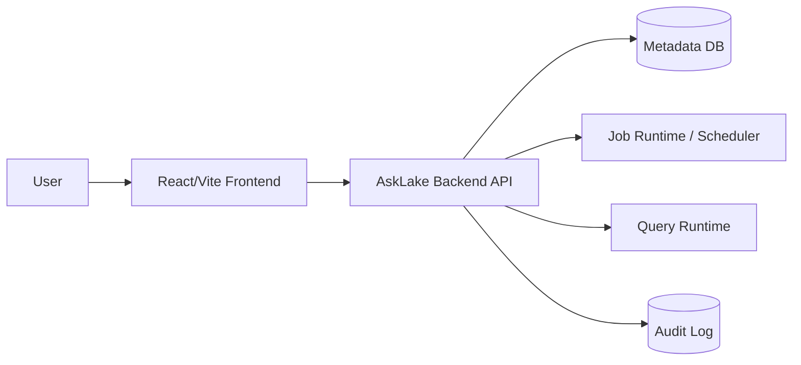

# 02. Architecture

## Current Pair A Live Boundary (2026-07-06)

This document contains earlier planning notes. For the current Pair A branch, the authoritative boundary is:

- Source / Schema / Create / Run calls the live backend through `VITE_API_BASE_URL`; mock mode is not the target path for this PR.
- Initial ETL and Catalog hydrate should start from backend state. Creating a pipeline creates a Job and a pending `catalogTarget`; the Catalog Dataset is created or updated only after a successful run.
- Run state is keyed by `runId`: `runsByJobId[jobId]`, `selectedRunIdByJobId[jobId]`, and `dagStepsByRunId[runId]`.
- `jobExecutionEvidence` is only a compatibility adapter for existing pages, not the source of truth.
- Source schema sampling is bounded. `1GB 요청(기본 16MB 제한)` means the operator requested the large-sample path, while the interactive backend cap defaults to 16MB unless environment variables override it.


??臾몄꽌??AskLake???꾩옱 frontend baseline怨?紐⑺몴 backend architecture瑜??④퍡 湲곕줉?쒕떎.

## 1) ?꾩옱 援ъ“

?꾩옱 repository??frontend-only app?대떎.

```text
AskLake/
?쒋? frontend/
?? ?쒋? src/
?? ?? ?쒋? components/
?? ?? ?쒋? data/
?? ?? ?쒋? hooks/
?? ?? ?쒋? pages/
?? ?? ?쒋? services/
?? ?? ?쒋? styles/
?? ?? ?붴? types/
?? ?쒋? package.json
?? ?붴? vite.config.ts
?쒋? docs/
?? ?쒋? api-contract.md
?? ?붴? backend-integration-readiness.md
?붴? README.md
```

## 2) 湲곗닠 ?ㅽ깮

| ?곸뿭 | ?꾩옱 ?좏깮 | ?곹깭 | 硫붾え |
| --- | --- | --- | --- |
| Frontend | React + Vite + TypeScript | implemented | `frontend/` |
| UI icons | lucide-react | implemented | package dependency |
| State | React hooks/local state | implemented | `useAskLakeData`, `useAuditLogs` |
| API client | fetch wrapper | partial | `frontend/src/services/apiClient.ts` |
| Backend | TBD | planned | API contract exists |
| Database | TBD | planned | persistence model not implemented |

## 3) 紐⑺몴 ?쒖뒪??援ъ꽦



?꾩옱??`FE`留?援ы쁽?섏뼱 ?덇퀬, backend/API/DB/runtime?€ planned ?곹깭??

## 4) Frontend Layer

二쇱슂 梨낆엫:

- navigation怨??붾㈃ composition: `frontend/src/App.tsx`
- layout: `frontend/src/components/layout/`
- ingest/job ?붾㈃: `frontend/src/pages/ingest/`
- ETL creation flow: `frontend/src/pages/etl/`
- catalog ?붾㈃: `frontend/src/pages/catalog/`
- SQL ?붾㈃: `frontend/src/pages/sql/`
- dashboard ?붾㈃: `frontend/src/pages/dashboard/`
- mock data: `frontend/src/data/mockData.ts`
- domain state: `frontend/src/hooks/useAskLakeData.ts`
- audit/toast state: `frontend/src/hooks/useAuditLogs.ts`
- API boundary: `frontend/src/services/mockApi.ts`, `frontend/src/services/apiClient.ts`

### Job Run State Contract

Job command, History, and DAG screens share Run state through three frontend maps:

```ts
type RunsByJobId = Record<string, JobRunSummary[]>;
type SelectedRunIdByJobId = Record<string, string>;
type DagStepsByRunId = Record<string, JobDagStep[]>;
```

Ownership rules:

- `job.id` is the key for `runsByJobId`.
- `run.runId` is the value stored in `selectedRunIdByJobId[job.id]`.
- `run.runId` is the key for `dagStepsByRunId`.
- History changes the selected run by updating `selectedRunIdByJobId[job.id]`.
- DAG renders only `dagStepsByRunId[selectedRunIdByJobId[job.id]]`.
- `useAskLakeData` exposes `selectRunForJob(jobId, runId)` so History can change the selected run without touching DAG state directly.
- Initial job hydrate moves `job.runHistory` into `runsByJobId` and attaches `job.dagSteps` to the latest run id when available.
- `jobExecutionEvidence` is a compatibility adapter for existing pages, not the long-term source of truth.
- PR1 optimistic command UX should create a frontend-only temp run id like `client:<jobId>:<timestamp>` and reconcile it to the server `run.runId` when the command response arrives.
- `commandPendingByJobId[job.id]` tracks in-flight command buttons. It disables duplicate clicks without changing the Run/DAG contract.
- If the selected run has no DAG yet, DAG UI must show the empty state for that run instead of falling back to another run's `job.dagSteps`.

## 5) Backend Target Boundary

諛깆뿏?쒓? ?뚯쑀??梨낆엫:

- ETL job ?앹꽦怨??곹깭 ?꾩씠
- dataset catalog hydrate
- SQL query run ?앹꽦怨?寃곌낵 諛섑솚
- dashboard ?€??寃뚯떆
- audit log ?€??
- ?몄쬆/沅뚰븳???꾩엯??寃쎌슦 actor?€ access policy ?먯젙

?꾨줎?멸? 怨꾩냽 ?뚯쑀??梨낆엫:

- ?붾㈃ ?곹깭?€ ?ъ슜??interaction
- loading/error ?쒖떆
- optimistic update ?먮뒗 rollback UX
- mock/live ?꾪솚 adapter

## 6) ?곗씠??紐⑤뜽 珥덉븞

?곸꽭 ?€?낆? `docs/api-contract.md`?€ `frontend/src/types/`瑜?湲곗??쇰줈 ?쒕떎.

?듭떖 由ъ냼??

| Resource | ?꾩옱 ?꾩튂 | 諛깆뿏??紐⑺몴 |
| --- | --- | --- |
| ETL Job | `JobRowData` mock | persisted job resource |
| Dataset | `CatalogDataset` mock | catalog dataset resource |
| SQL Run | `SqlResultDraft` runtime state | query run resource |
| Dashboard | `DashboardEntry` and local builder state | dashboard resource |
| Audit Log | `useAuditLogs` local/localStorage state | audit log resource |

## 7) API Boundary

?꾩옱 live mode 吏꾩엯??

- `VITE_API_BASE_URL=http://localhost:8080`
- `frontend/src/services/apiClient.ts`

P0 API:

- `POST /api/etl/jobs`
- `POST /api/etl/jobs/{jobId}/commands`
- `POST /api/query/runs`

P1 hydrate API:

- `GET /api/etl/jobs`
- `GET /api/etl/jobs/{jobId}`
- `GET /api/catalog/datasets`
- `GET /api/catalog/datasets/{datasetId}`

## 8) ?ㅺ퀎 ?먯튃

- Mock data??demo baseline?대ʼn, 理쒖쥌 persistence model濡?媛꾩＜?섏? ?딅뒗??
- API response shape???꾨줎???€?낃낵 臾몄꽌媛€ ?④퍡 諛붾€뚯뼱???쒕떎.
- API, mock fixture, frontend internal state??status 媛믪? ?곸뼱 canonical value濡??좎??섍퀬 UI label mapper?먯꽌 ?쒓뎅???쒖떆濡?蹂€?섑븳??
- Backend ?곌껐?€ ?앹꽦/紐낅졊/SQL ?ㅽ뻾 媛숈? P0 vertical slice遺€???쒖옉?쒕떎.
- SQL runtime?€ read-only guard瑜?媛€?몄빞 ?쒕떎.
- 媛먯궗 濡쒓렇???ъ슜?먯뿉寃?蹂댁씠???쒗뭹 湲곕뒫?대㈃??backend integration evidence濡쒕룄 ?곗씪 ???덈떎.

## 9) ?댁쁺/諛고룷 硫붾え

- ?꾩옱 ?ㅽ뻾?€ frontend dev server 湲곗??대떎.
- backend dev server, DB, migration, container strategy???꾩쭅 ?뺥븯吏€ ?딆븯??
- CI媛€ ?앷린硫?理쒖냼 required check ?꾨낫??frontend build??
