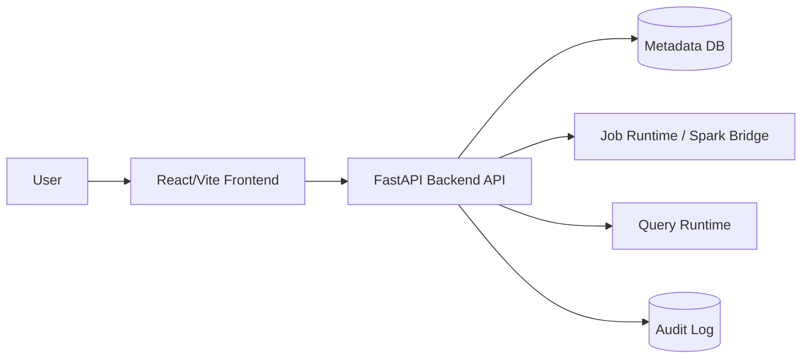

# 02. Architecture

이 문서는 AskLake의 현재 frontend baseline, FastAPI 전환 경계, 그리고 Pair별 backend ownership을 함께 기록한다.

## 1) Current Pair A Live Boundary

현재 Pair A 브랜치의 기준 경계는 다음과 같다.

- Source, Schema, Create, Run은 `VITE_API_BASE_URL`을 통해 live backend를 호출한다.
- 초기 ETL job과 Catalog dataset은 backend hydrate 결과를 따른다. 둘 다 비어 있을 수 있다.
- 파이프라인 생성은 Job과 pending `catalogTarget`을 만들고, Catalog dataset은 실행 성공 후 생성 또는 갱신한다.
- Run state는 `runId` 기준으로 관리한다.
- `jobExecutionEvidence`는 기존 화면 호환용 adapter이며 장기 source of truth가 아니다.
- Dashboard API는 FastAPI Pair3 전까지 local/mock fallback 또는 Node demo API 영역이다.

## 2) Repository Structure

```text
AskLake/
  backend/
    app/                 # FastAPI app
    scripts/             # source, spark, validation bridge scripts
    src/                 # existing Node validation/runtime helpers
  frontend/
    server/              # Node demo API, Dashboard persistence reference
    src/
      components/
      data/
      hooks/
      pages/
      services/
      styles/
      types/
  docs/
```

## 3) 기술 스택

| 영역 | 현재 선택 | 상태 | 메모 |
| --- | --- | --- | --- |
| Frontend | React + Vite + TypeScript | implemented | `frontend/` |
| UI icons | lucide-react | implemented | package dependency |
| Lineage graph | React Flow (`@xyflow/react`) | implemented | Catalog lineage modal |
| Dashboard grid | react-grid-layout + react-resizable | implemented | draft editor canvas |
| State | React hooks/local state | implemented | `useAskLakeData`, `useAuditLogs` |
| API client | fetch wrapper | partial | `frontend/src/services/apiClient.ts` |
| FastAPI backend | FastAPI + SQLAlchemy | partial | `backend/app/` |
| Node demo API | Node HTTP + pg | reference/demo | `frontend/server/` |
| Database | PostgreSQL metadata DB | partial | ETL/Catalog in FastAPI, Dashboard in Node demo reference |

## 4) 목표 시스템 구성



현재 FastAPI가 직접 소유하는 영역은 ETL, Run, Catalog hydrate, Catalog lineage fallback, SQL preview, SQL derived dataset 저장이다.
Dashboard persistence와 draft/published runtime은 Pair3에서 FastAPI로 옮긴다.

## 5) Frontend Layer

주요 책임:

- navigation과 화면 composition: `frontend/src/App.tsx`
- layout: `frontend/src/components/layout/`
- ingest/job 화면: `frontend/src/pages/ingest/`
- ETL creation flow: `frontend/src/pages/etl/`
- catalog 화면과 lineage graph modal: `frontend/src/pages/catalog/`
- SQL 화면: `frontend/src/pages/sql/`
- dashboard 화면: `frontend/src/pages/dashboard/`
- domain state: `frontend/src/hooks/useAskLakeData.ts`
- audit/toast state: `frontend/src/hooks/useAuditLogs.ts`
- API boundary: `frontend/src/services/apiClient.ts`, `frontend/src/services/pipelineApi.ts`, `frontend/src/services/mockApi.ts`
- dashboard list/runtime fallback: `frontend/src/services/dashboardApi.ts`, `frontend/src/services/dashboardRuntimeApi.ts`

라우팅은 아직 React Router가 아니라 `frontend/src/App.tsx`의 상태 기반 navigation이 중심이다.
Dashboard redesign부터 `/dashboards`, `/dashboards/:dashboardId`, `/dashboards/:dashboardId/edit`는 `App.tsx`의 browser history/path parser가 처리한다.

## 6) Job Run State Contract

Job command, History, DAG 화면은 세 개의 map을 공유한다.

```ts
type RunsByJobId = Record<string, JobRunSummary[]>;
type SelectedRunIdByJobId = Record<string, string>;
type DagStepsByRunId = Record<string, JobDagStep[]>;
```

Ownership rules:

- `job.id`는 `runsByJobId`의 key다.
- `run.runId`는 `selectedRunIdByJobId[job.id]`에 저장되는 값이다.
- `run.runId`는 `dagStepsByRunId`의 key다.
- History는 `selectedRunIdByJobId[job.id]`만 바꿔 선택 Run을 변경한다.
- DAG는 `dagStepsByRunId[selectedRunIdByJobId[job.id]]`만 렌더링한다.
- 초기 hydrate는 `job.runHistory`를 `runsByJobId`로 옮기고, 가능한 경우 최신 run id에 `job.dagSteps`를 연결한다.
- optimistic command UX는 `client:<jobId>:<timestamp>` 형태의 임시 run id를 만들고, 서버 응답의 `run.runId`로 reconcile한다.
- `commandPendingByJobId[job.id]`는 중복 클릭 방지용 in-flight 상태다.

## 7) Backend Target Boundary

FastAPI가 현재 소유하는 책임:

- ETL job 생성과 상태 전이
- Source test와 schema inference bridge
- Job hydrate와 Run hydrate
- Catalog dataset hydrate
- Catalog lineage fallback
- SQL preview 실행
- SQL preview 결과 기반 derived dataset 저장
- 공통 error envelope

FastAPI Pair3 이후로 넘길 책임:

- Dashboard list/query/create/delete
- Dashboard draft/published runtime
- Dashboard page/widget/layout persistence
- Audit log persistence
- 인증/권한 판정

## 8) 데이터 모델 요약

상세 타입은 `docs/api-contract.md`와 `frontend/src/types/`를 기준으로 한다.

| Resource | 현재 위치 | backend 목표 |
| --- | --- | --- |
| ETL Job | `JobRowData` | FastAPI persisted job resource |
| ETL Run | `JobRunSummary` | FastAPI persisted run resource |
| Dataset | `CatalogDataset` | FastAPI catalog dataset resource |
| Dataset Lineage | `LineageGraph` | FastAPI 저장 graph 또는 fallback graph |
| SQL Run | `SqlResultDraft` | FastAPI query preview resource |
| Dashboard | `DashboardEntry`, runtime response | Pair3 FastAPI dashboard resource |
| Audit Log | `useAuditLogs` local/localStorage state | future audit log resource |

## 9) API Boundary

Live mode 진입:

- `VITE_API_BASE_URL=http://localhost:8080`
- `VITE_USE_MOCK_API=false`
- `frontend/src/services/apiClient.ts`

FastAPI 현재 구현 범위:

- `GET /api/health`
- `POST /api/etl/sources/test`
- `POST /api/etl/schema-inference`
- `POST /api/etl/jobs`
- `GET /api/etl/jobs`
- `GET /api/etl/jobs/{jobId}`
- `POST /api/etl/jobs/{jobId}/commands`
- `GET /api/catalog/datasets`
- `GET /api/catalog/datasets/{datasetId}`
- `GET /api/catalog/datasets/{datasetId}/lineage`
- `POST /api/catalog/derived-datasets`
- `POST /api/query/runs`

Dashboard future API:

- `GET /api/dashboards`
- `POST /api/dashboards`
- `POST /api/dashboards/query`
- `PATCH /api/dashboards/{dashboardId}`
- `DELETE /api/dashboards/{dashboardId}`
- `GET /api/dashboards/{dashboardId}/published`
- `POST /api/dashboards/{dashboardId}/draft/ensure`
- `POST /api/dashboards/{dashboardId}/draft/pages`
- `PATCH /api/dashboards/{dashboardId}/draft/pages/{pageId}`
- `DELETE /api/dashboards/{dashboardId}/draft/pages/{pageId}`
- `POST /api/dashboards/{dashboardId}/draft/pages/{pageId}/widgets`
- `PATCH /api/dashboards/{dashboardId}/draft/widgets/{widgetId}`
- `DELETE /api/dashboards/{dashboardId}/draft/widgets/{widgetId}`
- `PATCH /api/dashboards/{dashboardId}/draft/layouts`
- `POST /api/dashboards/{dashboardId}/publish`

현재 프론트는 Dashboard endpoint가 FastAPI에서 404를 반환하면 local/mock fallback으로 목록, 생성, runtime 화면을 유지한다.

## 10) 설계 원칙

- Mock data는 demo baseline이며 최종 persistence model로 간주하지 않는다.
- API response shape는 frontend type과 문서가 함께 바뀌어야 한다.
- API, mock fixture, frontend internal state의 status 값은 영어 canonical value를 유지하고 UI label mapper에서 한국어로 표시한다.
- SQL runtime은 read-only guard를 가져야 한다.
- 빈 backend state는 정상 상태다. 상세/SQL/builder처럼 실제 resource가 필요한 화면만 방어한다.
- Dashboard API 구현 상태를 FastAPI live 구현으로 과장하지 않는다.

## 11) 운영/배포 메모

- 현재 실행은 backend FastAPI dev server와 frontend Vite dev server 기준이다.
- FastAPI 실행은 `backend/README.md`와 `docs/04-development-guide.md`를 따른다.
- Node demo API는 Dashboard Pair3 이전까지 reference로 유지한다.
- CI가 생기면 최소 required check 후보는 frontend build, backend import/compile, conflict marker scan이다.
