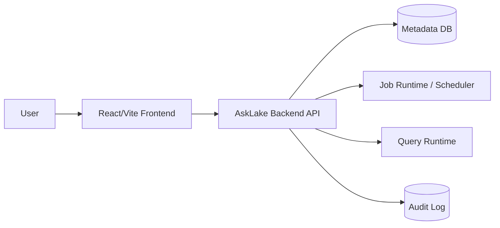

# 02. Architecture

## Current Pair A Live Boundary (2026-07-06)

This document contains earlier planning notes. For the current Pair A branch, the authoritative boundary is:

- Source / Schema / Create / Run calls the live backend through `VITE_API_BASE_URL`; mock mode is not the target path for this PR.
- Initial ETL and Catalog hydrate should start from backend state. Creating a pipeline creates a Job and a pending `catalogTarget`; the Catalog Dataset is created or updated only after a successful run.
- Run state is keyed by `runId`: `runsByJobId[jobId]`, `selectedRunIdByJobId[jobId]`, and `dagStepsByRunId[runId]`.
- `jobExecutionEvidence` is only a compatibility adapter for existing pages, not the source of truth.
- Source schema sampling is bounded. `1GB 요청(기본 16MB 제한)` means the operator requested the large-sample path, while the interactive backend cap defaults to 16MB unless environment variables override it.


??臾몄꽌??AskLake???꾩옱 frontend baseline怨?紐⑺몴 backend architecture瑜??④퍡 湲곕줉?쒕떎.

## 1) ?꾩옱 援ъ“

?꾩옱 repository??frontend-only app?대떎.

```text
AskLake/
?쒋? frontend/
?? ?쒋? src/
?? ?? ?쒋? components/
?? ?? ?쒋? data/
?? ?? ?쒋? hooks/
?? ?? ?쒋? pages/
?? ?? ?쒋? services/
?? ?? ?쒋? styles/
?? ?? ?붴? types/
?? ?쒋? package.json
?? ?붴? vite.config.ts
?쒋? docs/
?? ?쒋? api-contract.md
?? ?붴? backend-integration-readiness.md
?붴? README.md
```

## 2) 湲곗닠 ?ㅽ깮

| ?곸뿭 | ?꾩옱 ?좏깮 | ?곹깭 | 硫붾え |
| --- | --- | --- | --- |
| Frontend | React + Vite + TypeScript | implemented | `frontend/` |
| UI icons | lucide-react | implemented | package dependency |
| Dashboard grid | react-grid-layout + react-resizable | implemented | draft editor drag/resize canvas |
| Lineage graph | React Flow (`@xyflow/react`) | implemented | catalog lineage modal renders `LineageGraph` contract data with column-level handles and selected-column emphasis |
| State | React hooks/local state | implemented | `useAskLakeData`, `useAuditLogs` |
| API client | fetch wrapper | partial | `frontend/src/services/apiClient.ts` |
| Backend | Node HTTP demo API + FastAPI target scaffold | partial | `frontend/server/`는 demo adapter로 유지하고, production backend 전환 의사결정은 `docs/backend-fastapi-transition-plan.md`를 따른다. |
| Database | PostgreSQL demo metadata DB | partial | `docker-compose.yml`, JSONB tables plus dashboard revision tables |

## 3) 紐⑺몴 ?쒖뒪??援ъ꽦



?꾩옱??`FE`留?援ы쁽?섏뼱 ?덇퀬, backend/API/DB/runtime?€ planned ?곹깭??

## 4) Frontend Layer

二쇱슂 梨낆엫:

- navigation怨??붾㈃ composition: `frontend/src/App.tsx`
- layout: `frontend/src/components/layout/`
- ingest/job ?붾㈃: `frontend/src/pages/ingest/`
- ETL creation flow: `frontend/src/pages/etl/`
- catalog 화면과 lineage graph modal: `frontend/src/pages/catalog/`
- lineage graph API/mock boundary: `frontend/src/services/mockApi.ts`
- SQL 화면: `frontend/src/pages/sql/`
- dashboard 화면: `frontend/src/pages/dashboard/`
- dashboard runtime shell: `frontend/src/pages/dashboard/runtime/`
- mock data: `frontend/src/data/mockData.ts`
- domain state: `frontend/src/hooks/useAskLakeData.ts`
- audit/toast state: `frontend/src/hooks/useAuditLogs.ts`
- API boundary: `frontend/src/services/mockApi.ts`, `frontend/src/services/apiClient.ts`
- dashboard list/runtime API adapters: `frontend/src/services/dashboardApi.ts`, `frontend/src/services/dashboardRuntimeApi.ts`

라우팅은 아직 React Router가 아니라 `frontend/src/App.tsx`의 상태 기반 navigation이 중심이다.
Dashboard redesign Phase 01부터 `/dashboards`, `/dashboards/:dashboardId`, `/dashboards/:dashboardId/edit`는 `App.tsx`의 browser history/path parser가 처리한다.

### Job Run State Contract

Job command, History, and DAG screens share Run state through three frontend maps:

```ts
type RunsByJobId = Record<string, JobRunSummary[]>;
type SelectedRunIdByJobId = Record<string, string>;
type DagStepsByRunId = Record<string, JobDagStep[]>;
```

Ownership rules:

- `job.id` is the key for `runsByJobId`.
- `run.runId` is the value stored in `selectedRunIdByJobId[job.id]`.
- `run.runId` is the key for `dagStepsByRunId`.
- History changes the selected run by updating `selectedRunIdByJobId[job.id]`.
- DAG renders only `dagStepsByRunId[selectedRunIdByJobId[job.id]]`.
- `useAskLakeData` exposes `selectRunForJob(jobId, runId)` so History can change the selected run without touching DAG state directly.
- Initial job hydrate moves `job.runHistory` into `runsByJobId` and attaches `job.dagSteps` to the latest run id when available.
- `jobExecutionEvidence` is a compatibility adapter for existing pages, not the long-term source of truth.
- PR1 optimistic command UX should create a frontend-only temp run id like `client:<jobId>:<timestamp>` and reconcile it to the server `run.runId` when the command response arrives.
- `commandPendingByJobId[job.id]` tracks in-flight command buttons. It disables duplicate clicks without changing the Run/DAG contract.
- If the selected run has no DAG yet, DAG UI must show the empty state for that run instead of falling back to another run's `job.dagSteps`.

## 5) Backend Target Boundary

諛깆뿏?쒓? ?뚯쑀??梨낆엫:

- ETL job ?앹꽦怨??곹깭 ?꾩씠
- dataset catalog hydrate
- SQL query run 생성과 결과 반환
- dashboard 저장/게시/삭제
- audit log 저장
- 인증/권한이 도입될 경우 actor와 access policy 판정

FastAPI 전환은 `backend/app/`를 기준으로 한다.
1차 scaffold는 FastAPI 앱, CORS, PostgreSQL 연결, 공통 error envelope, `/api/health`까지를 범위로 두고, 실제 기능 endpoint 구현은 Pair별 후속 PR에서 진행한다.
구체적인 폴더 구조와 기술 선택은 `docs/backend-fastapi-transition-plan.md`를 기준으로 한다.

프론트가 계속 소유할 책임:

- ?붾㈃ ?곹깭?€ ?ъ슜??interaction
- loading/error ?쒖떆
- optimistic update ?먮뒗 rollback UX
- mock/live ?꾪솚 adapter

## 6) ?곗씠??紐⑤뜽 珥덉븞

?곸꽭 ?€?낆? `docs/api-contract.md`?€ `frontend/src/types/`瑜?湲곗??쇰줈 ?쒕떎.

?듭떖 由ъ냼??

| Resource | ?꾩옱 ?꾩튂 | 諛깆뿏??紐⑺몴 |
| --- | --- | --- |
| ETL Job | `JobRowData` mock | persisted job resource |
| Dataset | `CatalogDataset` mock | catalog dataset resource |
| Dataset Lineage | `LineageGraph` mock/fallback | column-level lineage graph resource |
| SQL Run | `SqlResultDraft` runtime state | query run resource |
| Dashboard | `DashboardEntry`, list adapter, draft/published runtime response | dashboard resource with revision/page/widget snapshots |
| Audit Log | `useAuditLogs` local/localStorage state | audit log resource |

## 7) API Boundary

?꾩옱 live mode 吏꾩엯??

- `VITE_API_BASE_URL=http://localhost:8080`
- `frontend/src/services/apiClient.ts`

P0 API:

- `POST /api/etl/jobs`
- `POST /api/etl/jobs/{jobId}/commands`
- `POST /api/query/runs`

P1 hydrate API:

- `GET /api/etl/jobs`
- `GET /api/etl/jobs/{jobId}`
- `GET /api/catalog/datasets`
- `GET /api/catalog/datasets/{datasetId}`
- `GET /api/catalog/datasets/{datasetId}/lineage`

Dashboard runtime API:

- `GET /api/dashboards`
- `POST /api/dashboards`
- `POST /api/dashboards/query`
- `PATCH /api/dashboards/{dashboardId}`
- `GET /api/dashboards/{dashboardId}/published`
- `POST /api/dashboards/{dashboardId}/draft/ensure`
- `POST /api/dashboards/{dashboardId}/draft/pages`
- `PATCH /api/dashboards/{dashboardId}/draft/pages/{pageId}`
- `DELETE /api/dashboards/{dashboardId}/draft/pages/{pageId}`
- `POST /api/dashboards/{dashboardId}/draft/pages/{pageId}/widgets`
- `PATCH /api/dashboards/{dashboardId}/draft/layouts`
- `POST /api/dashboards/{dashboardId}/publish`

랜딩 페이지의 새 대시보드 생성은 `POST /api/dashboards`로 dashboard card를 `draft` 상태로 먼저 저장하고, 프론트는 응답받은 id로 `/dashboards/{dashboardId}` 조회 화면에 진입한다. Draft editor는 DB-backed draft revision을 편집하고, page 추가/삭제, widget 생성/수정/삭제, widget layout 저장을 API로 반영한다. Published viewer는 published revision만 읽으며, draft 변경사항은 `POST /api/dashboards/{dashboardId}/publish` 이후 새 published revision으로 보인다.
Draft editor에서 dashboard title은 `PATCH /api/dashboards/{dashboardId}`로 dashboard card payload에 저장하고, page tab title은 `PATCH /api/dashboards/{dashboardId}/draft/pages/{pageId}`로 현재 draft revision의 page row에 저장한다.
Phase 06 runtime UX는 별도 share API 없이 프론트에서 공유 링크를 복사한다. Published revision이 있으면 `/dashboards/{dashboardId}`를, draft만 있으면 `/dashboards/{dashboardId}/edit`를 복사하며, publish 성공 후 목록 상태도 다시 갱신한다.
Dashboard draft editor shell은 화면 높이 안에서 상단 바, 페이지 탭, 필터 행, 왼쪽 dataset sidebar, 오른쪽 inspector를 고정 흐름으로 유지하고, 위젯이 많아질 때 중앙 canvas 영역 안에서만 스크롤한다.
Dataset 기반 위젯 생성 준비 단계에서는 draft editor가 transient `selectedDatasetId`를 소유하며, Gold dataset 목록은 `useDashboardDatasets` mock hook을 통해 공급한다. 이 hook은 이후 `GET /api/catalog/datasets` hydrate로 교체할 경계다.
Dataset 기반 widget 생성 폼은 `metric`, `table`, `bar_chart`, `line_chart`, `donut_chart` 5개 runtime type으로 고정한다. `POST /api/dashboards/{dashboardId}/draft/pages/{pageId}/widgets`는 `datasetId`와 type별 `config`를 함께 전송하며, config 계약은 `MetricWidgetConfig`, `TableWidgetConfig`, `BarChartWidgetConfig`, `LineChartWidgetConfig`, `DonutChartWidgetConfig`를 기준으로 한다.
Dashboard widget 생성 API는 `datasetId`가 있고 명시적 `data`가 없을 때 catalog dataset의 rows 또는 sample rows를 column name 기반 object row로 변환해 widget `data` snapshot에 저장한다. Draft runtime 조회는 이 `widget.data`를 그대로 반환하며, chart 계산/렌더링 레이어는 이미 내려온 `widget.data`를 소비하는 책임만 가진다.
Runtime widget renderer는 `widget.data`를 그대로 그리지 않고, type별 `config`와 `aggregation`을 기준으로 표시용 값을 계산한다. `metric`은 단일 집계값, `table`은 컬럼/정렬, `bar_chart`/`line_chart`/`donut_chart`는 label key 기준 grouping과 `sum`/`avg`/`count`/`min`/`max` 집계를 프론트에서 처리한다.
Draft grid는 위젯 카드 전체에서 drag를 시작할 수 있게 유지하되, no-reflow collision guard로 다른 위젯이 과하게 아래로 밀리는 layout을 막는다. 새 위젯은 현재 page layout에서 충돌하지 않는 첫 빈 위치에 배치하고, drag/resize stop 시 충돌 layout은 draft state와 `PATCH /api/dashboards/{dashboardId}/draft/layouts`에 저장하지 않고 되돌린다.
Dashboard runtime 프론트 구조는 `DashboardPage.tsx`가 목록/생성/삭제/런타임 진입 같은 상위 흐름을 소유하고, `runtime/DashboardRuntimeView.tsx`가 runtime shell, page tab, dataset sidebar, canvas, inspector 조립을 담당한다. Dataset 기반 위젯 생성 API 흐름은 `runtime/useDraftWidgetCreator.ts`, draft widget layout 저장과 collision 실패 처리는 `runtime/useDraftWidgetLayouts.ts`가 담당한다.

## 8) ?ㅺ퀎 ?먯튃

- Mock data??demo baseline?대ʼn, 理쒖쥌 persistence model濡?媛꾩＜?섏? ?딅뒗??
- API response shape???꾨줎???€?낃낵 臾몄꽌媛€ ?④퍡 諛붾€뚯뼱???쒕떎.
- API, mock fixture, frontend internal state??status 媛믪? ?곸뼱 canonical value濡??좎??섍퀬 UI label mapper?먯꽌 ?쒓뎅???쒖떆濡?蹂€?섑븳??
- Backend ?곌껐?€ ?앹꽦/紐낅졊/SQL ?ㅽ뻾 媛숈? P0 vertical slice遺€???쒖옉?쒕떎.
- SQL runtime?€ read-only guard瑜?媛€?몄빞 ?쒕떎.
- 媛먯궗 濡쒓렇???ъ슜?먯뿉寃?蹂댁씠???쒗뭹 湲곕뒫?대㈃??backend integration evidence濡쒕룄 ?곗씪 ???덈떎.

## 9) ?댁쁺/諛고룷 硫붾え

- ?꾩옱 ?ㅽ뻾?€ frontend dev server 湲곗??대떎.
- backend dev server, DB, migration, container strategy???꾩쭅 ?뺥븯吏€ ?딆븯??
- CI媛€ ?앷린硫?理쒖냼 required check ?꾨낫??frontend build??
