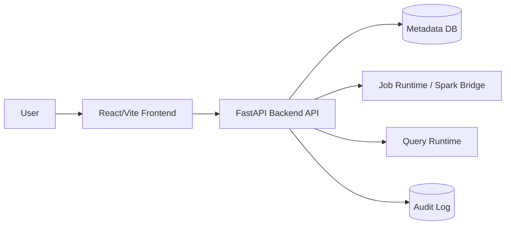

# 02. Architecture

이 문서는 AskLake의 현재 frontend baseline, FastAPI 전환 경계, 그리고 Pair별 backend ownership을 함께 기록한다.

## 1) Current Pair A Live Boundary

현재 Pair A 브랜치의 기준 경계는 다음과 같다.

- Source, Schema, Create, Run은 `VITE_API_BASE_URL`을 통해 live backend를 호출한다.
- 초기 ETL job과 Catalog dataset은 backend hydrate 결과를 따른다. 둘 다 비어 있을 수 있다.
- 파이프라인 생성은 Job과 pending `catalogTarget`을 만들고, Catalog dataset은 실행 성공 후 생성 또는 갱신한다.
- 같은 Job 또는 같은 `targetDataset`으로 다시 생성/실행한 결과는 기본적으로 기존 Catalog dataset에 append한다. Catalog 검색 목록은 dataset row를 하나만 유지하고, 실행/SQL materialize 결과는 dataset payload의 `materializationRuns` history로 관리한다.
- Run state는 `runId` 기준으로 관리한다.
- 실행 흐름/DAG는 별도 top-level 화면이 아니라 Run History에서 선택한 `runId`의 단계 흐름으로 표시한다.
- Dashboard card/list와 draft/published runtime API는 FastAPI에 등록되어 있다. 프론트는 이전 backend 호환을 위해 404 local fallback을 유지한다.

## 2) Repository Structure

```text
AskLake/
  backend/
    app/                 # FastAPI app
    scripts/             # source, spark, validation bridge scripts
    src/                 # existing Node validation/runtime helpers
  frontend/
    server/              # Node demo API, Dashboard persistence reference
    src/
      components/
      data/
      hooks/
      pages/
      services/
      styles/
      types/
  docs/
```

## 3) 기술 스택

| 영역 | 현재 선택 | 상태 | 메모 |
| --- | --- | --- | --- |
| Frontend | React + Vite + TypeScript | implemented | `frontend/` |
| UI icons | lucide-react | implemented | package dependency |
| Lineage graph | React Flow (`@xyflow/react`) | implemented | Catalog lineage modal |
| Dashboard grid | react-grid-layout + react-resizable | implemented | draft editor canvas |
| Dashboard charts | ApexCharts (`apexcharts`, `react-apexcharts`) | partial | runtime chart renderer and 8-type widget contract |
| State | React hooks/local state | implemented | `useAskLakeData`, `useAuditLogs` |
| API client | fetch wrapper | partial | `frontend/src/services/apiClient.ts` |
| FastAPI backend | FastAPI + SQLAlchemy | partial | `backend/app/` |
| Node demo API | Node HTTP + pg | reference/demo | `frontend/server/` |
| Database | PostgreSQL metadata DB | partial | ETL/Catalog/Dashboard metadata in FastAPI, Node demo API is reference/demo |

## 4) 목표 시스템 구성



현재 FastAPI가 직접 소유하는 영역은 ETL, Run, Catalog hydrate, Catalog lineage fallback, SQL preview, SQL derived dataset 저장, Dashboard card/list, Dashboard draft/published runtime이다.
Node demo API는 기존 동작 비교용 reference로 남긴다.

## 5) Frontend Layer

주요 책임:

- navigation과 화면 composition: `frontend/src/App.tsx`
- layout: `frontend/src/components/layout/`
- ingest/job 화면: `frontend/src/pages/ingest/`
- ETL creation flow: `frontend/src/pages/etl/`
- ETL Schedule step은 `스케줄링 건너뛰기`와 `반복 실행` 두 선택지만 노출한다. 스케줄링을 건너뛰면 저장 후 사용자가 Job 목록/상세에서 `즉시 실행`으로 1회 Run을 만든다. 따라서 `수동/자동/1회 실행` 표현은 스케줄 옵션으로 노출하지 않는다. 반복 실행은 IANA timezone, 겹침 처리(`skip_if_running` 기본값), watermark 수집 기준, 지수 백오프 재시도 정책을 생성 계약에 포함하지만, 실제 production-grade scheduler 엔진은 MVP 후속 범위다.
- catalog 화면과 lineage graph modal: `frontend/src/pages/catalog/`
- SQL 화면: `frontend/src/pages/sql/`
- dashboard 화면: `frontend/src/pages/dashboard/`
- domain state: `frontend/src/hooks/useAskLakeData.ts`
- audit/toast state: `frontend/src/hooks/useAuditLogs.ts`
- API boundary: `frontend/src/services/apiClient.ts`, `frontend/src/services/pipelineApi.ts`, `frontend/src/services/mockApi.ts`
- Query AI helper: `frontend/src/services/queryAiService.ts`
- dashboard list/runtime API adapter와 fallback: `frontend/src/services/dashboardApi.ts`, `frontend/src/services/dashboardRuntimeApi.ts`
- SQL 결과 저장 UI는 `useAskLakeData.prepareSqlDatasetJobDraft`에서 SQL Result metadata를 `DraftPipeline`으로 변환한 뒤 ETL Review 화면으로 이동한다.
- SQL 결과 대시보드 생성은 SQL 화면의 모달 안에 `DashboardPage`의 `source: "sql"`, `view: "runtime"`, `runtimeMode: "draft"` entry를 렌더링해, 현재 페이지를 떠나지 않고 대시보드 builder에서 SQL 결과 컬럼과 row sample을 직접 시각화하도록 한다.
- SQL 분석 화면은 Catalog에서 넘어온 dataset과 사용자가 추가한 dataset을 오른쪽 `선택 테이블` 사이드바에 단일 목록으로 표시한다. 왼쪽 `분석 테이블`은 schema preview를 펼쳐 확인한 뒤 선택할 수 있고, 오른쪽 schema 영역은 선택 테이블 목록에서 클릭한 단일 dataset의 schema만 표시한다. schema column 클릭은 SQL editor 커서 위치에 column reference를 삽입하는 보조 동작이며, 같은 column name이 여러 선택 테이블에 있으면 `table.column` 형태로 삽입한다. SQL editor의 사용자가 직접 작성한 query text가 실행 기준 source of truth이며 UI 선택 상태로 역동기화하지 않는다. 선택 테이블을 제거해도 SQL text는 자동 재작성하지 않고, 제거된 table을 계속 참조하면 preview 전 table context 검증에서 차단한다. UI에서는 base/reference를 구분하지 않고, 내부 API payload만 기존 `sourceDatasetId`/`referenceDatasetIds` 계약을 유지한다.
- SQL 분석 구현은 `SqlAnalysisPage.tsx`가 화면 상태와 큰 레이아웃을 맡고, `sqlLogic.ts`가 SQL 검증/자동완성/format helper를, `queryAiService.ts`가 Query AI 생성 요청을, `SqlPreviewTable.tsx`, `SqlSchemaPanel.tsx`, `SqlDatasetRow.tsx`, `SqlDatasetSchemaPreview.tsx`가 표시 컴포넌트를 맡는다.
- Query AI 생성 기능은 SQL editor 주변에서만 동작한다. live mode에서는 `frontend/src/services/queryAiService.ts`가 `POST /api/query/ai-suggestions`를 호출하고, FastAPI가 backend env의 `OPENAI_API_KEY`로 OpenAI Responses API에 요청한다. mock mode에서는 같은 request shape로 프론트 로컬 SQL 초안 fallback을 사용한다. AI는 선택 테이블 context 안에서만 SQL 초안을 만들 수 있고, backend는 AI 응답도 read-only SQL과 선택 dataset scope로 재검증한다. AI가 만든 SQL은 자동 실행하지 않고 editor 적용 후 기존 read-only/preflight 검증을 다시 통과해야 실행된다.

라우팅은 `frontend/src/main.tsx`에서 React Router Declarative Mode의 `BrowserRouter`를 사용하고, `/`는 `/jobs`로 redirect한다.
`frontend/src/App.tsx`는 Router Shell 역할을 맡아 `/jobs`, `/jobs/:jobId`, `/jobs/:jobId/runs`, `/etl/source`, `/etl/schema`, `/etl/schedule`, `/etl/permission`, `/etl/target`, `/etl/review`, `/catalog`, `/catalog/:datasetId`, `/sql`, `/dashboards`, `/dashboards/:dashboardId`, `/dashboards/:dashboardId/edit`를 기존 flow state와 매핑한다.
route param은 기존 `selectedJob`, `selectedDataset`, `dashboardEntry` 상태와 동기화하지만, 데이터 로딩은 React Router loader/action으로 옮기지 않는다.
수집/처리 생성 flow의 상단 stepper는 같은 `App.tsx` 상태 이동을 사용해 소스, 처리, 스케줄, 권한, 타겟, 검토 단계로 직접 이동하며, 화면 전환은 `useNavigate` 기반으로 URL도 함께 갱신한다.
수집/처리 목록은 TanStack Table 기반 표형 목록을 기본 화면으로 사용한다. 실행 이력에서는 같은 job의 run 목록, 실패 로그, 실행 단계 보기 모달을 함께 다룬다.
수집/처리의 작업 진행 순서 시각화는 독립 메뉴가 아니라 실행 이력의 `실행 단계 보기` 모달에서 표시한다.
live mode에서는 마지막으로 성공한 ETL job/catalog hydrate 결과를 브라우저 localStorage에 보관해, job 실행 중 새로고침해도 수집/처리 shell과 직전 job 목록을 먼저 렌더링한다.
live mode에서 run/retry 명령 응답의 `running` 상태를 즉시 반영하고, `GET /api/etl/jobs/{jobId}` polling으로 Spark 완료 후 최종 상태를 반영한다.

## 6) Job Run State Contract

Job command와 Run History의 실행 흐름 카드는 세 개의 map을 공유한다.

```ts
type RunsByJobId = Record<string, JobRunSummary[]>;
type SelectedRunIdByJobId = Record<string, string>;
type DagStepsByRunId = Record<string, JobDagStep[]>;
```

Ownership rules:

- `job.id`는 `runsByJobId`의 key다.
- `run.runId`는 `selectedRunIdByJobId[job.id]`에 저장되는 값이다.
- `run.runId`는 `dagStepsByRunId`의 key다.
- History는 `selectedRunIdByJobId[job.id]`만 바꿔 선택 Run을 변경한다.
- Run History 안의 실행 흐름 카드는 `dagStepsByRunId[selectedRunIdByJobId[job.id]]`만 렌더링한다.
- 초기 hydrate는 `job.runHistory`를 `runsByJobId`로 옮기고, 가능한 경우 최신 run id에 `job.dagSteps`를 연결한다.
- optimistic command UX는 `client:<jobId>:<timestamp>` 형태의 임시 run id를 만들고, 서버 응답의 `run.runId`로 reconcile한다.
- `commandPendingByJobId[job.id]`는 중복 클릭 방지용 in-flight 상태다.

## 7) Backend Target Boundary

FastAPI가 현재 소유하는 책임:

- ETL job 생성과 상태 전이
- Source test와 schema inference bridge
- Job hydrate와 Run hydrate
- Catalog dataset hydrate
- Catalog lineage fallback
- SQL preview 실행
- SQL preview 결과 기반 derived dataset 저장
- SQL preview 결과 기반 ETL job draft handoff
- Dashboard list/query/create/delete
- Dashboard draft/published runtime
- Dashboard page/widget/layout persistence
- Dashboard Assistant OpenAI-backed response endpoint
- 공통 error envelope

후속으로 넘길 책임:

- Audit log persistence
- 인증/권한 판정
- RAG 검색 기반 Dashboard Assistant 고도화

Dashboard Assistant는 `POST /api/dashboards/assistant`를 FastAPI가 소유한다.
이 endpoint는 요청의 `dashboardId`/`pageId`를 기준으로 DB에서 draft 우선, 없으면 published runtime을 읽고,
대시보드에서 사용할 수 있는 available catalog dataset과 현재 page widget, 지원 가능한 widget type/config option을 OpenAI에 전달한다.
OpenAI 응답은 backend guard를 통과해야 하며, guard는 없는 datasetId, 없는 widgetId, 지원하지 않는 widget type,
데이터셋 컬럼과 맞지 않는 config를 제외하고 `warnings`로 돌려준다.
`OPENAI_API_KEY`가 없거나 `OPENAI_ASSISTANT_ENABLED=false`이거나 OpenAI 호출이 실패하면 응답 `message`/`warnings`에 `mock fallback`을 명시한 fallback 응답을 반환한다.
현재 시각화 요청 위젯과의 호환을 위해 `configPatch`, `widgetPatch`도 임시로 유지한다.
RAG 검색과 action 자동 적용 고도화는 후속 작업 범위다.

## 8) 데이터 모델 요약

상세 타입은 `docs/api-contract.md`와 `frontend/src/types/`를 기준으로 한다.

| Resource | 현재 위치 | backend 목표 |
| --- | --- | --- |
| ETL Job | `JobRowData` | FastAPI persisted job resource |
| ETL Run | `JobRunSummary` | FastAPI persisted run resource |
| Dataset | `CatalogDataset` | FastAPI catalog dataset resource |
| Dataset Lineage | `LineageGraph` | FastAPI 저장 graph 또는 fallback graph |
| SQL Run | `SqlResultDraft` | FastAPI query preview resource |
| Dashboard | `DashboardEntry`, runtime response | FastAPI dashboard card/runtime resource |
| Audit Log | `useAuditLogs` local/localStorage state | future audit log resource |

Catalog dataset은 `materializationRuns` append history를 가질 수 있다. 부모 dataset의 `rows`, `size`, `storageSizeBytes`, `lastUpdated`, `sourceRunId`는 삭제되지 않은 성공 run history를 기준으로 계산한다. 마지막 append 결과를 삭제해도 dataset shell은 남기며, 전체 dataset 삭제와 append 결과 삭제는 별도 UX/API로 분리한다.

Dashboard backend ownership은 card/list와 runtime snapshot으로 나눈다.
Card/List는 `dashboards`, `dashboard_tags`를 중심으로 목록, 생성, 제목 수정, 삭제를 담당한다.
Runtime은 `dashboard_revisions`, `dashboard_pages`, `dashboard_widgets`를 중심으로 published 조회, draft 편집, page/widget/layout/publish를 담당한다.
두 흐름은 `dashboardId`, `publishedRevisionId`, `DashboardCard`, `DashboardRuntimeResponse` 계약만 공유한다.
Runtime chart widget은 `widget.data`와 type별 `config`를 frontend에서 ApexCharts option/series로 변환해 렌더링한다. Dashboard runtime widget contract는 `metric`, `table`, ApexCharts 차트 8종(`bar_chart`, `line_chart`, `area_chart`, `donut_chart`, `pie_chart`, `radial_bar_chart`, `heatmap_chart`, `treemap_chart`)을 기준으로 확장한다. 사람이 설정 패널에서 고르는 옵션과 향후 AI widget 생성기가 만드는 옵션은 같은 widget type/config 계약을 사용한다. `table` 위젯은 후속 작업에서 TanStack Table 기반으로 별도 전환한다.

## 9) API Boundary

Live mode 진입:

- `VITE_API_BASE_URL=http://localhost:8080`
- `VITE_USE_MOCK_API=false`
- `frontend/src/services/apiClient.ts`

FastAPI 현재 구현 범위:

- `GET /api/health`
- `POST /api/etl/sources/test`
- `POST /api/etl/review`: Review 화면의 표시값과 생성 가능 상태를 서버 기준으로 정규화
- `POST /api/etl/schema-inference`
- `POST /api/etl/jobs`
- `GET /api/etl/jobs`
- `GET /api/etl/jobs/{jobId}`: 수집/처리 상세 hydrate와 실행 중 job 최종 상태 polling에 사용
- `POST /api/etl/jobs/{jobId}/commands`
- `GET /api/catalog/datasets`
- `GET /api/catalog/datasets/{datasetId}`
- `DELETE /api/catalog/datasets/{datasetId}/materialization-runs/{runId}`
- `GET /api/catalog/datasets/{datasetId}/lineage`
- `POST /api/catalog/derived-datasets`
- `POST /api/query/runs`
- `GET /api/dashboards`
- `POST /api/dashboards`
- `POST /api/dashboards/query`
- `PATCH /api/dashboards/{dashboardId}`
- `DELETE /api/dashboards/{dashboardId}`
- `GET /api/dashboards/{dashboardId}/published`
- `POST /api/dashboards/{dashboardId}/draft/ensure`
- `POST /api/dashboards/{dashboardId}/draft/pages`
- `PATCH /api/dashboards/{dashboardId}/draft/pages/{pageId}`
- `DELETE /api/dashboards/{dashboardId}/draft/pages/{pageId}`
- `POST /api/dashboards/{dashboardId}/draft/pages/{pageId}/widgets`
- `PATCH /api/dashboards/{dashboardId}/draft/widgets/{widgetId}`
- `DELETE /api/dashboards/{dashboardId}/draft/widgets/{widgetId}`
- `PATCH /api/dashboards/{dashboardId}/draft/layouts`
- `POST /api/dashboards/{dashboardId}/publish`

Demo/reference endpoint는 live ETL/Catalog API를 가리지 않도록 `/api/demo` 아래에 둔다.

- `GET /api/demo/etl/jobs`
- `GET /api/demo/catalog/datasets`

현재 프론트는 Dashboard endpoint가 FastAPI에서 404를 반환하면 local/mock fallback으로 목록, 생성, runtime 화면을 유지한다. FastAPI 응답이 성공하면 서버 응답을 source of truth로 사용한다.

## 10) 설계 원칙

- Mock data는 demo baseline이며 최종 persistence model로 간주하지 않는다.
- API response shape는 frontend type과 문서가 함께 바뀌어야 한다.
- API, mock fixture, frontend internal state의 status 값은 영어 canonical value를 유지하고 UI label mapper에서 한국어로 표시한다.
- SQL runtime은 read-only guard를 가져야 하며, 선택된 catalog dataset을 DuckDB table context로 등록해 projection/filter/group/order/limit/JOIN을 실제 preview SQL로 실행한다.
- 빈 backend state는 정상 상태다. 상세/SQL/builder처럼 실제 resource가 필요한 화면만 방어한다.
- Dashboard adapter는 FastAPI 응답을 우선하고, 이전 backend 호환을 위한 local fallback은 실패/404 경로로만 사용한다.

## 11) 운영/배포 메모

- 현재 실행은 backend FastAPI dev server와 frontend Vite dev server 기준이다.
- FastAPI 실행은 `backend/README.md`와 `docs/04-development-guide.md`를 따른다.
- Node demo API는 FastAPI 구현과 비교하는 reference로 유지한다.
- CI가 생기면 최소 required check 후보는 frontend build, backend import/compile, conflict marker scan이다.
