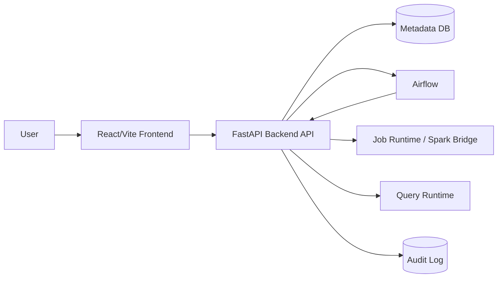

# 02. Architecture

이 문서는 AskLake의 현재 frontend baseline, FastAPI 전환 경계, 그리고 Pair별 backend ownership을 함께 기록한다.

## 1) Current Pair A Live Boundary

현재 Pair A 브랜치의 기준 경계는 다음과 같다.

- Source, Schema, Create, Run은 `VITE_API_BASE_URL`을 통해 live backend를 호출한다.
- 생성 wizard는 Source 결과의 `requiresRecordParsing`에 따라 `Source -> Record Parsing -> Schema` 또는 `Source -> Schema`로 분기한다. 이번 vertical slice에서 `requiresRecordParsing`은 선택한 MinIO/S3 `.txt`/`.log`가 이름 없는 `line_number + value` 샘플로 반환될 때만 활성화한다.
- Record Parsing Preview와 Spark batch runtime은 Job에 저장된 동일 `recordParsing` 계약을 사용한다. Preview는 제한 샘플을, Spark는 전체 입력을 검증하며 어느 쪽도 부족한 필드를 null로 채우거나 초과 필드를 버리지 않는다.
- PostgreSQL Source의 연결 테스트와 Schema 단계는 제한 Preview를 사용하지만 Snapshot `run`/`retry`는 `__Schema Sample Scope`와 무관하게 선택한 기본 테이블 전체를 읽는다. backend는 `REPEATABLE READ READ ONLY` transaction 안의 server-side cursor를 배치 fetch해 Run 전용 JSONL을 만들고, Spark는 그 파일 전체를 처리한다. 고정 행 상한은 두지 않으며 한 번에 메모리에 보관하는 행 수만 `ASKLAKE_POSTGRES_EXECUTION_BATCH_ROWS`로 제한한다.
- 초기 ETL job과 Catalog dataset은 backend hydrate 결과를 따른다. 둘 다 비어 있을 수 있다.
- 파이프라인 생성은 Job과 pending `catalogTarget`을 만들고, Catalog dataset은 실행 성공 후 생성 또는 갱신한다.
- 같은 Job 또는 표시명이 정확히 같은 `targetDataset`으로 다시 생성/실행한 결과는 기존 Catalog row의 `materializationRuns` history에 run-keyed로 누적한다. 일반 ETL/SQL full-refresh Run은 `materializationMode=snapshot`, Kafka의 새 offset/micro-batch Run은 `materializationMode=delta`다. 현재 Dataset은 newest-first 성공 history에서 첫 snapshot까지의 active segment만 사용하므로 새 snapshot은 이전 snapshot을 논리적으로 교체하고, snapshot 이후 delta만 누적한다. 다른 표시명은 ASCII slug가 같더라도 별도 Job/dataset identity를 가져야 한다. backend는 안전한 소문자 ASCII 이름에는 기존 `ds_<name>`을 유지하고, 한글·공백·특수문자·대소문자 변환처럼 slug에서 정보가 손실되는 이름에는 원문 기반 안정 해시 suffix를 붙인다. backend가 storage path를 자동 생성할 때도 같은 충돌 방지 key를 사용한다. Catalog 검색 목록은 dataset row를 하나만 유지하며 이전 snapshot의 물리 파일과 Run metadata는 history로 보존한다.
- ETL 컬럼 리니지는 source와 target에 같은 스키마를 복제하지 않는다. source node는 실제 입력/transform input 컬럼만 가지며, transform step의 `input -> output`을 source-to-job edge로, 실제 output column 이름 일치를 job-to-target edge로 저장한다. source engine은 파일 확장자나 connector type을, 가운데 Spark job은 dataset layer가 아닌 `PROCESS` node를, target engine은 현재 Spark runner가 실제 저장한 physical output format(`PARQUET`)을 사용한다. `_asklake_*` 실행 메타데이터는 Spark job에서 생성되므로 source edge를 만들지 않는다.
- Run state는 `runId` 기준으로 관리한다.
- 일반 File/Data Lake/PostgreSQL Snapshot Run은 `Frontend -> FastAPI command -> Airflow DAG -> token-authenticated FastAPI internal execution -> source export 또는 direct object read -> Spark runner -> Run/Catalog transaction` 순서다. Airflow에는 Job 전체나 source credential을 넘기지 않고 `jobId`, `runId`, `command`만 전달한다.
- Airflow의 terminal `success`만으로 데이터 처리를 성공 처리하지 않는다. 같은 `runId`의 실제 Spark output metadata와 Catalog materialization이 모두 저장되어야 Run이 `success`가 된다.
- 실행 흐름/DAG는 별도 top-level 화면이 아니라 Run History에서 선택한 `runId`의 단계 흐름으로 표시한다.
- Dashboard card/list와 draft/published runtime API는 FastAPI 응답만 source of truth로 사용한다. Catalog 기반 runtime widget은 `sampleRows` snapshot 대신 성공한 물리 materialization을 DuckDB로 제한 집계하거나 최대 500행 preview로 읽는다.

### Text Structuring Model Artifact Ownership

- text structuring model artifact는 Catalog dataset이 아니라 ETL 변환 실행에 사용하는 재사용 가능한 runtime artifact다.
- artifact 원본과 검증 metadata는 `model_artifacts` 저장소 및 `/api/catalog/models`, `/api/text-structuring/models` 호환 endpoint에 보존한다. 현재 endpoint 이름에 `catalog`가 포함되어도 dataset resource로 취급하지 않는다.
- 모델 선택 정책과 선택 artifact는 ETL 변환 설정이 소유한다. 특정 Run에서 실제 사용한 모델, fallback, 검증 행, invalid row는 Run의 `textStructuringExecution`이 실행 근거의 source of truth다.
- Catalog 목록은 model artifact 전역 inventory를 렌더링하지 않는다. Dataset materialization run에는 해당 dataset이 어떤 모델 기반 변환으로 생성됐는지와 quarantine 행을 compact provenance로만 표시한다.
- 독립 Model Registry가 제품 범위에 들어오기 전에는 model artifact를 Catalog dataset 또는 별도 top-level 탐색 자산으로 승격하지 않는다.

## 2) Repository Structure

```text
AskLake/
  backend/
    app/                 # FastAPI app
    scripts/             # source, spark, validation bridge scripts
    src/                 # existing Node validation/runtime helpers
  frontend/
    server/              # Node demo API, Dashboard persistence reference
    src/
      components/
      data/
      hooks/
      pages/
      services/
      styles/
      types/
  docs/
```

## 3) 기술 스택

| 영역 | 현재 선택 | 상태 | 메모 |
| --- | --- | --- | --- |
| Frontend | React + Vite + TypeScript | implemented | `frontend/` |
| UI icons | lucide-react | implemented | package dependency |
| Lineage graph | React Flow (`@xyflow/react`) | implemented | Catalog lineage modal |
| Dashboard grid | react-grid-layout + react-resizable | implemented | draft editor canvas |
| Dashboard charts | ApexCharts (`apexcharts`, `react-apexcharts`) | partial | runtime chart renderer and 8-type widget contract |
| State | React hooks/local state | implemented | `useAskLakeData`, `useAuditLogs` |
| API client | fetch wrapper | partial | `frontend/src/services/apiClient.ts` |
| FastAPI backend | FastAPI + SQLAlchemy | partial | `backend/app/` |
| Node demo API | Node HTTP + pg | reference/demo | `frontend/server/` |
| Database | PostgreSQL metadata DB | partial | ETL/Catalog/Dashboard metadata in FastAPI, Node demo API is reference/demo |

## 4) 목표 시스템 구성



현재 FastAPI가 직접 소유하는 영역은 ETL, Run, Catalog hydrate, Catalog lineage fallback, SQL query compatibility runtime, Trino Query Run, SQL derived dataset 저장, Dashboard card/list, Dashboard draft/published runtime이다. Issue #488은 local Compose의 Trino 482 coordinator, Iceberg JDBC catalog, object-storage warehouse, Trino HTTP adapter, canonical Query Run persistence/compiler와 Catalog `queryEngineTable` mapping을 추가한다. 일반 Trino result page는 private object storage의 gzip object에 저장하고 PostgreSQL에는 page metadata/checksum/manifest만 둔다. `trino-result-collector` worker가 Query Run, 1회성 Iceberg CTAS, 반복 SQL Job CTAS continuation을 수집하므로 browser polling과 상태 GET은 persisted state만 읽는다.

Collector claim은 DB lease와 증가하는 generation을 사용한다. page object는 generation별 attempt key에 쓴 뒤 현재 worker/generation이 유효한 transaction에서만 metadata로 공개한다. 오래된 worker는 자신이 쓴 attempt object만 삭제할 수 있고, page metadata의 source continuation을 이용해 retry 중 duplicate page 생성을 막는다. Query result API page size는 submit의 `resultPageSize`로 고정하며 signed cursor가 storage page index와 row offset을 감춘다. Frontend는 현재 page와 이전/다음 cursor만 유지하고 전체 결과를 memory에 누적하지 않는다. terminal result cleanup은 keyset batch worker가 retention에 따라 수행한다.

Query submit은 `(actorKey, clientRequestId)` unique reservation과 actor별 PostgreSQL advisory lock을 사용한다. 같은 key/fingerprint 재시도는 기존 run을 반환하고, 다른 요청의 key 재사용은 `409`, 동시 실행 slot 초과는 `429`다. run 재열기, 결과 조회, 취소, materialization 제출/조회는 현재 Dataset 권한·principal block·resource lock을 다시 검사한다. 실행 이력과 user grant의 principal 판정은 user ID를 우선하고 ID 없는 legacy record에만 display name fallback을 허용한다.

Query Engine 등록은 Dataset 표시명과 물리 table 이름을 분리한다. SQL 결과 Dataset은 Catalog에 `pending`을 먼저 저장하고 Iceberg CTAS terminal success와 `DESCRIBE` 검증이 끝난 뒤에만 `queryEngineStatus=available`과 `queryEngineTable`을 공개한다. 실패하면 mapping 없이 `registration_failed`와 안전한 오류만 저장한다. `TRINO_ENABLED=true`에서는 검증된 mapping이 없는 Dataset의 `permissions.canQuery`를 false로 계산한다. 현재 Spark Parquet와 Kafka JSONL writer는 Iceberg mapping을 증명하지 못하므로 `unavailable`로 저장하고, writer가 `queryEngineVerified=true`와 완전한 mapping을 반환할 때만 SQL 대상으로 승격한다.

반복 SQL Job은 `jobKind=trino_sql_materialization`과 `sqlRecipe`를 ETL Job에 저장한다. `sqlRecipe`에는 생성 당시 role/group/email snapshot 대신 `runAsUserId`만 남긴다. `run`/`retry`와 scheduler tick은 Airflow/Spark가 아니라 Trino SQL Job service로 분기되고, production에서는 실행 시점의 active auth user와 principal block을 다시 조회해 현재 role/group으로 권한을 판정한다. 삭제·비활성·차단 사용자는 실행 전에 `403`으로 차단한다. AuthUser row가 없는 로컬 header-auth 호환 경로만 저장된 user id를 유지한 `viewer`/빈 group actor로 제한하며 과거 admin/group snapshot을 신뢰하지 않는다. 각 Run은 고유 Iceberg table에 full-refresh CTAS를 수행하고 `DESCRIBE` 뒤에만 안정적인 논리 Dataset mapping을 교체한다. 실패·취소·collector 재시작 중에는 마지막 정상 mapping을 유지하고, 같은 `runId`의 Catalog 확정은 멱등이다.

Estimate & Guardrail은 SQL AST가 참조한 컬럼과 Iceberg `$files.readable_metrics`를 결합해 실행 전 스캔량을 계산하고, metadata가 없을 때만 Trino plan/Catalog heuristic을 fallback으로 사용한다. submit 시 estimate snapshot은 Query Run에 저장하지만 confirmation token은 저장하지 않는다. Collector는 continuation fetch 중 backend-only QueryInfo를 읽기 전용으로 샘플링해 progress, driver/split, elapsed/queued/CPU, processed rows/bytes, peak memory를 단조 증가 방식으로 보강한다. QueryInfo 실패는 실행 실패로 승격하지 않는다. Query 완료, 수집 시작, 첫 durable page, manifest 완료 milestone은 최초 관측 시각을 유지한다. 상세 lifecycle은 [Trino Query Run Contract](trino-query-run-contract.md), storage·retention은 [Trino Query Result Storage Contract](trino-query-result-storage-contract.md)를 따른다.
Node demo API는 기존 동작 비교용 reference로 남긴다.

### Object storage provider boundary

- 로컬 root Compose는 `ASKLAKE_OBJECT_STORAGE_PROVIDER=minio`를 기본값으로 사용하고 MinIO endpoint, 로컬 전용 access key/secret, path-style URL을 사용한다.
- 저장된 MinIO Source endpoint가 host loopback(`localhost`, `127.0.0.0/8`, `::1`)이면 host backend는 그 값을 유지하고 Docker Spark data plane만 `MINIO_ENDPOINT_IN_DOCKER`(기본 `http://m3-minio:9000`)로 변환한다. 외부 MinIO endpoint는 실행 경계에서도 그대로 보존한다.
- EC2 production Compose는 `ASKLAKE_OBJECT_STORAGE_PROVIDER=aws`를 사용하며 MinIO service나 장기 AWS access key/secret을 포함하지 않는다. Backend, Spark S3A, DuckDB, Trino warehouse/result storage는 EC2 instance profile IAM Role의 default credential chain을 공유한다.
- 현재 production 경로는 사전 생성한 Raw bucket을 읽고 Output bucket에 쓴다. `aws-s3-readiness`가 Raw list와 Output put/head/delete를 통과해야 backend가 시작된다.
- frontend는 provider build variable에 따라 local에서는 MinIO 연결 필드를, AWS에서는 region과 bucket/prefix만 표시한다. Target 기본 bucket은 production build에서 `ASKLAKE_SPARK_OUTPUT_BUCKET`을 `VITE_SPARK_OUTPUT_BUCKET`으로 주입해 backend writer와 같은 Output bucket을 가리킨다. AWS credential은 browser/API payload에 넣지 않는다.
- 저장된 legacy `s3a://asklake-output/...` Target은 실행과 Catalog 확정 시 현재 `ASKLAKE_SPARK_OUTPUT_BUCKET`으로 정규화한다. 사용자가 명시한 다른 S3 bucket 경로는 바꾸지 않는다.
- Warehouse와 Query Result bucket은 `TRINO_ENABLED=true`에서 Iceberg table data와 private result page에 사용한다. 로컬 root Compose는 MinIO를 쓰고 production은 사전 생성한 AWS S3 bucket과 EC2 instance profile default credential chain을 사용한다. Production에는 MinIO service나 장기 AWS access key/secret을 두지 않으며 readiness가 두 bucket의 최소 권한 round trip을 확인한다.
- Production Compose는 `TRINO_ENABLED=true`와 `COMPOSE_PROFILES=trino`를 함께 설정할 때만 coordinator, PostgreSQL bootstrap, collector, cleanup service를 포함한다. `false`에서는 profile을 비워 기존 DuckDB 호환 배포가 Trino bucket/secret/TLS file 없이 기동한다. Trino는 backend/PostgreSQL용 internal network와 AWS S3·IMDS default credential chain에 접근하는 전용 outbound network를 함께 사용하며 public port는 열지 않는다.
- 로컬 root Compose는 매 기동 시 idempotent PostgreSQL bootstrap service를 거쳐 기존 volume에도 Iceberg JDBC catalog table/권한을 보정한 뒤 Trino를 시작한다. `docker-entrypoint-initdb.d`는 새 volume 초기화만 담당한다.

### Storage Layout V1

Spark data-plane의 논리 경로는 MinIO와 AWS S3에서 같은 계약을 사용한다. 사용자가 `storagePath`를 명시하면 object key의 segment 의미를 바꾸지 않고 canonical percent encoding으로 보존하며 `s3://`는 `s3a://`로, bucket은 소문자로 정규화하고 마지막 `/` 하나를 제거한다. 공백·한글·`+`는 각각 의미가 유지되는 percent encoding으로 변환한다. 저장된 legacy `asklake-output` bucket만 현재 Output bucket으로 치환한다. 빈 segment(`//`), 잘못된 percent/UTF-8, percent-decoded slash, traversal, query/fragment는 `STORAGE_LAYOUT_INVALID`로 거부한다. 경로를 생략하면 아래 환경 격리 root를 만든다.

```text
s3a://<ASKLAKE_SPARK_OUTPUT_BUCKET>/<ASKLAKE_STORAGE_BASE_PREFIX>/<ASKLAKE_STORAGE_ENVIRONMENT>/datasets/<datasetId>/<layer>
```

| Artifact | Storage Layout V1 path |
| --- | --- |
| Batch data | `<root>/<runId>` |
| Batch quarantine compatibility | `<root>/<runId>_quarantine` |
| Continuous data | `<root>/_batches` |
| Job checkpoint | `<root>/_checkpoints/<jobId>` |
| Publication manifest | `<root>/_batch-manifests` |
| Continuous quarantine | `<root>/_quarantine` |
| Log reference | `<root>/_logs/<jobId>` |

Batch bridge는 표시명에서 다시 slug를 만들지 않고 저장된 `datasetId`를 Spark에 전달하며, Catalog 확정 시 실제 output이 같은 Storage Layout의 `<root>/<runId>`인지 검증한다. checkpoint는 Job ID까지 포함해 여러 Continuous Job이 같은 dataset/layer를 사용해도 충돌하지 않는다. 기존 Continuous Job에 `storagePath`가 없지만 `continuousConfig.checkpointPath`가 있으면 `/_checkpoints/<jobId>`를 제거해 원래 root를 복원한다. checkpoint와 root가 다르면 새 위치로 조용히 전환하지 않고 `STORAGE_LAYOUT_INVALID`로 중단한다. data/checkpoint/manifest/quarantine/log 보존 기간은 각각 `ASKLAKE_STORAGE_*_RETENTION_DAYS`로 선언하며 기본값은 `0(무기한)/30/90/30/14일`이다. 이 값은 애플리케이션 계약이며 실제 삭제는 MinIO/AWS bucket lifecycle을 같은 값으로 별도 구성해야 한다. Production data-plane은 object storage URI만 허용한다. Spark REST 상태 파일과 backend control-plane report는 아직 공유 host volume에 남으며 log reference object 적재와 중앙 로그 수집은 운영 관측 Phase의 범위다.

### Airflow batch execution

일반 배치 Job의 `run`/`retry`는 `FastAPI -> Airflow DAG Run -> token-authenticated FastAPI internal execution API -> PySpark -> MinIO/S3 Parquet` 순서로 실행한다. Airflow는 orchestration 상태의 source of truth이고 FastAPI/PostgreSQL은 Job 설정과 사용자-facing Run metadata의 source of truth다.

Airflow task는 Docker socket이나 object storage credential을 직접 받지 않는다. `spark_process_write` task가 `AIRFLOW_EXECUTION_API_TOKEN`으로 FastAPI 내부 API를 호출하면 FastAPI가 저장된 Job/Run identity를 재검증한다. 로컬 개발은 기존 Docker launcher를 사용한다. production 기본값은 내부 `spark-master:6066` Standalone REST API이고, AWS 배포가 명시적으로 opt in하면 일반 Batch만 EMR Serverless `StartJobRun`으로 제출한다. 두 remote 경로 모두 Airflow DAG shape는 바꾸지 않는다.

### Spark Runtime boundary

Spark 실행 환경 선택의 source of truth는 `backend/src/sparkRuntime.mjs`다. Runtime은 `docker`, `spark-rest`, `emr-serverless` canonical ID, `batch`·`sourceInspect`·`continuous`·`maintenance` capability, remote 여부, backend Docker socket 필요 여부를 함께 정의한다. 배치 실행, Parquet source inspection, Kafka Continuous lifecycle, replay/compaction maintenance는 각자 실행 구현을 보유하되 최상위 선택과 operation dispatch는 같은 Runtime 계약을 사용한다.

- 로컬 batch/source inspection은 설정이 없으면 기존처럼 `docker`가 기본이다. Kafka Continuous와 maintenance는 실수로 장기 container를 만드는 것을 막기 위해 `ASKLAKE_SPARK_RUNTIME=docker`를 명시해야 한다.
- production Compose 기본값은 `ASKLAKE_SPARK_RUNTIME=spark-rest`다. 일반 Batch 또는 Amazon MSK Continuous를 EMR Serverless로 전환한 AWS 배포만 `emr-serverless`를 선택한다. `APP_ENV=production`에서 local Docker Runtime은 작업 제출 전에 configuration error로 차단한다.
- `ASKLAKE_SPARK_RUNNER=docker|rest`는 기존 환경을 위한 호환 alias다. canonical 값과 legacy 값이 의미상 다르면 fail-fast하며 다른 Runtime으로 fallback하지 않는다.
- `emr-serverless`는 `batch`와 `continuous` capability를 제공한다. `continuous`는 MSK IAM과 AWS S3 layout만 허용한다. maintenance와 Parquet source inspection은 아직 지원하지 않으며 다른 Runtime으로 묵시적 fallback하지 않는다.

### EMR Serverless Batch control plane

EMR Batch는 `FastAPI -> Airflow -> Node bridge -> EMR Serverless -> S3 Parquet/report -> Catalog reconciliation` 순서다. backend는 Run별 manifest를 S3에 올린 뒤 `StartJobRun`을 한 번 호출하고 `GetJobRun`으로 상태를 poll한다. `applicationId`와 `jobRunId`는 durable control-state file에 원자적으로 저장하므로 backend가 재시작돼도 같은 Run을 다시 제출하지 않는다. PySpark report는 S3 object로 기록하고 backend는 성공·실패 manifest에 `runtime`, `runtimeJobId`, `runtimeLogReference`를 보존한다.

- 입력과 출력은 실제 AWS S3/S3A URI만 허용한다. 로컬 export/inline fixture source는 EMR Batch에서 fail-fast한다.
- backend는 EC2/ECS 등의 default AWS credential chain으로 `StartJobRun`, `GetJobRun`, `CancelJobRun`, manifest/artifact S3 작업을 수행하고 execution role을 `StartJobRun`에 전달한다. static access key/secret/session token은 제출 payload, state, log, API response에 저장하지 않는다.
- PySpark entry point는 `npm run emr:upload-artifact`로 versioned 운영 prefix에 업로드하며 SHA-256 metadata를 남긴다. Run manifest/report와 S3 monitoring log는 별도 configured prefix를 사용한다.
- `cancelRun`은 제출 전 cancellation marker를 남겨 race를 차단하고, 제출 뒤에는 persisted Job Run ID로 `CancelJobRun`을 요청한다. 취소된 Run은 뒤늦은 Airflow poll이나 Spark 결과가 success로 덮어쓰지 못하며 Catalog reconciliation도 거부된다.
- driver/executor cores·memory와 dynamic allocation min/initial/max는 환경 변수로 조정한다. 이 설정은 확장 가능성의 제어면일 뿐 처리량 보장이 아니며 실제 target workload 부하 시험은 별도다.

### EMR Serverless admission과 비용 경계

`ASKLAKE_EMR_SERVERLESS_ADMISSION_ENABLED=true`인 배포에서는 Batch Run과 Continuous session이 외부 제출 전에 `emr_admission_reservations`에 durable 예약을 만든다. application/workload scope의 PostgreSQL transaction advisory lock 안에서 활성 run/queue 수, 활성 예약의 vCPU·memory·disk 합계, actor/project quota를 다시 읽기 때문에 여러 FastAPI process의 동시 요청도 같은 결정을 공유한다. 예약은 `admitted|queued|submitted|running` 비종료 상태와 `completed|failed|canceled|expired` 종료 상태를 가지며 runtime Job ID와 판단 snapshot을 보존한다.

- 요청 자원은 driver 1개와 dynamic allocation `maxExecutors`까지 모두 사용한다고 가정한 안전 상한이다. memory는 overhead factor, disk는 driver/executor disk를 포함한다.
- 활성 slot 또는 자원 합계가 찼지만 queue 여유가 있으면 StartJobRun을 계속 보내고 EMR Serverless scheduler의 native FIFO queue에 dispatch를 위임한다. AskLake priority 값은 관측 metadata이며 AWS FIFO 순서를 바꾸지 않는다. queue가 가득 차거나 actor/project quota가 차면 외부 side effect 전에 `429`, 단일 Job이 policy/application cap보다 크면 `422`로 거절한다.
- Node adapter는 `GetApplication`으로 실제 `maximumCapacity`, `schedulerConfiguration`, auto-stop, Job cost allocation을 검증한 뒤에만 manifest upload/StartJobRun을 진행한다. 실제 AWS 설정이 AskLake 상한보다 넓으면 fail-closed한다.
- FastAPI 예약은 실행 결과/상태 동기화에서 terminal로 해제한다. runtime Job ID를 기록하기 전 죽은 `admitted/queued` lease만 background sync가 만료하며, 이미 제출된 원격 Job을 시간만으로 임의 해제하지 않는다.
- 비용은 configured vCPU/memory/disk 시간당 단가에 요청 상한을 곱한 비교용 최대 시간당 추정치다. 실제 사용량/청구액은 Phase 7 부하·비용 검증에서 CloudWatch와 Cost Explorer 근거로 별도 측정한다.
- `GET /api/admin/runtime-capacity`와 관리 콘솔 실행 용량 탭이 정책, 현재 예약량, 최근 판단을 제공한다. Batch는 `taskStates.sparkResult.emrAdmission`, Continuous는 `continuousRuntime.admission`으로 같은 예약을 사용자 실행 상세에 투영한다.

### AWS staging IaC와 smoke 계약 경계

Issue #727의 AWS staging은 제품 Runtime이나 일반 배포 환경이 아니라 `EMR Serverless + MSK Serverless` 후보 경로를 실제 AWS에서 검증하고 제거하는 일회성 validation environment다. versioned source of truth는 `infra/contracts/aws-staging-smoke.v1.json`이며 서울 리전, 전용 private VPC, S3 Terraform state, GitHub OIDC/IAM, 비용·TTL, EMR 용량, smoke 입력과 정합성 기준을 소유한다.

- 일반 애플리케이션 배포와 로컬 Compose는 staging Terraform apply를 호출하지 않는다. 유료 resource 생성은 수동 승인된 전용 workflow에서만 허용한다.
- Terraform state bootstrap, staging resource stack과 실행별 data/topic/checkpoint namespace를 분리한다. 실제 account/role/bucket/notification 값은 외부 입력이며 저장소에 커밋하지 않는다.
- apply 뒤 Runtime 설정은 `terraform output -json -> render-aws-staging-runtime.mjs -> stack별 private env + redacted manifest` 단방향으로 전달한다. env만 broker 원문을 가지며 mode `0600`/Git ignore로 관리하고, manifest와 console에는 broker 개수/SHA-256만 남긴다. Batch/Continuous application ID, execution role, S3 bucket, admission cap과 topic namespace는 Phase 0 계약과 Terraform output을 다시 검증한 뒤 기존 `ASKLAKE_*` 환경변수로 직렬화한다. Continuous feature flag는 Phase 3 artifact workflow가 필수 JAR와 전체 bundle checksum을 검증하고 불변 S3 prefix에 업로드한 뒤에만 활성화한다.
- private staging은 NAT/Maven egress를 두지 않고 S3 endpoint와 immutable JAR bundle을 사용한다. smoke runner는 private subnet의 일회성 EC2를 SSM으로 실행하며 public/SSH ingress를 열지 않는다. SSM/Logs/EMR 제어면 외에 CloudWatch metric evidence 조회용 `monitoring` interface endpoint를 명시한다.
- Batch와 Continuous application은 각각 16 vCPU 상한이지만 Phase 0에서는 계정 quota를 공유해 순차 실행한다. apply 전 실제 계정 quota가 최소 요구치보다 작은지 확인한다.
- 100만 건 smoke는 연결·정합성·pause/resume을 확인하는 기능 시험이다. latency와 비용을 기록하되 처리량/SLO 달성을 주장하지 않으며 Phase 7 반복 성능 evidence를 대체하지 않는다.
- 정상/실패 모두 증거 export 후 destroy하고 `ExpiresAt` 만료 sweep을 둔다. AWS Budget 알림은 지연될 수 있으므로 실시간 종료 장치로 취급하지 않는다.
- Terraform은 platform state bootstrap과 실행별 staging root를 분리한다. staging root는 network, storage, MSK, EMR, IAM, observability, cost-control, optional private SSM runner module을 조립하고 AWS provider lock과 credential 없는 mock plan으로 schema/연결을 검증한다.
- GitHub 제어면은 manual-only `plan/apply`, `artifacts`, `smoke`, `destroy` workflow로 분리한다. 모든 AWS job은 OIDC 단기 credential과 예상 account 검증을 사용하고, mutation은 서로 다른 보호 Environment와 정확한 `<operation>:<stackId>` 확인을 요구한다. plan/destroy 검토 job은 민감한 JSON 대신 의미적 SHA-256 fingerprint만 전달하고 승인 뒤 re-plan fingerprint가 다르면 변경 전에 중단한다. binary plan/private env/backend input은 GitHub artifact에 올리지 않으며 같은 stack 작업은 concurrency group으로 직렬화한다.
- artifact 제어면은 고정된 Maven dependency를 materialize해 JAR별/전체 SHA-256 manifest를 만들고 `dependencies/<bundleSha256>/`에 올린다. conditional write와 S3 checksum/size/metadata 재조회로 기존 key의 다른 content를 거부하고 manifest를 마지막에 검증한 뒤에만 Continuous를 활성화한다. 활성화된 private env는 staging S3의 실행별 runtime prefix로만 전달하며 일반 EC2/production deploy는 이를 자동 소비하지 않는다.
- Phase 4 smoke 제어면은 checksum 검증된 Linux runner bundle을 private SSM EC2에 전달하고 S3 readiness, MSK IAM roundtrip, EMR Batch, 100만 건 Continuous pause/resume를 순차 실행한다. `asklake.aws-staging-smoke-evidence.v1`은 Batch row, produced/consumed/sink, lag/quarantine, 두 worker attempt/Job Run, checkpoint/output/report와 실행 시점 price/resource snapshot을 하나의 redacted 근거로 묶으며 하나라도 빠지면 실패한다.
- Phase 5는 smoke SSM 실행 시작 후 success/failure evidence export를 확인한 뒤 같은 승인 job에서 stack teardown을 수행한다. 별도 TTL sweep은 state bucket의 엄격한 staging tag/`ExpiresAt`만 읽어 만료·비정상 stack을 발견하면 evidence와 실패 신호를 남기며, 자동 삭제 대신 기존 보호 destroy 승인으로 연결한다.
- EMR execution role trust는 AWS 공식 runtime-role 계약대로 `emr-serverless.amazonaws.com`과 `SourceAccount`에 묶고 전용 S3/KMS/MSK topic/group/CloudWatch만 허용한다. runner는 생성된 두 application ARN의 제어와 exact execution role PassRole만 허용하며 public IP와 SSH key를 갖지 않는다. MSK broker는 private Runtime env로 공급하므로 runner에는 `GetBootstrapBrokers`/`DescribeClusterV2` control-plane 권한을 주지 않는다.

전체 Phase와 고정 값은 [AWS Staging IaC와 실제 Smoke 자동화 계획](aws-staging-iac-smoke-plan.md)을 따른다. Phase 0 계약, Phase 1 Terraform/mock plan, Phase 2 Runtime 변환, Phase 3 수동 workflow, Phase 4 smoke 실행기와 Phase 5 cleanup/TTL 판정기까지 완료됐으며 실제 AWS resource와 evidence는 아직 생성하지 않았다.

### Phase 7 성능 evidence 경계

부하·장애·비용 검증은 제품 상태 DB를 성능 결과 저장소로 재사용하지 않는다. `streaming-phase7-plan.json`이 부하 8종과 장애 8종 및 전용 환경 안전 조건을, `streaming-slo-profile.draft.json`이 승인 전 SLO를, 실행별 `asklake.streaming-performance-evidence.v1`이 입력·정합성·처리량·지연·lag·복구·자원·output file·비용 근거를 소유한다. report engine은 반복 실행의 workload/tuning fingerprint가 같을 때만 한 시나리오로 묶고 JSON/Markdown을 만든다.

- 입력 누락과 설명되지 않은 중복은 항상 `failed`다.
- SLO가 draft이거나 최소 반복 수, latency, CloudWatch, EMR billed resource 또는 output file 근거가 없으면 `insufficient-evidence`다.
- profile과 evidence의 environment/region이 다르면 `failed`다. 장애 scenario는 실제 주입과 기대 결과가 필수이고 terminal fault는 정규화 failure code도 필요하다.
- `GetJobRun.billedResourceUtilization`의 vCPU/memory/storage 세 필드에 evidence와 같은 region/architecture 단가 snapshot을 곱한 값은 비교용 비용이며 S3/MSK/CloudWatch/data transfer와 Cost Explorer 실제 비용을 별도로 기록할 수 있다.
- CloudWatch는 period 값만으로 충분하지 않고 executor 표본과 peak CPU/memory가 함께 있어야 한다.
- local runner는 Redpanda/Docker Spark/MinIO의 정합성·복구 회귀에 사용한다. EMR autoscaling, MSK 처리량과 AWS 비용은 전용 staging에서만 승인할 수 있다.
- Continuous worker의 `endToEndLatency`는 Kafka record timestamp age percentile과 target commit까지의 batch duration으로 각 micro-batch P50/P95/P99를 계산한다. payload의 임의 event time이 아니다. batch manifest는 해당 batch 값을 보존하고 runtime은 checkpoint에서 복구 가능한 `worst-successful-batch-percentile` summary를 유지한다. runtime P95는 성공 batch별 P95의 최댓값인 보수적 지표이며 전체 record를 다시 합친 global percentile로 표현하지 않는다.

실제 부하 실행은 제품 API가 자동으로 AWS 인프라를 생성하거나 장애를 주입하는 흐름이 아니다. repo runner는 명시적 opt-in과 전용 local 환경을 요구하며, AWS-only scenario는 placeholder template만 만든다. 운영자는 승인된 staging에서 export한 증적으로 report를 생성한 뒤에만 Phase 8 Runtime 전환을 검토한다. 상세 절차는 [Kafka·Spark Phase 7 부하·장애·비용 검증](kafka-spark-phase7-validation.md)을 따른다.

### Phase 8 Runtime 전환 경계

Phase 8은 데이터 처리 Runtime 구현을 하나 더 만드는 단계가 아니라, 이미 존재하는 `spark-rest/redpanda`와 `emr-serverless/msk` 사이의 운영 전환 제어면이다. `asklake.runtime-cutover-plan.v1`이 고정 단계와 안전 규칙을, approved policy가 target/반복/관측 임계치를, evidence가 격리 식별자·Shadow 결과·관측·롤백 책임을 소유한다. report engine은 승인된 Phase 7 원본의 SHA와 요약을 포함한 `asklake.runtime-cutover-report.v1`을 생성한다.

- Baseline은 `spark-rest + redpanda`, Candidate는 승인 policy의 Runtime이어야 한다.
- 같은 논리 topic을 비교하되 consumer group, output prefix, checkpoint는 서로 달라야 하며 prefix 상하위 중첩도 실패다.
- 반복별 produced/consumed/sink 정합성과 누락·설명 안 된 중복 0을 먼저 확인한 뒤 row/quarantine delta와 schema/value/quarantine checksum을 비교한다.
- 단계 실패나 정합성/임계치 불일치는 `rollback-required`, 승인·반복·관측 부족은 `insufficient-evidence`다. 모든 gate가 통과한 `promotion-ready`도 Runtime을 자동 변경하지 않는다.
- Production preflight는 후보 Runtime을 선택한 경우 리포트 target과 env, 현재 전체 commit SHA, 원본 Phase 7 파일의 바이트 SHA를 대조한다. 기본 `spark-rest + redpanda` 롤백은 리포트 없이 가능하다.
- Batch의 `sparkResult.runtime`, Continuous의 `continuousRuntime.runtimeProvider`, admin runtime capacity를 실제 실행 Runtime 근거로 그대로 사용하며 Phase 8 전용 제품 API는 추가하지 않는다.

실제 AWS 실행, 승인과 운영 전환은 [Kafka·Spark Phase 8 점진적 Runtime 전환](kafka-spark-phase8-cutover.md)의 사람 승인 절차를 따른다. 배포 스크립트는 증거를 판정할 뿐 AWS 리소스 생성, topic 변경, Runtime promotion, output/checkpoint 삭제를 수행하지 않는다.

### Kafka Runtime과 Amazon MSK 연결 경계

Kafka 연결 설정의 source of truth는 `backend/src/kafkaRuntime.mjs`다. 기본 `redpanda` Runtime은 기존 `ASKLAKE_KAFKA_BROKER`와 무인증 plaintext 연결을 유지한다. `ASKLAKE_KAFKA_RUNTIME=msk`는 `ASKLAKE_MSK_ENABLED=true`, IAM bootstrap broker, AWS region을 모두 요구하고 MSK Serverless의 IAM SASL/OAUTHBEARER + TLS만 허용한다. Node client는 AWS 공식 signer와 default credential chain을 사용하며 access key, secret, session token을 별도 Kafka 설정이나 로그에 저장하지 않는다.

- Phase 4의 공통 client factory는 Node Source test/schema sampling, Kafka Snapshot ingest, replay producer, bounded MSK probe에 적용한다. Phase 5는 Spark Kafka source에 `SASL_SSL`/`AWS_MSK_IAM` 옵션과 IAM auth library를 주입하고 EMR Serverless Continuous adapter를 연결한다. Node는 OAUTHBEARER signer를, JVM Spark는 execution role의 default credential chain을 사용하는 AWS 공식 IAM 방식을 각각 사용한다.
- MSK topic은 기본 `asklake.<environment>.*` namespace를 사용한다. 기본 정책은 최소 3 partitions와 `retention.ms=604800000`이며 배포 환경 변수로 기대값을 명시할 수 있다. 메시지 건수만 보고 partition을 자동 증가시키지 않고, consumer 병렬성·key ordering·평균 record 크기·broker 처리량을 검토한 변경 승인으로 분리한다. partition 감소와 기존 topic 자동 삭제/재생성은 지원하지 않는다.
- `npm run kafka:msk-probe`는 topic metadata/config를 먼저 검사한 뒤 고유 correlation event를 produce하고 새 bounded consumer group이 같은 event를 제한 시간 안에 읽는지 확인한다. `--create-topic`은 topic이 없을 때만 명시적으로 생성하며 기존 topic의 partition이나 retention을 자동 수정하지 않는다.
- probe와 공통 Runtime은 authentication/authorization, connection timeout, topic 없음, topic policy mismatch를 서로 다른 code로 정규화한다. 오류 응답과 probe 로그에는 bootstrap broker 원문, provider stack, credential 값을 포함하지 않는다.
- 실제 MSK cluster, VPC/subnet/security group과 EMR role의 network/IAM 권한은 배포 인프라가 소유한다. repo 기본 검증은 fake client 계약이며 실제 roundtrip은 MSK에 접근 가능한 staging VPC에서 opt in으로 실행한다. local/Compose Redpanda는 rollback과 회귀 검증 경로로 계속 유지한다.

### EMR Serverless Continuous control plane

AWS Continuous 경로는 `FastAPI command -> Node bridge -> EMR Serverless STREAMING Job Run -> MSK -> S3A output/checkpoint/report -> FastAPI Catalog reconciliation` 순서다. `ASKLAKE_SPARK_RUNTIME=emr-serverless`, `ASKLAKE_KAFKA_RUNTIME=msk`, 두 feature flag를 모두 명시해야 하며 Redpanda broker를 EMR로 묵시적으로 전달하지 않는다.

- Start 전 로컬 durable state에 worker attempt, idempotent client token, application, manifest/report URI, checkpoint/output identity를 원자적으로 기록한다. backend가 제출 도중 또는 실행 중 재시작해도 같은 token/Job Run을 재연결하며 active state에서는 두 번째 `StartJobRun`을 보내지 않는다.
- 제출은 `mode=STREAMING`, `retryPolicy.maxFailedAttemptsPerHour=1..10`을 사용하고 `executionTimeoutMinutes`를 보내지 않는다. EMR 7.1.0 이상의 streaming resiliency가 같은 Job Run attempt와 S3 checkpoint에서 복구하지만, AskLake pause/stop이 사용하는 built-in graceful cancellation은 7.9.0 이상만 허용한다. 제출 직전 `GetApplication`으로 SPARK type, release와 제출 가능 상태를 검증하며 로그는 attempt별 S3 prefix를 참조한다.
- Job manifest는 S3에 저장하고 worker 환경에는 static AWS key가 아니라 MSK IAM SASL 옵션과 S3 경로만 전달한다. Python entry point와 세 helper module은 `npm run emr:upload-continuous-artifact`로 업로드한다.
- worker heartbeat/batch/lag/report와 Catalog ack는 deterministic S3 object로 왕복한다. API는 기존 Docker/Spark REST report shape로 정규화하고 `runtimeProvider`, application/Job Run ID, attempt, raw runtime state, log reference, last successful checkpoint를 추가한다. Catalog ack 업로드는 상태 조회와 분리해 실패를 `lastCatalogAckError`로 남기고 다음 polling에서 재시도한다.
- pause/stop은 `requested -> accepted -> completed|failed` 취소 상태를 durable state에 기록한다. `CancelJobRun` 성공 뒤에만 accepted가 되며 원격 `CANCELLED`에서만 각각 paused/stopped로 확정한다. `FAILED`/예상하지 못한 `SUCCESS`는 요청 의도가 있어도 실패다. Graceful 값은 15~1800초이며 기본 120초, stale worker `terminate`는 즉시 취소 값 0을 사용한다. resume은 같은 checkpoint로 새 Job Run/worker attempt를 만든다.
- 같은 broker/topic/group 충돌은 canonical identity에 대한 PostgreSQL transaction advisory lock을 Snapshot/Continuous 시작 경로가 공유하고, lock 안에서 active row를 다시 확인해 제출 전에 막는다. 아직 runtime row가 없는 동시 요청도 직렬화하며 EMR 내부 retry는 같은 Job Run이므로 새 consumer identity를 만들지 않는다.
- Connector는 `packages` 또는 `jars` mode를 명시한다. `packages`는 private subnet NAT/Maven egress를 확인하고 opt in해야 하며, `jars`는 release 호환 버전과 checksum을 고정한 Kafka/MSK IAM 및 transitive JAR의 S3 URI를 사용해 runtime Maven 의존을 제거한다.

CSV source와 source inspect는 `quote="`와 `escape="`를 명시해 RFC 4180의 quoted comma와 doubled quote를 같은 field로 해석한다. 예를 들어 `"안녕, 나는 ""해건"""`은 `안녕, 나는 "해건"`이라는 리뷰 하나로 유지된다.

Spark manifest의 input/output row count, output path, schema, quality, failure stage는 `etl_runs.task_states.sparkResult`와 Run summary에 보존한다. Phase 2는 물리 Parquet와 Spark/Airflow 결과 전파까지 책임지며 Catalog materialization/lineage와 최종 성공 gate는 Phase 3 경계다.

Phase 3에서는 DAG의 마지막 `publish_run_result` task가 `POST /api/internal/airflow/spark-runs/{runId}/catalog`를 호출한다. FastAPI는 요청 body의 결과값을 신뢰하지 않고 저장된 Job/Run identity와 `taskStates.sparkResult`를 다시 읽는다. 성공 manifest와 실제 Parquet를 확인한 뒤 `catalog_datasets.payload`와 같은 Run의 `taskStates.catalogResult`를 하나의 DB transaction으로 저장한다. 이 transaction이 완료되어야 `publish_run_result`와 Airflow DAG Run이 `success`가 될 수 있으므로, AskLake의 terminal success는 물리 적재와 Catalog 반영을 모두 뜻한다.

Catalog reconciliation의 상태 소유권은 다음과 같다.

- MinIO/S3 또는 local lake path: 실제 Parquet object의 source of truth
- `etl_runs.task_states.sparkResult`: Spark 실행 결과의 source of truth
- `catalog_datasets.payload`: dataset metadata, `materializationRuns`, lineage의 source of truth
- Airflow Task Instance/DAG Run: orchestration 성공·실패의 source of truth

같은 `runId` 재호출은 기존 materialization을 교체하고, 다른 Run은 같은 dataset row의 history 앞에 추가한다. 일반 Snapshot의 성공 materialization은 `snapshot`, Kafka append segment는 `delta`로 기록한다. 부모 `rows`, `size`, `storageSizeBytes`는 전체 history 합이 아니라 최신 성공 snapshot과 그보다 최신인 성공 delta만 합산하며 `sourceRunId`는 active history의 head를 가리킨다. mode가 없는 legacy Kafka Run만 `delta`, 그 외 legacy Run은 `snapshot`으로 해석한다. target dataset row는 read-modify-write 동안 lock해 동시 갱신 손실을 막는다. Catalog 저장이 실패하면 Parquet와 `sparkResult`는 복구 증거로 남고 `publish_run_result`가 실패한다. `publish_run_result`는 30초 간격으로 최대 2회 재시도하며, upstream Spark task를 다시 실행하지 않고 같은 DAG Run의 저장된 manifest로 Catalog 단계만 재호출한다. polling sync는 Airflow 상태를 읽은 뒤 persisted Run을 다시 읽고 lock한 상태에서 task snapshot을 교체해, 동시에 저장된 `sparkResult`/`catalogResult`를 오래된 snapshot으로 지우지 않는다. `catalogResult=failed`는 Airflow가 success를 반환해도 AskLake Run 실패가 우선하며, 성공 `catalogResult` 또는 같은 Run의 성공 materialization이 없으면 Spark 경로·행 수만으로 성공 처리하지 않는다. frontend는 같은 Run id를 queued/running으로 관찰한 뒤 terminal success로 전환됐을 때만 Catalog 목록을 한 번 다시 hydrate한다. 이 재조회만 실패하면 서버의 Run/Catalog 성공을 되돌리지 않고 현재 화면 데이터를 유지하며 수동 새로고침 안내를 표시한다.

### Kafka Snapshot Direct Target 전환 계획

Kafka source의 현재 구현은 `persist partition offset snapshot -> fixed-range consume -> configured transform/quality -> selected target write -> Catalog -> offset commit` 경로를 사용한다. Issue #455는 대용량 처리 지연을 줄이기 위해 중간 RAW landing을 제거했다. direct write는 normalized Kafka review event를 JSONL target에 저장하며, 사용자가 설정한 processing rule과 target layer를 서로 독립된 Job 설정으로 그대로 사용한다. 실패한 Job은 durable snapshot과 실패 단계를 Run/DAG에 보존하고 offset을 이동시키지 않아 같은 범위를 재시도할 수 있으며, capture 이후 새 메시지는 다음 snapshot에 남는다.

이 전환에서 snapshot은 메시지 본문을 복사한 landing 파일이 아니라, run 시작 시점의 partition별 offset 경계 metadata다. 기본 경로는 중간 RAW landing을 만들지 않고 선택한 `RAW`, `BRONZE`, 또는 `SILVER` target에 한 번만 저장한다. `GOLD` join/aggregation 실행과 선택형 장기 RAW archive는 별도 범위다.

상세 계약과 성공/실패 순서는 [Kafka Snapshot Direct Target Contract](kafka-snapshot-direct-target-contract.md)를 따른다. 현재 기본 target은 `BRONZE`이며, 중간 `kafka-landing/...` object를 만들지 않는다.

### Kafka Continuous Ingestion

Issue #500은 Snapshot direct-target 경로를 제거하지 않고, Kafka Job 생성 시 선택하는 별도 `continuous` execution mode를 추가한다. Continuous mode는 장기 실행 Spark Structured Streaming query가 checkpoint 기반 micro-batch를 반복해 동일 target dataset에 append하는 실시간 적재 경로다. 초기 checkpoint가 없으면 Job의 `earliest` 또는 `latest` 정책에서 시작하고, 이후 restart/resume은 checkpoint에서 이어받는다. Snapshot은 기존 스케줄 단계에서 수동 또는 반복 실행을 정하지만, Continuous는 스케줄 단계를 건너뛰고 `스케줄링 건너뛰기` metadata로 생성한다. 생성 후 스트림 시작/중지 lifecycle로만 제어하며, Source 단계의 고급 설정에서 시작 위치, trigger 간격, micro-batch 최대 메시지 수를 정한다.

Continuous 수동 검증용 입력은 `seed-kafka-review-fixture.mjs` replay producer가 책임진다. producer는 finite replay와 `--loop`를 모두 지원하며, loop의 각 cycle에는 고유 `event_id`와 단조 증가 `offset`을 부여한다. 배포 환경에서는 FastAPI의 admin-only replay producer endpoint가 subprocess를 소유해 시작/상태 조회/graceful stop을 제공한다. producer는 Kafka source의 durable offset이나 Continuous checkpoint를 직접 변경하지 않는다.

Continuous target은 V1에서 `batch_id=<id>`별 Parquet output과 별도 compaction을 사용한다. 디렉터리 존재가 아니라 `_SUCCESS`를 게시 완료 기준으로 삼고, 각 output의 숨김 signature와 최종 manifest에 topic/partition별 `[startOffset, endOffset)`, 건수, schema/rule/runtime fingerprint를 기록한다. manifest 없는 재시도는 signature가 같은 범위를 증명할 때만 output을 재사용하고, 불완전하거나 다른 signature의 경로는 다시 쓴다. Backend는 report가 전달한 완료 manifest를 worker liveness 판정보다 먼저 멱등 Catalog materialization으로 복구하고, 성공 cursor를 ack 파일로 돌려줘 worker report에서 이미 반영된 목록을 정리한다. `foreachBatch`는 schema policy 뒤에 Snapshot conformance를 통과한 stateless canonical Transform/Quality를 실행하며 Fail Batch는 checkpoint 전진을 막고 Quarantine은 Kafka와 Rule identity를 보존한다. 임의 SQL과 stateful 연산은 compiler가 거절한다. Kafka Source 화면은 `Snapshot`과 `Continuous`를 분리해 선택하며 Continuous 선택 시 Parquet target을 사용한다. Snapshot과 Continuous는 같은 broker/topic/consumer group을 공유한 상태로 동시 실행할 수 없다. 같은 worker attempt의 종료/heartbeat 실패는 한 번만 집계하고, 사용자 `pausing`/`stopping` 종료만 각각 `paused`/`stopped`로 확정한다. 상세 계약은 [Kafka Continuous Ingestion Contract](kafka-continuous-ingestion-contract.md)를 따른다.

Issue #567은 현재 차단을 즉시 제거하지 않고 일반 Snapshot, Kafka Snapshot, Kafka Continuous가 공유할 canonical Rule과 타입 계약을 먼저 확정한 뒤 지원 operation을 단계적으로 Continuous에 연결한다. Kafka offset capture/commit과 checkpoint 책임은 각 입력 경로에 유지하고 Transform/Quality 의미와 단계 결과만 통일한다. 구현 및 검증 순서는 [Transform/Quality 공통 실행 통합 계획](transform-quality-unification-plan.md)을 따른다.

Phase 4부터 Schema Transform 화면은 원본 `sourceType`과 target `type`을 분리하고, 필드 편집을 `rename -> cast -> portable transform -> default_value -> null_guard` canonical Rule 순서로 직렬화한다. bounded Preview는 `POST /api/etl/rules/preview`에서 같은 Snapshot runtime을 호출하며 Job이나 source progress를 변경하지 않는다. Portable Rule은 bounded Node runtime을 사용하고 일반 Snapshot의 SQL expression은 bounded Spark runtime으로 분기한다. Target layer는 Transform/Quality 적용 여부와 독립된 사용자 선택으로 노출하되 Kafka Snapshot은 실제 direct bridge가 지원하는 `RAW/BRONZE/SILVER + JSONL`, Kafka Continuous는 Parquet 포맷만 선택할 수 있다. Output schema의 `nullable: false`, Quality `not_null`, Transform `null_guard`는 서로 다른 계약이며 UI 요약도 실제 canonical Quality Rule만 검사 건수로 센다.

Rule 계약의 API와 저장 source of truth는 versioned `rules[]`다. Frontend는 현재 편집기의 transform/quality draft를 canonical Rule로 컴파일해 create/update/review에 보내고, backend는 실행 전에 operation 지원 범위와 출력 스키마를 다시 검증한다. 새로 생성하거나 수정한 Job은 nullable `rule_contract_version`과 `rules` 컬럼에 canonical payload를 그대로 저장하며, `transformSteps`와 `qualityRules`는 현재 Spark/Kafka runner와 이전 client를 위한 파생 호환 표현으로만 유지한다. 두 canonical 컬럼이 비어 있는 기존 행만 저장된 legacy 표현에서 Rule을 재구성하고, `rule_contract_version="1.0"`과 `rules=[]`가 저장된 행은 legacy 필드가 남아 있어도 명시적인 pass-through로 읽는다.

Source 설정 기본값은 backend runtime이 소유한다. Frontend는 `GET /api/etl/sources/defaults`로 Redpanda의 `ASKLAKE_KAFKA_BROKER` 또는 MSK의 canonical bootstrap broker 목록을 읽고, 저장된 Source 설정이나 사용자가 편집 중인 값을 덮어쓰지 않는다.

Phase 3부터 일반 Spark Snapshot과 Kafka Snapshot은 실행 직전에 저장된 canonical Rule을 다시 compile한다. 공통 operation은 같은 conformance fixture로 검증하며 Spark는 portable/SQL transform 순서를 보존하고 quality disposition을 run별 staging output에 적용한 뒤 성공한 결과만 최종 Parquet 경로로 publish한다. 따라서 `fail_batch`는 target을 만들지 않고, `quarantine`, `drop_row`, `set_null`은 실제 출력 행과 실행 근거에 반영된다. Kafka는 같은 의미를 JSON event에 적용한 뒤 compiled output schema로 정확히 projection하지만 partition offset capture와 성공 후 commit 책임은 기존 Kafka bridge에 남는다. 일반 Spark의 text analysis와 classifier처럼 공통 범위를 벗어난 operation은 기존 전용 실행 경로를 유지한다.

Phase 5부터 Kafka Continuous도 같은 공통 Spark Rule runtime을 bounded micro-batch에 적용한다. Worker 시작 시 `_asklake_contract` checkpoint metadata에 configured schema, canonical Rule, output schema와 source/target identity의 결합 fingerprint를 기록하며 불일치 checkpoint 재사용을 거절한다. Worker report와 Catalog materialization은 Rule fingerprint와 누적 Fail/Quarantine/Warn 근거를 보존한다. 초기화된 checkpoint의 처리 계약은 in-place로 바꾸지 않고 Job copy와 새 checkpoint를 사용한다. 격리 replay 역시 현재 schema policy와 canonical Rule을 다시 적용한다.

Phase 1부터 source profile은 JSON/JSONL의 native scalar type을 화면용 문자열 preview와 분리해 보존한다. `Float`는 legacy 입력 호환값으로만 받고 새 draft는 `Double`을 사용한다. Dotted `sourceName`은 lineage와 실행 projection의 논리 경로이며, underscore로 정규화한 `targetName`과 동일시하지 않는다. Continuous worker는 이 경로로 nested `StructType`을 구성하고 root 및 nested object의 unknown field를 각각 검사한다.

Continuous 실행 이력은 Snapshot `ETLRun`과 분리한다. 한 번의 `startContinuous` 또는 `resumeContinuous`부터 stop/pause/failure까지를 durable stream session 한 행으로 저장하고, worker가 보고한 micro-batch manifest는 해당 session의 하위 batch 이력으로 멱등 저장한다. 재시작은 checkpoint와 누적 runtime counter를 이어가되 새 session을 만들며, session counter는 시작 당시 runtime baseline과 현재 누적값의 차이로 계산한다. 실행 이력 화면은 active session 동안 3초 polling을 수행하고 hidden tab에서는 요청을 유예하며, terminal 전환 뒤 자동 polling을 멈춘다. 세션 누적 적재량과 Catalog의 현재 데이터셋 행 수는 서로 다른 값으로 표시한다.

운영 보강 경로는 streaming hot path와 유한 maintenance task를 분리한다. Backend control-plane은 worker liveness, partition lag, bounded log 조회, schema drift metadata를 동기화한다. Quarantine replay와 compaction은 run ID를 가진 유한 Spark batch로 실행하며 동일 `batch_id` partition layout과 완료 경로만 읽는다. 기본 replay는 현재 schema evolution policy를 다시 적용하고, unknown field 승인은 `manage` 권한과 감사 로그가 필요한 명시적 예외다. Maintenance run은 lease 만료 시 실패 처리되고 선택된 Runtime의 고아 Docker container 또는 Spark REST driver를 정리한다. 향후 Airflow 예약은 이 maintenance task만 감싸며 Continuous worker 자체를 장기 Airflow DAG task로 실행하지 않는다.

### ETL Job 수정 계약

Issue #460에서 Job 상세/목록의 수정은 `GET /api/etl/jobs/{jobId}` 결과를 `edit draft`로 hydrate해 Source 단계에 표시하고, `PATCH /api/etl/jobs/{jobId}`로 같은 Job ID에 저장한다. 수정 mode의 Kafka source identity는 읽기 전용이며, 수정 저장은 새 Job 생성을 호출하지 않는다.

Phase 4에서는 성공 Run이 있는 Job의 target dataset/database/format/storage path도 frontend에서 읽기 전용으로 표시한다. backend의 `PATCH` validation은 최종 보호 장치이며, UI 잠금은 사용자가 복제해야 하는 변경과 수정 가능한 metadata를 구분하는 사용성 보조다.

Kafka Job의 source identity(`sourceType`, `sourceLabel`, `sourceConfig`)는 broker, topic, consumer group, offset 정책을 포함하므로 수정에서 고정한다. 실행 이력이 있는 Job의 target identity도 고정하고, source 또는 output destination 변경은 복제 후 새 Job 생성으로 분리한다. 세부 필드 정책과 failure handling은 [ETL Job Edit Contract](etl-job-edit-contract.md)를 따른다.

## 5) Frontend Layer

주요 책임:

- navigation과 화면 composition: `frontend/src/App.tsx`
- layout: `frontend/src/components/layout/`
- ingest/job 화면: `frontend/src/pages/ingest/`
- ETL creation flow: `frontend/src/pages/etl/`
- ETL Schedule step은 한 개의 shadcn `Card` 안에서 `직접 실행`과 `반복 실행`을 `ToggleGroup`으로 선택한다. `직접 실행`은 저장 계약의 `스케줄링 건너뛰기`에 대응하며, 저장 후 사용자가 Job 목록/상세에서 `즉시 실행`으로 1회 Run을 만든다. 반복 실행을 선택한 때만 주기, 시각, IANA timezone, 겹침 처리(`skip_if_running` 기본값)를 노출하고, 재시도 정책은 `Switch` 상태에 따라 상세 필드를 조건부 표시한다. watermark 수집 기준과 지수 백오프 정책은 생성 계약에 계속 포함하지만, 실제 production-grade scheduler 엔진은 MVP 후속 범위다.
- catalog 화면과 lineage graph modal: `frontend/src/pages/catalog/`. 스키마 상세 modal은 dataset schema와 `GET /api/catalog/datasets/{datasetId}/rows` sample page를 함께 표시하며, 페이지 이동·새로고침·수평 스크롤을 modal 안에서 처리한다.
- SQL 화면: `frontend/src/pages/sql/`
- dashboard 화면: `frontend/src/pages/dashboard/`
- domain state: `frontend/src/hooks/useAskLakeData.ts`
- audit/toast state: `frontend/src/hooks/useAuditLogs.ts`
- API boundary: `frontend/src/services/apiClient.ts`, `frontend/src/services/pipelineApi.ts`, `frontend/src/services/mockApi.ts`
- Query AI helper: `frontend/src/services/queryAiService.ts`
- AI 활용 Chat UI 계약: `docs/ai-chat-ui-contract.md`
- dashboard list/runtime API adapter: `frontend/src/services/dashboardApi.ts`, `frontend/src/services/dashboardRuntimeApi.ts`
- ETL 소스·S3 경로·JSON 샘플·SQL 데이터셋·Dashboard 데이터셋의 계층 탐색은 `react-arborist`를 동작 엔진으로 사용한다. 공통 `frontend/src/components/ui/explorer-tree.tsx`가 가상화, 키보드 탐색, 선택/펼침과 AskLake/shadcn 계열 행 UI를 합성하고, 각 페이지는 노드 데이터·아이콘·활성화 callback만 제공한다. 페이지에서 별도 재귀 트리 상태나 독자적인 tree row CSS를 만들지 않는다.
- Dashboard frontend composition은 `DashboardPage.tsx`가 route/list/legacy 전환과 상위 상태를 조정하고, `legacy/`가 기존 builder/detail/chart 표시와 순수 view model을, `runtime/useDashboardRuntimeResources.ts`가 published/draft hydrate와 page 선택을, `runtime/useDashboardLayoutHistory.ts`가 layout undo/redo를 소유한다. `DashboardRuntimeView.tsx`는 runtime 화면 composition을 유지하고 편집 toolbar는 `DashboardEditToolbar.tsx`로 분리한다. `dashboard.css`와 `dashboard-runtime.css`는 `styles.css`의 기존 import 위치를 보존하는 manifest이며, 하위 `dashboard-*` CSS 모듈을 base/list/builder/detail과 shell/dataset/canvas/widget/config/assistant/responsive 순서로 import해 기존 cascade를 유지한다.
- SQL 결과 저장 UI는 `SqlJobWizardDialog`가 SQL 화면 안에서 기본 정보, 스케줄, 거버넌스, 저장 설정을 로컬로 유지한다. DuckDB compatibility 결과의 저장 및 검토 단계는 ETL Target과 같은 `DatabaseField`, `S3PathField`를 재사용하고 DB, 파일 포맷, 압축, 태그, 다중 파티션을 `SqlJobWizardTarget`에 보존한 뒤 `useAskLakeData.createSqlDatasetJob`이 기존 `POST /api/etl/jobs` 경로로 보낸다. Trino mode에서는 같은 wizard가 managed Iceberg/full-refresh와 단일 파티션 범위만 명시하고 `POST /api/etl/sql-jobs`로 SQL recipe Job을 만든다. 어느 경로도 ETL Review route로 이동하지 않는다.
- SQL 결과 영역은 `차트 보기`, `데이터 미리보기`, `실행 정보` 세 view를 같은 panel 안에서 제공한다. `실행 정보`에는 실행 평가와 `쿼리 실행 -> 첫 결과 준비 -> 전체 결과 수집` timeline을 둔다. 평가/timeline을 editor 아래 sibling card로 렌더링해 workspace 높이를 늘리지 않는다. 결과 action은 CSV 다운로드와 처리 Job 생성을 제공하고, Trino에서는 server-side CSV와 반복 SQL Job만 노출하며 1회성 Iceberg CTAS API를 toolbar에서 노출하지 않는다. SQL 화면에서는 Dashboard 생성 action을 제공하지 않는다.
- SQL 분석 화면은 오른쪽 `선택 테이블`/schema 사이드바 없이, 왼쪽 `분석 테이블` 트리에서 테이블 행을 클릭해 선택한다. 기준 테이블과 추가 참조 테이블 모두 선택된 행을 다시 클릭해 해제할 수 있다. 기준 테이블만 선택된 상태에서 해제하면 전체 선택과 editor context를 비우고, 참조 테이블이 남아 있으면 가장 먼저 선택한 참조 테이블을 새 기준 테이블로 승격한다. 선택된 행은 왼쪽 파란 체크로 표시한다. SQL editor의 사용자가 직접 작성한 query text가 실행 기준 source of truth이며 UI 선택 상태로 역동기화하지 않는다. 참조 테이블만 해제할 때는 SQL text를 자동 재작성하지 않고, 해제된 table을 계속 참조하면 preview 전 table context 검증에서 차단한다. 기준 테이블 해제 후 참조 테이블이 승격되는 경우는 dataset 변경으로 취급해 새 기준 테이블의 기본 쿼리로 초기화한다. 편집기를 전체 삭제한 빈 문자열도 사용자 입력으로 유지하며, 기본 쿼리 복원은 초기 dataset 선택·dataset 변경·명시적 reset로 한정한다. UI에서는 base/reference를 구분하지 않고, 내부 API payload만 기존 `sourceDatasetId`/`referenceDatasetIds` 계약을 유지한다.
- SQL 분석 route는 `SqlAnalysisPage.tsx`가 데이터셋·query·result 사이의 orchestration만 맡고, 화면 composition은 `SqlDatasetContextPanel.tsx`, `SqlQueryEditorPanel.tsx`, `SqlResultsPanel.tsx`로 분리한다. 데이터셋 검색·pagination·접힘 상태는 `useSqlContextPanel.ts`, Query AI 요청·적용 상태는 `useSqlQueryAi.ts`가 소유한다. `SqlPreviewTable.tsx`, `SqlResultChart.tsx`, `SqlDatasetRow.tsx`는 결과 표·위젯·데이터셋 표시를 맡는다. `SqlChartConfigurator.tsx`는 SQL 결과와 선택 데이터셋을 `DashboardDatasetOption`으로 변환하고 Dashboard `WidgetConfigPanel`을 그대로 합성해 설정 draft를 받는다. 명시적인 생성/적용 시점에만 페이지 widget config를 갱신한다.
- `sqlLogic.ts`는 기존 import 경로를 보존하는 호환 façade다. 실제 책임은 AST/참조 분석(`sqlAst.ts`), preflight(`sqlPreflight.ts`), autocomplete(`sqlAutocomplete.ts`), JOIN 검증(`sqlJoinLogic.ts`), identifier·결과 formatting·derived dataset helper 모듈로 나눈다. `queryAiService.ts`는 SQL 초안 생성 요청을 담당한다.
- `SqlAiWriterDialog.tsx`는 파일명 호환을 유지하면서 내부에서 shadcn `Popover`, `Bubble`, `Collapsible`로 Nessie prompt, 생성 상태, 초안 적용을 구성한다. SQL 결과 기반 Job wizard는 `SqlJobWizardDialog.tsx`가 dialog 흐름, `SqlJobWizardSteps.tsx`가 단계별 composition, `SqlJobWizardTargetSettings.tsx`가 저장 대상 form, `sqlJobWizardModel.ts`가 request formatting을 담당한다. `TRINO_ENABLED=false`에서는 기존 DuckDB snapshot pagination을 유지하고, Trino mode에서는 `POST /api/query/validate` 성공 뒤 Query Run을 제출해 상태 polling과 signed cursor 결과 page를 사용한다. Trino 문법의 최종 판정은 backend parser/compiler이며 frontend PostgreSQL parser는 UX 보조다.
- SQL route 전용 layout·interaction style은 각 component의 CSS Module에 함께 둔다. global stylesheet는 App Shell과 공용 token만 소유하며, `.page-body.sql-body` gutter 외의 SQL 내부 component selector를 추가하지 않는다. Editor wrapper와 textarea는 약 10행을 보이는 동일 viewport 높이를 공유하고 textarea 하나만 세로 스크롤을 소유한다. Trino 통합은 editor wrapper 높이, toolbar, textarea scroll contract를 변경하지 않는다.
- Query AI 생성 기능은 SQL editor 상단의 `Nessie로 SQL 작성` 버튼에 붙는 shadcn `Popover`에서 진입한다. prompt 제출 후 `Collapsible` 입력 폼을 접고 `Bubble`로 생성 중·완료·적용 상태를 표시한다. live mode에서는 `frontend/src/services/queryAiService.ts`가 `POST /api/query/ai-suggestions`를 호출하고, FastAPI가 backend env의 `OPENAI_API_KEY`로 OpenAI Responses API에 요청한다. mock mode에서는 같은 request shape로 프론트 로컬 SQL 초안 fallback을 사용한다. AI는 선택 테이블 context 안에서만 SQL 초안을 만들 수 있고, backend는 AI 응답도 read-only SQL과 선택 dataset scope로 재검증한다. AI가 만든 SQL은 자동 실행하지 않고 editor 적용 후 기존 read-only/preflight 검증을 다시 통과해야 실행된다. 차트 생성은 AI prompt와 분리하며, SQL 결과와 선택 데이터셋을 공용 `DashboardDatasetOption`으로 변환한 뒤 Dashboard `WidgetConfigPanel`과 `WidgetRenderer`를 재사용한다.
- SQL desktop layout은 좌측 분석 테이블 panel과 우측 editor/result workspace가 같은 height token을 공유한다. 결과 전/후 모두 하단 경계를 맞추고 결과 panel의 현재 view만 남은 높이 안에서 scroll한다. Trino 평가/timeline은 `실행 정보` view 내부에서 scroll하며 별도 block으로 좌우 하단 정렬을 깨지 않는다. Catalog 미리보기의 `SQL 분석에서 열기`는 선택 Dataset을 `App.tsx`의 `openDatasetInSqlWithSelection`에 전달해 `/sql` route와 editor context를 함께 갱신한다.
- `/login`은 `AuthPage`와 `/api/auth/*` session API를 사용하고, workspace hydrate는 session actor 확인 이후 시작한다.
- `AiChatPage`는 AI 활용 메뉴의 실제 화면이며 선택 가능한 Catalog Dataset context만 대화 초안에 사용한다.
- `AdminConsolePage`는 admin actor에게만 노출하고 `/api/admin/*`를 통해 사용자·그룹·permission grant·governance control·감사 로그를 관리한다.
- AI 활용 메뉴는 SQL Query AI와 Dashboard Assistant를 대체하지 않는 독립 대화형 UI surface다. 초기에는 `CatalogDataset` 중 `available` 상태이면서 `permissions.canQuery !== false`인 Dataset만 대화 context로 고를 수 있으며, 질문과 선택 상태는 브라우저 메모리에만 둔다. UI-only 단계는 OpenAI 호출, RAG index, vector DB, sessionStorage 대화 영속화를 만들지 않는다. 실제 runtime 연결 전에는 답변·근거·SQL·결과 테이블을 위조하지 않는다. 화면 구조와 후속 response contract는 [AI Chat UI Contract](ai-chat-ui-contract.md)를 따른다.
- 수집/처리 Transform 화면의 필드 transform은 사용자가 quick function 또는 expression을 직접 선택/입력하는 범위로 둔다. AI 기반 field transform/SQL transform 보조 버튼은 SQL 분석 Query AI와 역할이 겹치고 backend 계약이 없으므로 현재 MVP 화면에 노출하지 않는다.

라우팅은 `frontend/src/main.tsx`에서 React Router Declarative Mode의 `BrowserRouter`를 사용한다. `/`는 shell 밖의 랜딩이고 `/login` 및 workspace route는 `App`의 session guard를 통과한다.
`frontend/src/App.tsx`는 Router Shell 역할을 맡아 `/jobs`, `/jobs/:jobId`, `/jobs/:jobId/runs`, `/etl/source`, `/etl/schema`, `/etl/schedule`, `/etl/permission`, `/etl/target`, `/etl/review`, `/catalog`, `/catalog/:datasetId`, `/sql`, `/dashboards`, `/dashboards/:dashboardId`, `/dashboards/:dashboardId/edit`를 기존 flow state와 매핑한다.
route param은 기존 `selectedJob`, `selectedDataset`, `dashboardEntry` 상태와 동기화하지만, 데이터 로딩은 React Router loader/action으로 옮기지 않는다.
수집/처리 생성 flow의 상단 stepper는 같은 `App.tsx` 상태 이동을 사용해 소스, 처리, 스케줄, 권한, 타겟, 검토 단계로 직접 이동하며, 화면 전환은 `useNavigate` 기반으로 URL도 함께 갱신한다.
수집/처리 목록은 TanStack Table 기반 표형 목록을 기본 화면으로 사용한다. 실행 이력에서는 같은 job의 run 목록, 실패 로그, 실행 단계 보기 모달을 함께 다룬다.
수집/처리의 작업 진행 순서 시각화는 독립 메뉴가 아니라 실행 이력의 `실행 단계 보기` 모달에서 표시한다.
live mode에서는 마지막으로 성공한 ETL job/catalog hydrate 결과를 브라우저 localStorage에 보관해, job 실행 중 새로고침해도 수집/처리 shell과 직전 job 목록을 먼저 렌더링한다.
live mode에서 run/retry 명령 응답의 `running` 상태를 즉시 반영하고, `GET /api/etl/jobs/{jobId}` polling으로 Spark 완료 후 최종 상태를 반영한다.
Job 생성 응답은 frontend 목록에서 `job.id` 기준으로 upsert한다. 표시 이름 변경이나 동일 target append 응답이 와도 같은 ID를 여러 행으로 쌓지 않으며, polling reconciliation도 중복 ID 행을 한 행으로 축약한다.

## 6) Job Run State Contract

Job command와 Run History의 실행 흐름 카드는 세 개의 map을 공유한다.

```ts
type RunsByJobId = Record<string, JobRunSummary[]>;
type SelectedRunIdByJobId = Record<string, string>;
type DagStepsByRunId = Record<string, JobDagStep[]>;
```

Ownership rules:

- `job.id`는 `runsByJobId`의 key다.
- `run.runId`는 `selectedRunIdByJobId[job.id]`에 저장되는 값이다.
- `run.runId`는 Snapshot `dagStepsByRunId`의 key다. Continuous는 Airflow Run을 만들지 않고 durable session과 `(sessionId, batchId)` micro-batch row가 각자의 `dagSteps`를 소유한다.
- History는 `selectedRunIdByJobId[job.id]`만 바꿔 선택 Run을 변경한다.
- Run History 안의 실행 흐름 카드는 `dagStepsByRunId[selectedRunIdByJobId[job.id]]`만 렌더링한다.
- 초기 hydrate는 `job.runHistory`를 `runsByJobId`로 옮기고, 가능한 경우 최신 run id에 `job.dagSteps`를 연결한다.
- optimistic command UX는 `client:<jobId>:<timestamp>` 형태의 임시 run id를 만들고, 서버 응답의 `run.runId`로 reconcile한다.
- `commandPendingByJobId[job.id]`는 중복 클릭 방지용 in-flight 상태다.

## 7) Backend Target Boundary

FastAPI가 현재 소유하는 책임:

- ETL job 생성과 상태 전이
- Source test와 schema inference bridge
- 원시 TXT record parsing preview와 Job별 parsing contract 저장
- Job hydrate와 Run hydrate
- Catalog dataset hydrate
- Catalog lineage fallback
- SQL query compatibility runtime과 Trino Query Run lifecycle
- SQL 결과 기반 derived dataset 저장
- SQL 결과 기반 ETL job draft handoff
- Trino SQL recipe Job 생성, 수동/예약 실행, versioned Iceberg Dataset mapping 교체
- Dashboard list/query/create/delete
- Dashboard draft/published runtime
- Dashboard page/widget/layout persistence
- Dashboard Assistant OpenAI-backed response endpoint
- 공통 error envelope

후속으로 넘길 책임:

- 운영 IdP/SSO, production session hardening, auth/permission Alembic migration, deny/policy 고도화
- RAG 검색 기반 Dashboard Assistant 고도화

### Permission/Governance 경계

권한 판정은 공통 `ActorContext`와 permission engine을 기준으로 한다. `ActorContext`는 세션 쿠키가 있으면 session user를 우선 사용하고, 로컬 smoke/수동 검증 호환을 위해 세션이 없을 때만 `X-AskLake-User`, `X-AskLake-Role`, `X-AskLake-Groups` 임시 header fallback을 사용한다.

권한 모델을 확장할 때는 identity metadata와 access control을 분리한다. `createdBy`, `owner`, profile/avatar는 화면 표시와 감사 로그 문맥을 위한 값이고, 실제 허용 여부는 `actor -> resource -> action` 형태의 permission check에서 계산한다. Job/Dataset/Dashboard 응답은 optional `permissionGrants`와 `permissions` 계약을 받을 수 있다. Backend에는 `ActorContext`와 공통 `can(actor, action, resource)` 판정기가 있으며, 현재 allow-only 우선순위는 `user/group blocked 차단 -> resource lock 차단 -> admin 전체 허용 -> owner fallback -> user/group/role/public grant 허용 -> 차단`이다. Admin 권한은 resource 접근 그룹이 아니라 `role=admin`으로 설명하며, 로컬 demo admin 계정의 groups는 빈 배열로 유지한다. Group grant/block은 일반 사용자 권한 운영 단위다. 명시적 deny grant는 아직 지원하지 않고, 여러 grant는 합산된다. Resource lock은 `view`는 유지하고 `query/run/manage/delete/share` action만 차단한다. 목록 API는 block 상태를 반영해 해당 actor에게 resource를 숨기고, resource lock은 목록 노출을 유지하되 응답 `permissions`의 실행/변경 action을 false로 내려 프론트 버튼 상태와 backend 403이 같은 기준을 보도록 한다. Catalog dataset 조회/lineage/materialization-run 삭제, SQL Query Run 제출·결과 조회·취소·materialization, Query AI 생성, Job command/update, Dashboard 삭제/runtime 편집은 공통 permission check를 거쳐 `403 FORBIDDEN`을 반환할 수 있다.

Frontend는 resource별 `permissions`를 읽어 권한 없는 SQL 실행, Query AI 생성, Job command, Dataset materialization-run 삭제, Dashboard 삭제/편집 버튼을 비활성화하고, backend `403`은 권한 안내 toast/preflight message로 표시한다. 프론트의 비활성화는 사용성 보조이며 보안 근거는 backend enforcement다. Query AI 생성도 선택 dataset 전체에 대해 backend `query` permission check를 통과해야 하며, 권한 없는 dataset metadata는 AI 프롬프트 context로 전달하지 않는다. Dashboard runtime draft 생성, page/widget/layout 변경, publish는 dashboard `manage` permission check를 통과해야 한다. Runtime widget의 Catalog 물리 데이터도 현재 actor의 dataset `query` permission과 governance lock을 먼저 통과해야 하며, 거부된 widget은 storage를 열지 않고 빈 data와 안정적인 error config를 반환한다.

프로필/관리 화면은 Phase 0 기준에서 별도 Identity/Admin resource로 취급한다. 프로필 페이지는 `GET /api/users/me`로 현재 actor의 표시 프로필, role, group, 권한 요약을 읽고, 관리 페이지는 `/api/admin/users`, `/api/admin/groups`, `/api/admin/permissions`, `/api/admin/governance-controls`, `/api/admin/audit-logs` API를 사용한다. 로그인/회원가입은 `/api/auth/login`, `/api/auth/signup`, `/api/auth/session`, `/api/auth/logout`의 로컬 session API로 제공하며, backend는 httpOnly `asklake_session` 쿠키를 actor context로 변환한다. 기존 smoke와 수동 검증 호환을 위해 세션이 없으면 임시 actor header(`X-AskLake-User`, `X-AskLake-Role`, `X-AskLake-Groups`) fallback을 유지한다. 이 header fallback은 로컬/검증용이며, 운영에서는 session/IdP 또는 trusted gateway 검증 없이 client가 보낸 header만으로 admin actor를 허용하면 안 된다. 프론트는 `/login`의 로그인/회원가입 화면만 공개 route로 취급하고, 그 외 앱 route는 `/api/auth/session` 확인 전에는 앱 shell을 렌더링하지 않는다. 세션이 없으면 직접 URL 진입도 `/login`으로 대체하며, 로그인 후에만 사이드바/상단바와 업무 화면을 표시한다. `/api/admin/*`는 admin role이 아니면 `403 FORBIDDEN`을 반환한다. 관리 콘솔은 사용자 탭에서 user 차단/해제, 그룹 탭에서 group 차단/해제, 권한 탭에서 permission grant 추가/수정/삭제와 resource lock/unlock을 지원한다. 차단/잠금 사유는 관리자 내부 표시와 감사 로그용이며, 일반 사용자-facing 메시지에는 노출하지 않는다. payload에서 유래한 owner/permissionRoles grant는 원본 리소스 metadata로 남기고, 관리 콘솔에서는 읽기 전용으로 표시한다. 서버 감사 로그는 `audit_events` table에 저장하며, admin permission grant 생성/수정/삭제, governance control 변경, auth login/logout/login 실패, Dataset/Job/Dashboard의 직접 접근 또는 실행 403 이벤트를 저장한다. `/api/admin/audit-logs`는 actor/resource/result/text/date/limit 필터로 조회한다. Topbar 최근 API 호출 로그는 frontend local/localStorage 상태로 유지하며 서버 감사 로그와 합치지 않는다.

Dashboard Assistant는 `POST /api/dashboards/assistant`를 FastAPI가 소유한다.
이 endpoint는 `get_actor_context`를 필수 dependency로 사용하고, `dashboardId`가 있으면 해당 actor의 dashboard `view` 권한을 확인한 뒤에만 Assistant context를 구성한다. 운영 환경의 유효한 session이 없는 요청은 `401 UNAUTHORIZED`, dashboard 접근 권한이 없는 요청은 `403 FORBIDDEN`을 반환한다.
이 endpoint는 요청의 `dashboardId`/`pageId`를 기준으로 DB에서 draft 우선, 없으면 published runtime을 읽고,
현재 actor의 dataset `query` permission과 governance 검사를 통과한 available catalog dataset과 그 dataset에 연결된 현재 page widget, 지원 가능한 widget type/config option만 OpenAI에 전달한다. 제외된 dataset의 `sampleRows`와 widget data sample은 provider context에 포함하지 않는다.
OpenAI 응답은 backend guard를 통과해야 하며, guard는 없는 datasetId, 없는 widgetId, 지원하지 않는 widget type,
데이터셋 컬럼과 맞지 않는 config를 제외하고 `warnings`로 돌려준다.
`OPENAI_API_KEY`가 없거나 `OPENAI_ASSISTANT_ENABLED=false`이거나 OpenAI 호출이 실패하면 응답 `message`/`warnings`에 `mock fallback`을 명시한 fallback 응답을 반환한다.
현재 시각화 요청 위젯과의 호환을 위해 `configPatch`, `widgetPatch`도 임시로 유지한다.
RAG 검색과 action 자동 적용 고도화는 후속 작업 범위다.

## 8) 데이터 모델 요약

상세 타입은 `docs/api-contract.md`와 `frontend/src/types/`를 기준으로 한다.

| Resource | 현재 위치 | backend 목표 |
| --- | --- | --- |
| ETL Job | `JobRowData` | FastAPI persisted job resource |
| ETL Run | `JobRunSummary` | FastAPI persisted run resource |
| Dataset | `CatalogDataset` | FastAPI catalog dataset resource |
| Dataset Lineage | `LineageGraph` | FastAPI 저장 graph 또는 fallback graph |
| SQL Run | `QueryRun` (Trino), `SqlResultDraft` (legacy) | Trino Query Run resource와 DuckDB compatibility snapshot |
| Dashboard | `DashboardEntry`, runtime response | FastAPI dashboard card/runtime resource |
| Audit Log | `useAuditLogs` local/localStorage state | future audit log resource |
| Identity Metadata | `owner`, optional `createdBy`/`createdByProfile` 표시 값 | display/audit context metadata |
| Auth Session | local auth user/session rows + httpOnly cookie | FastAPI `/api/auth/*` local session resource |
| Identity Profile | session actor 또는 current actor header + demo identity catalog | FastAPI `/api/users/me` profile resource |
| Admin Console | admin users/groups/permissions/audit APIs + 관리 UI | FastAPI admin users/groups/permissions/audit resource |
| Permission Grant | resource payload grant + `permission_grants` table | backend-enforced access control resource and admin edit target |

Catalog dataset은 `materializationRuns` version history를 가질 수 있다. 각 Run의 `materializationMode`는 전체 기준점인 `snapshot` 또는 이후 추가분인 `delta`다. 부모 dataset의 `rows`, `size`, `storageSizeBytes`, `lastUpdated`, `sourceRunId`는 newest-first 성공 history에서 첫 snapshot까지의 active segment만 기준으로 계산한다. active 결과를 모두 삭제해도 dataset shell은 남기며, 전체 dataset 삭제와 materialization 결과 삭제는 별도 UX/API로 분리한다.

Dashboard backend ownership은 card/list와 runtime snapshot으로 나눈다.
Card/List는 `dashboards`, `dashboard_tags`를 중심으로 목록, 생성, 제목 수정, 삭제를 담당한다.
Runtime은 `dashboard_revisions`, `dashboard_pages`, `dashboard_widgets`를 중심으로 published 조회, draft 편집, page/widget/layout/publish를 담당한다.
두 흐름은 `dashboardId`, `publishedRevisionId`, `DashboardCard`, `DashboardRuntimeResponse` 계약만 공유한다.
Runtime chart widget은 backend가 Catalog 물리 데이터에서 만든 bounded `widget.data`와 type별 `config`를 frontend에서 ApexCharts option/series로 변환해 렌더링한다. 집계 응답은 `dataMode: "server_aggregated"`, table preview는 `dataMode: "server_preview"`를 사용하고, 편집 가능한 원본 설정은 `sourceConfig`에 유지한다. `materializationMode`가 명시되면 그 값을 우선하고, 미지정 run은 Kafka만 `delta`, 나머지는 `snapshot`으로 판정한다. 원격 S3 segment는 allowlist와 runtime 응답 전체의 누적 byte/object 예산을 먼저 검사하고, DuckDB는 memory/thread/temp/timeout 제한 안에서 실행한다. `httpfs` extension은 backend image build에서 설치하며 runtime 요청은 `LOAD`만 수행한다. Dashboard runtime widget contract는 `metric`, `table`, ApexCharts 차트 8종(`bar_chart`, `line_chart`, `area_chart`, `donut_chart`, `pie_chart`, `radial_bar_chart`, `heatmap_chart`, `treemap_chart`)을 기준으로 확장한다. 사람이 설정 패널에서 고르는 옵션과 향후 AI widget 생성기가 만드는 옵션은 같은 widget type/config 계약을 사용한다.

## 9) API Boundary

Live mode 진입:

- `VITE_API_BASE_URL=http://localhost:8080`
- `VITE_USE_MOCK_API=false`
- `frontend/src/services/apiClient.ts`

FastAPI 현재 구현 범위:

- `GET /api/health`
- `POST /api/auth/login`
- `POST /api/auth/signup`
- `GET /api/auth/session`
- `POST /api/auth/logout`
- `GET /api/users/me`
- `GET /api/admin/users`
- `GET /api/admin/groups`
- `GET /api/admin/permissions`
- `GET /api/admin/audit-logs`
- `POST /api/etl/sources/assets`: Source 연결을 검증하고 탐색 가능한 파일·테이블·컬렉션 목록을 반환한다. schema draft는 만들지 않는다.
- `POST /api/etl/sources/test`
- `POST /api/etl/record-parsing/preview`: 이름 없는 TXT 샘플에 연속 공백 구조화 규칙을 적용하고 필드 개수·타입 초안을 검증
- `POST /api/etl/review`: Review 화면의 표시값과 생성 가능 상태를 서버 기준으로 정규화
- `POST /api/etl/schema-inference`
- `POST /api/etl/rules/preview`: canonical Rule compile 후 bounded Snapshot runtime Preview
- `POST /api/etl/jobs`
- `GET /api/etl/jobs`
- `GET /api/etl/jobs/{jobId}`: 수집/처리 상세 hydrate와 실행 중 job 최종 상태 polling에 사용
- `POST /api/etl/jobs/{jobId}/commands`
- `GET /api/catalog/datasets`
- `GET /api/catalog/datasets/{datasetId}`
- `GET /api/catalog/datasets/{datasetId}/rows?offset=&limit=`: `query` 권한을 확인한 뒤 최신 성공 materialization의 실제 row page와 전체 행 수를 반환한다.
- `DELETE /api/catalog/datasets/{datasetId}/materialization-runs/{runId}`
- `GET /api/catalog/datasets/{datasetId}/lineage`
- `POST /api/catalog/derived-datasets`
- `POST /api/query/runs`
- `GET /api/query/runs`: 현재 actor의 Trino 실행 이력 조회
- `GET /api/query/runs/{runId}`: Trino lifecycle 또는 legacy DuckDB snapshot 조회
- `GET /api/query/runs/{runId}/results`: Trino signed-cursor 결과 page 조회
- `GET /api/query/runs/{runId}/exports/csv`: 저장된 결과의 server-side CSV stream
- `POST /api/query/runs/{runId}/cancel`
- `POST /api/query/validate`
- `POST /api/query/estimates`
- `POST /api/etl/sql-jobs`
- `POST /api/catalog/trino-runs/{runId}/materializations`: 별도 운영용 1회성 Iceberg CTAS
- `GET /api/catalog/trino-materializations/{materializationId}`
- `GET /api/dashboards`
- `POST /api/dashboards`
- `POST /api/dashboards/query`
- `PATCH /api/dashboards/{dashboardId}`
- `DELETE /api/dashboards/{dashboardId}`
- `GET /api/dashboards/{dashboardId}/published`
- `POST /api/dashboards/{dashboardId}/draft/ensure`
- `POST /api/dashboards/{dashboardId}/draft/pages`
- `PATCH /api/dashboards/{dashboardId}/draft/pages/{pageId}`
- `DELETE /api/dashboards/{dashboardId}/draft/pages/{pageId}`
- `POST /api/dashboards/{dashboardId}/draft/pages/{pageId}/widgets`
- `PATCH /api/dashboards/{dashboardId}/draft/widgets/{widgetId}`
- `DELETE /api/dashboards/{dashboardId}/draft/widgets/{widgetId}`
- `PATCH /api/dashboards/{dashboardId}/draft/layouts`
- `POST /api/dashboards/{dashboardId}/publish`

Demo/reference endpoint는 live ETL/Catalog API를 가리지 않도록 `/api/demo` 아래에 둔다.

- `GET /api/demo/etl/jobs`
- `GET /api/demo/catalog/datasets`

Dashboard endpoint와 Catalog 물리 데이터는 FastAPI 응답을 source of truth로 사용하며 API 오류는 명시적인 오류/재시도 상태로 표시한다.

## 10) 설계 원칙

- Mock data는 demo baseline이며 최종 persistence model로 간주하지 않는다.
- API response shape는 frontend type과 문서가 함께 바뀌어야 한다.
- API, mock fixture, frontend internal state의 status 값은 영어 canonical value를 유지하고 UI label mapper에서 한국어로 표시한다.
- SQL runtime은 read-only guard를 가져야 한다. Trino mode는 선택 Catalog Dataset의 검증된 physical mapping을 `catalog/schema/table`로 해석해 전체 SQL을 제출하고 private storage의 signed-cursor page로 조회한다. DuckDB compatibility mode만 기존 Run별 Parquet snapshot과 `offset`/`limit` pagination을 유지한다.
- 빈 backend state는 정상 상태다. 상세/SQL/builder처럼 실제 resource가 필요한 화면만 방어한다.
- Dashboard adapter는 FastAPI 응답을 우선하고, 이전 backend 호환을 위한 local fallback은 실패/404 경로로만 사용한다.

## 11) 운영/배포 메모

- 현재 실행은 backend FastAPI dev server와 frontend Vite dev server 기준이다.
- FastAPI 실행은 `backend/README.md`와 `docs/04-development-guide.md`를 따른다.
- Node demo API는 FastAPI 구현과 비교하는 reference로 유지한다.
- CI가 생기면 최소 required check 후보는 frontend build, backend import/compile, conflict marker scan이다.

## 12) SQL 결과 시각화 경계

- SQL 화면의 왼쪽 `차트 생성하기` 탭은 bounded `SqlResultDraft`, 현재 로드된 Trino 논리 결과 page, 또는 선택한 Catalog dataset sample을 로컬 `DashboardDatasetOption`으로 변환하고 Dashboard `WidgetConfigPanel`과 `WidgetRenderer`를 재사용한다. Trino page의 row range를 source label에 명시한다.
- 적용한 차트 설정은 SQL 화면 메모리에만 유지하며, SQL 결과 toolbar에는 대시보드 생성 action을 제공하지 않는다.
- 대시보드 생성과 저장은 별도 대시보드 메뉴의 runtime/builder 계약을 사용한다. 기존 `DashboardEntry.source = "sql"` 호환 타입은 즉시 제거하지 않지만 SQL 화면에서는 해당 entry를 만들지 않는다.
- Trino 원격 결과 한 page의 차트는 SQL 화면 메모리에만 존재하는 임시 시각화다. 전체 Query Run 차트나 persistent Dashboard source로 저장하지 않으며 반복 사용하려면 먼저 materialized Dataset으로 전환한다.
## ETL Permission 데이터 소유권

- 사용자·그룹 후보의 source of truth는 backend `GET /api/etl/permission-options`다.
- 생성 화면의 선택 상태는 `DraftPipeline.permission.grants`에 유지하며 `toCreatePipelineRequest`와 `toUpdatePipelineRequest`가 이를 `permissionGrants`로 전달한다.
- backend `permission_grants` table이 생성 이후 접근 판정의 source of truth다.
- `permission_ui` source는 생성 화면이 관리하고, 관리 콘솔의 `admin` source와 분리한다. 따라서 Job 수정이 관리자가 추가한 예외 grant를 덮어쓰지 않는다.
- 화면의 공개 범위는 metadata에만 머물지 않는다. `외부 공유`를 명시하면 `public:view` grant로 변환된다.
