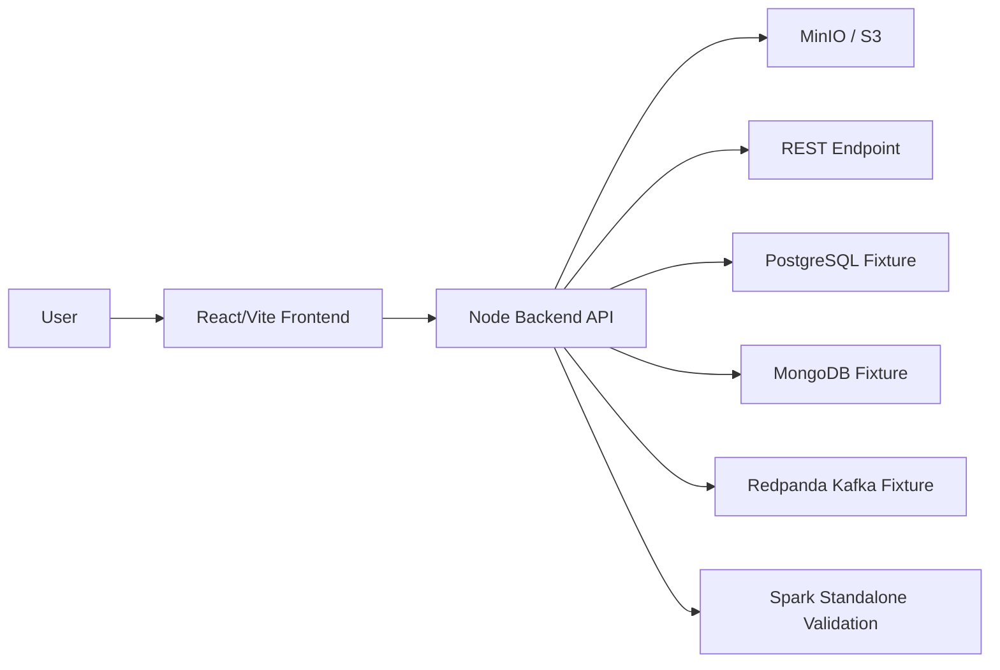

# 02. Architecture

AskLake currently has a React/Vite frontend and a local Node backend. The active vertical slice is Source, Schema, and Create for Pair A person-1.

## 1. Repository Layout

```text
AskLake/
  backend/
    src/
      server.mjs
      connectors.mjs
      createPipeline.mjs
      profile.mjs
    scripts/
      setup-source-fixtures.mjs
      verify-all-sources.mjs
      prepare-minio-samples.mjs
      start-spark-server.mjs
      run-spark-validation.mjs
      spark_validate.py
  frontend/
    src/
      data/appShellData.ts
      hooks/useAskLakeData.ts
      services/apiClient.ts
      services/pipelineApi.ts
      services/sourceConnectorService.ts
      pages/etl/EtlPages.tsx
  docs/
```

## 2. Runtime View



Frontend behavior is backend-driven. The UI does not perform direct source reads.

## 3. Frontend Ownership

- Navigation and shell state: `frontend/src/data/appShellData.ts`
- Domain state: `frontend/src/hooks/useAskLakeData.ts`
- Backend client: `frontend/src/services/apiClient.ts`
- Pipeline adapter: `frontend/src/services/pipelineApi.ts`
- Source adapter: `frontend/src/services/sourceConnectorService.ts`
- Draft contract: `frontend/src/types/etl.ts`, `frontend/src/services/draftPipelineContract.ts`

`DraftPipeline` remains nested for slice ownership:

```ts
type DraftPipeline = {
  source: SourceDraft;
  schema: SchemaDraft;
  transform: TransformDraft;
  quality: QualityDraft;
  schedule: ScheduleDraft;
  permission: PermissionDraft;
  target: TargetDraft;
};
```

Submit maps nested draft state to flat `CreatePipelineRequest` immediately before `POST /api/etl/jobs`.

## 4. Backend Ownership

- HTTP routing: `backend/src/server.mjs`
- Source connectors: `backend/src/connectors.mjs`
- Schema/sample profiling: `backend/src/profile.mjs`
- Create response mapping: `backend/src/createPipeline.mjs`
- Source fixtures: `backend/scripts/setup-source-fixtures.mjs`
- Source verification: `backend/scripts/verify-all-sources.mjs`
- MinIO 1GB sample preparation: `backend/scripts/prepare-minio-samples.mjs`
- Spark validation: `backend/scripts/spark_validate.py`

Current metadata storage is in-memory. This is sufficient for local Day 1 flow but not durable persistence.

## 5. API Boundary

Implemented endpoints:

- `GET /api/health`
- `GET /api/etl/jobs`
- `GET /api/catalog/datasets`
- `GET /api/harness/rest-sample`
- `POST /api/etl/sources/test`
- `POST /api/etl/schema-inference`
- `POST /api/etl/jobs`
- `POST /api/etl/jobs/{jobId}/commands`
- `POST /api/query/runs`

Initial hydrate endpoints return empty arrays until a pipeline is created.

## 6. Design Rules

- Public UI must not expose internal M/L stage labels.
- Public UI must use Korean text for user-facing ETL creation screens.
- Wide JSON/table previews must scroll inside their own panel, not expand the page.
- Source connector cards must distinguish PostgreSQL and MongoDB.
- Unsupported frontend-only source reads must not be reintroduced.
