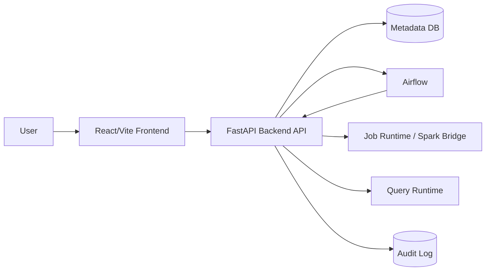

# 02. Architecture

이 문서는 AskLake의 현재 frontend baseline, FastAPI 전환 경계, 그리고 Pair별 backend ownership을 함께 기록한다.

## 1) Current Pair A Live Boundary

현재 Pair A 브랜치의 기준 경계는 다음과 같다.

- Source, Schema, Create, Run은 `VITE_API_BASE_URL`을 통해 live backend를 호출한다.
- 초기 ETL job과 Catalog dataset은 backend hydrate 결과를 따른다. 둘 다 비어 있을 수 있다.
- 파이프라인 생성은 Job과 pending `catalogTarget`을 만들고, Catalog dataset은 실행 성공 후 생성 또는 갱신한다.
- 같은 Job 또는 같은 `targetDataset`으로 다시 생성/실행한 결과는 기본적으로 기존 Catalog dataset에 append한다. Catalog 검색 목록은 dataset row를 하나만 유지하고, 실행/SQL materialize 결과는 dataset payload의 `materializationRuns` history로 관리한다.
- ETL 컬럼 리니지는 source와 target에 같은 스키마를 복제하지 않는다. source node는 실제 입력/transform input 컬럼만 가지며, transform step의 `input -> output`을 source-to-job edge로, 실제 output column 이름 일치를 job-to-target edge로 저장한다. source engine은 파일 확장자나 connector type을, 가운데 Spark job은 dataset layer가 아닌 `PROCESS` node를, target engine은 현재 Spark runner가 실제 저장한 physical output format(`PARQUET`)을 사용한다. `_asklake_*` 실행 메타데이터는 Spark job에서 생성되므로 source edge를 만들지 않는다.
- Run state는 `runId` 기준으로 관리한다.
- 일반 File/Data Lake Run은 `Frontend -> FastAPI command -> Airflow DAG -> token-authenticated FastAPI internal execution -> Spark runner -> Run/Catalog transaction` 순서다. Airflow에는 Job 전체나 source credential을 넘기지 않고 `jobId`, `runId`, `command`만 전달한다.
- Airflow의 terminal `success`만으로 데이터 처리를 성공 처리하지 않는다. 같은 `runId`의 실제 Spark output metadata와 Catalog materialization이 모두 저장되어야 Run이 `success`가 된다.
- 실행 흐름/DAG는 별도 top-level 화면이 아니라 Run History에서 선택한 `runId`의 단계 흐름으로 표시한다.
- Dashboard card/list와 draft/published runtime API는 FastAPI에 등록되어 있다. 프론트는 이전 backend 호환을 위해 404 local fallback을 유지한다.

## 2) Repository Structure

```text
AskLake/
  backend/
    app/                 # FastAPI app
    scripts/             # source, spark, validation bridge scripts
    src/                 # existing Node validation/runtime helpers
  frontend/
    server/              # Node demo API, Dashboard persistence reference
    src/
      components/
      data/
      hooks/
      pages/
      services/
      styles/
      types/
  docs/
```

## 3) 기술 스택

| 영역 | 현재 선택 | 상태 | 메모 |
| --- | --- | --- | --- |
| Frontend | React + Vite + TypeScript | implemented | `frontend/` |
| UI icons | lucide-react | implemented | package dependency |
| Lineage graph | React Flow (`@xyflow/react`) | implemented | Catalog lineage modal |
| Dashboard grid | react-grid-layout + react-resizable | implemented | draft editor canvas |
| Dashboard charts | ApexCharts (`apexcharts`, `react-apexcharts`) | partial | runtime chart renderer and 8-type widget contract |
| State | React hooks/local state | implemented | `useAskLakeData`, `useAuditLogs` |
| API client | fetch wrapper | partial | `frontend/src/services/apiClient.ts` |
| FastAPI backend | FastAPI + SQLAlchemy | partial | `backend/app/` |
| Node demo API | Node HTTP + pg | reference/demo | `frontend/server/` |
| Database | PostgreSQL metadata DB | partial | ETL/Catalog/Dashboard metadata in FastAPI, Node demo API is reference/demo |

## 4) 목표 시스템 구성



현재 FastAPI가 직접 소유하는 영역은 ETL, Run, Catalog hydrate, Catalog lineage fallback, SQL preview, SQL derived dataset 저장, Dashboard card/list, Dashboard draft/published runtime이다.
Node demo API는 기존 동작 비교용 reference로 남긴다.

### Airflow batch execution

일반 배치 Job의 `run`/`retry`는 `FastAPI -> Airflow DAG Run -> token-authenticated FastAPI internal execution API -> PySpark -> MinIO/S3 Parquet` 순서로 실행한다. Airflow는 orchestration 상태의 source of truth이고 FastAPI/PostgreSQL은 Job 설정과 사용자-facing Run metadata의 source of truth다.

Airflow task는 Docker socket이나 MinIO credential을 직접 받지 않는다. `spark_process_write` task가 `AIRFLOW_EXECUTION_API_TOKEN`으로 FastAPI 내부 API를 호출하면 FastAPI가 저장된 Job/Run identity를 재검증하고 기존 Spark launcher를 통해 `backend/scripts/spark_job_run.py`를 실행한다. Node helper는 Spark container lifecycle과 environment 전달만 담당하며, 데이터 읽기·변환·품질 검사·Parquet 쓰기는 PySpark가 수행한다.

Spark manifest의 input/output row count, output path, schema, quality, failure stage는 `etl_runs.task_states.sparkResult`와 Run summary에 보존한다. Phase 2는 물리 Parquet와 Spark/Airflow 결과 전파까지 책임지며 Catalog materialization/lineage와 최종 성공 gate는 Phase 3 경계다.

Phase 3에서는 DAG의 마지막 `publish_run_result` task가 `POST /api/internal/airflow/spark-runs/{runId}/catalog`를 호출한다. FastAPI는 요청 body의 결과값을 신뢰하지 않고 저장된 Job/Run identity와 `taskStates.sparkResult`를 다시 읽는다. 성공 manifest와 실제 Parquet를 확인한 뒤 `catalog_datasets.payload`와 같은 Run의 `taskStates.catalogResult`를 하나의 DB transaction으로 저장한다. 이 transaction이 완료되어야 `publish_run_result`와 Airflow DAG Run이 `success`가 될 수 있으므로, AskLake의 terminal success는 물리 적재와 Catalog 반영을 모두 뜻한다.

Catalog reconciliation의 상태 소유권은 다음과 같다.

- MinIO/S3 또는 local lake path: 실제 Parquet object의 source of truth
- `etl_runs.task_states.sparkResult`: Spark 실행 결과의 source of truth
- `catalog_datasets.payload`: dataset metadata, `materializationRuns`, lineage의 source of truth
- Airflow Task Instance/DAG Run: orchestration 성공·실패의 source of truth

같은 `runId` 재호출은 기존 materialization을 교체하고, 다른 Run은 같은 dataset row에 append한다. target dataset row는 append read-modify-write 동안 lock해 동시 갱신 손실을 막는다. Catalog 저장이 실패하면 Parquet와 `sparkResult`는 복구 증거로 남고 `publish_run_result`가 실패한다. `publish_run_result`는 30초 간격으로 최대 2회 재시도하며, upstream Spark task를 다시 실행하지 않고 같은 DAG Run의 저장된 manifest로 Catalog 단계만 재호출한다. polling sync는 Airflow 상태를 읽은 뒤 persisted Run을 다시 읽고 lock한 상태에서 task snapshot을 교체해, 동시에 저장된 `sparkResult`/`catalogResult`를 오래된 snapshot으로 지우지 않는다. `catalogResult=failed`는 Airflow가 success를 반환해도 AskLake Run 실패가 우선하며, 성공 `catalogResult` 또는 같은 Run의 성공 materialization이 없으면 Spark 경로·행 수만으로 성공 처리하지 않는다. frontend는 같은 Run id를 queued/running으로 관찰한 뒤 terminal success로 전환됐을 때만 Catalog 목록을 한 번 다시 hydrate한다. 이 재조회만 실패하면 서버의 Run/Catalog 성공을 되돌리지 않고 현재 화면 데이터를 유지하며 수동 새로고침 안내를 표시한다.

### Kafka Snapshot Direct Target 전환 계획

Kafka source의 현재 구현은 `persist partition offset snapshot -> fixed-range consume -> configured transform/quality -> selected target write -> Catalog -> offset commit` 경로를 사용한다. Issue #455는 대용량 처리 지연을 줄이기 위해 중간 RAW landing을 제거했다. direct write는 normalized Kafka review event를 JSONL target에 저장하며, 사용자가 설정한 processing rule과 target layer를 서로 독립된 Job 설정으로 그대로 사용한다. 실패한 Job은 durable snapshot과 실패 단계를 Run/DAG에 보존하고 offset을 이동시키지 않아 같은 범위를 재시도할 수 있으며, capture 이후 새 메시지는 다음 snapshot에 남는다.

이 전환에서 snapshot은 메시지 본문을 복사한 landing 파일이 아니라, run 시작 시점의 partition별 offset 경계 metadata다. 기본 경로는 중간 RAW landing을 만들지 않고 선택한 `BRONZE` 또는 `SILVER` target에 한 번만 저장한다. `GOLD` join/aggregation 실행과 선택형 장기 RAW archive는 별도 범위다.

상세 계약과 성공/실패 순서는 [Kafka Snapshot Direct Target Contract](kafka-snapshot-direct-target-contract.md)를 따른다. 현재 기본 target은 `BRONZE`이며, 중간 `kafka-landing/...` object를 만들지 않는다.

### ETL Job 수정 계약

Issue #460에서 Job 상세/목록의 수정은 `GET /api/etl/jobs/{jobId}` 결과를 `edit draft`로 hydrate해 Source 단계에 표시하고, `PATCH /api/etl/jobs/{jobId}`로 같은 Job ID에 저장한다. 수정 mode의 Kafka source identity는 읽기 전용이며, 수정 저장은 새 Job 생성을 호출하지 않는다.

Phase 4에서는 성공 Run이 있는 Job의 target dataset/database/format/storage path도 frontend에서 읽기 전용으로 표시한다. backend의 `PATCH` validation은 최종 보호 장치이며, UI 잠금은 사용자가 복제해야 하는 변경과 수정 가능한 metadata를 구분하는 사용성 보조다.

Kafka Job의 source identity(`sourceType`, `sourceLabel`, `sourceConfig`)는 broker, topic, consumer group, offset 정책을 포함하므로 수정에서 고정한다. 실행 이력이 있는 Job의 target identity도 고정하고, source 또는 output destination 변경은 복제 후 새 Job 생성으로 분리한다. 세부 필드 정책과 failure handling은 [ETL Job Edit Contract](etl-job-edit-contract.md)를 따른다.

## 5) Frontend Layer

주요 책임:

- navigation과 화면 composition: `frontend/src/App.tsx`
- layout: `frontend/src/components/layout/`
- ingest/job 화면: `frontend/src/pages/ingest/`
- ETL creation flow: `frontend/src/pages/etl/`
- ETL Schedule step은 `스케줄링 건너뛰기`와 `반복 실행` 두 선택지만 노출한다. 스케줄링을 건너뛰면 저장 후 사용자가 Job 목록/상세에서 `즉시 실행`으로 1회 Run을 만든다. 따라서 `수동/자동/1회 실행` 표현은 스케줄 옵션으로 노출하지 않는다. 반복 실행은 IANA timezone, 겹침 처리(`skip_if_running` 기본값), watermark 수집 기준, 지수 백오프 재시도 정책을 생성 계약에 포함하지만, 실제 production-grade scheduler 엔진은 MVP 후속 범위다.
- catalog 화면과 lineage graph modal: `frontend/src/pages/catalog/`
- SQL 화면: `frontend/src/pages/sql/`
- dashboard 화면: `frontend/src/pages/dashboard/`
- domain state: `frontend/src/hooks/useAskLakeData.ts`
- audit/toast state: `frontend/src/hooks/useAuditLogs.ts`
- API boundary: `frontend/src/services/apiClient.ts`, `frontend/src/services/pipelineApi.ts`, `frontend/src/services/mockApi.ts`
- Query AI helper: `frontend/src/services/queryAiService.ts`
- AI 활용 Chat UI 계약: `docs/ai-chat-ui-contract.md`
- dashboard list/runtime API adapter와 fallback: `frontend/src/services/dashboardApi.ts`, `frontend/src/services/dashboardRuntimeApi.ts`
- SQL 결과 저장 UI는 `useAskLakeData.prepareSqlDatasetJobDraft`에서 SQL Result metadata를 `DraftPipeline`으로 변환한 뒤 ETL Review 화면으로 이동한다.
- SQL 결과 대시보드 생성은 SQL 화면의 모달 안에 `DashboardPage`의 `source: "sql"`, `view: "runtime"`, `runtimeMode: "draft"` entry를 렌더링해, 현재 페이지를 떠나지 않고 대시보드 builder에서 SQL 결과 컬럼과 row sample을 직접 시각화하도록 한다.
- SQL 분석 화면은 Catalog에서 넘어온 dataset과 사용자가 추가한 dataset을 오른쪽 `선택 테이블` 사이드바에 단일 목록으로 표시한다. 왼쪽 `분석 테이블`은 schema preview를 펼쳐 확인한 뒤 선택할 수 있고, 오른쪽 schema 영역은 선택 테이블 목록에서 클릭한 단일 dataset의 schema만 표시한다. schema column 클릭은 SQL editor 커서 위치에 column reference를 삽입하는 보조 동작이며, 같은 column name이 여러 선택 테이블에 있으면 `table.column` 형태로 삽입한다. SQL editor의 사용자가 직접 작성한 query text가 실행 기준 source of truth이며 UI 선택 상태로 역동기화하지 않는다. 선택 테이블을 제거해도 SQL text는 자동 재작성하지 않고, 제거된 table을 계속 참조하면 preview 전 table context 검증에서 차단한다. UI에서는 base/reference를 구분하지 않고, 내부 API payload만 기존 `sourceDatasetId`/`referenceDatasetIds` 계약을 유지한다.
- SQL 분석 구현은 `SqlAnalysisPage.tsx`가 화면 상태와 큰 레이아웃을 맡고, `sqlLogic.ts`가 SQL 검증/자동완성/format helper를, `queryAiService.ts`가 Query AI 생성 요청을, `SqlPreviewTable.tsx`, `SqlSchemaPanel.tsx`, `SqlDatasetRow.tsx`, `SqlDatasetSchemaPreview.tsx`가 표시 컴포넌트를 맡는다.
- Query AI 생성 기능은 SQL editor 주변에서만 동작한다. live mode에서는 `frontend/src/services/queryAiService.ts`가 `POST /api/query/ai-suggestions`를 호출하고, FastAPI가 backend env의 `OPENAI_API_KEY`로 OpenAI Responses API에 요청한다. mock mode에서는 같은 request shape로 프론트 로컬 SQL 초안 fallback을 사용한다. AI는 선택 테이블 context 안에서만 SQL 초안을 만들 수 있고, backend는 AI 응답도 read-only SQL과 선택 dataset scope로 재검증한다. AI가 만든 SQL은 자동 실행하지 않고 editor 적용 후 기존 read-only/preflight 검증을 다시 통과해야 실행된다.
- AI 활용 메뉴는 SQL Query AI와 Dashboard Assistant를 대체하지 않는 독립 대화형 UI surface다. 초기에는 `CatalogDataset` 중 `available` 상태이면서 `permissions.canQuery !== false`인 Dataset만 대화 context로 고를 수 있으며, 질문과 선택 상태는 브라우저 메모리에만 둔다. UI-only 단계는 OpenAI 호출, RAG index, vector DB, sessionStorage 대화 영속화를 만들지 않는다. 실제 runtime 연결 전에는 답변·근거·SQL·결과 테이블을 위조하지 않는다. 화면 구조와 후속 response contract는 [AI Chat UI Contract](ai-chat-ui-contract.md)를 따른다.
- 수집/처리 Transform 화면의 필드 transform은 사용자가 quick function 또는 expression을 직접 선택/입력하는 범위로 둔다. AI 기반 field transform/SQL transform 보조 버튼은 SQL 분석 Query AI와 역할이 겹치고 backend 계약이 없으므로 현재 MVP 화면에 노출하지 않는다.

라우팅은 아직 React Router가 아니라 `frontend/src/App.tsx`의 상태 기반 navigation이 중심이다.
수집/처리 생성 flow의 상단 stepper는 같은 `App.tsx` 상태 이동을 사용해 소스, 처리, 스케줄, 권한, 타겟, 검토 단계로 직접 이동한다.
Dashboard redesign부터 `/dashboards`, `/dashboards/:dashboardId`, `/dashboards/:dashboardId/edit`는 `App.tsx`의 browser history/path parser가 처리한다.
수집/처리 목록은 TanStack Table 기반 표형 목록을 기본 화면으로 사용한다. 실행 이력에서는 같은 job의 run 목록, 실패 로그, 실행 단계 보기 모달을 함께 다룬다.
수집/처리의 작업 진행 순서 시각화는 독립 메뉴가 아니라 실행 이력의 `실행 단계 보기` 모달에서 표시한다.
live mode에서는 마지막으로 성공한 ETL job/catalog hydrate 결과를 브라우저 localStorage에 보관해, job 실행 중 새로고침해도 수집/처리 shell과 직전 job 목록을 먼저 렌더링한다.
live mode에서 run/retry 명령 응답의 `running` 상태를 즉시 반영하고, `GET /api/etl/jobs/{jobId}` polling으로 Spark 완료 후 최종 상태를 반영한다.

## 6) Job Run State Contract

Job command와 Run History의 실행 흐름 카드는 세 개의 map을 공유한다.

```ts
type RunsByJobId = Record<string, JobRunSummary[]>;
type SelectedRunIdByJobId = Record<string, string>;
type DagStepsByRunId = Record<string, JobDagStep[]>;
```

Ownership rules:

- `job.id`는 `runsByJobId`의 key다.
- `run.runId`는 `selectedRunIdByJobId[job.id]`에 저장되는 값이다.
- `run.runId`는 `dagStepsByRunId`의 key다.
- History는 `selectedRunIdByJobId[job.id]`만 바꿔 선택 Run을 변경한다.
- Run History 안의 실행 흐름 카드는 `dagStepsByRunId[selectedRunIdByJobId[job.id]]`만 렌더링한다.
- 초기 hydrate는 `job.runHistory`를 `runsByJobId`로 옮기고, 가능한 경우 최신 run id에 `job.dagSteps`를 연결한다.
- optimistic command UX는 `client:<jobId>:<timestamp>` 형태의 임시 run id를 만들고, 서버 응답의 `run.runId`로 reconcile한다.
- `commandPendingByJobId[job.id]`는 중복 클릭 방지용 in-flight 상태다.

## 7) Backend Target Boundary

FastAPI가 현재 소유하는 책임:

- ETL job 생성과 상태 전이
- Source test와 schema inference bridge
- Job hydrate와 Run hydrate
- Catalog dataset hydrate
- Catalog lineage fallback
- SQL preview 실행
- SQL preview 결과 기반 derived dataset 저장
- SQL preview 결과 기반 ETL job draft handoff
- Dashboard list/query/create/delete
- Dashboard draft/published runtime
- Dashboard page/widget/layout persistence
- Dashboard Assistant OpenAI-backed response endpoint
- 공통 error envelope

후속으로 넘길 책임:

- Audit log persistence
- 운영 IdP/SSO, auth/permission Alembic migration, deny/policy 고도화
- RAG 검색 기반 Dashboard Assistant 고도화

### Permission/Governance 경계

권한 판정은 공통 `ActorContext`와 permission engine을 기준으로 한다. `ActorContext`는 세션 쿠키가 있으면 session user를 우선 사용하고, 로컬 smoke/수동 검증 호환을 위해 세션이 없을 때만 `X-AskLake-User`, `X-AskLake-Role`, `X-AskLake-Groups` 임시 header fallback을 사용한다.

권한 모델을 확장할 때는 identity metadata와 access control을 분리한다. `createdBy`, `owner`, profile/avatar는 화면 표시와 감사 로그 문맥을 위한 값이고, 실제 허용 여부는 `actor -> resource -> action` 형태의 permission check에서 계산한다. Job/Dataset/Dashboard 응답은 optional `permissionGrants`와 `permissions` 계약을 받을 수 있다. Backend에는 `ActorContext`와 공통 `can(actor, action, resource)` 판정기가 있으며, 현재 allow-only 우선순위는 `user/group blocked 차단 -> resource lock 차단 -> admin 전체 허용 -> owner fallback -> user/group/role/public grant 허용 -> 차단`이다. Admin 권한은 resource 접근 그룹이 아니라 `role=admin`으로 설명하며, 로컬 demo admin 계정의 groups는 빈 배열로 유지한다. Group grant/block은 일반 사용자 권한 운영 단위다. 명시적 deny grant는 아직 지원하지 않고, 여러 grant는 합산된다. Resource lock은 `view`는 유지하고 `query/run/manage/delete/share` action만 차단한다. 목록 API는 block 상태를 반영해 해당 actor에게 resource를 숨기고, resource lock은 목록 노출을 유지하되 응답 `permissions`의 실행/변경 action을 false로 내려 프론트 버튼 상태와 backend 403이 같은 기준을 보도록 한다. Catalog dataset 조회/lineage/materialization-run 삭제, SQL preview 실행, Query AI 생성, Job command/update, Dashboard 삭제/runtime 편집은 공통 permission check를 거쳐 `403 FORBIDDEN`을 반환할 수 있다.

Frontend는 resource별 `permissions`를 읽어 권한 없는 SQL 실행, Query AI 생성, Job command, Dataset materialization-run 삭제, Dashboard 삭제/편집 버튼을 비활성화하고, backend `403`은 권한 안내 toast/preflight message로 표시한다. 프론트의 비활성화는 사용성 보조이며 보안 근거는 backend enforcement다. Query AI 생성도 선택 dataset 전체에 대해 backend `query` permission check를 통과해야 하며, 권한 없는 dataset metadata는 AI 프롬프트 context로 전달하지 않는다. Dashboard runtime draft 생성, page/widget/layout 변경, publish는 dashboard `manage` permission check를 통과해야 한다.

프로필/관리 화면은 Phase 0 기준에서 별도 Identity/Admin resource로 취급한다. 프로필 페이지는 `GET /api/users/me`로 현재 actor의 표시 프로필, role, group, 권한 요약을 읽고, 관리 페이지는 `/api/admin/users`, `/api/admin/groups`, `/api/admin/permissions`, `/api/admin/governance-controls`, `/api/admin/audit-logs` API를 사용한다. 로그인/회원가입은 `/api/auth/login`, `/api/auth/signup`, `/api/auth/session`, `/api/auth/logout`의 로컬 session API로 제공하며, backend는 httpOnly `asklake_session` 쿠키를 actor context로 변환한다. 기존 smoke와 수동 검증 호환을 위해 세션이 없으면 임시 actor header(`X-AskLake-User`, `X-AskLake-Role`, `X-AskLake-Groups`) fallback을 유지한다. 이 header fallback은 로컬/검증용이며, 운영에서는 session/IdP 또는 trusted gateway 검증 없이 client가 보낸 header만으로 admin actor를 허용하면 안 된다. 프론트는 `/login`의 로그인/회원가입 화면만 공개 route로 취급하고, 그 외 앱 route는 `/api/auth/session` 확인 전에는 앱 shell을 렌더링하지 않는다. 세션이 없으면 직접 URL 진입도 `/login`으로 대체하며, 로그인 후에만 사이드바/상단바와 업무 화면을 표시한다. `/api/admin/*`는 admin role이 아니면 `403 FORBIDDEN`을 반환한다. 관리 콘솔은 사용자 탭에서 user 차단/해제, 그룹 탭에서 group 차단/해제, 권한 탭에서 permission grant 추가/수정/삭제와 resource lock/unlock을 지원한다. 차단/잠금 사유는 관리자 내부 표시와 감사 로그용이며, 일반 사용자-facing 메시지에는 노출하지 않는다. payload에서 유래한 owner/permissionRoles grant는 원본 리소스 metadata로 남기고, 관리 콘솔에서는 읽기 전용으로 표시한다. 서버 감사 로그는 `audit_events` table에 저장하며, admin permission grant 생성/수정/삭제, governance control 변경, auth login/logout/login 실패, Dataset/Job/Dashboard의 직접 접근 또는 실행 403 이벤트를 저장한다. `/api/admin/audit-logs`는 actor/resource/result/text/date/limit 필터로 조회한다. Topbar 최근 API 호출 로그는 frontend local/localStorage 상태로 유지하며 서버 감사 로그와 합치지 않는다.

Dashboard Assistant는 `POST /api/dashboards/assistant`를 FastAPI가 소유한다.
이 endpoint는 요청의 `dashboardId`/`pageId`를 기준으로 DB에서 draft 우선, 없으면 published runtime을 읽고,
대시보드에서 사용할 수 있는 available catalog dataset과 현재 page widget, 지원 가능한 widget type/config option을 OpenAI에 전달한다.
OpenAI 응답은 backend guard를 통과해야 하며, guard는 없는 datasetId, 없는 widgetId, 지원하지 않는 widget type,
데이터셋 컬럼과 맞지 않는 config를 제외하고 `warnings`로 돌려준다.
`OPENAI_API_KEY`가 없거나 `OPENAI_ASSISTANT_ENABLED=false`이거나 OpenAI 호출이 실패하면 응답 `message`/`warnings`에 `mock fallback`을 명시한 fallback 응답을 반환한다.
현재 시각화 요청 위젯과의 호환을 위해 `configPatch`, `widgetPatch`도 임시로 유지한다.
RAG 검색과 action 자동 적용 고도화는 후속 작업 범위다.

## 8) 데이터 모델 요약

상세 타입은 `docs/api-contract.md`와 `frontend/src/types/`를 기준으로 한다.

| Resource | 현재 위치 | backend 목표 |
| --- | --- | --- |
| ETL Job | `JobRowData` | FastAPI persisted job resource |
| ETL Run | `JobRunSummary` | FastAPI persisted run resource |
| Dataset | `CatalogDataset` | FastAPI catalog dataset resource |
| Dataset Lineage | `LineageGraph` | FastAPI 저장 graph 또는 fallback graph |
| SQL Run | `SqlResultDraft` | FastAPI query preview resource |
| Dashboard | `DashboardEntry`, runtime response | FastAPI dashboard card/runtime resource |
| Audit Log | `useAuditLogs` local/localStorage state | future audit log resource |
| Identity Metadata | `owner`, optional `createdBy`/`createdByProfile` 표시 값 | display/audit context metadata |
| Auth Session | local auth user/session rows + httpOnly cookie | FastAPI `/api/auth/*` local session resource |
| Identity Profile | session actor 또는 current actor header + demo identity catalog | FastAPI `/api/users/me` profile resource |
| Admin Console | admin users/groups/permissions/audit APIs + 관리 UI | FastAPI admin users/groups/permissions/audit resource |
| Permission Grant | resource payload grant + `permission_grants` table | backend-enforced access control resource and admin edit target |

Catalog dataset은 `materializationRuns` append history를 가질 수 있다. 부모 dataset의 `rows`, `size`, `storageSizeBytes`, `lastUpdated`, `sourceRunId`는 삭제되지 않은 성공 run history를 기준으로 계산한다. 마지막 append 결과를 삭제해도 dataset shell은 남기며, 전체 dataset 삭제와 append 결과 삭제는 별도 UX/API로 분리한다.

Dashboard backend ownership은 card/list와 runtime snapshot으로 나눈다.
Card/List는 `dashboards`, `dashboard_tags`를 중심으로 목록, 생성, 제목 수정, 삭제를 담당한다.
Runtime은 `dashboard_revisions`, `dashboard_pages`, `dashboard_widgets`를 중심으로 published 조회, draft 편집, page/widget/layout/publish를 담당한다.
두 흐름은 `dashboardId`, `publishedRevisionId`, `DashboardCard`, `DashboardRuntimeResponse` 계약만 공유한다.
Runtime chart widget은 `widget.data`와 type별 `config`를 frontend에서 ApexCharts option/series로 변환해 렌더링한다. Dashboard runtime widget contract는 `metric`, `table`, ApexCharts 차트 8종(`bar_chart`, `line_chart`, `area_chart`, `donut_chart`, `pie_chart`, `radial_bar_chart`, `heatmap_chart`, `treemap_chart`)을 기준으로 확장한다. 사람이 설정 패널에서 고르는 옵션과 향후 AI widget 생성기가 만드는 옵션은 같은 widget type/config 계약을 사용한다. `table` 위젯은 후속 작업에서 TanStack Table 기반으로 별도 전환한다.

## 9) API Boundary

Live mode 진입:

- `VITE_API_BASE_URL=http://localhost:8080`
- `VITE_USE_MOCK_API=false`
- `frontend/src/services/apiClient.ts`

FastAPI 현재 구현 범위:

- `GET /api/health`
- `POST /api/auth/login`
- `POST /api/auth/signup`
- `GET /api/auth/session`
- `POST /api/auth/logout`
- `GET /api/users/me`
- `GET /api/admin/users`
- `GET /api/admin/groups`
- `GET /api/admin/permissions`
- `GET /api/admin/audit-logs`
- `POST /api/etl/sources/test`
- `POST /api/etl/schema-inference`
- `POST /api/etl/jobs`
- `GET /api/etl/jobs`
- `GET /api/etl/jobs/{jobId}`: 수집/처리 상세 hydrate와 실행 중 job 최종 상태 polling에 사용
- `POST /api/etl/jobs/{jobId}/commands`
- `GET /api/catalog/datasets`
- `GET /api/catalog/datasets/{datasetId}`
- `DELETE /api/catalog/datasets/{datasetId}/materialization-runs/{runId}`
- `GET /api/catalog/datasets/{datasetId}/lineage`
- `POST /api/catalog/derived-datasets`
- `POST /api/query/runs`
- `GET /api/dashboards`
- `POST /api/dashboards`
- `POST /api/dashboards/query`
- `PATCH /api/dashboards/{dashboardId}`
- `DELETE /api/dashboards/{dashboardId}`
- `GET /api/dashboards/{dashboardId}/published`
- `POST /api/dashboards/{dashboardId}/draft/ensure`
- `POST /api/dashboards/{dashboardId}/draft/pages`
- `PATCH /api/dashboards/{dashboardId}/draft/pages/{pageId}`
- `DELETE /api/dashboards/{dashboardId}/draft/pages/{pageId}`
- `POST /api/dashboards/{dashboardId}/draft/pages/{pageId}/widgets`
- `PATCH /api/dashboards/{dashboardId}/draft/widgets/{widgetId}`
- `DELETE /api/dashboards/{dashboardId}/draft/widgets/{widgetId}`
- `PATCH /api/dashboards/{dashboardId}/draft/layouts`
- `POST /api/dashboards/{dashboardId}/publish`

Demo/reference endpoint는 live ETL/Catalog API를 가리지 않도록 `/api/demo` 아래에 둔다.

- `GET /api/demo/etl/jobs`
- `GET /api/demo/catalog/datasets`

현재 프론트는 Dashboard endpoint가 FastAPI에서 404를 반환하면 local/mock fallback으로 목록, 생성, runtime 화면을 유지한다. FastAPI 응답이 성공하면 서버 응답을 source of truth로 사용한다.

## 10) 설계 원칙

- Mock data는 demo baseline이며 최종 persistence model로 간주하지 않는다.
- API response shape는 frontend type과 문서가 함께 바뀌어야 한다.
- API, mock fixture, frontend internal state의 status 값은 영어 canonical value를 유지하고 UI label mapper에서 한국어로 표시한다.
- SQL runtime은 read-only guard를 가져야 하며, 선택된 catalog dataset을 DuckDB table context로 등록해 projection/filter/group/order/limit/JOIN을 실제 preview SQL로 실행한다.
- 빈 backend state는 정상 상태다. 상세/SQL/builder처럼 실제 resource가 필요한 화면만 방어한다.
- Dashboard adapter는 FastAPI 응답을 우선하고, 이전 backend 호환을 위한 local fallback은 실패/404 경로로만 사용한다.

## 11) 운영/배포 메모

- 현재 실행은 backend FastAPI dev server와 frontend Vite dev server 기준이다.
- FastAPI 실행은 `backend/README.md`와 `docs/04-development-guide.md`를 따른다.
- Node demo API는 FastAPI 구현과 비교하는 reference로 유지한다.
- CI가 생기면 최소 required check 후보는 frontend build, backend import/compile, conflict marker scan이다.

## 12) SQL 결과 기반 Dashboard Builder

- SQL 분석에서 Dashboard builder로 진입할 때는 `DashboardEntry.source = "sql"`과 함께 `sqlRunId`, `baseDatasetId`, `sqlResultDatasetId`를 전달한다.
- Dashboard builder는 SQL entry에서 일치하는 `SqlResultDraft`가 없으면 일반 dataset builder로 fallback하지 않고 SQL 분석에서 다시 실행하라는 안내 상태를 보여준다.
- SQL entry가 유효하면 Dashboard runtime dataset sidebar는 일반 Catalog dataset 목록을 숨기고 `SQL 실행 결과` 하나만 데이터 소스로 노출한다.
- SQL entry의 draft runtime이 비어 있으면 SQL 결과 row/column snapshot을 사용해 결과 테이블과 기본 차트 1개를 자동 생성한다. 숫자 컬럼이 없으면 깨진 차트를 만들지 않고 결과 테이블만 생성한다.
- SQL 결과 mode의 위젯 생성/편집/Assistant 적용은 현재 노출된 SQL 결과 데이터소스의 컬럼만 사용할 수 있다. 기존 위젯이나 AI patch가 없는 컬럼 또는 다른 dataset id를 들고 오면 저장 전에 현재 SQL 결과 컬럼으로 정규화한다.
- `/dashboards/dash_<baseDatasetId>_<sqlRunId>/edit` 같은 SQL 결과 dashboard route는 `sqlRunId`를 복원해 SQL entry로 취급한다. 브라우저 새로고침이나 직접 URL 진입으로 `SqlResultDraft`가 없으면 `GET /api/query/runs/{sqlRunId}`로 저장된 SQL Preview snapshot을 복구한다. 복구 실패 시 일반 dashboard로 fallback하지 않고 SQL 분석 재실행 안내와 복귀 액션을 보여준다.
- 이 단계는 SQL result snapshot을 대시보드 입력으로 고정하는 UX 범위이며, run 단위 snapshot을 별도 persistent dashboard dataset으로 저장하는 기능은 후속 범위다.
