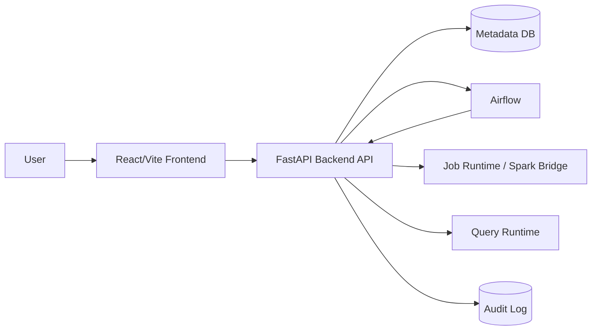

# 02. Architecture

AI Gateway/MCP 경계와 파일별 변경 계획은 [ai-gateway-mcp-rollout.md](./ai-gateway-mcp-rollout.md)를 따른다. 공개 Query AI route는 FastAPI가 소유하고, Gateway는 내부 Compose network에서만 접근한다.

이 문서는 AskLake의 현재 frontend baseline, FastAPI 전환 경계, 그리고 Pair별 backend ownership을 함께 기록한다.

## 1) Current Pair A Live Boundary

현재 Pair A 브랜치의 기준 경계는 다음과 같다.

- Source, Schema, Create, Run은 `VITE_API_BASE_URL`을 통해 live backend를 호출한다.
- 생성 wizard는 Source 결과의 `requiresRecordParsing`에 따라 `Source -> Record Parsing -> Schema` 또는 `Source -> Schema`로 분기한다. 이번 vertical slice에서 `requiresRecordParsing`은 선택한 MinIO/S3 `.txt`/`.log`가 이름 없는 `line_number + value` 샘플로 반환될 때만 활성화한다.
- Record Parsing Preview와 Spark batch runtime은 Job에 저장된 동일 `recordParsing` 계약을 사용한다. Preview는 제한 샘플을, Spark는 전체 입력을 검증하며 어느 쪽도 부족한 필드를 null로 채우거나 초과 필드를 버리지 않는다.
- File / S3 source는 단일 object와 prefix 데이터셋을 구분한다. Prefix 선택은 `Path / Prefix`와 `__Selection Kind=prefix`를 Job의 `sourceConfig`에 저장하고 개별 object 배열은 저장하지 않는다. Backend는 prefix를 재귀 조회해 `_SUCCESS`, `manifest.json`, basename이 `_` 또는 `.`으로 시작하는 객체와 선택 형식이 아닌 객체를 제외한다. Preview는 사전식 첫 데이터 파일을 대표 파일로 사용하고 모든 데이터 파일의 bounded schema fingerprint가 호환될 때만 Schema 단계로 진행한다.
- Prefix Spark runtime은 저장된 prefix를 다시 열거해 Preview와 같은 제외 규칙을 적용하고 모든 대상 경로를 DataFrame reader에 전달한다. Run manifest의 `inputFileCount`, `inputBytes`, `inputRows`, `outputFileCount`, `outputRows`가 실제 다중 파일 처리 근거다. 입력 파일이 여러 개면 writer는 실행 가능한 범위에서 복수 output partition을 유지하되 출력 파일의 정확한 byte 크기는 계약하지 않는다.
- PostgreSQL Source의 연결 테스트와 Schema 단계는 제한 Preview를 사용하지만 Snapshot `run`/`retry`는 `__Schema Sample Scope`와 무관하게 선택한 기본 테이블 전체를 읽는다. backend는 `REPEATABLE READ READ ONLY` transaction 안의 server-side cursor를 배치 fetch해 Run 전용 JSONL을 만들고, Spark는 그 파일 전체를 처리한다. 고정 행 상한은 두지 않으며 한 번에 메모리에 보관하는 행 수만 `ASKLAKE_POSTGRES_EXECUTION_BATCH_ROWS`로 제한한다.
- 초기 ETL job과 Catalog dataset은 backend hydrate 결과를 따른다. 둘 다 비어 있을 수 있다.
- 파이프라인 생성은 Job과 pending `catalogTarget`을 만들고, Catalog dataset은 실행 성공 후 생성 또는 갱신한다.
- 같은 Job 또는 표시명이 정확히 같은 `targetDataset`으로 다시 생성/실행한 결과는 기존 Catalog row의 `materializationRuns` history에 run-keyed로 누적한다. 일반 ETL/SQL full-refresh Run은 `materializationMode=snapshot`, Kafka의 새 offset/micro-batch Run은 `materializationMode=delta`다. 현재 Dataset은 newest-first 성공 history에서 첫 snapshot까지의 active segment만 사용하므로 새 snapshot은 이전 snapshot을 논리적으로 교체하고, snapshot 이후 delta만 누적한다. 다른 표시명은 ASCII slug가 같더라도 별도 Job/dataset identity를 가져야 한다. backend는 안전한 소문자 ASCII 이름에는 기존 `ds_<name>`을 유지하고, 한글·공백·특수문자·대소문자 변환처럼 slug에서 정보가 손실되는 이름에는 원문 기반 안정 해시 suffix를 붙인다. backend가 storage path를 자동 생성할 때도 같은 충돌 방지 key를 사용한다. Catalog 검색 목록은 dataset row를 하나만 유지하며 이전 snapshot의 물리 파일과 Run metadata는 history로 보존한다.
- ETL 컬럼 리니지는 source와 target에 같은 스키마를 복제하지 않는다. source node는 실제 입력/transform input 컬럼만 가지며, transform step의 `input -> output`을 source-to-job edge로, 실제 output column 이름 일치를 job-to-target edge로 저장한다. source engine은 파일 확장자나 connector type을, 가운데 Spark job은 dataset layer가 아닌 `PROCESS` node를, target engine은 현재 Spark runner가 실제 저장한 physical output format(`PARQUET`)을 사용한다. `_asklake_*` 실행 메타데이터는 Spark job에서 생성되므로 source edge를 만들지 않는다.
- Run state는 `runId` 기준으로 관리한다. Airflow가 호출하는 Spark 실행과 Catalog reconciliation은 `etl_runs`의 owner, lease 만료 시각, generation을 원자적으로 선점한다. lease를 잃은 이전 FastAPI replica는 Spark/Catalog 결과를 저장하지 못하며, 만료 뒤 새 replica만 같은 `runId`를 복구한다.
- 일반 File/Data Lake/PostgreSQL Snapshot Run은 `Frontend -> FastAPI command -> Airflow DAG -> token-authenticated FastAPI internal execution -> source export 또는 direct object read -> Spark runner -> Run/Catalog transaction` 순서다. Airflow에는 Job 전체나 source credential을 넘기지 않고 `jobId`, `runId`, `command`만 전달한다.
- 내부 `Data Lake` 소스는 Catalog의 `Source Dataset ID`를 권한과 가용 상태 기준으로 검증한 뒤, 등록된 Iceberg table identity를 Spark catalog 입력으로 사용한다. 외부 object-storage 경로를 직접 읽는 `Data Lake Parquet` 소스는 기존 S3 path 계약을 유지한다.
- Airflow의 terminal `success`만으로 데이터 처리를 성공 처리하지 않는다. 같은 `runId`의 실제 Spark output metadata와 Catalog materialization이 모두 저장되어야 Run이 `success`가 된다.
- 실행 흐름/DAG는 별도 top-level 화면이 아니라 Run History에서 선택한 `runId`의 단계 흐름으로 표시한다.
- Dashboard card/list와 draft/published runtime API는 FastAPI 응답만 source of truth로 사용한다. Catalog 기반 runtime widget은 `sampleRows` snapshot 대신 성공한 물리 materialization을 DuckDB로 제한 집계하거나 최대 500행 preview로 읽는다.

### Text Structuring Model Artifact Ownership

- text structuring model artifact는 Catalog dataset이 아니라 ETL 변환 실행에 사용하는 재사용 가능한 runtime artifact다.
- artifact 원본과 검증 metadata는 `model_artifacts` 저장소 및 `/api/catalog/models`, `/api/text-structuring/models` 호환 endpoint에 보존한다. 현재 endpoint 이름에 `catalog`가 포함되어도 dataset resource로 취급하지 않는다.
- 모델 선택 정책과 선택 artifact는 ETL 변환 설정이 소유한다. 특정 Run에서 실제 사용한 모델, fallback, 검증 행, invalid row는 Run의 `textStructuringExecution`이 실행 근거의 source of truth다.
- Catalog 목록은 model artifact 전역 inventory를 렌더링하지 않는다. Dataset materialization run에는 해당 dataset이 어떤 모델 기반 변환으로 생성됐는지와 quarantine 행을 compact provenance로만 표시한다.
- 독립 Model Registry가 제품 범위에 들어오기 전에는 model artifact를 Catalog dataset 또는 별도 top-level 탐색 자산으로 승격하지 않는다.

## 2) Repository Structure

```text
AskLake/
  backend/
    app/                 # FastAPI app
    scripts/             # source, spark, validation bridge scripts
    src/                 # existing Node validation/runtime helpers
  frontend/
    server/              # Node demo API, Dashboard persistence reference
    src/
      components/
      data/
      hooks/
      pages/
      services/
      styles/
      types/
  docs/
```

## 3) 기술 스택

| 영역 | 현재 선택 | 상태 | 메모 |
| --- | --- | --- | --- |
| Frontend | React + Vite + TypeScript | implemented | `frontend/` |
| UI icons | lucide-react | implemented | package dependency |
| Lineage graph | React Flow (`@xyflow/react`) | implemented | Catalog lineage modal |
| Dashboard grid | react-grid-layout + react-resizable | implemented | draft editor canvas |
| Dashboard charts | ApexCharts (`apexcharts`, `react-apexcharts`) | partial | runtime chart renderer and 8-type widget contract |
| State | React hooks/local state | implemented | `useAskLakeData`, `useAuditLogs` |
| API client | fetch wrapper | partial | `frontend/src/services/apiClient.ts` |
| FastAPI backend | FastAPI + SQLAlchemy | partial | `backend/app/` |
| Node demo API | Node HTTP + pg | reference/demo | `frontend/server/` |
| Database | PostgreSQL metadata DB | partial | ETL/Catalog/Dashboard metadata in FastAPI, Node demo API is reference/demo |

## 4) 목표 시스템 구성



현재 FastAPI가 직접 소유하는 영역은 ETL, Run, Catalog hydrate, Catalog lineage fallback, SQL query compatibility runtime, Trino Query Run, SQL derived dataset 저장, Dashboard card/list, Dashboard draft/published runtime이다. Issue #488은 local Compose의 Trino 482 coordinator, Iceberg JDBC catalog, object-storage warehouse, Trino HTTP adapter, canonical Query Run persistence/compiler와 Catalog `queryEngineTable` mapping을 추가한다. 일반 Trino result page는 private object storage의 gzip object에 저장하고 PostgreSQL에는 page metadata/checksum/manifest만 둔다. `trino-result-collector` worker가 Query Run, 1회성 Iceberg CTAS, 반복 SQL Job CTAS continuation을 수집하므로 browser polling과 상태 GET은 persisted state만 읽는다.

Collector claim은 DB lease와 증가하는 generation을 사용한다. page object는 generation별 attempt key에 쓴 뒤 현재 worker/generation이 유효한 transaction에서만 metadata로 공개한다. 오래된 worker는 자신이 쓴 attempt object만 삭제할 수 있고, page metadata의 source continuation을 이용해 retry 중 duplicate page 생성을 막는다. Query result API page size는 submit의 `resultPageSize`로 고정하며 signed cursor가 storage page index와 row offset을 감춘다. Frontend는 현재 page와 이전/다음 cursor만 유지하고 전체 결과를 memory에 누적하지 않는다. terminal result cleanup은 keyset batch worker가 retention에 따라 수행한다.

Query submit은 `(actorKey, clientRequestId)` unique reservation과 actor별 PostgreSQL advisory lock을 사용한다. 같은 key/fingerprint 재시도는 기존 run을 반환하고, 다른 요청의 key 재사용은 `409`, 동시 실행 slot 초과는 `429`다. run 재열기, 결과 조회, 취소, materialization 제출/조회는 현재 Dataset 권한·principal block·resource lock을 다시 검사한다. 실행 이력과 user grant의 principal 판정은 user ID를 우선하고 ID 없는 legacy record에만 display name fallback을 허용한다.

Query Engine 등록은 Dataset 표시명과 물리 table 이름을 분리한다. SQL 결과 Dataset은 Catalog에 `pending`을 먼저 저장하고 Iceberg CTAS terminal success와 `DESCRIBE` 검증이 끝난 뒤에만 `queryEngineStatus=available`과 `queryEngineTable`을 공개한다. 실패하면 mapping 없이 `registration_failed`와 안전한 오류만 저장한다. `TRINO_ENABLED=true`에서는 검증된 mapping이 없는 Dataset의 `permissions.canQuery`를 false로 계산한다. ETL Job은 backend-owned `icebergTarget`(`catalog`, `namespace`, 안정적인 physical `table`, `writeMode`)을 선택적으로 저장하며 기존 `storagePath`를 읽기 호환으로 유지한다. 이 target 선언 자체는 물리 table 존재 증명이 아니다. 일반 non-Kafka Spark batch, Kafka Snapshot과 Kafka Continuous는 native Iceberg commit 뒤 snapshot/warehouse/fingerprint evidence와 Trino `DESCRIBE`/`$snapshots`/`$files` 검증이 모두 맞을 때만 `available`로 승격한다. Job을 통하지 않는 legacy/debug JSONL ingest는 Iceberg mapping을 증명하지 못하므로 `unavailable`을 유지한다. writer별 전환 단계와 S3 warehouse 책임은 [Iceberg Writer Migration Plan](iceberg-writer-migration-plan.md)을 따른다.

반복 SQL Job은 `jobKind=trino_sql_materialization`과 `sqlRecipe`를 ETL Job에 저장한다. `sqlRecipe`에는 생성 당시 role/group/email snapshot 대신 `runAsUserId`만 남긴다. `run`/`retry`와 scheduler tick은 Airflow/Spark가 아니라 Trino SQL Job service로 분기되고, production에서는 실행 시점의 active auth user와 principal block을 다시 조회해 현재 role/group으로 권한을 판정한다. 삭제·비활성·차단 사용자는 실행 전에 `403`으로 차단한다. AuthUser row가 없는 로컬 header-auth 호환 경로만 저장된 user id를 유지한 `viewer`/빈 group actor로 제한하며 과거 admin/group snapshot을 신뢰하지 않는다. 각 Run은 고유 Iceberg table에 full-refresh CTAS를 수행하고 `DESCRIBE` 뒤에만 안정적인 논리 Dataset mapping을 교체한다. 실패·취소·collector 재시작 중에는 마지막 정상 mapping을 유지하고, 같은 `runId`의 Catalog 확정은 멱등이다.

Estimate & Guardrail은 SQL AST가 참조한 컬럼과 Iceberg `$files.readable_metrics`를 결합해 실행 전 스캔량을 계산하고, metadata가 없을 때만 Trino plan/Catalog heuristic을 fallback으로 사용한다. submit 시 estimate snapshot은 Query Run에 저장하지만 confirmation token은 저장하지 않는다. Collector는 continuation fetch 중 backend-only QueryInfo를 읽기 전용으로 샘플링해 progress, driver/split, elapsed/queued/CPU, processed rows/bytes, peak memory를 단조 증가 방식으로 보강한다. QueryInfo 실패는 실행 실패로 승격하지 않는다. Query 완료, 수집 시작, 첫 durable page, manifest 완료 milestone은 최초 관측 시각을 유지한다. 상세 lifecycle은 [Trino Query Run Contract](trino-query-run-contract.md), storage·retention은 [Trino Query Result Storage Contract](trino-query-result-storage-contract.md)를 따른다.
Node demo API는 기존 동작 비교용 reference로 남긴다.

### Object storage provider boundary

- 로컬 root Compose는 `ASKLAKE_OBJECT_STORAGE_PROVIDER=minio`를 기본값으로 사용하고 MinIO endpoint, 로컬 전용 access key/secret, path-style URL을 사용한다.
- EC2 production Compose는 `ASKLAKE_OBJECT_STORAGE_PROVIDER=aws`를 사용하며 MinIO service나 장기 AWS access key/secret을 포함하지 않는다. Backend, Spark S3A, DuckDB, Trino warehouse/result storage는 EC2 instance profile IAM Role의 default credential chain을 공유한다.
- 현재 production 경로는 사전 생성한 Raw bucket을 읽고 Output bucket에 쓴다. Raw/Output은 여러 기존 Dataset top-level prefix를 담는 전용 bucket이므로 EKS IAM도 승인된 해당 bucket 전체를 object resource 경계로 사용할 수 있다. Warehouse와 Query Result는 각각 `warehouse`, `query-results` prefix로 더 좁힌다. `aws-s3-readiness`가 Raw list와 Output put/head/delete를 통과해야 backend가 시작된다.
- frontend는 provider build variable에 따라 local에서는 MinIO 연결 필드를, AWS에서는 region과 bucket/prefix만 표시한다. Target 기본 bucket은 production build에서 `ASKLAKE_SPARK_OUTPUT_BUCKET`을 `VITE_SPARK_OUTPUT_BUCKET`으로 주입해 backend writer와 같은 Output bucket을 가리킨다. AWS credential은 browser/API payload에 넣지 않는다.
- 저장된 legacy `s3a://asklake-output/...` Target은 실행과 Catalog 확정 시 현재 `ASKLAKE_SPARK_OUTPUT_BUCKET`으로 정규화한다. 사용자가 명시한 다른 S3 bucket 경로는 바꾸지 않는다.
- Warehouse와 Query Result bucket은 `TRINO_ENABLED=true`에서 Iceberg table data와 private result page에 사용한다. 로컬 root Compose는 MinIO를 쓰고 production은 사전 생성한 AWS S3 bucket과 EC2 instance profile default credential chain을 사용한다. Production에는 MinIO service나 장기 AWS access key/secret을 두지 않으며 readiness가 두 bucket의 최소 권한 round trip을 확인한다.
- Production Compose는 `TRINO_ENABLED=true`와 `COMPOSE_PROFILES=trino`를 함께 설정할 때만 coordinator, PostgreSQL bootstrap, collector, cleanup service를 포함한다. `false`에서는 profile을 비워 기존 DuckDB 호환 배포가 Trino bucket/secret/TLS file 없이 기동한다. Trino는 backend/PostgreSQL용 internal network와 AWS S3·IMDS default credential chain에 접근하는 전용 outbound network를 함께 사용하며 public port는 열지 않는다.
- 로컬 root Compose는 매 기동 시 idempotent PostgreSQL bootstrap service를 거쳐 기존 volume에도 Iceberg JDBC catalog table/권한을 보정한 뒤 Trino를 시작한다. `docker-entrypoint-initdb.d`는 새 volume 초기화만 담당한다.

### Airflow batch execution

일반 배치 Job의 `run`/`retry`는 `FastAPI -> Airflow DAG Run -> token-authenticated FastAPI internal execution API -> PySpark -> Iceberg JDBC catalog commit -> MinIO/S3 warehouse` 순서로 실행한다. warehouse의 실제 data file은 Parquet이고 Iceberg metadata/snapshot이 논리 테이블 상태를 결정한다. Airflow는 orchestration 상태의 source of truth이고 FastAPI/PostgreSQL은 Job 설정과 사용자-facing Run metadata의 source of truth다.

Kafka Snapshot Job은 기본적으로 Airflow를 거치지 않고 `FastAPI -> durable offset snapshot -> fixed-range Kafka consume -> canonical transform/quality -> PySpark Iceberg append -> Trino physical verification -> AskLake Catalog -> Kafka offset commit` 순서로 실행한다. 단, EKS MVP 전용 topic/group 또는 내부 fixture receipt 필드가 있는 Snapshot Job은 별도 bounded fixture 실행 의도로 분류해 Airflow 경로로 보낸다. fixture 의도가 감지됐는데 exact topic/group, batch ID, expected count, IAM 9098 또는 Kubernetes runner 계약이 맞지 않으면 기존 Kafka 경로로 fallback하지 않고 command를 거부한다. 이 예외는 기존 Kafka Snapshot의 offset/commit 순서와 EC2 소유 Continuous 경로를 변경하지 않는다.

EKS MVP fixture Run은 Airflow 외부 호출 전에 `etl_runs.task_states.eksMvpFixture`에 `runId`, producer `fixtureBatchId`/`expectedCount`, exact broker/topic/group, Run 전용 output/checkpoint path를 함께 저장한다. 이 RDS row가 boundary의 source of truth다. Airflow DAG Run conf와 내부 Spark 실행 요청은 같은 `sourceBoundary`를 운반하지만 값을 새로 계산하지 않으며, FastAPI는 요청 boundary가 RDS와 정확히 같을 때만 lease를 획득하고 Spark payload를 만든다. SparkApplication은 RDS boundary에서 만든 manifest와 driver env, `asklake.io/fixture-batch-id` annotation을 받는다. Job 설정이 나중에 바뀌거나 Airflow 요청이 달라지면 SparkApplication 제출 전에 `AIRFLOW_SOURCE_BOUNDARY_MISMATCH`로 실패한다.

EKS MVP fixture의 동적 Spark 실행은 다른 Kafka Job과 달리 전용 `iceberg.asklake.eks_mvp_fixture` target을 `replace` mode로 고정한다. Spark는 Kafka를 읽은 뒤 `raw.fixture_batch_id`가 RDS boundary의 값인 행만 남기고, 그 행 수가 `expectedCount`와 다르면 Iceberg commit 전에 실패한다. 성공 report를 받은 FastAPI도 `sourceBoundary`, input/output count, Job/Run identity, target, snapshot ID와 commit boundary를 다시 대조한 뒤에만 `sparkResult` 성공을 RDS에 저장한다. 따라서 driver Pod의 `Succeeded`만으로 데이터 처리 성공을 인정하지 않는다.

기존 Kafka Snapshot의 `sourceBoundary`는 snapshot ID와 partition별 exclusive offset range를 Iceberg commit evidence에 결합한다. Iceberg/Catalog 뒤 offset 확정이 실패하면 같은 durable snapshot을 retry하며, table의 snapshot marker와 Catalog의 `kafkaSnapshot.snapshotId`로 물리 append와 materialization을 각각 deduplicate한다. 따라서 retry가 새 Kafka 메시지를 현재 범위에 섞거나 이미 commit된 행을 다시 append하지 않는다. Job의 최종 data file은 warehouse Parquet이고, snapshot별 JSON metadata와 quarantine JSONL은 진단/오류 보존용 보조 object일 뿐 target Dataset data가 아니다.

Airflow task는 Docker socket이나 object-storage credential을 직접 받지 않는다. `spark_process_write` task가 `AIRFLOW_EXECUTION_API_TOKEN`으로 FastAPI 내부 API를 호출하면 FastAPI가 저장된 Job/Run identity를 재검증한다. 로컬 개발은 기존 Docker launcher를 사용할 수 있지만 production Compose는 backend에 Docker socket/CLI를 제공하지 않고 내부 `spark-master:6066` Standalone REST API로 cluster-mode driver를 제출하고 상태를 확인한다. 데이터 읽기·변환·품질 검사와 Iceberg DataFrameWriterV2 commit은 Spark worker의 PySpark가 수행하며 report/sample/Ivy 경로는 UID 185 bind mount로 공유한다. JDBC catalog credential은 driver 환경에만 전달하고 executor 환경으로 복제하지 않는다.

Spark manifest의 input/output file count와 byte/row count, output path, schema, quality, failure stage, Iceberg commit 증거는 `etl_runs.task_states.sparkResult`와 Run summary에 보존한다. Prefix Job의 입력 파일 수와 바이트 수는 Preview metadata가 아니라 실제 Spark 입력 파일을 기준으로 기록한다.

CSV source와 source inspect는 `quote="`와 `escape="`를 명시해 RFC 4180의 quoted comma와 doubled quote를 같은 field로 해석한다. 예를 들어 `"안녕, 나는 ""해건"""`은 `안녕, 나는 "해건"`이라는 리뷰 하나로 유지된다.

Spark manifest의 input/output row count, 논리 `outputPath`, schema, quality, failure stage와 `icebergCommit` evidence는 `etl_runs.task_states.sparkResult`와 Run summary에 보존한다. `icebergCommit`은 Job/Run identity, target, snapshot ID, warehouse location, schema/rule fingerprint와 source boundary를 포함한다.

DAG의 마지막 `publish_run_result` task는 `POST /api/internal/airflow/spark-runs/{runId}/catalog`를 호출한다. FastAPI는 요청 body의 결과값을 신뢰하지 않고 저장된 Job/Run identity와 `taskStates.sparkResult`를 다시 읽는다. 일반 Spark batch는 persisted `icebergTarget`과 reported snapshot/fingerprint를 Trino의 실제 table/snapshot/data-file evidence와 대조한다. EKS bounded fixture는 여기에 RDS Run에 고정한 `expectedCount`와 같은 snapshot의 `_asklake_run_id=runId` 행 수도 정확히 일치해야 한다. 검증 뒤 `catalog_datasets.payload`와 같은 Run의 `taskStates.catalogResult`를 하나의 DB transaction으로 저장한다. 이 transaction이 완료되어야 `publish_run_result`와 Airflow DAG Run이 `success`가 될 수 있으므로 AskLake terminal success는 Iceberg commit, 물리 검증, Catalog 반영을 모두 뜻한다.

Catalog reconciliation의 상태 소유권은 다음과 같다.

- Iceberg JDBC catalog와 MinIO/S3 warehouse: 현재 metadata location, snapshot, Parquet data file의 source of truth
- `etl_runs.task_states.sparkResult`: Spark 실행 결과의 source of truth
- `catalog_datasets.payload`: dataset metadata, `materializationRuns`, lineage의 source of truth
- Airflow Task Instance/DAG Run: orchestration 성공·실패의 source of truth

같은 `runId` 재호출은 기존 materialization을 교체하고, 다른 Run은 같은 dataset row의 history 앞에 추가한다. 일반 Snapshot의 성공 materialization은 `snapshot`, Kafka append segment는 `delta`로 기록한다. 부모 `rows`, `size`, `storageSizeBytes`는 전체 history 합이 아니라 최신 성공 snapshot과 그보다 최신인 성공 delta만 합산하며 `sourceRunId`는 active history의 head를 가리킨다. mode가 없는 legacy Kafka Run만 `delta`, 그 외 legacy Run은 `snapshot`으로 해석한다. target dataset row는 read-modify-write 동안 lock해 동시 갱신 손실을 막는다. Spark commit 직후 report 단계가 실패하면 writer가 이전 Iceberg snapshot으로 rollback한다. 검증된 commit 뒤 Catalog transaction만 실패하면 committed snapshot과 `sparkResult`를 복구 증거로 남기고 `publish_run_result`가 실패한다. `publish_run_result`는 30초 간격으로 최대 2회 재시도하며 upstream Spark task를 다시 실행하지 않고 같은 DAG Run의 저장된 manifest로 Catalog 단계만 재호출한다. polling sync는 Airflow 상태를 읽은 뒤 persisted Run을 다시 읽고 lock한 상태에서 task snapshot을 교체해, 동시에 저장된 `sparkResult`/`catalogResult`를 오래된 snapshot으로 지우지 않는다. `catalogResult=failed`는 Airflow가 success를 반환해도 AskLake Run 실패가 우선하며, 성공 `catalogResult` 또는 같은 Run의 성공 materialization이 없으면 Spark 경로·행 수만으로 성공 처리하지 않는다. frontend는 같은 Run id를 queued/running으로 관찰한 뒤 terminal success로 전환됐을 때만 Catalog 목록을 한 번 다시 hydrate한다. 이 재조회만 실패하면 서버의 Run/Catalog 성공을 되돌리지 않고 현재 화면 데이터를 유지하며 수동 새로고침 안내를 표시한다.

### Kafka Snapshot Direct Target 전환 계획

Kafka source의 현재 구현은 `persist partition offset snapshot -> fixed-range consume -> configured transform/quality -> Iceberg append -> Trino/Catalog 검증 -> offset commit` 경로를 사용한다. Issue #455는 대용량 처리 지연을 줄이기 위해 중간 RAW landing을 제거했다. Job 실행은 확정된 `schemaColumns`가 있으면 범용 JSON object를 그 스키마와 Rule 계약으로 처리하고, Job identity가 없는 legacy direct endpoint만 기존 review event 정규화를 적용한다. direct write는 그 결과를 backend-owned Iceberg table에 저장하며, 사용자가 설정한 processing rule과 target layer를 서로 독립된 Job 설정으로 그대로 사용한다. 실패한 Job은 durable snapshot과 실패 단계를 Run/DAG에 보존하고 offset을 이동시키지 않아 같은 범위를 재시도할 수 있으며, capture 이후 새 메시지는 다음 snapshot에 남는다.

이 전환에서 snapshot은 메시지 본문을 복사한 landing 파일이 아니라, run 시작 시점의 partition별 offset 경계 metadata다. 기본 경로는 중간 RAW landing을 만들지 않고 선택한 `RAW`, `BRONZE`, 또는 `SILVER` target의 Iceberg snapshot에 한 번만 저장한다. 실제 data file은 S3/MinIO warehouse의 Parquet이며 `GOLD` join/aggregation 실행과 선택형 장기 RAW archive는 별도 범위다.

상세 계약과 성공/실패 순서는 [Kafka Snapshot Direct Target Contract](kafka-snapshot-direct-target-contract.md)를 따른다. 현재 기본 target은 `BRONZE`이며, 중간 `kafka-landing/...` object를 만들지 않는다.

### Kafka Continuous Ingestion

Issue #500은 Snapshot direct-target 경로를 제거하지 않고, Kafka Job 생성 시 선택하는 별도 `continuous` execution mode를 추가한다. Continuous mode는 장기 실행 Spark Structured Streaming query가 checkpoint 기반 micro-batch를 반복해 동일 target dataset에 append하는 실시간 적재 경로다. 초기 checkpoint가 없으면 Job의 `earliest` 또는 `latest` 정책에서 시작하고, 이후 restart/resume은 checkpoint에서 이어받는다. Snapshot은 기존 스케줄 단계에서 수동 또는 반복 실행을 정하지만, Continuous는 스케줄 단계를 건너뛰고 `스케줄링 건너뛰기` metadata로 생성한다. 생성 후 스트림 시작/중지 lifecycle로만 제어하며, Source 단계의 고급 설정에서 시작 위치, trigger 간격, micro-batch 최대 메시지 수를 정한다.

Continuous 수동 검증용 입력은 `seed-kafka-review-fixture.mjs` replay producer가 책임진다. producer는 finite replay와 `--loop`를 모두 지원하며, loop의 각 cycle에는 고유 `event_id`와 단조 증가 `offset`을 부여한다. 배포 환경에서는 FastAPI의 admin-only replay producer endpoint가 subprocess를 소유해 시작/상태 조회/graceful stop을 제공한다. producer는 Kafka source의 durable offset이나 Continuous checkpoint를 직접 변경하지 않는다.

Continuous target은 backend-owned append Iceberg table이다. Backend는 worker 시작/재개 전에 PostgreSQL의 topic·partition별 `nextOffset`을 넘기고, `foreachBatch`는 모든 저장·카운터 계산 전에 그보다 작은 offset을 제거한다. 전체가 재전달된 batch는 아무 것도 게시하지 않고 checkpoint만 진행하며, 일부만 겹치면 보지 못한 suffix만 source range와 집계 대상이 된다. 각 non-empty micro-batch는 durable publication 순번, checkpoint/source identity와 필터된 offset range에서 deterministic `sourceBoundary`와 `_asklake_run_id`를 만들고 Iceberg snapshot에 commit한다. Spark raw batch ID는 진단값일 뿐 Run identity가 아니므로 empty micro-batch나 checkpoint 재생성으로 번호가 바뀌어도 manifest 경로가 충돌하지 않는다. manifest 전 장애 재시도는 이 marker로 이미 committed snapshot을 재사용하므로 checkpoint가 같은 범위를 다시 전달해도 중복 append하지 않는다. Quarantine/schema-evidence 보조 경로만 `_SUCCESS`와 숨김 signature를 사용하는 Parquet sidecar로 유지한다. Backend는 report의 exact snapshot에서 해당 `_asklake_run_id` 행 수가 `storedCount`와 같은지 Trino로 검증한 뒤 Catalog materialization과 cursor를 전진시키고 ack 파일로 worker report를 정리한다. `foreachBatch`는 schema policy 뒤에 Snapshot conformance를 통과한 stateless canonical Transform/Quality를 실행하며 Fail Batch는 checkpoint 전진을 막고 Quarantine은 Kafka와 Rule identity를 보존한다. 임의 SQL과 stateful 연산은 compiler가 거절한다. Kafka Source 화면의 `targetFormat=parquet`은 create 호환값이고 최종 query target은 Iceberg다. Snapshot과 Continuous는 같은 broker/topic/consumer group을 공유한 상태로 동시 실행할 수 없다. 같은 worker attempt의 종료/heartbeat 실패는 한 번만 집계하고, 사용자 `pausing`/`stopping` 종료만 각각 `paused`/`stopped`로 확정한다. 상세 계약은 [Kafka Continuous Ingestion Contract](kafka-continuous-ingestion-contract.md)를 따른다.

Continuous worker report는 모든 과거 publication을 메모리에 누적하지 않는다. durable batch manifest가 복구 source of truth이고 report에는 Catalog가 아직 확인하지 않은 가장 오래된 publication을 `ASKLAKE_CONTINUOUS_PUBLICATION_WINDOW` 크기만큼만 노출한다. Backend가 ack cursor를 전진시키면 worker는 durable manifest에서 다음 window를 채운다. worker가 이미 종료돼 report window가 바뀌지 않는 경우에도 backend는 ack 이후 S3의 완료된 manifest ID를 다시 나열하고, report의 마지막 publication `_SUCCESS`가 확인된 경우에만 복구를 계속한다. 따라서 장기 실행 중 Catalog 장애나 terminal report 축약이 있어도 메모리는 bounded되고 미반영 snapshot은 유실되지 않는다.

Catalog row 조회와 Dashboard 물리 widget 조회는 `storageFormat=iceberg`, `queryEngineStatus=available`, 완전한 `queryEngineTable`이 모두 확인된 Dataset을 Trino table로 읽는다. Iceberg warehouse의 Parquet object를 직접 glob하지 않는다. Catalog row API는 `$refs`의 `main` snapshot을 요청당 한 번 고정해 count/page를 같은 snapshot에서 읽고, Catalog 사용자 schema를 명시 projection해 `_asklake_*` 내부 marker를 숨긴다. Dashboard full 계산도 Catalog의 `icebergSnapshotId`에 `FOR VERSION AS OF`를 적용하고, revision delta는 같은 snapshot에서 `_asklake_run_id`로 해당 Run만 고른다. offset pagination은 preview 용도이며 별도 sort key가 없으므로 요청 간 안정 순서를 보장하지 않는다. Dashboard는 Catalog schema와 물리 `DESCRIBE` 교집합만 집계하고 전체 wall-clock timeout 뒤 Trino query를 취소한다. 전환 전 CSV/JSON/JSONL/Parquet Dataset만 기존 DuckDB compatibility reader를 사용한다. Materialization history는 `icebergCommittedAt`, fallback `createdAt` 기준 newest-first이며 늦게 복구된 과거 snapshot은 history/합계만 보강하고 현재 schema, sample, quality와 physical mapping을 되돌리지 않는다.

Issue #567은 현재 차단을 즉시 제거하지 않고 일반 Snapshot, Kafka Snapshot, Kafka Continuous가 공유할 canonical Rule과 타입 계약을 먼저 확정한 뒤 지원 operation을 단계적으로 Continuous에 연결한다. Kafka offset capture/commit과 checkpoint 책임은 각 입력 경로에 유지하고 Transform/Quality 의미와 단계 결과만 통일한다. 구현 및 검증 순서는 [Transform/Quality 공통 실행 통합 계획](transform-quality-unification-plan.md)을 따른다.

Phase 4부터 Schema Transform 화면은 원본 `sourceType`과 target `type`을 분리하고, 필드 편집을 `rename -> cast -> portable transform -> default_value -> null_guard` canonical Rule 순서로 직렬화한다. Schema Transform 내부의 별도 실행 엔진 Preview는 처리 단계의 결과 미리보기와 중복되므로 제공하지 않는다. canonical Rule은 review/create와 실제 Snapshot 또는 Continuous 실행 경로에서 compiler와 runtime 검증을 거친다. Portable Rule은 bounded Node runtime을 사용하고 일반 Snapshot의 SQL expression은 bounded Spark runtime으로 분기한다. Target layer는 Transform/Quality 적용 여부와 독립된 사용자 선택으로 노출한다. Kafka Snapshot의 `RAW/BRONZE/SILVER + JSONL`과 Kafka Continuous의 `Parquet` draft 값은 기존 UI/저장값 호환이며 두 Job writer 모두 backend-owned Iceberg target으로 승격한다. Output schema의 `nullable: false`, Quality `not_null`, Transform `null_guard`는 서로 다른 계약이며 UI 요약도 실제 canonical Quality Rule만 검사 건수로 센다.

새 Source 연결 또는 레코드 파싱 결과는 원본 스키마를 `BEFORE (SOURCE)`에만 적재하고 `AFTER (TARGET)` 선택은 비어 있는 상태로 시작한다. 사용자가 명시적으로 이동한 필드만 target schema에 포함하며, 저장된 Job을 다시 여는 수정 흐름은 기존 `included` 선택을 유지한다. 출력 필드명은 편집 중 빈 문자열을 임시 상태로 보존하되 스키마 확정 시 비어 있는 이름을 거절한다.

Rule 계약의 API와 저장 source of truth는 versioned `rules[]`다. Frontend는 현재 편집기의 transform/quality draft를 canonical Rule로 컴파일해 create/update/review에 보내고, backend는 실행 전에 operation 지원 범위와 출력 스키마를 다시 검증한다. 새로 생성하거나 수정한 Job은 nullable `rule_contract_version`과 `rules` 컬럼에 canonical payload를 그대로 저장하며, `transformSteps`와 `qualityRules`는 현재 Spark/Kafka runner와 이전 client를 위한 파생 호환 표현으로만 유지한다. 두 canonical 컬럼이 비어 있는 기존 행만 저장된 legacy 표현에서 Rule을 재구성하고, `rule_contract_version="1.0"`과 `rules=[]`가 저장된 행은 legacy 필드가 남아 있어도 명시적인 pass-through로 읽는다.

Source 설정 기본값은 backend runtime이 소유한다. Frontend는 `GET /api/etl/sources/defaults`로 `ASKLAKE_KAFKA_BROKER`의 공개 기본값을 읽고, 저장된 Source 설정이나 사용자가 편집 중인 값을 덮어쓰지 않는다.

Phase 3부터 일반 Spark Snapshot과 Kafka Snapshot은 실행 직전에 저장된 canonical Rule을 다시 compile한다. 공통 operation은 같은 conformance fixture로 검증하며 Spark는 portable/SQL transform 순서를 보존하고 quality disposition을 run별 staging output에 적용한 뒤 성공한 결과만 최종 Parquet 경로로 publish한다. 따라서 `fail_batch`는 target을 만들지 않고, `quarantine`, `drop_row`, `set_null`은 실제 출력 행과 실행 근거에 반영된다. Kafka는 같은 의미를 JSON event에 적용한 뒤 compiled output schema로 정확히 projection하지만 partition offset capture와 성공 후 commit 책임은 기존 Kafka bridge에 남는다. 일반 Spark의 text analysis와 classifier처럼 공통 범위를 벗어난 operation은 기존 전용 실행 경로를 유지한다.

Phase 5부터 Kafka Continuous도 같은 공통 Spark Rule runtime을 bounded micro-batch에 적용한다. Worker 시작 시 `_asklake_contract` checkpoint metadata에 configured schema, canonical Rule, output schema와 source/target identity의 결합 fingerprint를 기록하며 불일치 checkpoint 재사용을 거절한다. Worker report와 Catalog materialization은 Rule fingerprint와 누적 Fail/Quarantine/Warn 근거를 보존한다. 초기화된 checkpoint의 처리 계약은 in-place로 바꾸지 않고 Job copy와 새 checkpoint를 사용한다. 격리 replay 역시 현재 schema policy와 canonical Rule을 다시 적용한다.

Phase 1부터 source profile은 JSON/JSONL의 native scalar type을 화면용 문자열 preview와 분리해 보존한다. `Float`는 legacy 입력 호환값으로만 받고 새 draft는 `Double`을 사용한다. Dotted `sourceName`은 lineage와 실행 projection의 논리 경로이며, underscore로 정규화한 `targetName`과 동일시하지 않는다. Continuous worker는 이 경로로 nested `StructType`을 구성하고 root 및 nested object의 unknown field를 각각 검사한다.

Continuous 실행 이력은 Snapshot `ETLRun`과 분리한다. 한 번의 `startContinuous` 또는 `resumeContinuous`부터 stop/pause/failure까지를 durable stream session 한 행으로 저장하고, worker가 보고한 micro-batch manifest는 해당 session의 하위 batch 이력으로 멱등 저장한다. 재시작은 checkpoint와 누적 runtime counter를 이어가되 새 session을 만들며, session counter는 시작 당시 runtime baseline과 현재 누적값의 차이로 계산한다. 실행 이력 화면은 active session 동안 3초 polling을 수행하고 hidden tab에서는 요청을 유예하며, terminal 전환 뒤 자동 polling을 멈춘다. 세션 누적 적재량과 Catalog의 현재 데이터셋 행 수는 서로 다른 값으로 표시한다.

운영 보강 경로는 streaming hot path와 유한 maintenance task를 분리한다. Backend control-plane은 worker liveness, partition lag, bounded log 조회, schema drift metadata를 동기화한다. Quarantine replay는 run ID를 가진 유한 Spark batch로 sidecar를 읽고 같은 Iceberg table에 append한 뒤 Trino/Catalog를 검증한다. 기본 replay는 현재 schema evolution policy를 다시 적용하고, unknown field 승인은 `manage` 권한과 감사 로그가 필요한 명시적 예외다. Continuous worker가 paused/stopped인 동안에만 유한 Spark maintenance가 Iceberg `rewrite_data_files`, 선택적 `expire_snapshots`, `remove_orphan_files`를 실행한다. Worker start/resume과 maintenance 시작은 Job row -> runtime row의 동일한 lock 순서로 fence해 한쪽만 외부 runner를 시작한다. 삭제성 retention 작업은 `manage` 권한이 필요하고 기본 비활성화되며, 완료 snapshot과 물리 파일 지표를 Trino로 재검증한 뒤 maintenance history를 성공 처리한다. DB lease가 만료돼도 REST runner의 durable heartbeat가 fresh이면 lease를 갱신하며, heartbeat가 stale/absent일 때만 고아 Spark submission/container를 한 번 정리한다. terminal runner는 kill하지 않는다. 향후 Airflow 예약은 이 maintenance task만 감싸며 Continuous worker 자체를 장기 Airflow DAG task로 실행하지 않는다.

### ETL Job 수정 계약

Issue #460에서 Job 상세/목록의 수정은 `GET /api/etl/jobs/{jobId}` 결과를 `edit draft`로 hydrate해 Source 단계에 표시하고, `PATCH /api/etl/jobs/{jobId}`로 같은 Job ID에 저장한다. 수정 mode의 Kafka source identity는 읽기 전용이며, 수정 저장은 새 Job 생성을 호출하지 않는다.

Phase 4에서는 성공 Run이 있는 Job의 target dataset/database/format/storage path도 frontend에서 읽기 전용으로 표시한다. backend의 `PATCH` validation은 최종 보호 장치이며, UI 잠금은 사용자가 복제해야 하는 변경과 수정 가능한 metadata를 구분하는 사용성 보조다.

Kafka Job의 source identity(`sourceType`, `sourceLabel`, `sourceConfig`)는 broker, topic, consumer group, offset 정책을 포함하므로 수정에서 고정한다. 실행 이력이 있는 Job의 target identity도 고정하고, source 또는 output destination 변경은 복제 후 새 Job 생성으로 분리한다. 세부 필드 정책과 failure handling은 [ETL Job Edit Contract](etl-job-edit-contract.md)를 따른다.

## 5) Frontend Layer

주요 책임:

- navigation과 화면 composition: `frontend/src/App.tsx`
- layout: `frontend/src/components/layout/`
- ingest/job 화면: `frontend/src/pages/ingest/`
- ETL creation flow: `frontend/src/pages/etl/`
- ETL Schedule step은 한 개의 shadcn `Card` 안에서 `직접 실행`과 `반복 실행`을 `ToggleGroup`으로 선택한다. `직접 실행`은 저장 계약의 `스케줄링 건너뛰기`에 대응하며, 저장 후 사용자가 Job 목록/상세에서 `즉시 실행`으로 1회 Run을 만든다. 반복 실행을 선택한 때만 주기, 시각, IANA timezone, 겹침 처리(`skip_if_running` 기본값)를 노출하고, 재시도 정책은 `Switch` 상태에 따라 상세 필드를 조건부 표시한다. watermark 수집 기준과 지수 백오프 정책은 생성 계약에 계속 포함하지만, 실제 production-grade scheduler 엔진은 MVP 후속 범위다.
- catalog 화면과 lineage graph modal: `frontend/src/pages/catalog/`. 스키마 상세 modal은 dataset schema와 `GET /api/catalog/datasets/{datasetId}/rows` sample page를 함께 표시하며, 페이지 이동·새로고침·수평 스크롤을 modal 안에서 처리한다.
- SQL 화면: `frontend/src/pages/sql/`
- dashboard 화면: `frontend/src/pages/dashboard/`
- domain state: `frontend/src/hooks/useAskLakeData.ts`
- audit/toast state: `frontend/src/hooks/useAuditLogs.ts`
- API boundary: `frontend/src/services/apiClient.ts`, `frontend/src/services/pipelineApi.ts`, `frontend/src/services/mockApi.ts`
- Query AI helper: `frontend/src/services/queryAiService.ts`
- AI 활용 Chat UI 계약: `docs/ai-chat-ui-contract.md`
- dashboard list/runtime API adapter: `frontend/src/services/dashboardApi.ts`, `frontend/src/services/dashboardRuntimeApi.ts`
- ETL 소스·S3 경로·JSON 샘플·SQL 데이터셋·Dashboard 데이터셋의 계층 탐색은 `react-arborist`를 동작 엔진으로 사용한다. 공통 `frontend/src/components/ui/explorer-tree.tsx`가 가상화, 키보드 탐색, 선택/펼침과 AskLake/shadcn 계열 행 UI를 합성하고, 각 페이지는 노드 데이터·아이콘·활성화 callback만 제공한다. 페이지에서 별도 재귀 트리 상태나 독자적인 tree row CSS를 만들지 않는다.
- Dashboard frontend composition은 `DashboardPage.tsx`가 route/list/legacy 전환과 상위 상태를 조정하고, `legacy/`가 기존 builder/detail/chart 표시와 순수 view model을, `runtime/useDashboardRuntimeResources.ts`가 published/draft hydrate와 page 선택을, `runtime/useDashboardLayoutHistory.ts`가 layout undo/redo를 소유한다. `DashboardRuntimeView.tsx`는 runtime 화면 composition을 유지하고 편집 toolbar는 `DashboardEditToolbar.tsx`로 분리한다. `dashboard.css`와 `dashboard-runtime.css`는 `styles.css`의 기존 import 위치를 보존하는 manifest이며, 하위 `dashboard-*` CSS 모듈을 base/list/builder/detail과 shell/dataset/canvas/widget/config/assistant/responsive 순서로 import해 기존 cascade를 유지한다.
- SQL 결과 저장 UI는 `SqlJobWizardDialog`가 SQL 화면 안에서 기본 정보, 스케줄, 거버넌스, 저장 설정을 로컬로 유지한다. DuckDB compatibility 결과의 저장 및 검토 단계는 ETL Target과 같은 `DatabaseField`, `S3PathField`를 재사용하고 DB, 파일 포맷, 압축, 태그, 다중 파티션을 `SqlJobWizardTarget`에 보존한 뒤 `useAskLakeData.createSqlDatasetJob`이 기존 `POST /api/etl/jobs` 경로로 보낸다. Trino mode에서는 같은 wizard가 managed Iceberg/full-refresh와 단일 파티션 범위만 명시하고 `POST /api/etl/sql-jobs`로 SQL recipe Job을 만든다. 어느 경로도 ETL Review route로 이동하지 않는다.
- SQL 결과 영역은 `차트 보기`, `데이터 미리보기`, `실행 정보` 세 view를 같은 panel 안에서 제공한다. `실행 정보`에는 실행 평가와 `쿼리 실행 -> 첫 결과 준비 -> 전체 결과 수집` timeline을 둔다. 평가/timeline을 editor 아래 sibling card로 렌더링해 workspace 높이를 늘리지 않는다. 결과 action은 CSV 다운로드와 처리 Job 생성을 제공하고, Trino에서는 server-side CSV와 반복 SQL Job만 노출하며 1회성 Iceberg CTAS API를 toolbar에서 노출하지 않는다. SQL 화면에서는 Dashboard 생성 action을 제공하지 않는다.
- SQL 분석 화면은 오른쪽 `선택 테이블`/schema 사이드바 없이, 왼쪽 `분석 테이블` 트리에서 테이블 행을 클릭해 선택한다. 기준 테이블과 추가 참조 테이블 모두 선택된 행을 다시 클릭해 해제할 수 있다. 기준 테이블만 선택된 상태에서 해제하면 전체 선택과 editor context를 비우고, 참조 테이블이 남아 있으면 가장 먼저 선택한 참조 테이블을 새 기준 테이블로 승격한다. 선택된 행은 왼쪽 파란 체크로 표시한다. SQL editor의 사용자가 직접 작성한 query text가 실행 기준 source of truth이며 UI 선택 상태로 역동기화하지 않는다. 참조 테이블만 해제할 때는 SQL text를 자동 재작성하지 않고, 해제된 table을 계속 참조하면 preview 전 table context 검증에서 차단한다. 기준 테이블 해제 후 참조 테이블이 승격되는 경우는 dataset 변경으로 취급해 새 기준 테이블의 기본 쿼리로 초기화한다. 편집기를 전체 삭제한 빈 문자열도 사용자 입력으로 유지하며, 기본 쿼리 복원은 초기 dataset 선택·dataset 변경·명시적 reset로 한정한다. UI에서는 base/reference를 구분하지 않고, 내부 API payload만 기존 `sourceDatasetId`/`referenceDatasetIds` 계약을 유지한다.
- SQL 분석 route는 `SqlAnalysisPage.tsx`가 데이터셋·query·result 사이의 orchestration만 맡고, 화면 composition은 `SqlDatasetContextPanel.tsx`, `SqlQueryEditorPanel.tsx`, `SqlResultsPanel.tsx`로 분리한다. 데이터셋 검색·pagination·접힘 상태는 `useSqlContextPanel.ts`, Query AI 요청·적용 상태는 `useSqlQueryAi.ts`가 소유한다. `SqlPreviewTable.tsx`, `SqlResultChart.tsx`, `SqlDatasetRow.tsx`는 결과 표·위젯·데이터셋 표시를 맡는다. `SqlChartConfigurator.tsx`는 SQL 결과와 선택 데이터셋을 `DashboardDatasetOption`으로 변환하고 Dashboard `WidgetConfigPanel`을 그대로 합성해 설정 draft를 받는다. 명시적인 생성/적용 시점에만 페이지 widget config를 갱신한다.
- `sqlLogic.ts`는 기존 import 경로를 보존하는 호환 façade다. 실제 책임은 AST/참조 분석(`sqlAst.ts`), preflight(`sqlPreflight.ts`), autocomplete(`sqlAutocomplete.ts`), JOIN 검증(`sqlJoinLogic.ts`), identifier·결과 formatting·derived dataset helper 모듈로 나눈다. `queryAiService.ts`는 SQL 초안 생성 요청을 담당한다.
- `SqlAiWriterDialog.tsx`는 파일명 호환을 유지하면서 내부에서 shadcn `Popover`, `Bubble`, `Collapsible`로 Nessie prompt, 생성 상태, 초안 적용을 구성한다. SQL 결과 기반 Job wizard는 `SqlJobWizardDialog.tsx`가 dialog 흐름, `SqlJobWizardSteps.tsx`가 단계별 composition, `SqlJobWizardTargetSettings.tsx`가 저장 대상 form, `sqlJobWizardModel.ts`가 request formatting을 담당한다. `TRINO_ENABLED=false`에서는 기존 DuckDB snapshot pagination을 유지하고, Trino mode에서는 `POST /api/query/validate` 성공 뒤 Query Run을 제출해 상태 polling과 signed cursor 결과 page를 사용한다. Trino 문법의 최종 판정은 backend parser/compiler이며 frontend PostgreSQL parser는 UX 보조다.
- SQL route 전용 layout·interaction style은 각 component의 CSS Module에 함께 둔다. global stylesheet는 App Shell과 공용 token만 소유하며, `.page-body.sql-body` gutter 외의 SQL 내부 component selector를 추가하지 않는다. Editor wrapper와 textarea는 약 10행을 보이는 동일 viewport 높이를 공유하고 textarea 하나만 세로 스크롤을 소유한다. Trino 통합은 editor wrapper 높이, toolbar, textarea scroll contract를 변경하지 않는다.
- Query AI 생성 기능은 SQL editor 상단의 `Nessie로 SQL 작성` 버튼에 붙는 shadcn `Popover`에서 진입한다. prompt 제출 후 `Collapsible` 입력 폼을 접고 `Bubble`로 생성 중·완료·적용 상태를 표시한다. live mode에서는 `frontend/src/services/queryAiService.ts`가 `POST /api/query/ai-suggestions`를 호출하고, FastAPI가 권한·범위·검증을 수행한 뒤 private AI Gateway로 요청한다. mock mode에서는 같은 request shape로 프론트 로컬 SQL 초안 fallback을 사용한다. AI는 선택 테이블 context 안에서만 SQL 초안을 만들 수 있고, backend는 AI 응답도 read-only SQL과 선택 dataset scope로 재검증한다. AI가 만든 SQL은 자동 실행하지 않고 editor 적용 후 기존 read-only/preflight 검증을 다시 통과해야 실행된다. 차트 생성은 AI prompt와 분리하며, SQL 결과와 선택 데이터셋을 공용 `DashboardDatasetOption`으로 변환한 뒤 Dashboard `WidgetConfigPanel`과 `WidgetRenderer`를 재사용한다.
- SQL desktop layout은 좌측 분석 테이블 panel과 우측 editor/result workspace가 같은 height token을 공유한다. 결과 전/후 모두 하단 경계를 맞추고 결과 panel의 현재 view만 남은 높이 안에서 scroll한다. Trino 평가/timeline은 `실행 정보` view 내부에서 scroll하며 별도 block으로 좌우 하단 정렬을 깨지 않는다. Catalog 미리보기의 `SQL 분석에서 열기`는 선택 Dataset을 `App.tsx`의 `openDatasetInSqlWithSelection`에 전달해 `/sql` route와 editor context를 함께 갱신한다.
- `/login`은 `AuthPage`와 `/api/auth/*` session API를 사용하고, workspace hydrate는 session actor 확인 이후 시작한다.
- `AiChatPage`는 AI 활용 메뉴의 실제 화면이며 선택 가능한 Catalog Dataset context만 대화 초안에 사용한다.
- `AdminConsolePage`는 admin actor에게만 노출하고 `/api/admin/*`를 통해 사용자·그룹·permission grant·governance control·감사 로그를 관리한다.
- AI 활용 메뉴는 SQL Query AI와 Dashboard Assistant를 대체하지 않는 독립 대화형 UI surface다. 초기에는 `CatalogDataset` 중 `available` 상태이면서 `permissions.canQuery !== false`인 Dataset만 대화 context로 고를 수 있으며, 질문과 선택 상태는 브라우저 메모리에만 둔다. UI-only 단계는 OpenAI 호출, RAG index, vector DB, sessionStorage 대화 영속화를 만들지 않는다. 실제 runtime 연결 전에는 답변·근거·SQL·결과 테이블을 위조하지 않는다. 화면 구조와 후속 response contract는 [AI Chat UI Contract](ai-chat-ui-contract.md)를 따른다.
- 수집/처리 Transform 화면의 필드 transform은 사용자가 quick function 또는 expression을 직접 선택/입력하는 범위로 둔다. 여러 quick function은 현재 SQL 표현식을 다음 함수가 감싸는 단일 중첩 표현식으로 합성하고, 선택된 quick function을 다시 누르면 해당 wrapper만 제거한다. 편집기와 필드 행은 적용된 함수 선택 상태와 최종 SQL 표현식을 동일하게 표시한다. AI 기반 field transform/SQL transform 보조 버튼은 SQL 분석 Query AI와 역할이 겹치고 backend 계약이 없으므로 현재 MVP 화면에 노출하지 않는다.

라우팅은 `frontend/src/main.tsx`에서 React Router Declarative Mode의 `BrowserRouter`를 사용한다. `/`는 shell 밖의 랜딩이고 `/login` 및 workspace route는 `App`의 session guard를 통과한다.
`frontend/src/App.tsx`는 Router Shell 역할을 맡아 `/jobs`, `/jobs/:jobId`, `/jobs/:jobId/runs`, `/etl/source`, `/etl/schema`, `/etl/schedule`, `/etl/permission`, `/etl/target`, `/etl/review`, `/catalog`, `/catalog/:datasetId`, `/sql`, `/dashboards`, `/dashboards/:dashboardId`, `/dashboards/:dashboardId/edit`를 기존 flow state와 매핑한다.
route param은 기존 `selectedJob`, `selectedDataset`, `dashboardEntry` 상태와 동기화하지만, 데이터 로딩은 React Router loader/action으로 옮기지 않는다.
수집/처리 생성 flow의 상단 stepper는 같은 `App.tsx` 상태 이동을 사용해 소스, 처리, 스케줄, 권한, 타겟, 검토 단계로 직접 이동하며, 화면 전환은 `useNavigate` 기반으로 URL도 함께 갱신한다.
수집/처리 목록은 TanStack Table 기반 표형 목록을 기본 화면으로 사용한다. 실행 이력에서는 같은 job의 run 목록, 실패 로그, 실행 단계 보기 모달을 함께 다룬다.
수집/처리의 작업 진행 순서 시각화는 독립 메뉴가 아니라 실행 이력의 `실행 단계 보기` 모달에서 표시한다.
live mode에서는 마지막으로 성공한 ETL job/catalog hydrate 결과를 브라우저 localStorage에 보관해, job 실행 중 새로고침해도 수집/처리 shell과 직전 job 목록을 먼저 렌더링한다.
live mode에서 run/retry 명령 응답의 `running` 상태를 즉시 반영하고, `GET /api/etl/jobs/{jobId}` polling으로 Spark 완료 후 최종 상태를 반영한다.
Job 생성 응답은 frontend 목록에서 `job.id` 기준으로 upsert한다. 표시 이름 변경이나 동일 target append 응답이 와도 같은 ID를 여러 행으로 쌓지 않으며, polling reconciliation도 중복 ID 행을 한 행으로 축약한다.

## 6) Job Run State Contract

Job command와 Run History의 실행 흐름 카드는 세 개의 map을 공유한다.

```ts
type RunsByJobId = Record<string, JobRunSummary[]>;
type SelectedRunIdByJobId = Record<string, string>;
type DagStepsByRunId = Record<string, JobDagStep[]>;
```

Ownership rules:

- `job.id`는 `runsByJobId`의 key다.
- `run.runId`는 `selectedRunIdByJobId[job.id]`에 저장되는 값이다.
- `run.runId`는 Snapshot `dagStepsByRunId`의 key다. Continuous는 Airflow Run을 만들지 않고 durable session과 `(sessionId, batchId)` micro-batch row가 각자의 `dagSteps`를 소유한다.
- History는 `selectedRunIdByJobId[job.id]`만 바꿔 선택 Run을 변경한다.
- Run History 안의 실행 흐름 카드는 `dagStepsByRunId[selectedRunIdByJobId[job.id]]`만 렌더링한다.
- 초기 hydrate는 `job.runHistory`를 `runsByJobId`로 옮기고, 가능한 경우 최신 run id에 `job.dagSteps`를 연결한다.
- optimistic command UX는 `client:<jobId>:<timestamp>` 형태의 임시 run id를 만들고, 서버 응답의 `run.runId`로 reconcile한다.
- `commandPendingByJobId[job.id]`는 중복 클릭 방지용 in-flight 상태다.

## 7) Backend Target Boundary

FastAPI가 현재 소유하는 책임:

- ETL job 생성과 상태 전이
- Source test와 schema inference bridge
- 원시 TXT record parsing preview와 Job별 parsing contract 저장
- Job hydrate와 Run hydrate
- Catalog dataset hydrate
- Catalog lineage fallback
- SQL query compatibility runtime과 Trino Query Run lifecycle
- SQL 결과 기반 derived dataset 저장
- SQL 결과 기반 ETL job draft handoff
- Trino SQL recipe Job 생성, 수동/예약 실행, versioned Iceberg Dataset mapping 교체
- Dashboard list/query/create/delete
- Dashboard draft/published runtime
- Dashboard page/widget/layout persistence
- Dashboard Assistant OpenAI-backed response endpoint
- 공통 error envelope

후속으로 넘길 책임:

- 운영 IdP/SSO, production session hardening, auth/permission Alembic migration, deny/policy 고도화
- RAG 검색 기반 Dashboard Assistant 고도화

### Permission/Governance 경계

권한 판정은 공통 `ActorContext`와 permission engine을 기준으로 한다. `ActorContext`는 세션 쿠키가 있으면 session user를 우선 사용하고, 로컬 smoke/수동 검증 호환을 위해 세션이 없을 때만 `X-AskLake-User`, `X-AskLake-Role`, `X-AskLake-Groups` 임시 header fallback을 사용한다.

권한 모델을 확장할 때는 identity metadata와 access control을 분리한다. `createdBy`, `owner`, profile/avatar는 화면 표시와 감사 로그 문맥을 위한 값이고, 실제 허용 여부는 `actor -> resource -> action` 형태의 permission check에서 계산한다. Job/Dataset/Dashboard 응답은 optional `permissionGrants`와 `permissions` 계약을 받을 수 있다. Backend에는 `ActorContext`와 공통 `can(actor, action, resource)` 판정기가 있으며, 현재 allow-only 우선순위는 `user/group blocked 차단 -> resource lock 차단 -> admin 전체 허용 -> owner fallback -> user/group/role/public grant 허용 -> 차단`이다. Admin 권한은 resource 접근 그룹이 아니라 `role=admin`으로 설명하며, 로컬 demo admin 계정의 groups는 빈 배열로 유지한다. Group grant/block은 일반 사용자 권한 운영 단위다. 명시적 deny grant는 아직 지원하지 않고, 여러 grant는 합산된다. Resource lock은 `view`는 유지하고 `query/run/manage/delete/share` action만 차단한다. 목록 API는 block 상태를 반영해 해당 actor에게 resource를 숨기고, resource lock은 목록 노출을 유지하되 응답 `permissions`의 실행/변경 action을 false로 내려 프론트 버튼 상태와 backend 403이 같은 기준을 보도록 한다. Catalog dataset 조회/lineage/materialization-run 삭제, SQL Query Run 제출·결과 조회·취소·materialization, Query AI 생성, Job command/update, Dashboard 삭제/runtime 편집은 공통 permission check를 거쳐 `403 FORBIDDEN`을 반환할 수 있다.

Frontend는 resource별 `permissions`를 읽어 권한 없는 SQL 실행, Query AI 생성, Job command, Dataset materialization-run 삭제, Dashboard 삭제/편집 버튼을 비활성화하고, backend `403`은 권한 안내 toast/preflight message로 표시한다. 프론트의 비활성화는 사용성 보조이며 보안 근거는 backend enforcement다. Query AI 생성도 선택 dataset 전체에 대해 backend `query` permission check를 통과해야 하며, 권한 없는 dataset metadata는 AI 프롬프트 context로 전달하지 않는다. Dashboard runtime draft 생성, page/widget/layout 변경, publish는 dashboard `manage` permission check를 통과해야 한다. Runtime widget의 Catalog 물리 데이터도 현재 actor의 dataset `query` permission과 governance lock을 먼저 통과해야 하며, 거부된 widget은 storage를 열지 않고 빈 data와 안정적인 error config를 반환한다.

프로필/관리 화면은 Phase 0 기준에서 별도 Identity/Admin resource로 취급한다. 프로필 페이지는 `GET /api/users/me`로 현재 actor의 표시 프로필, role, group, 권한 요약을 읽고, 관리 페이지는 `/api/admin/users`, `/api/admin/groups`, `/api/admin/permissions`, `/api/admin/governance-controls`, `/api/admin/audit-logs` API를 사용한다. 로그인/회원가입은 `/api/auth/login`, `/api/auth/signup`, `/api/auth/session`, `/api/auth/logout`의 로컬 session API로 제공하며, backend는 httpOnly `asklake_session` 쿠키를 actor context로 변환한다. 기존 smoke와 수동 검증 호환을 위해 세션이 없으면 임시 actor header(`X-AskLake-User`, `X-AskLake-Role`, `X-AskLake-Groups`) fallback을 유지한다. 이 header fallback은 로컬/검증용이며, 운영에서는 session/IdP 또는 trusted gateway 검증 없이 client가 보낸 header만으로 admin actor를 허용하면 안 된다. 프론트는 `/login`의 로그인/회원가입 화면만 공개 route로 취급하고, 그 외 앱 route는 `/api/auth/session` 확인 전에는 앱 shell을 렌더링하지 않는다. 세션이 없으면 직접 URL 진입도 `/login`으로 대체하며, 로그인 후에만 사이드바/상단바와 업무 화면을 표시한다. `/api/admin/*`는 admin role이 아니면 `403 FORBIDDEN`을 반환한다. 관리 콘솔은 사용자 탭에서 user 차단/해제, 그룹 탭에서 group 차단/해제, 권한 탭에서 permission grant 추가/수정/삭제와 resource lock/unlock을 지원한다. 차단/잠금 사유는 관리자 내부 표시와 감사 로그용이며, 일반 사용자-facing 메시지에는 노출하지 않는다. payload에서 유래한 owner/permissionRoles grant는 원본 리소스 metadata로 남기고, 관리 콘솔에서는 읽기 전용으로 표시한다. 서버 감사 로그는 `audit_events` table에 저장하며, admin permission grant 생성/수정/삭제, governance control 변경, auth login/logout/login 실패, Dataset/Job/Dashboard의 직접 접근 또는 실행 403 이벤트를 저장한다. `/api/admin/audit-logs`는 actor/resource/result/text/date/limit 필터로 조회한다. Topbar 최근 API 호출 로그는 frontend local/localStorage 상태로 유지하며 서버 감사 로그와 합치지 않는다.

Production startup은 기본적으로 알려진 legacy demo 계정(`admin.user@asklake.local`, `demo.user@asklake.local`)을 `disabled`로 만들고 기존 세션을 폐기한다. 데모 배포에서만 `AUTH_LEGACY_DEMO_USERS_ENABLED=true`와 `VITE_AUTH_LEGACY_DEMO_USERS_ENABLED=true`를 함께 설정하면 startup이 기존 계정 상태와 세션을 보존하고 frontend도 같은 계정 안내를 표시한다. 이 opt-in은 기존 `active`를 유지하지만 관리자가 명시적으로 저장한 `disabled`를 자동 해제하지 않으므로, 처음 전환할 때 필요한 계정 활성화는 한 번만 별도로 수행한다. Production bootstrap admin 요구사항과 client header fallback 차단은 opt-in과 무관하게 유지한다.

Dashboard Assistant는 `POST /api/dashboards/assistant`를 FastAPI가 소유한다.
이 endpoint는 `get_actor_context`를 필수 dependency로 사용하고, `dashboardId`가 있으면 해당 actor의 dashboard `view` 권한을 확인한 뒤에만 Assistant context를 구성한다. 운영 환경의 유효한 session이 없는 요청은 `401 UNAUTHORIZED`, dashboard 접근 권한이 없는 요청은 `403 FORBIDDEN`을 반환한다.
이 endpoint는 요청의 `dashboardId`/`pageId`를 기준으로 DB에서 draft 우선, 없으면 published runtime을 읽고,
현재 actor의 dataset `query` permission과 governance 검사를 통과한 available catalog dataset과 그 dataset에 연결된 현재 page widget, 지원 가능한 widget type/config option만 OpenAI에 전달한다. 제외된 dataset의 `sampleRows`와 widget data sample은 provider context에 포함하지 않는다.
OpenAI 응답은 backend guard를 통과해야 하며, guard는 없는 datasetId, 없는 widgetId, 지원하지 않는 widget type,
데이터셋 컬럼과 맞지 않는 config를 제외하고 `warnings`로 돌려준다.
`OPENAI_API_KEY`가 없거나 `OPENAI_ASSISTANT_ENABLED=false`이거나 OpenAI 호출이 실패하면 응답 `message`/`warnings`에 `mock fallback`을 명시한 fallback 응답을 반환한다.
현재 시각화 요청 위젯과의 호환을 위해 `configPatch`, `widgetPatch`도 임시로 유지한다.
RAG 검색과 action 자동 적용 고도화는 후속 작업 범위다.

## 8) 데이터 모델 요약

상세 타입은 `docs/api-contract.md`와 `frontend/src/types/`를 기준으로 한다.

| Resource | 현재 위치 | backend 목표 |
| --- | --- | --- |
| ETL Job | `JobRowData` | FastAPI persisted job resource |
| ETL Run | `JobRunSummary` | FastAPI persisted run resource |
| Dataset | `CatalogDataset` | FastAPI catalog dataset resource |
| Dataset Lineage | `LineageGraph` | FastAPI 저장 graph 또는 fallback graph |
| SQL Run | `QueryRun` (Trino), `SqlResultDraft` (legacy) | Trino Query Run resource와 DuckDB compatibility snapshot |
| Dashboard | `DashboardEntry`, runtime response | FastAPI dashboard card/runtime resource |
| Audit Log | `useAuditLogs` local/localStorage state | future audit log resource |
| Identity Metadata | `owner`, optional `createdBy`/`createdByProfile` 표시 값 | display/audit context metadata |
| Auth Session | local auth user/session rows + httpOnly cookie | FastAPI `/api/auth/*` local session resource |
| Identity Profile | session actor 또는 current actor header + demo identity catalog | FastAPI `/api/users/me` profile resource |
| Admin Console | admin users/groups/permissions/audit APIs + 관리 UI | FastAPI admin users/groups/permissions/audit resource |
| Permission Grant | resource payload grant + `permission_grants` table | backend-enforced access control resource and admin edit target |

Catalog dataset은 `materializationRuns` version history를 가질 수 있다. 각 Run의 `materializationMode`는 전체 기준점인 `snapshot` 또는 이후 추가분인 `delta`다. 부모 dataset의 `rows`, `size`, `storageSizeBytes`, `lastUpdated`, `sourceRunId`는 newest-first 성공 history에서 첫 snapshot까지의 active segment만 기준으로 계산한다. active 결과를 모두 삭제해도 dataset shell은 남기며, 전체 dataset 삭제와 materialization 결과 삭제는 별도 UX/API로 분리한다.

Dashboard backend ownership은 card/list와 runtime snapshot으로 나눈다.
Card/List는 `dashboards`, `dashboard_tags`를 중심으로 목록, 생성, 제목 수정, 삭제를 담당한다.
Runtime은 `dashboard_revisions`, `dashboard_pages`, `dashboard_widgets`를 중심으로 published 조회, draft 편집, page/widget/layout/publish를 담당한다.
두 흐름은 `dashboardId`, `publishedRevisionId`, `DashboardCard`, `DashboardRuntimeResponse` 계약만 공유한다.
Runtime chart widget은 backend가 Catalog 물리 데이터에서 만든 bounded `widget.data`와 type별 `config`를 frontend에서 ApexCharts option/series로 변환해 렌더링한다. 집계 응답은 `dataMode: "server_aggregated"`, table preview는 `dataMode: "server_preview"`를 사용하고, 편집 가능한 원본 설정은 `sourceConfig`에 유지한다. `materializationMode`가 명시되면 그 값을 우선하고, 미지정 run은 Kafka만 `delta`, 나머지는 `snapshot`으로 판정한다. Iceberg Dataset은 Catalog snapshot에 고정한 Trino query로 읽는다. 전환 전 원격 S3 file segment만 allowlist와 누적 byte/object 예산을 먼저 검사하고 DuckDB memory/thread/temp/timeout 제한 안에서 실행한다. `httpfs` extension은 backend image build에서 설치하며 runtime 요청은 `LOAD`만 수행한다. Dashboard runtime widget contract는 `metric`, `table`, ApexCharts 차트 8종(`bar_chart`, `line_chart`, `area_chart`, `donut_chart`, `pie_chart`, `radial_bar_chart`, `heatmap_chart`, `treemap_chart`)을 기준으로 확장한다. 사람이 설정 패널에서 고르는 옵션과 향후 AI widget 생성기가 만드는 옵션은 같은 widget type/config 계약을 사용한다.

## 9) API Boundary

Live mode 진입:

- `VITE_API_BASE_URL=http://localhost:8080`
- `VITE_USE_MOCK_API=false`
- `frontend/src/services/apiClient.ts`

FastAPI 현재 구현 범위:

- `GET /api/health`
- `POST /api/auth/login`
- `POST /api/auth/signup`
- `GET /api/auth/session`
- `POST /api/auth/logout`
- `GET /api/users/me`
- `GET /api/admin/users`
- `GET /api/admin/groups`
- `GET /api/admin/permissions`
- `GET /api/admin/audit-logs`
- `POST /api/etl/sources/assets`: Source 연결을 검증하고 탐색 가능한 파일·폴더·테이블·컬렉션 목록을 반환한다. 폴더 펼치기는 탐색 전용이며 schema draft는 만들지 않는다.
- `POST /api/etl/sources/test`: 명시적으로 선택한 단일 object 또는 prefix를 Preview한다. Prefix 응답은 `datasetSummary`로 bucket, prefix, format, 전체 파일 수·용량, 제외 파일 수, 대표 object와 schema 호환성을 반환한다.
- `POST /api/etl/record-parsing/preview`: 이름 없는 TXT 샘플에 연속 공백 구조화 규칙을 적용하고 필드 개수·타입 초안을 검증
- `POST /api/etl/review`: Review 화면의 표시값과 생성 가능 상태를 서버 기준으로 정규화
- `POST /api/etl/schema-inference`
- `POST /api/etl/jobs`
- `GET /api/etl/jobs`
- `GET /api/etl/jobs/{jobId}`: 수집/처리 상세 hydrate와 실행 중 job 최종 상태 polling에 사용
- `POST /api/etl/jobs/{jobId}/commands`
- `GET /api/catalog/datasets`
- `GET /api/catalog/datasets/{datasetId}`
- `GET /api/catalog/datasets/{datasetId}/rows?offset=&limit=`: `query` 권한을 확인한 뒤 최신 성공 materialization의 실제 row page와 전체 행 수를 반환한다.
- `DELETE /api/catalog/datasets/{datasetId}/materialization-runs/{runId}`
- `GET /api/catalog/datasets/{datasetId}/lineage`
- `POST /api/catalog/derived-datasets`
- `POST /api/query/runs`
- `GET /api/query/runs`: 현재 actor의 Trino 실행 이력 조회
- `GET /api/query/runs/{runId}`: Trino lifecycle 또는 legacy DuckDB snapshot 조회
- `GET /api/query/runs/{runId}/results`: Trino signed-cursor 결과 page 조회
- `GET /api/query/runs/{runId}/exports/csv`: 저장된 결과의 server-side CSV stream
- `POST /api/query/runs/{runId}/cancel`
- `POST /api/query/validate`
- `POST /api/query/estimates`
- `POST /api/etl/sql-jobs`
- `POST /api/catalog/trino-runs/{runId}/materializations`: 별도 운영용 1회성 Iceberg CTAS
- `GET /api/catalog/trino-materializations/{materializationId}`
- `GET /api/dashboards`
- `POST /api/dashboards`
- `POST /api/dashboards/query`
- `PATCH /api/dashboards/{dashboardId}`
- `DELETE /api/dashboards/{dashboardId}`
- `GET /api/dashboards/{dashboardId}/published`
- `POST /api/dashboards/{dashboardId}/draft/ensure`
- `POST /api/dashboards/{dashboardId}/draft/pages`
- `PATCH /api/dashboards/{dashboardId}/draft/pages/{pageId}`
- `DELETE /api/dashboards/{dashboardId}/draft/pages/{pageId}`
- `POST /api/dashboards/{dashboardId}/draft/pages/{pageId}/widgets`
- `PATCH /api/dashboards/{dashboardId}/draft/widgets/{widgetId}`
- `DELETE /api/dashboards/{dashboardId}/draft/widgets/{widgetId}`
- `PATCH /api/dashboards/{dashboardId}/draft/layouts`
- `POST /api/dashboards/{dashboardId}/publish`
- `GET /api/datasets/{datasetId}/freshness`
- `POST /api/datasets/freshness/query`
- `POST /api/dashboards/{dashboardId}/widgets/query`

Demo/reference endpoint는 live ETL/Catalog API를 가리지 않도록 `/api/demo` 아래에 둔다.

- `GET /api/demo/etl/jobs`
- `GET /api/demo/catalog/datasets`

Dashboard endpoint와 Catalog 물리 데이터는 FastAPI 응답을 source of truth로 사용하며 API 오류는 명시적인 오류/재시도 상태로 표시한다.

## 10) 설계 원칙

- Mock data는 demo baseline이며 최종 persistence model로 간주하지 않는다.
- API response shape는 frontend type과 문서가 함께 바뀌어야 한다.
- API, mock fixture, frontend internal state의 status 값은 영어 canonical value를 유지하고 UI label mapper에서 한국어로 표시한다.
- SQL runtime은 read-only guard를 가져야 한다. Trino mode는 선택 Catalog Dataset의 검증된 physical mapping을 `catalog/schema/table`로 해석해 전체 SQL을 제출하고 private storage의 signed-cursor page로 조회한다. DuckDB compatibility mode만 기존 Run별 Parquet snapshot과 `offset`/`limit` pagination을 유지한다.
- 빈 backend state는 정상 상태다. 상세/SQL/builder처럼 실제 resource가 필요한 화면만 방어한다.
- Dashboard adapter는 FastAPI 응답을 우선하고, 이전 backend 호환을 위한 local fallback은 실패/404 경로로만 사용한다.
- Schema field constraint는 `default_value` 다음 `null_guard` 순서로 직렬화한다. 사용자가 지정한 `필수값`의 Null Guard는 `Fail Run`으로 고정하고, 같은 필드의 중복 `quality:not_null` 설정은 UI에서 만들지 않는다. Quality `severity`는 계약 호환 metadata로 보존하지만 현재 runtime 분기에는 사용하지 않으므로 편집 UI에는 노출하지 않는다.

## 11) 운영/배포 메모

- 현재 실행은 backend FastAPI dev server와 frontend Vite dev server 기준이다.
- FastAPI 실행은 `backend/README.md`와 `docs/04-development-guide.md`를 따른다.
- Node demo API는 FastAPI 구현과 비교하는 reference로 유지한다.
- CI가 생기면 최소 required check 후보는 frontend build, backend import/compile, conflict marker scan이다.
- Issue #735의 EKS + MSK MVP는 dev 검증 runtime으로 실제 가동 중이지만 production cutover 경로로 승인된 상태는 아니다. dev에서는 frontend/FastAPI/Airflow/단일 Trino coordinator/Spark batch가 EKS에서 실행되고 배포 broker는 MSK Serverless + IAM을 사용한다. 기존 EC2 Kafka Continuous control plane과 worker는 rollback 원본이자 유일한 Continuous owner로 유지한다. 테스트 fixture producer는 EKS 밖에서 격리된 MSK topic에 입력하며 Kafka/Redpanda broker를 EKS 안에 운영하지 않는다. 로컬 Redpanda는 fixture/replay 경로로 남긴다.
- EKS 전환의 환경 inventory, 미결정 경계, Pair A/B handoff와 resource 생성 gate는 [EKS + MSK MVP Phase 0 환경·인수 계약](eks-msk-mvp-phase-0-contract.md)을 따른다. EKS FastAPI가 EC2 Continuous runtime을 동시에 제어하지 못하게 하는 routing/feature boundary가 구현되기 전에는 production 전환으로 간주하지 않는다.
- Phase 1 foundation은 `infra/eks/terraform`의 existing/create cluster 입력, ECR와 Trino handoff output, `infra/eks/helm/asklake-foundation`의 namespace/service account/RBAC 계약으로 구성한다. Phase 10부터 신규 cluster compute는 EKS Auto Mode이고 표준 Managed Node Group은 만들지 않는다. `asklake-backend`는 SparkApplication 제출·조회·취소와 Pod log/Event 조회에 한정된 namespace Role과 API token을 사용한다. `asklake-spark`도 executor Pod·Service·ConfigMap lifecycle 최소 Role과 API token을 사용한다. Spark 4 shutdown cleanup이 label selector로 Pod·Service·ConfigMap·PVC를 정리하므로 해당 namespace Role에는 이 resource의 `deletecollection`을 포함하되 Secret·Node·cluster-wide 권한은 추가하지 않는다. Frontend·Airflow·Trino·MSK smoke는 Kubernetes API token mount를 금지한다. Replay Producer 입력은 `create=false`로 유지한다. dev foundation revision 3에는 이 token/RBAC 경계와 실제 `pod_identity` mode를 적용했고, 별도 Helm release로 Spark Operator CRD/controller/webhook까지 배포했다. 2026-07-16에는 B runtime provider를 배포해 실제 FastAPI 요청이 SparkApplication과 driver/executor Pod를 만들고 같은 `runId` 재요청이 한 object로 수렴하는 것까지 확인했다. 상세 계약과 실제 인수 상태는 [Phase 1 인수 계약](eks-msk-mvp-phase-1-handoff.md), [B workload foundation handoff](eks-day15-b-workload-foundation-handoff.md), [FastAPI-Spark 연결 기록](eks-day16-b-spark-link-live-evidence.md)을 따른다.
- Phase 3 data plane은 MSK와 RDS를 `disabled`/`existing`/`create`, S3를 `disabled`/`existing`/`managed-existing`/`create` 모드로 분리하고 기본값을 `disabled`로 둔다. `managed-existing`은 기존 Raw/Output/Warehouse/Query Result bucket을 Terraform state로 import해 public access block, encryption과 versioning을 관리하되 `prevent_destroy`와 `shared-preserved` lifecycle로 삭제를 차단한다. 배포 broker는 IAM 인증 MSK Serverless만 허용하며 test topic/group은 기존 EC2 Continuous consumer와 격리한다. RDS create는 private PostgreSQL과 `asklake_app` 초기 database까지만 소유하고 Airflow/Iceberg database·user·grant는 별도 멱등 bootstrap이 담당한다. workload IAM은 최소 권한 policy document까지만 만들며 IRSA 또는 Pod Identity 선택 전에는 role에 연결하지 않는다. 실제 apply 경계는 [Phase 3 Data Plane 계약](eks-phase-3-data-plane.md)을 따른다.
- Phase 4 workload identity는 IRSA와 EKS Pod Identity를 선택형으로 지원하고 기본값을 `disabled`로 둔다. Backend, Trino, MSK smoke와 Spark는 각자 전용 role만 사용하며 Frontend/Airflow와 EKS 밖 fixture producer에는 EKS role을 만들지 않는다. policy와 trust resource key는 생성 예정 ARN/issuer와 분리된 정적 workload key를 사용하고 Spark checkpoint/quarantine 및 Backend evidence의 읽기 복구 경계를 포함한다. Backend·Spark·Trino의 `ListBucket`은 한 statement가 여러 bucket의 prefix 조건을 공유하지 않도록 bucket별 statement로 격리한다. dev Backend Pod Identity는 실제 Query Result/Evidence 쓰기, Raw/Output/Warehouse 읽기, 읽기 전용 prefix 쓰기 거절, 계약 밖 실제 object 읽기·목록과 bucket metadata 거절을 반복 검증했다. Spark·Trino는 Terraform 적용과 무변경 재계획까지만 완료했으며 실제 workload positive/negative smoke 전에는 runtime 최소 권한을 승인하지 않는다. 신규 EKS의 IRSA는 cluster와 OIDC provider 확인 뒤 두 번째 plan에서 활성화한다. dev RDS는 host 일치와 `verify-full` TLS gate 뒤 `asklake_app`, `airflow_metadata`, `iceberg_catalog` database와 전용 login role을 EKS Job으로 멱등 bootstrap했다. password source는 Secrets Manager에, bootstrap target은 임시 Kubernetes Secret에 두고 실행 후 target을 삭제한다. application schema migration과 EC2 데이터 이전은 별도 단계다. 선택·secret·실행 gate와 Backend 실제 증거는 [Phase 4 Workload Identity와 RDS Bootstrap](eks-phase-4-identity-rds-bootstrap.md), [Backend S3 최소 권한 검증 기록](eks-day15-backend-s3-runtime-evidence.md)을 따른다.
- Phase 5 delivery handoff는 A의 Terraform 출력과 B의 workload manifest 사이의 배포 입력을 `infra/eks/delivery`의 machine-readable 계약으로 연결한다. 이 계약은 namespace/ServiceAccount, immutable image digest, ConfigMap/Secret reference, 격리된 Kafka fixture와 허용 network flow를 고정하지만 실제 secret value를 보관하지 않는다. cluster·identity·secret delivery·ingress·domain/certificate·private egress 선택과 실제 AWS reference가 채워지기 전에는 deploy-ready 검증이 실패해야 한다. Continuous는 외부 EC2 소유이고 Replay workload는 EKS에 없다는 경계를 planning 단계에서도 강제한다. 상세 gate는 [Phase 5 배포 Handoff](eks-phase-5-delivery-handoff.md)를 따른다.
- Phase 6 image delivery는 GitHub OIDC로 environment별 ECR에 Frontend, Backend, image-baked DAG를 포함한 Airflow, Spark runtime의 단일 AMD64 build와 Trino mirror를 수동 publish하고 한 Git revision의 immutable digest receipt를 만든다. Airflow를 공식 base image 그대로 mirror하면 DAG Processor의 `/opt/airflow/dags`가 비므로 금지한다. 네 build는 provenance attestation index 대신 `--provenance=false`인 단일 platform manifest를 사용한다. Git tag는 표시용이며 workload와 rollback은 digest만 사용한다. Frontend의 미지정 API base는 동일 browser origin을 사용해 public hostname을 image에 고정하지 않고 ALB의 `/api` routing을 따른다. workflow는 repository를 생성하지 않고 `push`/`pull_request`에 자동 실행되지 않으며, 실제 실행 전 GitHub Environment 승인자·OIDC trust·ECR push/retention 경계를 선택해야 한다. 상세 계약은 [Phase 6 ECR Image Delivery](eks-phase-6-image-delivery.md)를 따른다.
- Phase 7은 internal/internet-facing exposure, ip/instance target, exact DNS/ACM, private egress와 Pod network enforcement를 선택 전 `disabled`/`undecided`로 유지하는 최초 계약이었다. Phase 13에서 self-managed controller 전제를 제거하고 이 선택들을 EKS Auto Mode 전용 IngressClassParams로 이전했다. Phase 7 문서는 변경 이력과 private network 결정 배경으로 유지한다.
- Phase 8 runtime Secret handoff는 한 machine-readable JSON을 정적 기준으로 사용해 FastAPI, Airflow, Spark, Trino가 소비하는 네 Kubernetes Secret의 이름·key, 공유 token/JDBC binding, env injection과 읽기 전용 file mount를 값 없이 고정한다. dev 전달 기반은 AWS Secrets Manager와 namespace 범위 External Secrets Operator이며 controller 전용 EKS Pod Identity는 `asklake/dev/*`의 read-only action만 가진다. Terraform은 IAM role/policy/association과 handoff만 소유하고 Kubernetes Secret이나 외부 secret version은 소유하지 않는다. `ready_for_sync`는 controller/store 기반 준비 상태이고 Airflow API 인증·AI runtime까지 선택한 `full_service_secret_contract_ready`와 분리한다. AWS static credential, cluster-wide store와 PushSecret은 금지한다. 네 workload source/target과 공유 binding을 값 노출 없이 검증했고 Backend는 Trino key와 CA를 포함한 canonical target 하나로 수렴했다. full-service Backend key는 고정 17개가 아니라 공통 key에 선택한 Airflow 인증 방식과 AI runtime profile의 실제 소비 key만 합성한다. 상세 기준과 적용 증거는 [Phase 8 런타임 Secret 전달 계약](eks-phase-8-runtime-secrets.md), [Backend runtime Secret 전환 기록](eks-day15-backend-secret-runtime-evidence.md)을 따른다.
- Phase 10 EKS foundation은 신규 cluster에서 compute, load balancing, block storage Auto Mode capability를 함께 활성화하고 Auto Mode 전용 cluster/node IAM 역할과 API Access Entry를 사용한다. 기존 cluster는 Terraform이 import·변경하지 않으며 활성 상태와 node role을 실제 환경에서 확인한 입력 없이는 handoff가 실패한다. built-in `system`/`general-purpose` pool은 bootstrap 경계로 유지한다. 실제 AWS apply와 smoke 전까지 후보 배포 경로라는 상태는 유지한다. 상세 기준은 [Phase 10 EKS Auto Mode Foundation](eks-phase-10-auto-mode-foundation.md)을 따른다.
- Phase 11 network foundation은 기본 `external` 경로에서 기존/shared VPC를 참조만 하고, 신규 MVP-owned EKS에 한해서만 전용 VPC와 최소 2개 AZ의 public/private subnet을 생성할 수 있다. dev는 전용 VPC와 단일 NAT를 적용해 EKS/MSK/RDS를 private subnet에 배치하고 MSK `9098`과 RDS `5432`를 EKS cluster security group source에만 허용했다. S3/STS egress, service private DNS/exact port와 wrong-port·VPC 외부 차단 smoke가 통과했다. Pod enforcement는 Auto Mode Network Policy Controller와 NodeClass `DefaultAllow`로 활성화했으며 임시 deny policy가 실제 enforcement됨을 확인했다. 실제 workload allow/default-deny 정책은 B의 Service·port 계약 뒤 추가한다. 공개 ALB·DNS·ACM은 Phase 13 범위다. 상세 기준은 [Phase 11 VPC와 Private Network Foundation](eks-phase-11-network-foundation.md)을 따른다.
- Phase 12는 전용 node IAM role/access entry와 `asklake-general`/`asklake-spark` custom NodeClass·NodePool을 선택형으로 추가한다. 기본값은 disabled이고 instance category, capacity type, pool CPU/memory 상한, disruption 및 subnet/security-group selector가 모두 승인돼야 manifest가 렌더된다. 일반 workload는 `asklake.io/workload-class=general`, Spark driver/executor는 `spark` selector와 전용 `NoSchedule` toleration을 명시한다. built-in pool은 삭제하지 않으며 실제 apply·scheduling·scale/cost smoke 전에는 배포 완료로 간주하지 않는다. 상세 기준은 [Phase 12 Auto Mode NodeClass와 NodePool](eks-phase-12-auto-mode-node-pools.md)을 따른다.
- Phase 13은 `eks.amazonaws.com/v1` IngressClassParams와 `eks.amazonaws.com/alb` IngressClass를 사용해 Auto Mode가 ALB를 직접 reconcile하게 한다. dev 첫 공개 방식은 `internet-facing`·`ip`·`ipv4`, AWS 생성 ALB DNS와 HTTP 80이며 사용자 도메인·ACM·HTTPS는 후속 결정으로 보류한다. 환경별 class는 exact namespace label로 사용 범위를 제한하고 scheme·address type·subnet·group은 class params, target type·listener·health path는 Ingress에 둔다. class 기반을 먼저 적용한 뒤 최종 `frontend:80`, `fastapi:8080` Service가 준비된 시점에 `/`, `/api` Ingress를 활성화한다. 별도 AWS Load Balancer Controller나 Route 53 record는 만들지 않는다. dev에는 class/params와 두 Ingress가 적용됐고 하나의 ALB가 `active` 상태로 두 target group의 Ready Pod를 연결한다. 기본 DNS의 `/`와 `/api/health`는 HTTP 200이고 Backend health의 RDS 연결도 정상이다. 상세 기준과 증거는 [Phase 13 Auto Mode ALB 진입 경로](eks-phase-13-auto-mode-alb.md), [dev foundation 적용 기록](eks-day15-alb-foundation-evidence.md), [ALB route 적용 기록](eks-day15-alb-runtime-evidence.md)을 따른다.
- Phase 14는 Phase 13의 target인 Frontend Nginx와 FastAPI를 각각 `frontend:80`, `fastapi:8080` ClusterIP Service와 Deployment로 정의한다. 두 workload는 General NodePool에만 배치하고 ECR digest, runtime ConfigMap/Secret, Foundation과 NodePool, B의 다중 replica·Continuous 분리 증거가 완성되기 전에는 렌더하지 않는다. Airflow/Trino/Spark workload와 HPA/PDB 수치는 후속 단계이며 실제 rollout/restart/Continuous 격리 증거 전에는 EKS 전환 완료가 아니다. 상세 기준은 [Phase 14 Frontend·FastAPI Workload](eks-phase-14-web-workloads.md)를 따른다.
- 7월 15일 Spark Operator foundation은 B가 생성하는 `sparkoperator.k8s.io/v1beta2` SparkApplication과 같은 API를 제공하는 공식 Kubeflow Spark Operator 2.5.1을 사용한다. chart package SHA-256과 controller/hook image digest를 함께 고정하고, 검증한 로컬 chart archive만 렌더와 설치에 사용한다. `spark-operator` namespace에 controller/webhook 각 1개를 배치하고 controller와 admission webhook은 `asklake-dev`만 감시한다. chart의 범용 Spark job ServiceAccount/RBAC 생성은 끈 채 Foundation의 `asklake-spark` 최소 Role을 재사용한다. webhook은 `Fail`, leader election은 활성화하고 Spark UI·batch scheduler·PodMonitor·cert-manager는 만들지 않는다. Operator 설치는 CRD와 제어 기반만 만들며 저장소의 admission fixture도 server dry-run만 실행한다. 릴리스 제거는 CRD 삭제와 분리하고 CRD는 AskLake ownership tuple, 전역 세 workload kind 0개와 두 번째 확인값 없이는 삭제하지 않는다. 실제 적용과 비용 경계는 [Spark Operator 적용 기록](eks-day15-spark-operator-evidence.md)을 따른다.
- FastAPI의 Kubernetes Spark provider는 driver와 executor 양쪽에 `asklake.io/workload-class=spark`, `kubernetes.io/arch=amd64`와 전용 `NoSchedule` toleration을 함께 넣는다. Maven package resolution은 submitter/driver의 비쓰기 home에 의존하지 않도록 `spark.jars.ivy=/tmp/.ivy2`를 고정한다. terminal 실패 전에 driver Pod가 만들어지지 않은 경우에는 Pod log `404` 대신 SparkApplication status error를 Run 실패 원인으로 보존한다.
- Spark 4.0.1의 Hadoop S3A는 `hadoop-aws:3.4.1`이 컴파일된 AWS SDK v2 bundle `2.24.6`만 사용한다. MSK IAM `2.3.6`이 요구하는 AWS SDK v2 `2.38.3`과 Netty는 Spark runtime image의 `aws-msk-iam-auth-2.3.6-asklake-shaded.jar` 안에서 `com.asklake.spark.msk.shadow.*` namespace로 격리한다. Kubernetes Kafka source만 이 image-local JAR를 `spec.deps.jars`로 추가하며 S3/Iceberg-only source에는 추가하지 않는다. 공개 `software.amazon.awssdk` 또는 `io.netty` package를 포함한 unshaded MSK Maven artifact는 Spark classpath에 올리지 않는다.
- 7월 15일 데이터 복사 리허설은 private RDS/network 준비 뒤와 EKS workload cutover 사이에 둔다. dev는 기존 EC2의 AskLake·Airflow PostgreSQL과 application DB에 섞인 Iceberg JDBC Catalog를 RDS의 세 전용 database로 분리 복원하고 table/sequence/constraint와 기존 S3 참조 368개를 검증했다. Production object는 이미 인수한 같은 AWS S3 URI를 유지해 중복 복사하지 않았다. 사용자 부재만으로 정합성을 가정하지 않고 Continuous, Airflow, FastAPI background와 Trino collector의 writer 상태를 확인한 짧은 기준 시점을 사용했다. 기존 EC2는 healthy rollback 원본으로 남고 dual-write나 endpoint cutover는 수행하지 않았다. 2026-07-16에는 exact Catalog materialization을 EKS Spark Pod Identity로 물리 조회했고, 이어 현재 formal image receipt의 Backend/Spark로 격리된 MSK fixture 100건을 Spark·Iceberg·Trino·Catalog까지 검증했다. RDS Run, SparkApplication UID, Iceberg snapshot과 materialization의 동일성 및 같은 성공 Run 재호출의 중복 방지도 확인했다. Iceberg rows `ApiError` 수정은 새 AMD64 immutable Backend image로 배포되어 HTTP 계약까지 검증됐다. production cutover 직전 delta와 AI runtime 선택은 별도 gate다. 상세 기준과 증거는 [EC2 → RDS·S3 데이터 복사 리허설](eks-day15-data-copy-rehearsal.md), [실행 기록](eks-day15-data-copy-receipt.md), [15.5 Backend image handoff](eks-day15-5-backend-image-handoff.md), [Phase 5 current-runtime E2E](eks-day16-phase5-current-runtime-e2e.md)를 따른다.
- Issue #794 최종 통합 gate는 Git tag가 아니라 Git 제외 Phase 6 receipt의 full revision/Backend digest를 Deployment와 Pod imageID에 대조하고, FastAPI 두 replica, Auto Mode ALB exact single-target routing, ESO Backend Secret, RDS health와 Backend S3 최소 권한을 하나의 dev runtime으로 검증한다. EKS FastAPI는 `external_ec2`에서 worker와 maintenance Continuous process를 시작하지 않아야 한다. rollback 원본은 저장소 밖에서 전달한 정확한 EC2 instance가 running이고 instance/system status check가 모두 `ok`인 것으로 보존을 판정하지만, 이것만으로 EC2 안의 Continuous 서비스 health를 주장하지 않는다. 최종 S3 gate는 현재 run의 exact version/DeleteMarker cleanup 뒤 승인된 smoke prefix 전체와 Kubernetes label/name prefix 잔여 0을 요구한다. 2026-07-16 private receipt/exact-instance 입력을 사용한 강화 live 재검증에서 이 gate와 잔여 0을 통과했다. 이는 Backend web runtime 인수이고 EC2 내부 Continuous 서비스 health, Airflow·Spark·Trino bounded E2E, production cutover 또는 EC2 삭제 승인이 아니다. 상세 결과와 한계는 [Issue #794 최종 통합 인수 기록](eks-day15-final-integration-evidence.md)을 따른다.
- 14일 A의 resource 관측과 Node scale 증거는 EKS community add-on `metrics-server`와 삭제 가능한 임시 General Deployment로 수집한다. add-on version은 target Kubernetes version의 AWS 호환 목록에서 선택하며 다른 owner의 기존 add-on과 중복 소유하지 않는다. Metrics API는 현재 CPU/memory와 HPA 입력용이고 장기 monitoring source가 아니다. scale test의 replica/request/limit은 실제 NodePool 용량을 학습한 뒤 선택하고 운영 workload 설정으로 간주하지 않는다.

## 12) SQL 결과 시각화 경계

- SQL 화면의 왼쪽 `차트 생성하기` 탭은 bounded `SqlResultDraft`, 현재 로드된 Trino 논리 결과 page, 또는 선택한 Catalog dataset sample을 로컬 `DashboardDatasetOption`으로 변환하고 Dashboard `WidgetConfigPanel`과 `WidgetRenderer`를 재사용한다. Trino page의 row range를 source label에 명시한다.
- 적용한 차트 설정은 SQL 화면 메모리에만 유지하며, SQL 결과 toolbar에는 대시보드 생성 action을 제공하지 않는다.
- 대시보드 생성과 저장은 별도 대시보드 메뉴의 runtime/builder 계약을 사용한다. 기존 `DashboardEntry.source = "sql"` 호환 타입은 즉시 제거하지 않지만 SQL 화면에서는 해당 entry를 만들지 않는다.
- Trino 원격 결과 한 page의 차트는 SQL 화면 메모리에만 존재하는 임시 시각화다. 전체 Query Run 차트나 persistent Dashboard source로 저장하지 않으며 반복 사용하려면 먼저 materialized Dataset으로 전환한다.
## ETL Permission 데이터 소유권

- 사용자·그룹 후보의 source of truth는 backend `GET /api/etl/permission-options`다.
- 생성 화면의 선택 상태는 `DraftPipeline.permission.grants`에 유지하며 `toCreatePipelineRequest`와 `toUpdatePipelineRequest`가 이를 `permissionGrants`로 전달한다.
- backend `permission_grants` table이 생성 이후 접근 판정의 source of truth다.
- `permission_ui` source는 생성 화면이 관리하고, 관리 콘솔의 `admin` source와 분리한다. 따라서 Job 수정이 관리자가 추가한 예외 grant를 덮어쓰지 않는다.
- 공통 permission schema는 `view`, `query`, `run`, `manage`, `delete`, `share`를 허용한다. 현재 생성 화면은 그룹 선택 시 options API의 `groups[].actions`를 그대로 사용하고 사용자 선택 시 `view`, `run`을 고정 적용하며, 대상별 action 직접 편집은 지원하지 않는다.
- frontend의 `roles` 상태와 `역할` 탭은 실제로 backend `group` principal 목록을 다룬다. actor role과 조직 group의 의미가 섞여 있는 현재 표시 구조다.
- `permissionTemplate`은 독립된 정책 템플릿이 아니라 선택 그룹 이름을 저장하고, 해당 그룹을 선택 상태로 만드는 호환 필드다.
- 공개 범위 `외부 공유`는 `public:view` grant로 변환한다. permission engine의 `public`은 현재 보호 route의 인증 경계 안에서 모든 actor에 매칭되며 익명 공개 링크를 만들지는 않는다.
- 사용자 후보는 `auth_users`를 우선 사용하지만 그룹 후보는 현재 `DEMO_GROUPS` 고정 정의다. 실서비스 조직/그룹 디렉터리 연동은 후속 범위다.
- `owner`는 현재 자유 문자열로 입력하고 backend 이름 일치 owner fallback에도 사용한다. 안정적인 principal id 기반 담당자 선택으로 바꾸기 전까지 identity metadata와 권한 우회 경계가 완전히 분리되지 않은 상태다.
- Permission 화면의 민감 데이터 상태는 컬럼명 정규식으로 계산한 frontend 추정값이며 backend governance 결과가 아니다.

## 13) Kafka Continuous 대시보드 자동 갱신 경계

Kafka 수집 hot path는 바꾸지 않는다. 기존 Spark Structured Streaming이 checkpoint 기준 micro-batch를 backend-owned Iceberg table에 append하고 완료 manifest를 게시하면, backend control-plane이 exact Iceberg commit을 Trino로 검증해 Catalog에 반영한 다음에만 대시보드 리비전을 공개한다.

```text
Kafka Continuous micro-batch
↓
S3/MinIO Parquet + _SUCCESS + manifest
↓
Catalog materialization
↓
dataset_revision_commits + dataset_freshness transaction
↓
published Dashboard freshness polling
↓
변경된 widget result만 교체
```

데이터 소유권은 다음과 같다.

- S3/MinIO: 전체 event 행과 완료된 batch의 source of truth
- `catalog_datasets.payload.materializationRuns`: active snapshot/delta 물리 구성의 source of truth
- `dataset_freshness`: 데이터셋별 최신 공개 revision
- `dataset_revision_commits`: revision에 포함된 Run/Iceberg table, 완료 manifest, commit 종류와 Kafka topic·partition·offset 범위 fingerprint 연결
- `dataset_kafka_partition_cursors`: stream dataset·topic·partition별 다음 offset watermark. 과거 commit 전체를 다시 훑지 않고 역순·중복 범위를 막음
- `dashboard_widget_results`: 위젯의 현재 계산 버전 result, merge state, applied revision의 source of truth. 새 버전 저장 성공 시 같은 위젯의 이전 버전은 삭제
- Browser: 작은 위젯 결과만 유지하며 S3 전체 행을 합치지 않음

`latestRevision`은 완료된 `manifestPath`의 `_SUCCESS`, 유효한 `[startOffset, endOffset)` 범위, 일치하는 `sourceBoundary`와 exact Iceberg snapshot/table, 그리고 그 snapshot의 해당 Run 행 수가 `storedCount`와 같음을 모두 확인하고 Trino 검증까지 끝낸 batch만 Catalog와 같은 transaction으로 반영한 뒤 증가한다. manifest의 batch/run identity도 서로 일치해야 한다. 같은 `runId`를 다른 근거로 재사용하면 오류로 처리한다. 같은 offset fingerprint를 다른 `runId`로 다시 보내도 같은 commit 종류에서는 한 번만 반영하며, stream offset이 partition watermark보다 과거이거나 일부 겹치면 거절한다. 배포 전 legacy Kafka backfill도 현재 worker report의 manifest·Iceberg commit 근거를 다시 검증한 뒤 watermark를 한 번만 seed한다. 0행 batch는 새 revision을 만들지 않지만 committed manifest와 source range를 확인한 뒤 stream watermark는 전진시킨다. 첫 Catalog row가 없어도 dataset advisory transaction lock으로 동시 publication을 직렬화하고 잠금 순서는 Catalog row 다음 freshness row를 유지한다. quarantine replay는 자체 완료 manifest와 offset 근거를 만들고 원본 stream과 별도 commit 종류로 구분한다. replay에서 새 Iceberg commit 뒤 manifest 게시가 실패하면 그 새 snapshot을 rollback하고, 이미 존재해 재사용한 snapshot은 rollback하지 않는다. manifest 도입 전 replay output은 Catalog에 성공 run으로 등록된 run ID만 maintenance worker의 신뢰 가능한 migration 입력으로 전달한다. replay worker result를 Catalog보다 먼저 복구 가능한 형태로 저장하며 backend 종료나 terminal runtime 뒤에도 background reconciliation이 같은 결과를 다시 반영하고, 성공한 뒤에만 runtime replay 카운터를 한 번 더한다. 로컬 result가 사라졌어도 `runId`에 해당하는 S3 replay `_SUCCESS`와 payload를 직접 검증해 복구한다. 명시적인 object 404만 "없음"으로 취급하고 접근·파싱·identity 불일치는 실패 상태로 유지한다. start/resume은 이 복구를 먼저 수행하며 미반영 replay가 남으면 `409`로 막아 replay 행을 다음 stream revision에 중복 합산하지 않는다. 주기 동기화는 Job마다 별도 DB session/transaction을 사용해 한 Job의 복구 실패가 다른 Job의 revision 반영을 막지 않는다.

Dashboard 계산은 Catalog row → freshness row 순서로 잠그며 ETL commit도 같은 순서를 사용한다. 따라서 한 계산에서 Catalog의 고정 Iceberg snapshot과 적용 revision이 서로 다른 commit 시점으로 섞이지 않는다. 도입 전 Catalog run의 첫 revision backfill은 snapshot rebaseline으로 기록해 revision 0 전체 계산과 중복 합산하지 않는다.

`calculationVersion`은 `contractVersion + datasetId + widgetType + sourceConfig + schemaIdentity`를 canonical JSON으로 만든 SHA-256이다. schema identity는 `schemaFingerprint`를 우선하고 없으면 schema 전체를 사용한다. 버전이 바뀌면 예전 aggregate state를 이어 쓰지 않는다.

전체 누적 기준 `count`/`sum`/`avg` 집계는 새 widget에서 Catalog의 `icebergSnapshotId`에 고정한 전체 데이터로 기준값을 한 번 만든다. 이후에는 revision을 한 개씩 읽되 `_asklake_run_id = commit.run_id`인 행만 Trino 집계해 기존 계산 상태에 합치고, 성공한 revision까지만 PostgreSQL에 저장한다. row가 존재하는 commit의 delta 집계가 비어 있으면 revision만 전진시키지 않고 같은 Catalog snapshot 전체 재계산으로 fallback한다. backfill/legacy/non-delta revision, revision gap, 내부 run ID가 없는 과거 table, `min`/`max`, table widget, aggregate group 10,000개 초과는 같은 Catalog snapshot의 전체 재계산으로 fallback한다. Iceberg full 계산은 Trino query timeout 경계를 적용하므로 매우 큰 최초 baseline에는 별도 aggregate snapshot/bootstrap이 필요하다. 전환 전 file-backed Dataset은 기본 256 objects, 512 MiB, 15초 원격 scan 경계를 적용한다. 미게시 data-only 경로가 섞일 수 있어 raw `_batches` root wildcard로 우회하지 않는다. 최근 N분·슬라이딩 시간창과 만료 행 차감은 이번 범위에서 구현하지 않는다. chart/metric 응답은 최대 500 group이다. table의 backend 안전 상한은 500행이며 현재 UI는 기본 10행, 최대 100행을 설정한다.

Frontend는 published `/dashboards/:dashboardId`에서 Continuous dataset만 polling한다. 같은 dataset을 쓰는 여러 widget은 freshness를 한 번만 확인하고 `latestRevision > appliedRevision`인 widget만 재조회한다. 한 revision이라도 실제로 전진했지만 아직 최신 revision보다 뒤라면 250ms 뒤 다음 chunk를 요청한다. 계산 실패처럼 `appliedRevision`이 전진하지 않으면 빠른 재시도를 하지 않고 backend 권장 주기로 돌아간다. 일반 주기는 backend가 `clamp(triggerIntervalSeconds × 500, 1,000, 60,000)`으로 계산한 `nextCheckAfterMs`를 사용하고, 동시 요청을 흩뜨리기 위해 dataset ID 기반 0~10% deterministic jitter를 더한다. hidden tab에서는 중지하고, route unmount 시 timer/request를 정리하며, 실패하면 이전 위젯 결과를 유지한다.

상세 사용·운영·검증 절차는 [Kafka PostgreSQL Dashboard Sync](kafka-postgresql-dashboard-sync.md)를 따른다.

## 14) EKS MVP 애플리케이션 런타임 경계

EKS 애플리케이션 workload는 `infra/eks/helm/asklake-workloads` chart가 소유한다. chart는 `asklake-dev` namespace에 Frontend/FastAPI 2 replica, Airflow API server/scheduler/DAG processor, Trino coordinator를 `Deployment`로 배포하고 외부에 직접 노출하지 않는 `ClusterIP` Service를 만든다. Airflow DB migration은 Helm pre-install/pre-upgrade hook Job으로 실행한다. namespace, Spark operator, EKS Pod Identity ServiceAccount/RBAC, RDS/MSK/S3/ECR과 External Secrets Operator 전달 기반은 EKS foundation 범위가 제공한다. 이미 A의 `asklake-web` release가 Frontend/FastAPI를 소유하는 전환 기간에는 `frontend.enabled=false`, `backend.enabled=false`, `trino.enabled=false`인 별도 Airflow component release만 허용한다. 비활성 component는 Deployment, Service, ConfigMap을 전혀 렌더하지 않아 기존 web resource의 Helm ownership을 가져가지 않는다.

일반 설정은 `ConfigMap`으로 전달한다. credential과 TLS 파일은 chart가 만들지 않으며 기존 `asklake-backend-runtime`, `asklake-airflow-runtime`, `asklake-spark-runtime`, `asklake-trino-runtime` Secret의 확정된 key만 참조한다. dev는 네 이름의 AWS source/ExternalSecret/target과 Backend Trino client·CA, Airflow 인증, Spark/Trino consumer 주입까지 검증했다. workload image는 모두 `repository@sha256:digest`로 고정하고 static AWS access key는 허용하지 않는다. 다만 live `asklake-runtime` ConfigMap은 Helm owner metadata가 없는 수동 상태이므로 promotion verifier가 owner release 선택과 exact receipt image 일치를 별도 fail-closed gate로 검사한다. owner가 확정되기 전에는 기존 ConfigMap을 임의 adopt·patch하지 않는다. FastAPI와 Spark driver의 최소 권한 RBAC는 foundation chart가 단독 소유한다. workload chart는 해당 Role/RoleBinding을 다시 만들지 않고, `asklake-backend`에는 `SparkApplication` create/get/list/watch/delete와 Pod log 조회, `asklake-spark`에는 executor Pod/Service/ConfigMap 관리 권한이 제공됐다는 계약만 소비한다. Frontend/FastAPI Service는 A/B 원격 계약의 `frontend:80`, `fastapi:8080`을 사용한다. 다른 Service 이름을 선택하면 Ingress values와 foundation handoff를 같은 변경에서 갱신한다.

dev Trino data plane은 `asklake-trino` 전용 Pod Identity와 Warehouse/Query Result 두 S3 prefix만 허용하는 policy를 사용한다. identity smoke로 STS role session, RDS `iceberg_catalog` TLS login, 두 S3 prefix의 put/get/list/delete와 계약 밖 list 거부, namespace DNS를 검증했다. 이후 Trino coordinator와 최종 Service TLS, Backend CA 검증 query, bounded Iceberg snapshot의 exact row/file 조회까지 통과했다. 실제 endpoint·bucket·image와 실행 식별자는 Git 제외 private 입력·증거에만 둔다. [16일차 Phase 3 Trino data plane 검증](eks-day16-a-trino-data-plane.md)은 당시 기반 검증 기록이며 최종 상태는 [Phase 5 current-runtime E2E](eks-day16-phase5-current-runtime-e2e.md)를 따른다.

Airflow MVP는 `LocalExecutor`와 image에 bake한 DAG를 사용하고 metadata를 RDS `airflow_metadata`에 저장한다. API server, scheduler, DAG processor는 각각 1 replica이며 EFS/PVC와 shared DAG/log volume은 만들지 않는다. RDS URL은 `sslmode=verify-full`과 region CA ConfigMap mount를 사용한다. pre-install/pre-upgrade migration hook은 FAB AuthManager를 명시해 API 사용자를 멱등 생성/reset한다. dev API 인증은 ClusterIP 내부 username/password이며 password·execution/internal token은 Backend와 Airflow target Secret의 공유 binding이다. 따라서 Pod-local task log의 재시작 후 보존이나 cross-Pod 공유는 보장하지 않는다. 이 제한은 MVP에서 수용하고 durable log, scheduler HA 또는 동적 DAG 배포가 필요할 때 storage/executor 설계를 다시 연다. 실제 revision 2와 양방향 smoke는 [목요일 Pair B Airflow 실환경 검증 기록](eks-day16-b-airflow-live-evidence.md)을 따른다.

MVP에서 Kafka Continuous control-plane은 EC2에 남는다. EKS FastAPI의 `ASKLAKE_CONTINUOUS_CONTROL_PLANE=external_ec2`는 Continuous 생성·상세·수정·삭제·명령·전용 runtime 조회뿐 아니라 Continuous dataset freshness와 dashboard widget data 조회도 `409 CONTINUOUS_CONTROL_OWNED_BY_EC2`로 거절하고 일반 Job 목록에서는 Continuous Job을 숨긴다. EKS process는 Continuous background sync도 시작하지 않는다. 따라서 EKS와 EC2가 같은 Continuous worker나 상태 DB를 동시에 제어하거나 EKS가 stale Continuous 결과를 읽는 shared mode는 허용하지 않는다.

FastAPI singleton은 별도 lease table을 만들지 않는다. 기존 `etl_runs` row의 `execution_owner`, `execution_lease_expires_at`, `execution_generation`을 사용해 같은 `runId`의 Spark/Catalog 외부 실행을 한 generation만 소유하게 한다. 기본 lease는 60초이고 20초마다 갱신한다. lease는 최대 작업 시간을 제한하지 않으며 `ASKLAKE_SPARK_RUN_TIMEOUT_SECONDS`와 독립적이다. 정상 작업은 heartbeat로 계속 연장되고, process 또는 heartbeat가 멈추면 마지막 갱신 후 최대 약 60초에 다음 generation이 takeover할 수 있다. lease를 잃은 이전 generation은 결과를 저장할 수 없다.

EKS의 `ASKLAKE_SPARK_RUN_TIMEOUT_SECONDS=7200`은 SparkApplication 자체의 절대 polling 제한이다. heartbeat는 lease만 갱신하므로 2시간 제한을 늘리지 않으며, timeout에 도달하면 provider가 해당 SparkApplication을 삭제하고 Run을 실패 처리한다.

`ASKLAKE_SPARK_RUNNER=kubernetes`는 FastAPI의 Node bridge가 in-cluster Kubernetes API를 호출하는 provider다. provider는 `runId`에서 결정적인 `SparkApplication` 이름을 만들고 run/job/image digest annotation을 함께 저장한다. 최초 create 응답 유실 또는 `409`가 발생하면 같은 이름을 조회해 annotation과 image가 모두 일치할 때만 기존 실행을 복구하므로 다른 실행을 오인하지 않는다. Kubernetes create/recover 직후 application namespace/name/UID와 run/job/image identity를 Pod-local progress file로 내보내고 FastAPI watcher가 이를 같은 generation의 `etl_runs.task_states.sparkExecution.kubernetesExecution`에 즉시 저장한다. progress file은 process 간 전달용일 뿐 복구 기준은 RDS이며 bridge 종료 시 삭제한다. 예외 확정 세션은 watcher가 별도 transaction으로 저장한 identity를 다시 읽고 병합해야 하며 stale task state로 UID를 지우면 안 된다.

새 generation에 RDS UID가 있으면 provider는 `POST` 전에 결정적 namespace/name을 `GET`한다. 실제 object가 같은 UID/run/job/image일 때만 복구하고, object가 사라졌거나 같은 이름의 UID가 바뀌었으면 대체 SparkApplication을 만들지 않고 실패한다. 이미 `sparkResult.status=success`인 같은 `runId` 요청은 lease generation도 올리지 않고 저장된 manifest를 즉시 반환한다. terminal state까지 polling한 뒤 driver Pod phase/termination reason과 log의 `ASKLAKE_SPARK_JOB_RESULT` marker를 같은 identity에 합치고, 성공 marker 또는 API/RDS/Kubernetes identity가 맞지 않으면 Run을 성공 처리하지 않는다. timeout이면 해당 application을 삭제한다.

배포용 opt-in smoke는 두 단계다. MSK smoke Job은 `asklake-msk-smoke` Pod Identity로 TLS/OAUTHBEARER metadata 조회만 확인한다. Spark smoke는 `asklake-spark` Pod Identity로 fixture topic의 `earliest`부터 실행 시점 `latest`까지 bounded read하고 전용 `iceberg.asklake.eks_mvp_fixture` table을 RDS JDBC catalog와 S3 warehouse에 replace commit한다. fixture marker가 있는 실행은 topic `asklake.eks-mvp.fixture.v1`, group `asklake-eks-mvp-spark-v1`, `eks-mvp/output/<runId>`, `eks-mvp/checkpoints/<runId>`, IAM `9098`, runtime/manifest expected count 일치를 Spark read 전에 fail-closed로 검사하고, filter 후 count가 receipt와 다르면 Iceberg publication 전에 실패한다. 같은 persisted Kafka snapshot boundary가 target table에 이미 있으면 append/replace mode와 무관하게 writer를 다시 호출하지 않고 현재 Iceberg snapshot을 `reuse`한다. 따라서 commit 뒤 FastAPI result 저장 전에 process가 중단돼 driver를 다시 관찰하더라도 새 snapshot을 만들지 않는다. fixture marker가 없는 기존 local/EC2 Kafka Snapshot에는 이 EKS 전용 gate를 적용하지 않는다. replay producer와 Continuous worker는 chart에 포함하지 않는다. 15일차 MVP는 Spark driver/executor가 `asklake-spark`를 공유하므로 executor도 Kubernetes API token과 driver RBAC을 받는 잔여 과권한을 수용한다. 운영 전에는 driver를 token/RBAC 사용 ServiceAccount, executor를 token/RBAC 없는 별도 ServiceAccount로 분리하되 양쪽의 Spark MSK/S3 Pod Identity 권한은 유지한다. 실제 Secret 값과 image digest가 주입된 live smoke는 별도 배포 gate다.

ServiceAccount, IAM, Secret consumer, Spark와 Continuous의 7월 15일 A/B 대조 결과는 [7월 15일 A foundation / B workload 계약 대조](eks-day15-b-workload-contract-review.md)를 따른다.
