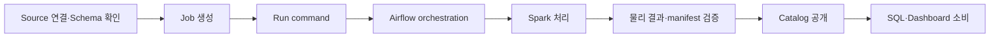

# 03. API Reference

> **문서 상태: Canonical API Index.** 이 문서는 AskLake API의 현재 경로, 노출 범위와 런타임 경계를 찾는 색인이다. 상세 request·response schema와 오류 조건은 [API Contract](api-contract.md), 실제 연결·검증 상태는 [Backend Integration Readiness](backend-integration-readiness.md)를 따른다.

## 1. 문서 목적과 읽는 법

AskLake의 기본 backend는 FastAPI다. 이 문서는 `backend/app/main.py`가 조립하는 OpenAPI와 실제 router를 기준으로 작성했다.

- local 기본 profile: **121 paths, 137 operations**
- production profile: **118 paths, 134 operations**
- 차이: production에서 등록하지 않는 local-only API 3개
- `POST /api/sql/test`는 이름과 달리 모든 profile에 등록되는 현재 API다.
- FastAPI에 없는 Node ESM Text Structuring 호환 endpoint 2개는 OpenAPI 수치에 포함하지 않는다.
- `/internal/mcp` private ASGI transport는 `/api` router 밖에 있으므로 OpenAPI 수치에 포함하지 않는다.

### 1.1 상태 분류

| 표기 | 의미 |
| --- | --- |
| **Current** | 기본 FastAPI router에 등록된 현재 API |
| **Profile-gated** | route는 존재하지만 feature flag나 배포 profile에 따라 비활성 응답을 낼 수 있는 API |
| **Internal** | Airflow 같은 내부 workload가 service token으로 호출하는 API |
| **Compatibility** | 기존 caller나 대체 runtime을 보존하는 호환 경로 |
| **Deprecated** | 현재 router에는 남아 있으나 새 caller가 사용하면 안 되는 별칭 |
| **Local-only** | production에는 등록되지 않는 fixture API. 현재 router 등록 범위와 실제 실행 guard는 아래 색인에서 따로 설명한다. |
| **Removed** | 현재 FastAPI router와 OpenAPI에 존재하지 않는 API |

`Current`는 route와 계약이 존재한다는 뜻이다. 모든 배포 profile에서 기능이 활성화됐거나 frontend 화면에 노출된다는 뜻은 아니다.
성공 경로가 명시적인 feature flag나 배포 profile에 의존하면 `Profile-gated`를 우선 표기한다.

### 1.2 접근 표기

| 표기 | 의미 |
| --- | --- |
| **Open** | route 수준 actor 인증이 없음. Production의 network·ingress 보호 여부를 별도로 확인한다. |
| **Cookie optional** | session cookie가 없어도 호출할 수 있으며 응답에서 인증 상태를 구분한다. |
| **Session** | `asklake_session` actor를 사용하며 endpoint에 따라 resource permission·governance를 적용한다. |
| **Admin** | session actor 중 `role=admin`만 허용한다. |
| **Service token** | 사용자 session이 아닌 내부 workload 전용 token을 사용한다. |
| **Test guard** | production에는 등록되지 않으며 현재 runtime guard는 `test|testing`에서만 통과한다. |

OpenAPI에는 전역 security scheme이 선언돼 있지 않으므로 인증 여부를 OpenAPI 표시만으로 판단하면 안 된다. Production의 사용자 API는 session을 기준으로 하며 `X-AskLake-*` actor header fallback은 `APP_ENV=test|testing`에서만 허용한다.

### 1.3 기준 문서

| 찾는 내용 | 기준 문서 |
| --- | --- |
| endpoint와 노출 상태 | 이 문서 |
| request·response shape, validation, 오류 | [API Contract](api-contract.md) |
| 구현·연결·검증 상태 | [Backend Integration Readiness](backend-integration-readiness.md) |
| 컴포넌트와 상태 소유권 | [Architecture](02-architecture.md) |
| 환경변수와 실행 명령 | [Development Guide](04-development-guide.md) |
| 전체 문서 lifecycle | [문서 포털](README.md) |

## 2. 공통 호출 규칙

- Base path는 `/api`다.
- Frontend는 `VITE_API_BASE_URL`이 비어 있으면 same-origin `/api`를 사용한다.
- request body와 일반 response body는 JSON이다. CSV export와 Realtime SSE는 각각 `text/csv`, `text/event-stream`을 사용한다.
- API field는 `camelCase`가 기본이다. 예외 endpoint인 `POST /api/sql/test`의 일부 field는 `snake_case`를 유지한다.
- URL path parameter는 아래 OpenAPI 표기처럼 `snake_case` 이름일 수 있다.
- ID는 의미를 추론하지 않는 opaque string, 시간은 ISO 8601 string이다.
- 오류는 [API Contract의 Error Envelope](api-contract.md#error-envelope)를 따른다.
- 목록 API는 offset 또는 signed cursor 방식 중 해당 endpoint 계약을 따른다.
- `clientRequestId`와 command ID가 있는 요청은 actor 범위 멱등성 규칙을 적용한다.
- 권한은 resource의 `view`, `query`, `run`, `manage`, `delete`, `share`, `publish`와 governance 차단·잠금을 함께 판정한다.
- `X-Correlation-ID`가 있으면 요청 추적에 사용하고, 없으면 backend가 생성한다. 자세한 관측 경계는 [Observability and Error Contract](refactor-2026/contracts/observability-and-error-contract.md)를 따른다.

환경변수 전체 목록과 실행 방법은 이 문서에 복제하지 않는다. [Development Guide](04-development-guide.md)와 각 runtime의 Runbook을 확인한다.

## 3. 핵심 API 흐름

### 3.1 Batch ETL과 Catalog 발행



Job command 접수와 데이터셋 공개는 같은 성공 조건이 아니다. Spark 물리 결과와 manifest를 검증한 뒤에만 Catalog를 공개한다. 상세 경계는 [Airflow Execution and Publication Boundary](refactor-2026/contracts/airflow-execution-publication-boundary.md)를 따른다.

### 3.2 SQL Query Run

`POST /api/query/runs`는 기본적으로 최대 100행 preview run을 접수한다. 상태와 결과를 조회한 뒤 전체 결과가 필요할 때 별도 full-result run을 만들고 signed cursor 또는 server CSV를 사용한다. `TRINO_ENABLED=false`에서는 같은 제출 endpoint가 DuckDB compatibility runtime을 사용한다.

자세한 상태 전이와 저장 방식은 [Trino Query Run Contract](trino-query-run-contract.md)와 [Trino Result Storage Contract](trino-query-result-storage-contract.md)를 따른다.

### 3.3 Realtime과 Continuous SQL

Kafka Continuous Job은 Job command와 continuous session API로 제어한다. Continuous SQL은 streaming Dataset과 static Dataset의 관계를 검증한 뒤 별도 backend Job으로 관리한다.

일반 Trino SQL Job의 revision-driven 재실행과 `/api/query/continuous-jobs`는 서로 다른 흐름이다. Continuous SQL backend API는 현재 SQL 화면에 노출되지 않으므로 API 존재를 곧바로 사용자 화면 제공 상태로 해석하지 않는다.

## 4. 도메인별 endpoint 색인

경로와 Method는 생성된 FastAPI OpenAPI를 그대로 사용한다. 상세 schema는 [API Contract](api-contract.md)에서 확인한다.

도메인 바로가기:

- 사용자·운영: [Health·Auth·User](#41-healthauthuser), [Admin·Permission·Governance](#42-adminpermissiongovernance)
- 데이터 준비: [Source·Schema·Target·Review](#43-sourceschematargetreview), [Job·Run·Schedule](#44-jobrunschedule), [Catalog·Lineage·Materialization](#45-cataloglineagematerialization)
- 분석·소비: [Semantic Model](#46-semantic-model), [SQL Query Run·AI](#47-sql-query-runai), [Dashboard](#48-dashboard)
- 실시간·내부 경계: [Realtime·Continuous SQL](#49-realtimecontinuous-sql), [Internal·Compatibility](#410-internalcompatibility-service-api), [Local-only](#411-local-only-api)

### 4.1 Health·Auth·User

| Method | Path | 상태 | 접근 | 용도 |
| --- | --- | --- | --- | --- |
| `GET` | `/api/health` | Compatibility | Open | readiness 호환 alias |
| `GET` | `/api/health/live` | Current | Open | process liveness 확인 |
| `GET` | `/api/health/ready` | Current | Open | dependency readiness 확인 |
| `GET` | `/api/health/metrics` | Current | Open | 운영 지표 확인 |
| `GET` | `/api/health/ai` | Current | Open | AI Gateway readiness 확인 |
| `GET` | `/api/health/realtime` | Current | Open | Realtime owner와 runtime readiness 확인 |
| `POST` | `/api/auth/login` | Current | Open | 로그인하고 httpOnly session cookie 발급 |
| `POST` | `/api/auth/signup` | Profile-gated | Open | 허용된 profile에서 viewer 계정 생성 |
| `GET` | `/api/auth/session` | Current | Cookie optional | 현재 session과 public signup 상태 확인 |
| `POST` | `/api/auth/logout` | Current | Cookie optional | session 폐기와 cookie 제거 |
| `GET` | `/api/users/me` | Current | Session | 현재 actor의 profile·role·permission 요약 |

### 4.2 Admin·Permission·Governance

| Method | Path | 상태 | 접근 | 용도 |
| --- | --- | --- | --- | --- |
| `GET` | `/api/admin/users` | Current | Admin | 사용자 목록 |
| `GET` | `/api/admin/groups` | Current | Admin | 그룹 목록 |
| `GET` | `/api/admin/permissions` | Current | Admin | permission grant와 actor 권한 조회 |
| `POST` | `/api/admin/permissions` | Current | Admin | permission grant 생성 |
| `PATCH` | `/api/admin/permissions/{grant_id}` | Current | Admin | permission grant 수정 |
| `DELETE` | `/api/admin/permissions/{grant_id}` | Current | Admin | permission grant 삭제 |
| `GET` | `/api/admin/governance-controls` | Current | Admin | principal 차단과 resource lock 조회 |
| `PATCH` | `/api/admin/governance/principals` | Current | Admin | 사용자·그룹 차단 상태 변경 |
| `PATCH` | `/api/admin/governance/resource-locks` | Current | Admin | resource lock 변경 |
| `GET` | `/api/admin/audit-logs` | Current | Admin | 감사 로그 검색·조회 |

### 4.3 Source·Schema·Target·Review

| Method | Path | 상태 | 접근 | 용도 |
| --- | --- | --- | --- | --- |
| `GET` | `/api/etl/sources/defaults` | Current | Open | backend 환경 기준 Source 기본값 |
| `POST` | `/api/etl/sources/assets` | Current | Session | Source 연결 검증 후 asset 탐색 |
| `POST` | `/api/etl/sources/test` | Current | Session | 선택 Source의 bounded sample과 schema draft 확인 |
| `POST` | `/api/etl/schema-inference` | Current | Session | Source sample 기반 schema 추론 |
| `POST` | `/api/etl/record-parsing/preview` | Current | Open | TXT·로그 레코드 구조화 preview |
| `GET` | `/api/etl/permission-options` | Current | Session | Job 생성·수정용 사용자·그룹 후보 |
| `POST` | `/api/etl/review` | Current | Session | Pipeline 생성 전 최종 review snapshot |
| `GET` | `/api/s3/buckets` | Current | Session | 허용된 target bucket 목록 |
| `GET` | `/api/s3/prefixes` | Current | Session | bucket prefix 탐색 |
| `GET` | `/api/target/databases` | Current | Session | 허용된 target database 목록 |
| `POST` | `/api/review-analysis/schema-suggestion` | Current | Session | review 분석 output schema 제안 |
| `POST` | `/api/review-analysis/preview` | Current | Session | bounded review 분석 preview |
| `POST` | `/api/review-analysis/runs` | Current | Session | durable review 분석 run 접수 |
| `GET` | `/api/review-analysis/runs/latest` | Current | Session | 현재 actor의 최신 분석 run |
| `GET` | `/api/review-analysis/runs/{run_id}` | Current | Session | 지정 분석 run 조회 |
| `GET` | `/api/review-analysis/cellphones` | Deprecated | Session | 과거 휴대폰 리뷰 분석 조회 별칭 |
| `POST` | `/api/review-analysis/cellphones/run` | Deprecated | Session | 과거 휴대폰 리뷰 실행 별칭 |
| `GET` | `/api/catalog/models` | Current | Session | 검증·게시된 portable model 목록 |

### 4.4 Job·Run·Schedule

Job 수정 범위는 [ETL Job Edit Contract](etl-job-edit-contract.md), Kafka 동작은 [Kafka Snapshot Contract](kafka-snapshot-direct-target-contract.md)와 [Kafka Continuous Ingestion Contract](kafka-continuous-ingestion-contract.md)를 함께 확인한다.

| Method | Path | 상태 | 접근 | 용도 |
| --- | --- | --- | --- | --- |
| `POST` | `/api/etl/jobs` | Current | Session | Snapshot·Continuous pipeline Job 생성 |
| `POST` | `/api/etl/sql-jobs` | Profile-gated | Session | 저장 SQL 기반 Trino Job 생성 |
| `GET` | `/api/etl/jobs` | Current | Session | Job 목록과 filter 조회 |
| `GET` | `/api/etl/jobs/statuses` | Current | Session | 여러 Job의 실행·Continuous 상태 조회 |
| `GET` | `/api/etl/jobs/{job_id}` | Current | Session | Job 상세 조회 |
| `PATCH` | `/api/etl/jobs/{job_id}` | Current | Session | 허용된 Job 설정 수정 |
| `DELETE` | `/api/etl/jobs/{job_id}` | Current | Session | idle runtime 정리 후 Job을 삭제하고 게시 Dataset은 자동 갱신 종료 상태로 유지 |
| `POST` | `/api/etl/jobs/{job_id}/commands` | Current | Session | run·retry·cancel·Continuous 제어 |
| `GET` | `/api/etl/jobs/{job_id}/continuous/logs` | Current | Session | redacted Continuous worker log |
| `GET` | `/api/etl/jobs/{job_id}/continuous/sessions` | Current | Session | Continuous session 목록 |
| `GET` | `/api/etl/jobs/{job_id}/continuous/sessions/{session_id}` | Current | Session | Continuous session 상세 |
| `GET` | `/api/etl/jobs/{job_id}/continuous/sessions/{session_id}/batches` | Current | Session | session micro-batch 목록 |
| `GET` | `/api/etl/jobs/{job_id}/continuous/quarantine` | Current | Session | 격리된 Continuous row 조회 |
| `GET` | `/api/etl/jobs/{job_id}/continuous/maintenance-runs` | Current | Session | replay·compaction·Iceberg maintenance 이력 |
| `POST` | `/api/etl/jobs/{job_id}/continuous/quarantine/replays` | Current | Session | quarantine replay 접수 |
| `POST` | `/api/etl/jobs/{job_id}/continuous/compactions` | Current | Session | Continuous target compaction |
| `POST` | `/api/etl/jobs/{job_id}/continuous/iceberg-maintenance` | Current | Session | Continuous Iceberg maintenance |
| `POST` | `/api/etl/schedules/run-due` | Current | Session | due schedule을 검사하고 실행 |
| `POST` | `/api/etl/kafka/reviews/ingest` | Compatibility | Session | Kafka snapshot range 직접 ingest·Catalog 등록 |
| `GET` | `/api/etl/kafka/replay-producer` | Compatibility | Session | 검증용 replay producer 상태 |
| `POST` | `/api/etl/kafka/replay-producer` | Compatibility | Session | 검증용 replay producer 시작 |
| `DELETE` | `/api/etl/kafka/replay-producer` | Compatibility | Session | 검증용 replay producer 중지 |

`DELETE /api/etl/jobs/{job_id}`는 권한과 idle 상태를 확인하고, idle Continuous runtime이 있으면 worker와 SparkApplication 정리를 먼저 확인한다. cleanup 실패 시 Job과 runtime metadata를 보존한다. cleanup 성공 뒤 Job 운영 레코드는 제거하지만 해당 Job이 게시한 Catalog Dataset과 물리 데이터는 삭제하지 않고 `runtimeStatus="producer_deleted"`, `nextRefresh="예정 없음"`으로 기록해 Catalog, SQL 분석, Dashboard에서 계속 조회할 수 있게 한다. Dataset 제거 또는 물리 purge는 별도 Catalog Dataset 삭제 API를 사용한다.

### 4.5 Catalog·Lineage·Materialization

| Method | Path | 상태 | 접근 | 용도 |
| --- | --- | --- | --- | --- |
| `GET` | `/api/catalog/datasets` | Current | Session | 권한이 있는 Dataset 목록 |
| `GET` | `/api/catalog/datasets/{dataset_id}` | Current | Session | Dataset 상세와 schema·materialization |
| `GET` | `/api/catalog/datasets/{dataset_id}/rows` | Current | Session | 최신 성공 materialization의 bounded row |
| `POST` | `/api/catalog/datasets/{dataset_id}/filter-values/query` | Current | Session | Dashboard filter용 bounded distinct 값 |
| `GET` | `/api/catalog/datasets/{dataset_id}/lineage` | Current | Session | Dataset·column lineage graph |
| `POST` | `/api/catalog/datasets/{dataset_id}/unique-keys/verify-and-register` | Current | Session | 전체 데이터 유일키 검증 후 등록 |
| `GET` | `/api/catalog/datasets/{dataset_id}/deletion-impact` | Current | Session | 삭제 blocker와 물리 artifact 영향도 |
| `DELETE` | `/api/catalog/datasets/{dataset_id}` | Current | Session | 확인 이름을 포함한 durable 삭제 접수 |
| `GET` | `/api/catalog/dataset-deletions/{deletion_id}` | Current | Session | Dataset 삭제 작업 상태 |
| `DELETE` | `/api/catalog/datasets/{dataset_id}/materialization-runs/{run_id}` | Current | Session | materialization metadata 삭제와 집계 재계산 |
| `POST` | `/api/catalog/derived-datasets` | Compatibility | Session | DuckDB 결과 기반 파생 Dataset 생성 |
| `POST` | `/api/catalog/trino-runs/{run_id}/materializations` | Profile-gated | Session | Trino run의 Iceberg materialization 접수 |
| `GET` | `/api/catalog/trino-materializations/{materialization_id}` | Current | Session | Trino materialization 상태 갱신·조회 |

Dataset 삭제는 즉시 metadata를 지우지 않는다. impact를 다시 검사하고 `202 Accepted`로 durable 작업을 만든 뒤 상태 endpoint에서 추적한다.

### 4.6 Semantic Model

| Method | Path | 상태 | 접근 | 용도 |
| --- | --- | --- | --- | --- |
| `GET` | `/api/semantic-models` | Current | Session | 접근 가능한 Semantic Model 목록 |
| `POST` | `/api/semantic-models` | Current | Session | Semantic Model 생성 |
| `GET` | `/api/semantic-models/{model_id}` | Current | Session | Semantic Model 상세 |
| `PATCH` | `/api/semantic-models/{model_id}` | Current | Session | 기본 metadata 수정 |
| `PUT` | `/api/semantic-models/{model_id}/datasets` | Current | Session | Dataset collection 교체 |
| `PUT` | `/api/semantic-models/{model_id}/dimensions` | Current | Session | Dimension collection 교체 |
| `PUT` | `/api/semantic-models/{model_id}/metrics` | Current | Session | Metric collection 교체 |
| `PUT` | `/api/semantic-models/{model_id}/relationships` | Current | Session | Relationship collection 교체 |
| `PUT` | `/api/semantic-models/{model_id}/vocabulary` | Current | Session | Vocabulary collection 교체 |
| `PUT` | `/api/semantic-models/{model_id}/permissions` | Current | Session | Semantic Model permission 교체 |
| `POST` | `/api/semantic-models/{model_id}/validate` | Current | Session | 게시 전 계약 검증 |
| `POST` | `/api/semantic-models/{model_id}/publish` | Current | Session | 검증된 version 게시 |
| `GET` | `/api/semantic-models/{model_id}/versions` | Current | Session | version 이력 조회 |
| `POST` | `/api/semantic-models/{model_id}/rollback` | Current | Session | 지정 version으로 rollback |

Semantic Model은 SQL AI의 검증된 relationship·metric context에 사용한다. 폐기된 RAG Dataset runtime과는 별도 기능이다.

### 4.7 SQL Query Run·AI

| Method | Path | 상태 | 접근 | 용도 |
| --- | --- | --- | --- | --- |
| `POST` | `/api/query/estimates` | Profile-gated | Session | 실행 전 scan 규모·비용 추정 |
| `POST` | `/api/query/validate` | Current | Session | Trino SQL·Dataset scope·권한 검증 |
| `POST` | `/api/query/runs` | Current | Session | Trino preview run 또는 DuckDB 호환 실행 |
| `GET` | `/api/query/runs` | Current | Session | 현재 actor의 Trino run 목록 |
| `GET` | `/api/query/runs/{run_id}` | Current | Session | Query Run 상태·preview 결과 |
| `GET` | `/api/query/runs/{run_id}/results` | Current | Session | signed cursor 결과 page |
| `POST` | `/api/query/runs/{run_id}/full-results` | Profile-gated | Session | preview에서 full-result run 생성·재사용 |
| `GET` | `/api/query/runs/{run_id}/exports/csv` | Current | Session | 서버 측 CSV stream |
| `POST` | `/api/query/runs/{run_id}/cancel` | Current | Session | 실행 중 Trino run 취소 |
| `POST` | `/api/query/ai-suggestions` | Current | Session | 선택 Dataset context 기반 SQL 초안 |
| `POST` | `/api/ai/generate-sql` | Current | Session | ETL inline transform용 SQL 생성 |
| `POST` | `/api/sql/test` | Current | Session | 단일 Source SQL transform preview |

Query AI는 선택한 Dataset ID를 기준으로 권한·governance와 read-only scope를 검증한다. Provider 실패 시 frontend가 SQL이나 근거를 임의 생성하지 않는다.

`POST /api/sql/test`는 개발용 transform preview 성격이지만 현재 env gate 없이 production OpenAPI에도 등록된다. 이름만 보고 local-only API로 분류하지 않는다.

### 4.8 Dashboard

| Method | Path | 상태 | 접근 | 용도 |
| --- | --- | --- | --- | --- |
| `GET` | `/api/dashboards` | Current | Session | Dashboard card 목록 |
| `POST` | `/api/dashboards/query` | Current | Session | 검색·filter·sort·pagination |
| `POST` | `/api/dashboards` | Current | Session | draft Dashboard 생성 |
| `PATCH` | `/api/dashboards/{dashboard_id}` | Current | Session | 제목 등 card metadata 수정 |
| `DELETE` | `/api/dashboards/{dashboard_id}` | Current | Session | Dashboard 삭제 |
| `GET` | `/api/dashboards/{dashboard_id}/published` | Current | Session | published runtime 조회 |
| `POST` | `/api/dashboards/{dashboard_id}/draft/ensure` | Current | Session | draft runtime 조회·생성 |
| `POST` | `/api/dashboards/{dashboard_id}/draft/pages` | Current | Session | draft page 생성 |
| `PATCH` | `/api/dashboards/{dashboard_id}/draft/pages/{page_id}` | Current | Session | draft page 수정 |
| `DELETE` | `/api/dashboards/{dashboard_id}/draft/pages/{page_id}` | Current | Session | draft page와 widget 삭제 |
| `POST` | `/api/dashboards/{dashboard_id}/draft/pages/{page_id}/widgets` | Current | Session | draft widget 생성 |
| `PATCH` | `/api/dashboards/{dashboard_id}/draft/widgets/{widget_id}` | Current | Session | draft widget 수정 |
| `DELETE` | `/api/dashboards/{dashboard_id}/draft/widgets/{widget_id}` | Current | Session | draft widget 삭제 |
| `PATCH` | `/api/dashboards/{dashboard_id}/draft/layouts` | Current | Session | widget layout batch 저장 |
| `POST` | `/api/dashboards/{dashboard_id}/publish` | Current | Session | draft revision 게시 |
| `POST` | `/api/dashboards/{dashboard_id}/widgets/query` | Current | Session | `mode`에 따른 선택 widget 데이터 계산 |
| `GET` | `/api/datasets/{dataset_id}/freshness` | Current | Session | Dataset revision과 권장 재확인 시각 |
| `POST` | `/api/datasets/freshness/query` | Current | Session | 최대 100개 Dataset freshness 묶음 조회 |
| `POST` | `/api/dashboards/assistant` | Current | Session | 검증된 Dashboard action과 근거 생성 |

현재 Dashboard frontend는 페이지 진입과 사용자의 새로고침에서 widget query를 실행한다. 자동 freshness polling이나 SSE 구독은 시작하지 않는다. API가 존재한다는 이유만으로 자동 갱신이 활성화됐다고 설명하면 안 된다.

### 4.9 Realtime·Continuous SQL

Realtime event 계약은 [Realtime Event V1](realtime-2026/contracts/realtime-event-v1.md), Continuous SQL은 [Continuous SQL V1](realtime-2026/contracts/continuous-sql-v1.md)과 [SQL Job Execution Tree](realtime-2026/contracts/sql-job-execution-tree-v1.md)를 따른다.

| Method | Path | 상태 | 접근 | 용도 |
| --- | --- | --- | --- | --- |
| `GET` | `/api/realtime/config` | Current | Session | effective feature flag와 serving mode |
| `GET` | `/api/realtime/status` | Current | Session | event cursor·dispatcher·capacity 상태 |
| `GET` | `/api/realtime/events` | Profile-gated | Session | cursor replay가 가능한 SSE stream |
| `GET` | `/api/realtime/ingest/status` | Profile-gated | Admin | ClickHouse V2·Kafka Connect ingest 상태 |
| `PUT` | `/api/realtime/ingest/connector` | Profile-gated | Admin | V2 Kafka Connect connector 등록 |
| `POST` | `/api/realtime/ingest/exceptions/{pipeline_version_id}/{topic}/{partition}/{offset}/audited-skip` | Current | Admin | ingest 예외의 감사 가능한 skip 승인 |
| `POST` | `/api/query/continuous-jobs/validate` | Profile-gated | Session | streaming·static relation과 SQL plan 검증 |
| `POST` | `/api/query/continuous-jobs` | Profile-gated | Session | Continuous SQL Job 생성 |
| `GET` | `/api/query/continuous-jobs` | Current | Session | Continuous SQL Job 목록 |
| `GET` | `/api/query/continuous-jobs/{job_id}` | Current | Session | Job·execution tree 상태 |
| `POST` | `/api/query/continuous-jobs/{job_id}/commands` | Profile-gated | Session | start·pause·resume·stop·recover |
| `GET` | `/api/query/continuous-jobs/{job_id}/batches` | Current | Session | 처리 batch 이력 |

SSE route는 현재 API지만 Dashboard client가 자동 연결하지 않는다. ClickHouse V2 status·connector API는 EKS Realtime V1 profile에서 비활성이다. `audited-skip` route 자체는 호출 가능하지만 EKS Realtime V1에는 처리 대상인 ClickHouse V2 ingest가 활성화돼 있지 않다.

### 4.10 Internal·Compatibility service API

| Method | Path | 상태 | 접근 | 용도 |
| --- | --- | --- | --- | --- |
| `POST` | `/api/internal/airflow/spark-runs/{run_id}/execute` | Internal | Service token | Airflow가 finite Spark run 실행 |
| `POST` | `/api/internal/airflow/spark-runs/{run_id}/catalog` | Internal | Service token | 물리 결과 검증 후 Catalog 조정 |
| `POST` | `/api/etl/internal/airflow/jobs/{job_id}/runs/{run_id}/execute` | Compatibility | Service token | 이전 Airflow caller용 실행 경로 |

새 내부 caller는 `/api/internal/airflow/spark-runs/*` 경로를 사용한다. 내부 token을 browser나 사용자 API 응답에 노출하면 안 된다.

FastAPI main app은 read-only Catalog context를 제공하는 private MCP ASGI transport를 `/internal/mcp`에 별도로 mount한다. 이 transport는 OpenAPI operation이 아니며 `AI_MCP_SERVICE_TOKEN` bearer token과 request-scoped signed context가 모두 필요하다.

### 4.11 Local-only API

| Method | Path | 상태 | 접근 | 용도 |
| --- | --- | --- | --- | --- |
| `GET` | `/api/harness/rest-sample` | Local-only | Test guard | Source connector용 고정 REST fixture |
| `GET` | `/api/demo/etl/jobs` | Local-only | Test guard | local demo Job hydrate |
| `GET` | `/api/demo/catalog/datasets` | Local-only | Test guard | local demo Catalog hydrate |

이 세 operation은 `local|development|dev|test|testing` router에 등록되고 production OpenAPI에는 없다. 다만 현재 runtime guard는 header fallback이 허용된 `test|testing`에서만 통과하므로 `local|development|dev`에서는 `404`를 반환한다.

## 5. 배포 profile과 API 가용성

기준 ownership은 [`deploy/control-plane-ownership.json`](../deploy/control-plane-ownership.json)과 [Control-plane Deployment Ownership](refactor-2026/contracts/control-plane-deployment-ownership.md)이다.

| Profile | 현재 역할 | API 경계 |
| --- | --- | --- |
| EKS web·finite batch | active | 사용자 API, Airflow·Spark finite batch, Trino Query Run |
| EKS Realtime V1 | active, Continuous control-plane owner | Kafka Continuous, Spark Structured Streaming, Iceberg GOLD, Continuous SQL |
| EC2 Compose Continuous | inactive rollback standby | 승인된 owner 전환 뒤에만 rollback 또는 ClickHouse V2 opt-in |

- EKS Realtime V1에서는 `CLICKHOUSE_REALTIME_V2_ENABLED=false`, `KAFKA_CONNECT_SINK_ENABLED=false`, consumer owner `disabled`를 유지한다.
- `/api/realtime/ingest/*` route가 OpenAPI에 있어도 EKS에서 V2가 활성이라는 뜻은 아니다.
- Continuous control-plane owner는 모든 active deployment를 합쳐 정확히 하나여야 한다.
- EC2 V2 profile을 켜기 전에 ownership manifest와 배포 receipt를 함께 전환해야 한다.

## 6. Compatibility·Deprecated·Removed

| 경로·기능 | 상태 | 현재 해석 |
| --- | --- | --- |
| `TRINO_ENABLED=false`의 `/api/query/runs` | Compatibility | DuckDB response를 유지하는 호환 runtime |
| `/api/catalog/derived-datasets` | Compatibility | DuckDB 결과의 직접 Dataset 생성 경로 |
| `/api/etl/kafka/reviews/ingest` | Compatibility | Snapshot Job 외 direct Kafka ingest 경로 |
| `/api/etl/internal/airflow/jobs/*/runs/*/execute` | Compatibility | 이전 Airflow caller용 token 계약 |
| `/api/review-analysis/cellphones`와 `/run` | Deprecated | canonical `/api/review-analysis/runs*`로 교체 |
| `/api/text-structuring/models` | Compatibility | FastAPI가 아닌 Node ESM `backend/src/server.mjs`에만 존재 |
| `/api/text-structuring/training-runs` | Compatibility | FastAPI가 아닌 Node ESM `backend/src/server.mjs`에만 존재 |
| `/api/catalog/datasets/{dataset_id}/rag/*` | Removed | RAG indexing·search runtime 제거 |
| `/api/dashboard-job-bindings*` | Removed | Dashboard는 사용자 요청형 widget query 사용 |
| `/api/internal/airflow/spark-runs/{run_id}/fault-attempts/msk-authorization` | Removed | Historical 문서에만 남고 현재 router와 OpenAPI에는 없음 |

SQL AI와 Dashboard Assistant가 반환하는 retrieval 호환 필드는 `mode=disabled`, `status=disabled`, 빈 `sources`를 유지한다. 이는 실제 RAG runtime이 동작한다는 뜻이 아니다.

## 7. 화면과 API 연결

| 화면·흐름 | 현재 주요 API | 비고 |
| --- | --- | --- |
| 수집·처리 생성 | `/api/etl/sources/*`, `/api/etl/schema-inference`, `/api/etl/review`, `/api/etl/jobs` | live backend 실패를 local fixture 성공으로 바꾸지 않음 |
| 수집·처리 목록·상세 | `/api/etl/jobs`, `/api/etl/jobs/statuses`, `/api/etl/jobs/{job_id}` | PostgreSQL durable metadata |
| Catalog·Lineage | `/api/catalog/datasets*` | 실제 materialization과 lineage 조회 |
| SQL 분석 | `/api/query/validate`, `/api/query/estimates`, `/api/query/runs*` | preview와 full result lifecycle 분리 |
| SQL AI | `/api/query/ai-suggestions` | Dataset ID와 권한이 context 기준 |
| Dashboard | `/api/dashboards*`, `/api/datasets/*/freshness` | 현재 frontend는 수동 widget query |
| 관리 콘솔 | `/api/users/me`, `/api/admin/*` | admin role과 resource governance 분리 |
| Continuous 운영 | `/api/etl/jobs/{job_id}/continuous/*`, `/api/query/continuous-jobs*` | backend API와 화면 노출 상태를 구분 |

## 8. 변경·검증 규칙

- FastAPI endpoint를 추가·변경·삭제하면 이 문서와 [API Contract](api-contract.md)를 함께 갱신한다.
- OpenAPI 경로, 실제 router 등록, frontend adapter를 대조한다.
- `Current`, `Profile-gated`, `Compatibility`, `Deprecated`, `Internal`, `Local-only`, `Removed`를 같은 의미로 사용한다.
- profile-gated route를 배포 완료 기능처럼 표현하지 않는다.
- API 상세 shape, 환경변수 덤프와 검증 증적을 이 색인에 복사하지 않는다.

대표 검증:

```bash
cd backend
npm run verify:backward-compatibility
npm run verify:control-plane-ownership

cd ..
node scripts/verify-docs.mjs
```

## 9. 관련 문서

- [API Contract](api-contract.md)
- [Backend Integration Readiness](backend-integration-readiness.md)
- [Architecture](02-architecture.md)
- [Development Guide](04-development-guide.md)
- [System Guardrails](system-guardrails.md)
- [ETL Job Edit Contract](etl-job-edit-contract.md)
- [Kafka Snapshot Contract](kafka-snapshot-direct-target-contract.md)
- [Kafka Continuous Ingestion Contract](kafka-continuous-ingestion-contract.md)
- [Trino Query Run Contract](trino-query-run-contract.md)
- [Trino Result Storage Contract](trino-query-result-storage-contract.md)
- [Realtime Event V1](realtime-2026/contracts/realtime-event-v1.md)
- [Continuous SQL V1](realtime-2026/contracts/continuous-sql-v1.md)
- [SSE Operations](realtime-2026/sse-operations.md)
- [Control-plane Deployment Ownership](refactor-2026/contracts/control-plane-deployment-ownership.md)
