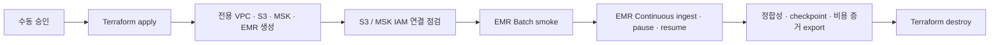

# AWS Staging IaC와 실제 Smoke 자동화 계획

이 문서는 Issue #727의 구현 기준이다. 목표는 현재 코드에 있는 `EMR Serverless + MSK Serverless` 경로를 일회성 AWS staging에서 안전하게 생성하고, 실제 연결·처리·복구를 검증한 뒤 자동으로 제거할 수 있게 만드는 것이다.

현재 완료된 코드 범위는 **Phase 0 계약 고정, Phase 1 Terraform 기반, Phase 2 Runtime 설정 연결, Phase 3 수동 GitHub Actions, Phase 4 smoke 실행기·증적 판정기**다. Terraform resource, credential 없는 mock plan, output 변환기, OIDC workflow와 private SSM smoke orchestration은 구현했지만 AWS 계정에는 아직 plan/apply/smoke하지 않았다. 따라서 유료 resource, 실제 JAR bundle과 smoke 결과는 아직 없으며 일반 애플리케이션 배포와 로컬 Docker 환경은 바꾸지 않는다.

## 1. 한눈에 보는 전환 구조

| 구분 | 현재 기본 경로 | AWS staging 후보 경로 |
| --- | --- | --- |
| Kafka | Redpanda 1개 | MSK Serverless |
| Spark Batch | Docker 또는 Spark REST | EMR Serverless Batch application |
| Spark Continuous | 로컬 Spark worker | EMR Serverless STREAMING application |
| Object storage | MinIO | AWS S3 |
| 인증 | 로컬 전용 credential | GitHub OIDC, IAM role, default credential chain |
| 목적 | 개발·회귀 검증 | 실제 AWS 연결·정합성·복구 smoke |
| 생성 시점 | `docker compose`를 명시적으로 실행할 때 | 수동 승인된 전용 staging workflow에서만 |
| 종료 | 로컬 stack stop | 증거 export 후 `terraform destroy` |



이 staging은 운영 Runtime이 아니다. smoke 성공만으로 production 전환을 승인하지 않으며, Phase 7 반복 부하 검증과 Phase 8 전환 승인은 별도로 남는다.

## 2. 전체 개발 Phase

| Phase | 결과물 | 완료 조건 | 현재 상태 |
| --- | --- | --- | --- |
| 0. 계약 고정 | versioned contract, 정적 verifier, 문서 | 리전·네트워크·state·비용·quota·smoke 크기가 코드 리뷰 가능한 값으로 고정 | 완료 |
| 1. Terraform 기반 | bootstrap/state, network, S3, IAM, MSK, EMR module | `fmt`, `validate`, credential 없는 mock plan이 통과하고 secret output이 없음 | 완료 |
| 2. Runtime 연결 | Terraform output을 AskLake env/manifest로 변환 | broker/role/application/S3 값이 수작업 복사 없이 주입되고 민감값은 출력되지 않음 | 완료 |
| 3. GitHub Actions | OIDC plan/apply/artifact/destroy workflow | 장기 AWS key 없이 수동 plan, apply/artifact/destroy 개별 승인, checksum bundle 전달과 독립 destroy 가능 | 완료(코드·로컬 검증) |
| 4. 실제 smoke | S3 readiness, MSK probe, Batch, Continuous pause/resume | 입력·소비·sink count 일치, final lag 0, checkpoint resume, report 확보 | 실행 코드 완료, 실제 AWS 증적 대기 |
| 5. 비용·TTL guard | budget alert, 만료 sweep, failure cleanup | 정상/실패 모두 증거 export 후 제거되고 만료 stack을 탐지 | 예정 |
| 6. 운영 인계 | runbook, 장애/비용 기록, 오피스아워 질문 | 다른 팀원이 같은 절차를 재현하고 안전하게 종료 가능 | 예정 |

## 3. Phase 0에서 고정한 계약

machine-readable source of truth는 [`infra/contracts/aws-staging-smoke.v1.json`](../infra/contracts/aws-staging-smoke.v1.json)이다. 사람이 읽는 이 문서와 값이 충돌하면 JSON 계약과 verifier를 함께 수정하고 version을 올린다.

### 3.1 환경과 이름

- 환경은 `staging`, 리전은 `ap-northeast-2`로 제한한다.
- 모든 resource는 3~16자의 `stackId`로 격리하고 기본 prefix는 `asklake-staging-${stackId}`다.
- S3의 63자 이름 제한을 넘지 않도록 bucket prefix는 `asklake-stg-${accountId}-apne2-${stackId}`를 사용한다.
- Kafka topic namespace는 `asklake.staging.${stackId}`다. 기존 staging/production topic을 재사용하지 않는다.
- 필수 tag는 `Project`, `Environment`, `ManagedBy`, `Issue`, `StackId`, `ExpiresAt`이다.
- 실제 account ID, role ARN, 알림 주소, 만료 시각은 repo에 넣지 않고 apply 입력으로 받는다.

### 3.2 Terraform state

- state backend는 versioning과 KMS 암호화를 적용한 S3다.
- backend bucket/KMS 값은 partial configuration으로 외부에서 전달하며 credential을 backend 설정에 넣지 않는다.
- S3 native lockfile을 사용하고 DynamoDB locking은 새로 도입하지 않는다.
- state bucket은 같은 staging stack이 자기 자신을 관리하지 않는다. Phase 1에서 별도 bootstrap stack으로 분리한다.
- state key는 `asklake/staging/${stackId}/terraform.tfstate`로 stack마다 분리한다.

### 3.3 Network

- 전용 VPC `10.77.0.0/16`을 사용한다.
- 3개 AZ의 private subnet은 `10.77.0.0/20`, `10.77.16.0/20`, `10.77.32.0/20`이다.
- public subnet, public ingress, SSH ingress를 만들지 않는다.
- NAT Gateway와 runtime Maven egress를 사용하지 않는다.
- S3 gateway endpoint와 SSM/SSM Messages/EC2 Messages/CloudWatch Logs/CloudWatch Metrics/EMR Serverless interface endpoint를 사용한다. no-NAT smoke runner의 `GetMetricData`는 `monitoring` endpoint를 통해서만 실행한다.
- smoke runner는 private subnet의 일회성 EC2이며 SSH 대신 SSM으로 실행한다. 실행 bundle과 결과는 S3로 전달한다.
- MSK bootstrap broker는 Terraform sensitive output에서 private Runtime env로 전달하므로 runner에 MSK control-plane 조회 권한이나 public API egress를 주지 않는다.
- EMR Continuous dependency는 runtime package download가 아니라 checksum을 고정한 S3 JAR bundle을 사용한다.

### 3.4 인증과 secret

- GitHub Actions는 OIDC로 임시 credential을 발급받는다. 장기 access key/secret은 GitHub secret, env 파일, Terraform state/output에 넣지 않는다.
- MSK Serverless는 IAM authentication과 TLS만 허용한다.
- smoke runner, EMR execution role, GitHub control-plane role은 역할을 분리하고 최소 권한을 Phase 1 IAM policy로 구현한다.
- MSK broker 원문, AWS credential, secret output은 log나 artifact에 남기지 않는다.

### 3.5 EMR 용량과 quota

Batch application과 Continuous application은 각각 다음 상한을 사용한다.

| 항목 | 값 |
| --- | ---: |
| maximum capacity | 16 vCPU / 64 GB memory / 320 GB disk |
| driver | 1 core / 4 GB / 20 GB |
| executor | 2 cores / 4 GB / 20 GB |
| executor dynamic allocation | min 0 / initial 2 / max 7 |
| application concurrent runs | 1 |
| idle auto-stop | 10분 |

`driver 1 core + executor 2 cores × 최대 7개 = 15 vCPU`이므로 application 상한 16 vCPU 안에 들어간다. AWS 계정에는 최소 16 concurrent vCPU quota가 있어야 하며 Phase 1 preflight가 실제 계정 quota를 조회해 부족하면 apply 전에 실패해야 한다.

Batch와 Continuous를 동시에 돌리면 두 application이 최대 32 vCPU를 요구할 수 있으므로 Phase 0 smoke는 **순차 실행**한다. 동시 실행이나 더 큰 executor 수는 quota 증액과 비용 검토를 별도 승인한 뒤 계약 version을 올린다.

### 3.6 Smoke 입력 크기

이 smoke는 “대용량 성능 보장”이 아니라 실제 AWS 연결과 정합성 확인용이다.

| 입력 | 값 | 의미 |
| --- | ---: | --- |
| Kafka record count | 1,000,000건 | 작은 샘플만 통과하는 연결 오류를 피할 기능 smoke |
| 평균 / P95 message size | 1,024 / 4,096 bytes | 건수뿐 아니라 byte 크기도 기록 |
| 예상 Kafka ingress | 1,024,000,000 bytes | 약 0.95 GiB |
| producer rate | 5,000 records/s | 약 200초 동안 입력 |
| topic partitions | 3 | 초기 smoke 병렬성; 성능 최적값을 뜻하지 않음 |
| trigger | 2초 | micro-batch 주기 |
| max offsets/trigger | 10,000 | 한 trigger 동안 계획된 5,000 × 2초 입력을 수용 |
| Batch fixture | 100 MiB | S3 → EMR Batch → S3/Catalog 연결 확인 |

성공 기준은 produced/consumed/sink count 완전 일치, 설명되지 않은 중복 0, final lag 0, quarantine 0, 동일 checkpoint pause/resume, 단일 remote Job identity, S3 report/checkpoint 존재다. latency는 기록하지만 Phase 0에서 P95 임계값을 만들거나 성능 달성을 주장하지 않는다.

### 3.7 비용과 수명

- 한 번의 smoke 예산 기준은 30 USD이며 50%, 80%, 100% 알림을 둔다.
- 기본 TTL은 8시간, 절대 상한은 24시간이다.
- AWS Budgets는 지연된 비용 관측/알림이므로 실시간 kill switch로 사용하지 않는다.
- 실제 안전장치는 workflow의 `finally` cleanup, 독립 destroy workflow, `ExpiresAt` 기반 만료 sweep이다.
- 정상 smoke와 실패 smoke 모두 증거를 먼저 export한 뒤 staging stack을 제거한다.
- 일반 애플리케이션 배포는 이 Terraform apply를 호출할 수 없다. 유료 resource 생성은 전용 staging workflow와 수동 승인에서만 가능하다.
- smoke 실행 시점의 서울 리전 단가 snapshot과 EMR billed resource를 artifact에 저장한다. 계약 파일에 변동 가격을 상수로 고정하지 않는다.

## 4. Phase 1 Terraform 구성

Terraform root는 `infra/terraform` 아래에 있으며 AWS provider `6.54.0`을 lock file로 고정한다.

| 경로 | 소유 resource |
| --- | --- |
| `bootstrap/` | staging stack과 분리된 state S3, KMS, versioning, public access block, native S3 lockfile |
| `modules/network` | 전용 VPC, 3개 private subnet, route table, security group, S3 gateway/6개 interface endpoint |
| `modules/storage` | 실행별 artifact/output/checkpoint/report bucket과 data KMS key |
| `modules/msk` | IAM authentication을 사용하는 MSK Serverless cluster |
| `modules/emr` | `emr-7.9.0`, X86_64, application별 16 vCPU 상한의 Batch/Continuous application |
| `modules/iam` | application에 묶인 EMR execution role과 private smoke runner role/profile |
| `modules/observability` | Batch/Continuous/smoke CloudWatch log group과 7일 retention |
| `modules/cost-control` | `StackId`로 격리된 30 USD AWS Budget와 50/80/100% 알림 |
| `modules/smoke-runner` | 승인된 AMI가 입력될 때만 생성되는 no-public-IP EC2/SSM runner |
| `environments/staging` | Phase 0 계약값을 조립하는 실제 staging root module |

Network에는 Internet Gateway, NAT Gateway, public subnet, `0.0.0.0/0`, SSH key가 없다. EMR와 runner는 security-group reference로 MSK IAM port `9098`에만 접근하고 AWS API/S3는 private endpoint를 사용한다.

MSK bootstrap broker는 credential은 아니지만 운영 endpoint이므로 Terraform 일반 output에서 `sensitive`로 redaction한다. application ID, execution role ARN, bucket 이름처럼 Phase 2가 소비할 비민감 output은 `infrastructure_contract`에 모은다.

state bootstrap에는 `prevent_destroy`를 적용한다. 실행별 staging bucket은 고유 `StackId`로만 만들어지고 evidence export 뒤 제거할 수 있도록 `force_destroy`를 사용한다. 따라서 staging destroy가 platform state bucket이나 다른 stack bucket을 제거할 수 없다.

## 5. Phase 2 Runtime 설정 연결

`backend/scripts/render-aws-staging-runtime.mjs`는 apply가 끝난 staging root의 `terraform output -json`을 표준 입력으로만 받고 stack별 private env와 redacted manifest를 만든다.

```bash
terraform -chdir=infra/terraform/environments/staging output -json \
  | npm --prefix backend run aws-staging:render-runtime -- \
      --output-dir deploy/generated/aws-staging
```

- private env: `deploy/generated/aws-staging/<stackId>.env`, mode `0600`, Git ignore 대상
- redacted manifest: `deploy/generated/aws-staging/<stackId>.manifest.json`, mode `0600`
- env에는 기존 Runtime이 소비하는 `ASKLAKE_SPARK_RUNTIME=emr-serverless`, `ASKLAKE_KAFKA_RUNTIME=msk`, Batch/Continuous application ID, execution role ARN, S3 bucket/prefix, admission cap과 MSK broker가 들어간다.
- manifest에는 application/role/bucket과 broker 개수/SHA-256만 남기며 broker endpoint 원문, AWS credential, session token을 넣지 않는다.
- Terraform JSON의 sensitive output은 원문을 포함하므로 중간 파일로 `tee`하거나 job log에 출력하지 않는다. converter도 입력값과 오류 원문을 stdout/stderr에 되쓰지 않는다.
- Phase 2 env는 Batch와 MSK 설정을 연결하지만 `ASKLAKE_EMR_SERVERLESS_CONTINUOUS_ENABLED=false`를 유지한다. no-NAT 환경의 checksum 고정 JAR bundle이 Phase 3에서 S3에 올라가고 검증되기 전에는 Continuous를 활성화하지 않는다.
- 별도 checkpoint/report bucket 이름은 staging orchestration용 `ASKLAKE_AWS_STAGING_*_BUCKET`에도 보존한다. 현재 제품 Storage Layout V1의 dataset checkpoint는 output bucket의 dataset root 아래를 계속 사용하며 Phase 4가 이를 임의로 다른 root로 바꾸지 않는다.

변환 계약은 다음 명령으로 AWS API나 credential 없이 검증한다.

```bash
cd backend
npm run verify:aws-staging-runtime
```

정상 mapping, Runtime config parse, contract/capacity/account 변조 거부, broker injection 차단, 파일 권한, manifest/stdout/stderr 비노출과 원자적 overwrite를 확인한다.

## 6. Phase 3 수동 GitHub Actions

Phase 3은 일반 CI나 애플리케이션 배포에 연결하지 않는다. 다음 세 workflow는 모두 `workflow_dispatch` 전용이고 같은 `stackId` 동시 실행을 막는다.

| Workflow | 역할 | 변경 승인 |
| --- | --- | --- |
| `aws-staging-plan-apply.yml` | 실제 quota 조회, Terraform plan 증거/fingerprint 생성, 승인 후 같은 만료 시각으로 재-plan하고 fingerprint가 같을 때만 apply, private Runtime env 생성 | `plan`은 변경 없음, `apply`는 `asklake-aws-staging-apply` Environment와 `apply:<stackId>` |
| `aws-staging-artifacts.yml` | state에서 private Runtime 재생성, Maven 의존성 materialize, SHA-256 JAR bundle·Python entry point 업로드, Continuous 활성 env를 암호화된 staging S3에 전달 | `asklake-aws-staging-artifacts` Environment와 `artifacts:<stackId>` |
| `aws-staging-destroy.yml` | 승인 전에 destroy plan 증거/fingerprint 생성, 별도 승인 뒤 같은 fingerprint일 때만 격리 stack 제거 | apply job의 `asklake-aws-staging-destroy` Environment와 `destroy:<stackId>` |

- 모든 AWS job은 GitHub OIDC의 단기 credential만 사용하며 `id-token: write`, 예상 account 확인, `allowed-account-ids`, account masking과 기존 credential unset을 적용한다.
- `apply`와 `destroy`는 binary plan을 job 사이에 전달하지 않는다. 검토 job은 민감한 plan JSON을 출력하지 않고 timestamp만 제외한 전체 plan 의미의 SHA-256 fingerprint를 남긴다. 보호 Environment 승인 뒤 동일 commit·stack·만료 시각으로 다시 plan하고 fingerprint가 정확히 같은 경우에만 적용한다.
- GitHub artifact에는 사람이 검토할 text plan, redacted manifest, checksum/전달 receipt만 남긴다. backend 설정, tfvars, broker가 든 Runtime `.env`, Terraform binary plan은 job 종료 시 삭제한다.
- Continuous dependency는 `infra/artifacts/emr-continuous-dependencies.pom.xml`의 정확한 버전에서 만들고 각 JAR와 전체 bundle SHA-256을 계산한다. `If-None-Match: *`와 S3 SHA-256/size/metadata 조회로 동일 key 덮어쓰기를 차단하고 모든 JAR 검증 뒤 `bundle.json`을 마지막에 기록한다. 필수 Spark Kafka/MSK IAM JAR와 manifest까지 원격 검증된 뒤에만 Continuous flag를 켠다.
- artifact workflow가 전달한 private Runtime env는 staging artifact bucket의 실행별 `runtime/<runId>-<attempt>/` 경로에만 둔다. 이것은 Phase 4 smoke runner가 소비할 입력이며 production 배포 파일이 아니다.
- artifact workflow는 같은 immutable runtime prefix에 Linux/x86 runner용 backend source·production dependency bundle과 SHA-256 manifest도 전달한다. private SSM runner는 다운로드 뒤 checksum이 일치할 때만 Phase 4 실행기를 시작한다.
- workflow 파일이 존재한다고 AWS 연결 성공을 뜻하지 않는다. GitHub Environment/variable/secret과 AWS OIDC trust/IAM permission을 platform이 준비한 뒤 Phase 4에서 실제 수동 실행한다.

로컬에서 side effect 없이 Phase 3 계약을 확인한다.

```bash
cd backend
npm run verify:aws-staging-workflows
```

이 verifier는 입력/확인 문자열/quota/KMS/TTL 거부, cleanup의 budget/quota 독립성, private 파일 권한, plan fingerprint 변조, JAR conditional write·원격 checksum·부분 실패·필수 dependency, Continuous 활성화 순서, manual-only trigger, OIDC/action version, 보호 Environment, redacted artifact와 2단계 destroy 경계를 검증한다. 별도 `AWS Staging Contract Checks` PR workflow는 AWS credential과 `id-token: write` 없이 이 verifier와 Terraform mock test를 실행한다.

## 7. Phase 4 private smoke 실행과 증적

`.github/workflows/aws-staging-smoke.yml`은 `workflow_dispatch` 전용이며 `asklake-aws-staging-smoke` 보호 Environment와 `smoke:<stackId>` 확인을 요구한다. 입력은 artifact workflow receipt의 immutable `runtimeRootUri`이고, Terraform state의 stack/artifact bucket/private runner와 일치하지 않으면 SSM 명령 전에 실패한다.

실행 순서는 다음과 같다.

1. GitHub OIDC로 예상 account와 Terraform state를 확인하고 private SSM runner ID를 읽는다.
2. GitHub runner에서 실행 시점의 서울 리전 EMR price snapshot을 만들고 staging S3 evidence prefix에 저장한다.
3. private runner가 checksum 검증된 bundle과 activated Runtime env를 S3 endpoint로 내려받는다.
4. 네 staging bucket의 read/write/delete readiness와 MSK IAM/TLS roundtrip을 확인한다.
5. 100 MiB 이상 JSONL fixture를 checksum과 함께 올리고 EMR Batch를 제출해 input/output row와 report를 검증한다. Batch entry point의 네 Python helper는 `--py-files`로 S3에서 공급한다.
6. 전용 3-partition topic에 총 100만 건을 계약 속도로 두 구간에 생산한다. 첫 구간 처리 뒤 graceful pause, 같은 output/checkpoint로 resume, 두 번째 구간 처리와 final pause를 수행한다.
7. `asklake.aws-staging-smoke-evidence.v1`을 생성해 produced/consumed/sink 완전 일치, lag/quarantine 0, 서로 다른 두 worker attempt와 EMR Job Run, duplicate submission 0, checkpoint/output/report 존재, Batch row 일치와 price/resource snapshot을 fail-closed로 평가한다.

로컬 검증은 AWS API나 유료 resource 없이 실행한다.

```bash
cd backend
npm run verify:aws-staging-smoke
```

이 명령의 성공은 실제 smoke 성공이 아니다. 실제 evidence가 만들어지고 같은 evaluator를 통과하기 전까지 Issue의 Phase 4 acceptance는 미완료다.

## 8. 실제 plan/apply 이전 외부 준비값

다음 값은 코드에 실제 값을 저장하지 않는다.

- AWS account ID
- 계정의 실제 EMR Serverless concurrent vCPU quota
- Terraform state bucket 이름과 KMS key ARN
- GitHub OIDC role ARN
- AWS Budget 알림 대상
- AWS Billing에서 활성화된 `StackId` user-defined cost allocation tag
- 실행별 `stackId`와 ISO-8601 `ExpiresAt`

GitHub OIDC provider와 Terraform 실행 role은 계정 단위 platform bootstrap으로 한 번 준비한다. AskLake Terraform은 EMR execution/smoke runner role과 staging resource policy를 소유한다. artifact 단계의 control-plane role에는 생성된 artifact bucket의 `PutObject`/`GetObject`와 data KMS encrypt/decrypt가 있어야 S3 checksum을 재조회할 수 있다. 이 선행 조건이 없으면 로컬 AWS key를 임시로 추가하지 말고 plan/apply를 중단한다.

Repository에는 `AWS_ACCOUNT_ID`, `AWS_GITHUB_OIDC_ROLE_ARN`, `AWS_TERRAFORM_STATE_BUCKET`, `AWS_TERRAFORM_STATE_KMS_KEY_ARN` variable과 `AWS_BUDGET_NOTIFICATION_EMAIL` secret이 필요하다. private SSM runner를 켜기 위해 승인된 `AWS_STAGING_SMOKE_RUNNER_AMI_ID` variable을 추가한다. apply/artifact/smoke/destroy Environment에는 required reviewer를 설정하고 OIDC role trust policy는 이 repository와 해당 Environment/branch claim으로 제한한다. smoke 제어면 role에는 SSM Send/GetCommand, runtime/evidence S3 Get/Put, KMS decrypt/encrypt, Pricing 조회 권한이 추가로 필요하다.

## 9. Phase 0·1·2·3·4 검증

```bash
cd backend
npm run verify:aws-staging-contract
npm run verify:aws-staging-terraform
npm run verify:aws-staging-runtime
npm run verify:aws-staging-workflows
npm run verify:aws-staging-smoke
```

verifier는 정상 계약뿐 아니라 다음 변조가 실패하는지도 자체 확인한다.

- 서울 외 리전 변경
- 예산 상향
- 장기 AWS key 허용
- NAT/Maven egress 허용
- EMR vCPU cap 상향
- 기능 smoke를 성능 보장으로 변경
- checkpoint resume 근거 제거
- 일반 배포에서 인프라 apply 허용

Phase 0 완료는 AWS resource가 준비됐다는 뜻이 아니다. Phase 1 Terraform과 Phase 3 workflow가 완료된 뒤에도 `plan`, 수동 `apply`, artifact 전달, 실제 smoke, `destroy`를 순서대로 검증해야 한다.

두 번째 명령은 정적 정책 검증 뒤 `terraform fmt -check`, bootstrap/staging `init -backend=false`, `validate`, mock provider plan assertion을 실행한다. 실제 credential, backend bucket, AWS API 없이 resource schema와 module 연결을 검증한다.

Phase 4 실행 코드 완료는 AWS 통합 성공을 뜻하지 않는다. 실제 account/role/backend/quota 값을 GitHub 설정에 등록하고 workflow가 기본 브랜치에서 dispatch 가능한 상태가 된 뒤 real plan/apply/artifact/smoke를 순서대로 실행해야 한다. 생성된 evidence가 evaluator를 통과해야만 Phase 4를 완료 처리하며 실패 정리와 TTL sweep은 Phase 5 증거로 남는다.

## 10. 공식 기준

- [Terraform S3 backend](https://developer.hashicorp.com/terraform/language/backend/s3)
- [EMR Serverless VPC access](https://docs.aws.amazon.com/emr/latest/EMR-Serverless-UserGuide/vpc-access.html)
- [EMR Serverless quotas](https://docs.aws.amazon.com/emr/latest/EMR-Serverless-UserGuide/endpoints-quotas.html)
- [Amazon MSK quotas](https://docs.aws.amazon.com/msk/latest/developerguide/limits.html)
- [AWS Budgets 관리](https://docs.aws.amazon.com/cost-management/latest/userguide/budgets-managing-costs.html)
- [IAM OIDC identity provider](https://docs.aws.amazon.com/IAM/latest/UserGuide/id_roles_providers_oidc.html)
