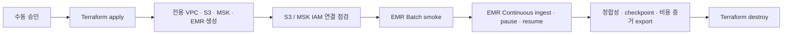

# AWS Staging IaC와 실제 Smoke 자동화 계획

이 문서는 Issue #727의 구현 기준이다. 목표는 현재 코드에 있는 `EMR Serverless + MSK Serverless` 경로를 일회성 AWS staging에서 안전하게 생성하고, 실제 연결·처리·복구를 검증한 뒤 자동으로 제거할 수 있게 만드는 것이다.

현재 완료된 범위는 **Phase 0 계약 고정**이다. 아직 Terraform resource, AWS 계정 resource, GitHub Actions apply/destroy workflow, 실제 smoke 실행은 만들지 않았다. 일반 애플리케이션 배포와 로컬 Docker 환경도 바꾸지 않는다.

## 1. 한눈에 보는 전환 구조

| 구분 | 현재 기본 경로 | AWS staging 후보 경로 |
| --- | --- | --- |
| Kafka | Redpanda 1개 | MSK Serverless |
| Spark Batch | Docker 또는 Spark REST | EMR Serverless Batch application |
| Spark Continuous | 로컬 Spark worker | EMR Serverless STREAMING application |
| Object storage | MinIO | AWS S3 |
| 인증 | 로컬 전용 credential | GitHub OIDC, IAM role, default credential chain |
| 목적 | 개발·회귀 검증 | 실제 AWS 연결·정합성·복구 smoke |
| 생성 시점 | `docker compose`를 명시적으로 실행할 때 | 수동 승인된 전용 staging workflow에서만 |
| 종료 | 로컬 stack stop | 증거 export 후 `terraform destroy` |



이 staging은 운영 Runtime이 아니다. smoke 성공만으로 production 전환을 승인하지 않으며, Phase 7 반복 부하 검증과 Phase 8 전환 승인은 별도로 남는다.

## 2. 전체 개발 Phase

| Phase | 결과물 | 완료 조건 | 현재 상태 |
| --- | --- | --- | --- |
| 0. 계약 고정 | versioned contract, 정적 verifier, 문서 | 리전·네트워크·state·비용·quota·smoke 크기가 코드 리뷰 가능한 값으로 고정 | 완료 |
| 1. Terraform 기반 | bootstrap/state, network, S3, IAM, MSK, EMR module | `fmt`, `validate`, `plan`이 통과하고 secret output이 없음 | 예정 |
| 2. Runtime 연결 | Terraform output을 AskLake env/manifest로 변환 | broker/role/application/S3 값이 수작업 복사 없이 주입되고 민감값은 출력되지 않음 | 예정 |
| 3. GitHub Actions | OIDC plan/apply/destroy workflow | 장기 AWS key 없이 plan 자동, apply 수동 승인, destroy 독립 실행 가능 | 예정 |
| 4. 실제 smoke | S3 readiness, MSK probe, Batch, Continuous pause/resume | 입력·소비·sink count 일치, final lag 0, checkpoint resume, report 확보 | 예정 |
| 5. 비용·TTL guard | budget alert, 만료 sweep, failure cleanup | 정상/실패 모두 증거 export 후 제거되고 만료 stack을 탐지 | 예정 |
| 6. 운영 인계 | runbook, 장애/비용 기록, 오피스아워 질문 | 다른 팀원이 같은 절차를 재현하고 안전하게 종료 가능 | 예정 |

## 3. Phase 0에서 고정한 계약

machine-readable source of truth는 [`infra/contracts/aws-staging-smoke.v1.json`](../infra/contracts/aws-staging-smoke.v1.json)이다. 사람이 읽는 이 문서와 값이 충돌하면 JSON 계약과 verifier를 함께 수정하고 version을 올린다.

### 3.1 환경과 이름

- 환경은 `staging`, 리전은 `ap-northeast-2`로 제한한다.
- 모든 resource는 `stackId`로 격리하고 기본 prefix는 `asklake-staging-${stackId}`다.
- Kafka topic namespace는 `asklake.staging.${stackId}`다. 기존 staging/production topic을 재사용하지 않는다.
- 필수 tag는 `Project`, `Environment`, `ManagedBy`, `Issue`, `StackId`, `ExpiresAt`이다.
- 실제 account ID, role ARN, 알림 주소, 만료 시각은 repo에 넣지 않고 apply 입력으로 받는다.

### 3.2 Terraform state

- state backend는 versioning과 KMS 암호화를 적용한 S3다.
- backend bucket/KMS 값은 partial configuration으로 외부에서 전달하며 credential을 backend 설정에 넣지 않는다.
- S3 native lockfile을 사용하고 DynamoDB locking은 새로 도입하지 않는다.
- state bucket은 같은 staging stack이 자기 자신을 관리하지 않는다. Phase 1에서 별도 bootstrap stack으로 분리한다.
- state key는 `asklake/staging/${stackId}/terraform.tfstate`로 stack마다 분리한다.

### 3.3 Network

- 전용 VPC `10.77.0.0/16`을 사용한다.
- 3개 AZ의 private subnet은 `10.77.0.0/20`, `10.77.16.0/20`, `10.77.32.0/20`이다.
- public subnet, public ingress, SSH ingress를 만들지 않는다.
- NAT Gateway와 runtime Maven egress를 사용하지 않는다.
- S3 gateway endpoint와 SSM/SSM Messages/EC2 Messages/CloudWatch Logs interface endpoint를 사용한다.
- smoke runner는 private subnet의 일회성 EC2이며 SSH 대신 SSM으로 실행한다. 실행 bundle과 결과는 S3로 전달한다.
- EMR Continuous dependency는 runtime package download가 아니라 checksum을 고정한 S3 JAR bundle을 사용한다.

### 3.4 인증과 secret

- GitHub Actions는 OIDC로 임시 credential을 발급받는다. 장기 access key/secret은 GitHub secret, env 파일, Terraform state/output에 넣지 않는다.
- MSK Serverless는 IAM authentication과 TLS만 허용한다.
- smoke runner, EMR execution role, GitHub control-plane role은 역할을 분리하고 최소 권한을 Phase 1 IAM policy로 구현한다.
- MSK broker 원문, AWS credential, secret output은 log나 artifact에 남기지 않는다.

### 3.5 EMR 용량과 quota

Batch application과 Continuous application은 각각 다음 상한을 사용한다.

| 항목 | 값 |
| --- | ---: |
| maximum capacity | 16 vCPU / 64 GB memory / 320 GB disk |
| driver | 1 core / 4 GB / 20 GB |
| executor | 2 cores / 4 GB / 20 GB |
| executor dynamic allocation | min 0 / initial 2 / max 7 |
| application concurrent runs | 1 |
| idle auto-stop | 10분 |

`driver 1 core + executor 2 cores × 최대 7개 = 15 vCPU`이므로 application 상한 16 vCPU 안에 들어간다. AWS 계정에는 최소 16 concurrent vCPU quota가 있어야 하며 Phase 1 preflight가 실제 계정 quota를 조회해 부족하면 apply 전에 실패해야 한다.

Batch와 Continuous를 동시에 돌리면 두 application이 최대 32 vCPU를 요구할 수 있으므로 Phase 0 smoke는 **순차 실행**한다. 동시 실행이나 더 큰 executor 수는 quota 증액과 비용 검토를 별도 승인한 뒤 계약 version을 올린다.

### 3.6 Smoke 입력 크기

이 smoke는 “대용량 성능 보장”이 아니라 실제 AWS 연결과 정합성 확인용이다.

| 입력 | 값 | 의미 |
| --- | ---: | --- |
| Kafka record count | 1,000,000건 | 작은 샘플만 통과하는 연결 오류를 피할 기능 smoke |
| 평균 / P95 message size | 1,024 / 4,096 bytes | 건수뿐 아니라 byte 크기도 기록 |
| 예상 Kafka ingress | 1,024,000,000 bytes | 약 0.95 GiB |
| producer rate | 5,000 records/s | 약 200초 동안 입력 |
| topic partitions | 3 | 초기 smoke 병렬성; 성능 최적값을 뜻하지 않음 |
| trigger | 2초 | micro-batch 주기 |
| max offsets/trigger | 10,000 | 한 trigger 동안 계획된 5,000 × 2초 입력을 수용 |
| Batch fixture | 100 MiB | S3 → EMR Batch → S3/Catalog 연결 확인 |

성공 기준은 produced/consumed/sink count 완전 일치, 설명되지 않은 중복 0, final lag 0, quarantine 0, 동일 checkpoint pause/resume, 단일 remote Job identity, S3 report/checkpoint 존재다. latency는 기록하지만 Phase 0에서 P95 임계값을 만들거나 성능 달성을 주장하지 않는다.

### 3.7 비용과 수명

- 한 번의 smoke 예산 기준은 30 USD이며 50%, 80%, 100% 알림을 둔다.
- 기본 TTL은 8시간, 절대 상한은 24시간이다.
- AWS Budgets는 지연된 비용 관측/알림이므로 실시간 kill switch로 사용하지 않는다.
- 실제 안전장치는 workflow의 `finally` cleanup, 독립 destroy workflow, `ExpiresAt` 기반 만료 sweep이다.
- 정상 smoke와 실패 smoke 모두 증거를 먼저 export한 뒤 staging stack을 제거한다.
- 일반 애플리케이션 배포는 이 Terraform apply를 호출할 수 없다. 유료 resource 생성은 전용 staging workflow와 수동 승인에서만 가능하다.
- smoke 실행 시점의 서울 리전 단가 snapshot과 EMR billed resource를 artifact에 저장한다. 계약 파일에 변동 가격을 상수로 고정하지 않는다.

## 4. Phase 1 이전 외부 준비값

다음 값은 코드에 실제 값을 저장하지 않는다.

- AWS account ID
- 계정의 실제 EMR Serverless concurrent vCPU quota
- Terraform state bucket 이름과 KMS key ARN
- GitHub OIDC role ARN
- AWS Budget 알림 대상
- 실행별 `stackId`와 ISO-8601 `ExpiresAt`

GitHub OIDC provider는 계정 단위 platform bootstrap으로 한 번 준비하고, AskLake staging role과 resource policy는 Phase 1 Terraform이 소유한다. 이 선행 조건이 없으면 로컬 AWS key를 임시로 추가하지 말고 apply를 중단한다.

## 5. Phase 0 검증

```bash
cd backend
npm run verify:aws-staging-contract
```

verifier는 정상 계약뿐 아니라 다음 변조가 실패하는지도 자체 확인한다.

- 서울 외 리전 변경
- 예산 상향
- 장기 AWS key 허용
- NAT/Maven egress 허용
- EMR vCPU cap 상향
- 기능 smoke를 성능 보장으로 변경
- checkpoint resume 근거 제거
- 일반 배포에서 인프라 apply 허용

Phase 0 완료는 AWS resource가 준비됐다는 뜻이 아니다. Phase 1 Terraform과 Phase 3 workflow가 완료된 후 `plan`, 수동 `apply`, 실제 smoke, `destroy`를 순서대로 검증해야 한다.

## 6. 공식 기준

- [Terraform S3 backend](https://developer.hashicorp.com/terraform/language/backend/s3)
- [EMR Serverless VPC access](https://docs.aws.amazon.com/emr/latest/EMR-Serverless-UserGuide/vpc-access.html)
- [EMR Serverless quotas](https://docs.aws.amazon.com/emr/latest/EMR-Serverless-UserGuide/endpoints-quotas.html)
- [Amazon MSK quotas](https://docs.aws.amazon.com/msk/latest/developerguide/limits.html)
- [AWS Budgets 관리](https://docs.aws.amazon.com/cost-management/latest/userguide/budgets-managing-costs.html)
- [IAM OIDC identity provider](https://docs.aws.amazon.com/IAM/latest/UserGuide/id_roles_providers_oidc.html)
