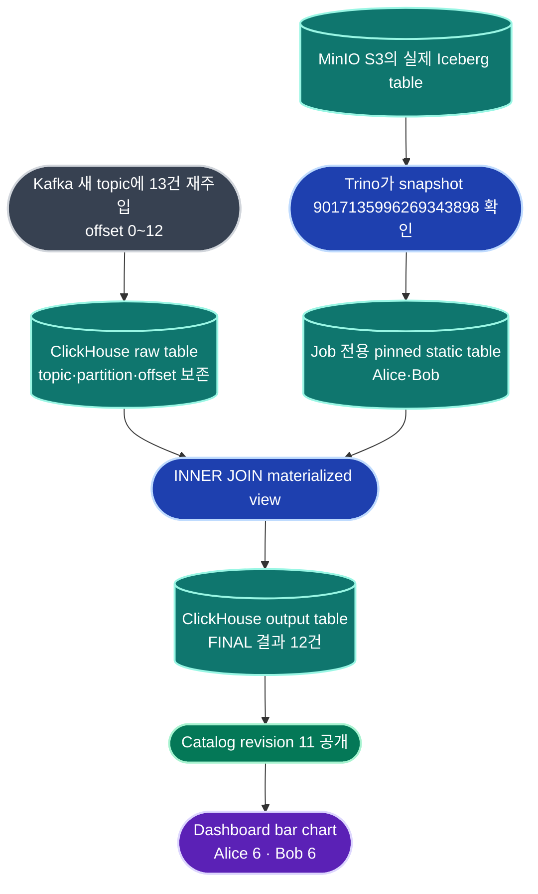

# ClickHouse Kafka JOIN 대시보드 검증 보고서

이 문서는 [작업 계획](clickhouse-dashboard-join-plan.md)에 적은 ClickHouse 경로를 실제로 구현하고 검증한 결과다.

연결 이슈는 [#895](https://github.com/JUNGLE-TEAM1/AskLake/issues/895)다.

## 1. 먼저 결론

로컬 재배포 환경에서 다음 흐름이 실제로 동작했다.

```text
실제 MinIO S3에 Iceberg 기준 테이블 생성
↓
Trino에서 정확한 Iceberg snapshot 확인
↓
Continuous SQL ClickHouse Job 생성·시작
↓
새 Kafka topic의 offset 0부터 13건 재주입
↓
ClickHouse에서 INNER JOIN 결과 12건 생성
↓
Catalog revision 11까지 갱신
↓
Dashboard 위젯에서 Alice 6건, Bob 6건 표시
```

기존 Spark/S3/Iceberg 경로는 삭제하거나 바꾸지 않았다. `servingMode=clickhouse`를 명시하고 두 feature flag를 켠 Continuous JOIN Job만 새 경로를 탄다.

2026-07-17 최초 보고 당시에는 공유 dev 서버 재배포 권한을 확인하지 못했으므로 아래 2~10절의 실측값은 로컬 Compose 결과로 작성했다. 이후 2026-07-18에 AWS EC2 Continuous cell의 실제 배포 권한과 SSM 경로를 확인해 재배포·장애 주입·장시간 검증까지 완료했다. 운영 결과는 11절에 별도로 기록한다.

## 2. 왜 예전보다 짧아질 수 있는가

예전 경로는 Kafka 데이터가 들어온 뒤에도 Dashboard가 읽기 전에 다음 저장·검증 단계를 모두 지나야 했다.

```text
Spark micro-batch
→ JOIN
→ S3 파일 쓰기
→ Iceberg metadata commit
→ manifest 작성
→ Trino exact snapshot 검증
→ Catalog 공개
→ Dashboard 조회
```

새 경로는 Job 시작 때 static Iceberg snapshot을 한 번 고정한 뒤, 새 Kafka 행을 ClickHouse 안에서 JOIN하고 같은 ClickHouse 결과를 Dashboard가 읽는다.

```text
ClickHouse Kafka consumer
→ raw table
→ JOIN materialized view
→ output table
→ Catalog revision
→ Dashboard 조회
```

즉, 매 갱신마다 S3 파일·Iceberg commit·manifest·Trino 검증을 반복하지 않는 것이 핵심이다.

다만 이번 검증에서는 같은 장비와 같은 데이터로 기존 Spark 경로의 시간을 다시 재지 않았다. 그래서 “정확히 몇 배 빠르다”고 말할 수는 없다. 확인된 사실은 새 경로의 실제 반영 시간이 초 단위였고, 중간 단계가 줄었다는 것이다.

## 3. 실제로 움직인 모습



처음 넣은 Kafka 데이터는 다음 세 건이었다.

| event_id | user_id | 결과 |
| ---: | ---: | --- |
| 1001 | 1 | Alice와 JOIN |
| 1002 | 2 | Bob과 JOIN |
| 1003 | 999 | 기준 데이터가 없어 INNER JOIN 결과에서 제외 |

그 뒤 Alice와 Bob 이벤트를 번갈아 10건 더 넣었다. 따라서 입력은 13건이고 JOIN 결과는 12건이다.

## 4. 실제 측정값

실제 MinIO S3/Iceberg snapshot을 Trino로 읽은 실행 결과는 다음과 같다.

| 측정 항목 | 결과 |
| --- | ---: |
| Kafka 입력 | 13건 |
| Kafka offset | partition 0, offset 0~12 |
| INNER JOIN 결과 | 12건 |
| JOIN 결과가 query 가능해진 시간 | 622.52 ms |
| Catalog revision 공개 시간 | 1,395.80 ms |
| 최초 Dashboard 위젯 준비 시간 | 2,229.67 ms |
| 추가 이벤트 10회 end-to-end p50 | 2,253.22 ms |
| 추가 이벤트 10회 end-to-end p95 | 3,705.96 ms |
| 초기 환경·Job 준비 시간 | 27,409.30 ms |
| 최종 Catalog revision | 11 |

초기 준비 시간에는 임시 MinIO 기동, 실제 Iceberg 테이블 생성, snapshot 조회, ClickHouse runtime table 생성이 포함된다. 사용자가 새 이벤트를 넣은 뒤 위젯이 바뀌는 평상시 동기화 속도는 warm end-to-end 값으로 봐야 한다.

bounded Trino fixture로도 같은 흐름을 한 번 더 실행했다. 이때 JOIN은 647.13 ms, 최초 Dashboard 준비는 2,608.85 ms, warm p50은 1,901.75 ms, p95는 2,676.61 ms였다.

## 5. 위젯은 어디까지 확인했는가

JOIN 결과 Dataset으로 다음 10종 위젯의 실제 서버 조회를 확인했다.

- metric
- table
- bar chart
- line chart
- area chart
- donut chart
- pie chart
- radial bar chart
- heatmap chart
- treemap chart

대표 bar chart는 `user_name`을 X축으로 묶었고 결과는 Alice 6, Bob 6이었다. Dashboard 응답의 `liveRefresh`는 `true`, `appliedRevision`은 `11`이었다.

## 6. 중복과 재시작은 어떻게 막았는가

Kafka 메시지의 위치인 `topic + partition + offset`을 raw와 output identity로 보존한다.

ClickHouse table은 `ReplacingMergeTree`를 사용하고 Dashboard와 Dataset row 조회는 `FINAL`로 읽는다. 검증 중 같은 JOIN 결과 한 행을 물리적으로 한 번 더 삽입했지만, 물리 행은 13건이어도 `FINAL` 결과는 12건으로 유지됐다.

pause 후 resume도 실제 호출했고, 이후 이벤트가 계속 반영되는 것을 확인했다.

같은 실행에서 ClickHouse가 실패했다고 Spark consumer를 자동으로 함께 시작하지는 않는다. 두 consumer가 같은 Kafka 진행 위치를 서로 다르게 소유하면 중복이나 누락이 생길 수 있기 때문이다. 전환할 때는 feature flag를 끄고 기존 Iceberg mode Job을 새로 만드는 방식으로 운영한다.

## 7. 어떤 코드를 바꿨는가

| 영역 | 적용 내용 |
| --- | --- |
| Continuous SQL 계약 | `servingMode=clickhouse`, `clickhouseTarget`, mode별 검증 추가 |
| ClickHouse 실행 | Kafka Engine, ingest MV, raw table, pinned static table, JOIN MV, output table 생성 |
| Catalog 공개 | ClickHouse table identity와 Kafka offset을 revision으로 공개 |
| Dashboard 조회 | ClickHouse Dataset을 `FINAL`로 읽어 metric·table·chart 집계 |
| 기존 기능 보호 | 기본 mode는 계속 Iceberg이며 ClickHouse flag 기본값은 `false` |
| 배포 | local/prod Compose ClickHouse service, health check, credential, preflight 추가 |
| 검증 | 실제 Kafka replay·Iceberg snapshot·Dashboard widget E2E 스크립트 추가 |

중심 구현 파일은 다음과 같다.

- `backend/app/services/clickhouse_continuous_sql.py`
- `backend/app/services/clickhouse_continuous_publication.py`
- `backend/app/services/clickhouse_client.py`
- `backend/app/services/dashboard_physical_data.py`
- `backend/app/services/dataset_rows_service.py`
- `backend/scripts/verify-clickhouse-kafka-join.py`
- `deploy/docker-compose.prod.yml`
- `docker-compose.yml`

## 8. 회귀 검증 결과

| 검증 | 결과 |
| --- | --- |
| ClickHouse focused unit/contract | 13 passed |
| realtime stack 전체 | 77 passed |
| frontend production build | 성공 |
| Continuous SQL 기존 계약 | 23 passed |
| deploy regression | 37 passed, 0 failed, 1 Windows skip |
| local Compose config | 성공 |
| production Compose config | 성공 |
| Python compile | 성공 |
| `git diff --check` | 성공 |
| 실제 Kafka→ClickHouse→Dashboard E2E | 성공 |

Windows skip 1건은 POSIX Spark runtime 경로 검사이며 ClickHouse 동작 실패가 아니다.

## 9. 검증 뒤 남은 데이터

검증은 고유한 Kafka topic과 table 이름을 사용했다. 종료 뒤 다음을 확인했다.

- Redpanda 검증 topic: 0개
- ClickHouse 검증 table: 0개
- Continuous SQL Job row: 0개
- Catalog output Dataset row: 0개
- Dashboard row: 0개
- Trino 검증용 Iceberg table: 0개

기존 다른 작업공간의 `m3-minio` 컨테이너와 volume은 건드리지 않았다. 이번 검증 전용 임시 MinIO와 Trino 컨테이너만 제거했다.

## 10. 아직 남은 한계

- 2~9절 성능 수치는 최초 로컬 Compose 검증값이며, 운영 장애·복구 실측은 11절 값으로 판단해야 한다.
- static Iceberg 데이터는 Job 시작 시점의 exact snapshot으로 고정된다. static 데이터가 바뀌면 Job을 다시 시작해야 한다.
- 한 Job에서 static snapshot을 ClickHouse로 적재하는 크기는 운영 설정의 안전 상한을 넘을 수 없다.
- ClickHouse 결과 Dataset은 Dashboard와 Dataset row API용이다. 일반 Trino SQL table로 자동 등록하지 않는다.
- 이번 성능 수치는 로컬 Compose의 기능·동기화 측정값이다. 운영 SLO나 기존 Spark 대비 배수로 해석하면 안 된다.

## 11. 2026-07-18 AWS 운영 복구 검증

AWS EC2 Continuous cell에 `70266ba44a8dd2f898bb21bd6638ab07a8ce3568`을 배포했다. 기존 PostgreSQL, Redpanda, ClickHouse volume과 실행 중 Dataset은 보존하고 backend image만 교체했다.

| 검증 | 운영 결과 |
| --- | --- |
| Dashboard 실시간 기준선 | 10초 사이 집계 162,000 → 164,000, Catalog revision 140 → 142 |
| Kafka 중지·재시작 | 중지 중 `recovering`, 재기동 후 같은 generation 2·같은 active Run으로 `running`; offset 368,999 → 371,999, revision 346 → 349 |
| backend 재시작 | 같은 generation/Run 유지, raw offset 206,999 → 208,999 |
| ClickHouse 재시작 | consumer group offset 유지, raw offset 208,999 → 210,999; group committed offset 211,000 |
| offset 연속성 | raw `count = distinct(partition,offset) = max-min+1`; offset 0부터 공백 없음 |
| 10분 soak | raw 220,000 → 340,000(+120,000), memory 3,568,607,232 → 3,580,612,608 bytes, 최대 4,125,626,368 bytes/6 GiB |
| soak 중복 | raw 340,000/identity 340,000, output 339,000/identity 339,000 |
| 정적 snapshot 교체 | Iceberg snapshot `8339785072495771562` 2행 → `9069373903868998388` 3행; cache key와 ClickHouse table 모두 분리 |
| Catalog 삭제·자가복구 | row 삭제 뒤 같은 publication으로 복원, revision 398 → 398 유지, Dashboard `ready` |
| 동일 이름 재시도 | 같은 `clientRequestId`는 같은 Job 반환, 같은 표시 이름의 다른 Dataset ID Job은 충돌 없이 생성; fixture Job 즉시 정리 |
| Dashboard SQL matrix | `day|month|year` × `count|sum|avg|min|max` 15/15 성공 |
| 최종 상태 | Job `running`, Catalog 447,000행/revision 424, Dashboard `ready` 8포인트, `/jobs` HTTP 200 |
| 최종 중복·연속성 | raw 448,000행/identity 448,000/offset 0~447,999, output 447,000행/identity 447,000 |
| fixture 정리 | 임시 ClickHouse table 0, cache registry row 0, Iceberg table 0, 동일 이름 검증 Job 0 |

Kafka와 ClickHouse를 멈춘 동안 producer는 계속 같은 topic으로 전송했다. 복구 뒤 consumer가 committed offset부터 backlog를 이어 읽었고 generation을 새로 만들거나 수동 start command를 보내지 않았다. broker 연결 오류는 non-terminal `recovering`으로 보이지만 parsing·field-count 오류는 계속 `failed`로 분리한다.

관련 자동 회귀는 ClickHouse/Continuous SQL/Dashboard 82개, 집중 lifecycle 31개, `verify:continuous-sql-contract` 27개가 통과했다. 전체 로컬 `npm run verify`는 Docker Desktop의 MinIO가 꺼져 있어 `127.0.0.1:9000` 연결 단계에서만 중단됐으며, 같은 object storage·Kafka·ClickHouse 경계는 위 AWS 운영 검증으로 확인했다.

## 딱 기억해

**기존 안전한 Spark/Iceberg 길은 그대로 두고, 선택한 Kafka JOIN 결과만 ClickHouse에서 바로 읽게 만들었다. 실제 S3/Iceberg snapshot과 Kafka offset 0~12를 사용한 검증에서 JOIN 12건이 Dashboard 위젯까지 약 2.23초에 처음 보였고, 반복 갱신 p50은 약 2.25초였다.**
