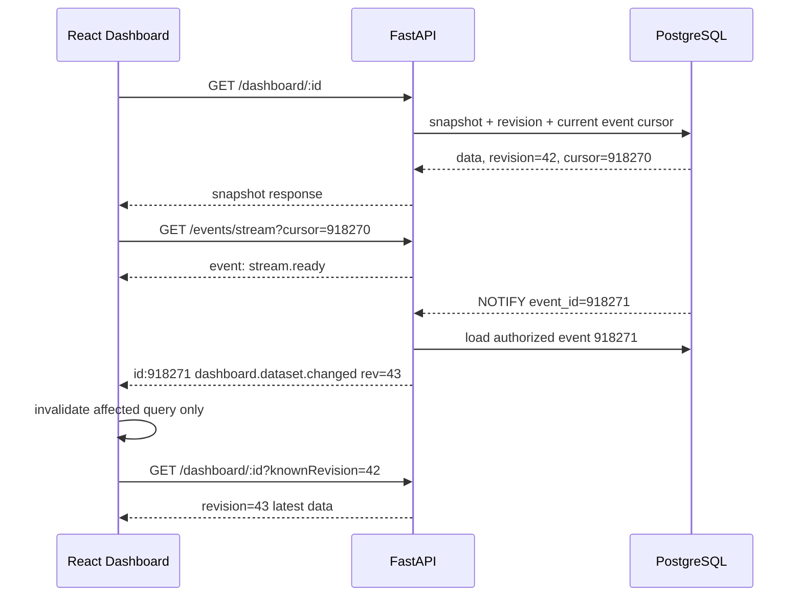
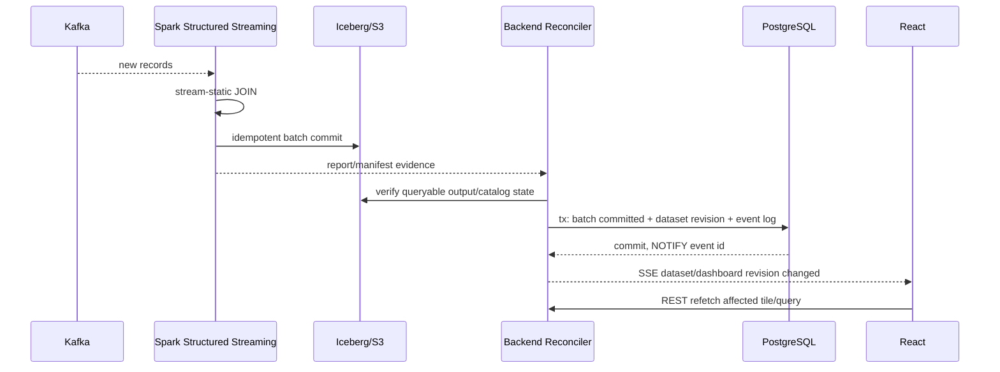
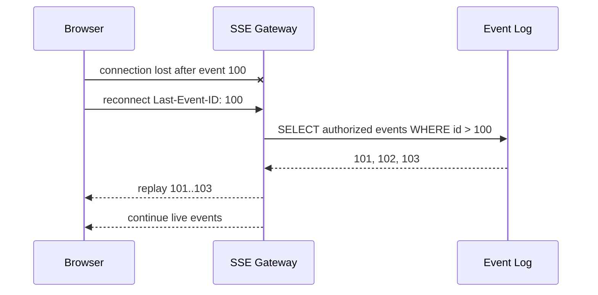

# 00 — Master Control

> **AskLake 저장소 로컬 우선 규칙:** 원본 9개 PR은 `STACKED_PR_PLAN.md`의 4개 Stack PR로 묶어 실행한다. 현재 실행 단위와 상태는 `WORK_STATUS.md`를 따르며, 한 Stack PR 안에서는 매핑된 원본 문서를 모두 읽되 다음 Stack PR 범위는 구현하지 않는다.

이 문서는 모든 PR에서 공통으로 읽는 제어 문서다. Codex는 `README.md`, 이 문서, `WORK_STATUS.md`, 현재 PR 문서만으로 작업을 시작할 수 있어야 한다.

## 명령 해석

사용자가 `다음 단계 진행해`라고 말하면 다음 절차를 실행한다.

1. 현재 branch, HEAD, `git status --short`, remote와 최근 commit을 확인한다.
2. `WORK_STATUS.md`에서 상태가 `READY`인 가장 낮은 PR 하나를 선택한다.
3. 이전 PR이 `DONE`인지 확인한다. `PARTIAL/BLOCKED`이면 다음으로 건너뛰지 않는다.
4. 선택한 PR 문서에 명시된 범위만 구현한다.
5. 변경 전 baseline과 변경 후 테스트·build·lint·typecheck를 실행한다.
6. 결과 문서와 `WORK_STATUS.md`를 갱신한다.
7. 완료·미완료·남은 PR을 사용자에게 보고한다.
8. 다음 PR을 읽거나 구현하지 않고 멈춘다.

## 절대 중단 규칙

- 한 응답 또는 한 작업 세션에서 두 개의 PR 단계를 연속 실행하지 않는다.
- 현재 PR이 완료되어도 다음 PR은 `READY`로만 표시하고 실행하지 않는다.
- blocker를 우회하기 위해 미래 PR 코드를 당겨오지 않는다.
- PR 범위를 넘어선 결함을 발견하면 `WORK_STATUS.md`의 위험/후속 작업에 기록한다.
- 테스트가 실패한 상태를 성공으로 보고하지 않는다.

## 단일 상태 원장

작업 진행 상태는 `WORK_STATUS.md`만 권위로 사용한다. 완료 기록을 삭제하거나 이전 결과를 덮어쓰지 않는다. 각 PR 결과는 `docs/realtime-2026/phase-results/PR-XX-<slug>.md`로 별도 저장한다.

## 최종 사용자 보고 형식

```text
[PR 단계 종료]
- 단계/판정:
- 시작 HEAD / 종료 HEAD:
- 이번에 한 일:
- 변경 파일과 계약 영향:
- 실행한 검증:
- 실패·미실행 검증:
- 롤백:
- blocker/잔여 위험:
- 완료된 PR:
- 남은 PR:
- 다음 READY PR:
- 중단 문구: 다음 단계는 사용자가 “다음 단계 진행해”라고 말할 때만 시작한다.
```


---

## 공통 프로젝트 컨텍스트

## 감사 기준

- 감사일: `2026-07-16`
- 실제 배포 환경: AWS EC2 `<redacted-ec2-instance>`
- 배포 경로: `/opt/asklake-release`
- 배포 branch: `dev`
- 배포 commit: `06fbe213eaa56506fd7bebf26c6c5739004d03aa`
- commit 제목: `Merge pull request #787 from JUNGLE-TEAM1/codex/kafka-raw-preview-visible`
- 감사 시점에 포함되지 않은 로컬 PR #793 commit: `ca6f567b`

현재 작업은 다른 컴퓨터에서 진행되므로 위 commit은 기준점일 뿐이다. 현재 branch/HEAD가 더 최신이면 최신 코드를 우선하되, drift를 문서화하고 사용자의 변경을 절대 덮어쓰지 않는다.

## 감사에서 확인된 관련 위험

- `backend/app/services/etl_service.py` 약 9,088줄: Kafka Continuous, Spark, Catalog, Dashboard publication 집중
- `backend/app/services/sql_service.py` 약 1,752줄: SQL 분석 책임 집중
- `backend/scripts/kafka_continuous_stream.py` 약 1,820줄: streaming lifecycle·batch 처리 집중
- `frontend/src/hooks/useAskLakeData.ts` 약 1,502줄: server state·polling·UI orchestration 집중
- `frontend/src/pages/ingest/JobsPages.tsx` 약 3,559줄: runtime 상태와 action 집중
- Continuous 상태가 PostgreSQL, Kafka lag, Spark, report, checkpoint, S3, Catalog, Dashboard, frontend polling에 분산
- EC2 reboot 후 Spark 공유 경로 및 UID 185 권한 문제가 실제로 발생

## 이번 작업의 제품 목표

1. Dashboard의 짧은 주기 polling을 SSE 기반 변경 알림으로 교체한다.
2. Job, Dataset, Catalog, SQL live result, Dashboard tile이 바뀌면 필요한 화면만 동기화한다.
3. 연결이 끊겨도 마지막 event cursor 이후를 replay하거나 snapshot 재동기화한다.
4. SQL 분석에서 실시간 relation과 정적 relation을 JOIN한 쿼리를 장기 실행 Job으로 저장·시작·중지·복구한다.
5. 새 Kafka record가 들어올 때마다 다음 micro-batch에서 정적 Dataset과 계속 JOIN한다.
6. batch output이 실제 조회 가능한 상태가 된 뒤 Dashboard revision을 갱신하고 SSE event를 기록한다.
7. 기존 API, Job, Dataset, checkpoint, SQL 정적 실행 기능을 깨지 않는다.

## 이번 작업에서 피해야 할 잘못된 구현

- API process 메모리에만 subscriber와 event를 저장
- SSE payload로 전체 Dashboard 또는 대형 SQL 결과를 전송
- EventSource 연결 하나당 PostgreSQL LISTEN connection 하나 생성
- 장기 JWT를 query string에 넣음
- Spark worker가 브라우저 SSE endpoint를 직접 호출
- Kafka record 한 건마다 Trino/SQL query 전체 실행
- 정적 Dataset 변경 의미를 정의하지 않고 자동으로 과거 결과까지 바뀐다고 가정
- polling을 유지하면서 SSE도 동일 주기로 실행해 요청을 두 배로 만듦
- SQL 문자열을 정규식으로만 파싱
- 기존 God Service/God Hook에 모든 새 로직을 추가

---

## 목표 아키텍처와 권위 규칙

## 1. Dashboard 동기화

### 읽기 경로

1. 브라우저는 REST로 Dashboard snapshot을 읽는다.
2. 응답은 `revision`과 `eventCursor`를 함께 준다.
3. 브라우저는 해당 cursor 이후로 SSE에 연결한다.
4. SSE event가 오면 event가 지정한 query key 또는 resource만 stale 처리한다.
5. 브라우저는 REST로 최신 데이터를 다시 읽는다.

SSE event가 유실되거나 cursor retention을 벗어나면 서버는 `system.resync_required`를 보내고 연결을 닫는다. 브라우저는 전체 snapshot을 다시 읽은 뒤 새 cursor로 연결한다.

### 쓰기 경로

1. REST command 또는 backend reconciler가 canonical state를 변경한다.
2. 같은 DB transaction에서 state revision과 durable event row를 기록한다.
3. PostgreSQL `NOTIFY`는 event payload 전체가 아니라 event ID만 알린다.
4. API process당 하나의 listener가 알림을 받아 local hub에 전달한다.
5. SSE client는 tenant/audience 권한에 맞는 event만 받는다.

## 2. Event 권위

- canonical 데이터: 기존 DB/Catalog/Iceberg/Dashboard API
- event durability와 replay: PostgreSQL append-only event log
- process wake-up: PostgreSQL LISTEN/NOTIFY 또는 저장소에 이미 있는 동등한 broadcast adapter
- browser transport: SSE
- client cache: 서버 상태의 복사본이며 revision이 낮으면 폐기

NOTIFY는 durable queue가 아니다. 재연결 복구는 반드시 event log 조회로 수행한다.

## 3. 지속 SQL JOIN

### 기본 V1

- streaming relation: 1개
- static relation: 1개 이상
- 기본 JOIN: streaming relation을 왼쪽에 둔 `INNER` 또는 `LEFT OUTER`
- 실행: Spark Structured Streaming micro-batch
- 결과: 기존 Iceberg/S3/Catalog publication 경로 재사용
- 기본 정적 binding: `PINNED_AT_START`

### 정적 binding 정책

| 정책 | 새 실시간 row | 정적 Dataset 변경 | 과거 결과 | 용도 |
|---|---|---|---|---|
| `PINNED_AT_START` | 시작 시 고정한 snapshot과 JOIN | 현재 Run에는 미반영 | 변경 없음 | 재현성·안전 기본값 |
| `LATEST_PER_BATCH` | 각 batch 시작 시 최신 committed snapshot과 JOIN | 다음 batch부터 반영 | 변경 없음 | reference data가 자주 바뀌는 경우 |
| `BACKFILL_ON_CHANGE` | 최신 snapshot 사용 | change event가 replay 작업 생성 | 정의한 범위만 upsert | 과거 결과 수정이 제품 요구인 경우 |

`LATEST_PER_BATCH`는 과거 결과를 자동 수정하지 않는다. 과거 결과까지 바꾸려면 raw retention, replay 범위, output key, upsert semantics가 있는 `BACKFILL_ON_CHANGE`가 필요하다.

## 4. Batch commit과 Dashboard publication

```text
Spark batch output commit
  -> report/manifest/checkpoint evidence
  -> backend reconciliation
  -> continuous_sql_batch = committed
  -> dataset revision 증가
  -> dashboard projection/queryable 상태 확인
  -> realtime_event_log insert
  -> NOTIFY
  -> SSE
  -> frontend targeted invalidation
```

Dashboard event는 output이 query engine에서 보이기 전에 발행하면 안 된다. Catalog refresh와 Dashboard projection이 별도 단계라면 event type과 revision도 분리한다.

## 5. 상태 이름

- desired state: `stopped | running | paused`
- observed state: `starting | running | pausing | paused | stopping | stopped | failed | recovering`
- batch state: `planned | executing | output_committed | catalog_ready | dashboard_ready | failed`
- SSE connection: `connecting | open | degraded | fallback_polling | closed`

기존 상태명이 다르면 compatibility mapper를 두고 API breaking change 없이 이동한다.

---

## 모든 Codex 단계의 공통 실행 규칙

## 저장소 안전

1. 시작 즉시 branch, HEAD, `git status --short`, remote, 최근 commit을 확인한다.
2. 사용자의 미커밋 변경을 reset, checkout, stash, 삭제로 덮어쓰지 않는다.
3. 감사 기준 commit 이후 drift를 먼저 분류한다.
4. 관련 없는 formatter 변경, 전체 줄바꿈 변경, lockfile 재생성을 피한다.
5. push, merge, production deploy, destructive migration은 현재 세션에서 명시되지 않으면 실행하지 않는다.

## 사실 확인

1. 실제 경로, framework, auth, query cache, DB driver, Spark/Iceberg 버전을 저장소에서 확인한다.
2. 이 문서의 경로가 이동했으면 현재 symbol을 찾아 근거를 남긴다.
3. 명령은 `package.json`, Python 설정, Docker/Compose, CI, 개발 문서에서 찾는다.
4. 실행하지 못한 테스트를 통과했다고 쓰지 않는다.
5. 최신 공식 문서가 현재 배포 버전과 다르면 현재 버전 동작을 우선하고 차이를 기록한다.

## 구조 원칙

1. Big-bang rewrite 금지. feature flag와 compatibility adapter를 사용하는 단계적 전환을 한다.
2. SSE는 transport일 뿐 source of truth로 만들지 않는다.
3. in-memory-only event bus를 production 정답으로 만들지 않는다.
4. event producer는 canonical state 변경과 함께 durable event를 기록한다.
5. SSE payload는 작은 식별자, revision, invalidation hint 중심으로 제한한다.
6. 대형 SQL 결과, 원본 record, secret, credential, 개인정보를 event에 넣지 않는다.
7. EventSource 연결마다 DB LISTEN connection을 만들지 않는다. process당 listener와 local bounded hub를 사용한다.
8. 기존 God Service/God Hook에 신규 핵심 로직을 직접 추가하지 않는다.
9. application layer가 Docker, subprocess, raw filesystem, Spark REST 문자열을 직접 조립하지 않게 한다.
10. 새 Redis, queue, microservice는 기존 PostgreSQL/Kafka 구조로 해결 불가능한 이유가 ADR로 증명될 때만 추가한다.

## SSE 계약

1. 표준 `text/event-stream`, `id`, `event`, `data`, 필요 시 `retry`를 사용한다.
2. 재연결은 `Last-Event-ID`와 첫 연결 cursor를 모두 지원한다.
3. heartbeat 간격은 실제 proxy/LB idle timeout보다 짧다.
4. NGINX buffering과 SSE compression을 비활성화한다.
5. slow client queue는 bounded이며 overflow 시 `resync_required` 후 종료한다.
6. tenant와 audience filtering은 서버에서 한다.
7. native EventSource가 custom Authorization header를 지원한다고 가정하지 않는다.
8. bearer auth라면 장기 token 대신 짧은 수명의 1회용 stream ticket 또는 현재 보안 모델에 맞는 동등한 방식을 사용한다.

## 지속 SQL 계약

1. SQL을 regex로 파싱하지 않는다. 기존 parser/AST를 이용한다.
2. V1은 실시간 relation 1개 + 정적 relation N개를 기본으로 한다.
3. unsupported JOIN, unbounded sort/limit, nondeterministic function, stateful query는 명시적 validation error로 거절한다.
4. `PINNED_AT_START`, `LATEST_PER_BATCH`, `BACKFILL_ON_CHANGE` 의미를 섞지 않는다.
5. `foreachBatch`는 기본 at-least-once이므로 `query/run generation/batchId` 기반 중복 방지를 구현한다.
6. checkpoint, input offset, static snapshot ID, output commit ID를 lineage로 남긴다.
7. Spark batch 성공과 Catalog/Dashboard 성공을 하나의 상태로 뭉개지 않는다.
8. event 한 건마다 외부 SQL engine 전체 query를 실행하지 않는다.
9. static key duplicate로 row가 폭증할 수 있으므로 cardinality guard를 둔다.
10. schema evolution과 checkpoint compatibility를 테스트한다.

## 호환성·DB

1. 기존 API, persisted Job, Run, Dataset, checkpoint, manifest, SQL 정적 실행을 깨지 않는다.
2. DB는 expand → dual-read/write 또는 backfill → contract 순서다.
3. 새 column/table은 additive migration으로 시작한다.
4. rollback 후에도 새 event row와 continuous SQL metadata가 기존 코드 실행을 막지 않아야 한다.
5. 외부 side effect를 기다리는 동안 긴 DB transaction을 유지하지 않는다.

## 테스트·결과

1. 변경 전 baseline을 기록하고 실패 재현 테스트를 먼저 만든다.
2. 단위, 계약, 통합, E2E, restart/replay를 단계에 맞게 실행한다.
3. 현재 단계만 구현한다.
4. 완료하지 못한 blocker와 위험을 숨기지 않는다.
5. 모든 단계 결과는 `WORK_STATUS.md`와 현재 PR 결과 문서를 따른다.

---

## 용어 정리

- **Snapshot**: Dashboard 또는 Dataset을 한 시점에 REST로 읽은 완전한 상태.
- **Cursor**: durable event log의 마지막 처리 위치. SSE `id`와 연결된다.
- **Revision**: 특정 aggregate의 단조 증가 버전. duplicate/out-of-order event를 무시하는 기준.
- **Event log**: replay를 위해 PostgreSQL에 저장하는 append-only event 기록.
- **NOTIFY**: event가 생겼음을 process에 깨우는 신호. event 자체의 저장소가 아니다.
- **SSE hub**: API process 안에서 한 listener가 여러 browser connection의 bounded queue로 fan-out하는 계층.
- **Invalidation**: event payload 전체를 cache에 덮는 대신 해당 query를 stale 처리하고 REST 재조회하는 방식.
- **Continuous SQL Job**: 사용자가 작성한 SQL을 Spark Structured Streaming 장기 실행 계획으로 저장한 Job.
- **Static binding**: streaming run이 어떤 정적 Dataset version을 사용할지 정한 정책.
- **Pinned snapshot**: run 시작 시 고정한 정적 Dataset snapshot.
- **Latest per batch**: 각 micro-batch에서 최신 committed static snapshot을 다시 결정하는 정책.
- **Backfill**: 정적 변경 또는 버그 수정으로 과거 input 범위를 다시 읽고 결과를 upsert하는 작업.
- **Batch commit**: 특정 input offset range의 output이 sink에 중복 없이 확정된 상태.
- **Generation/Fencing token**: stale worker가 새 run의 상태나 output을 덮지 못하게 하는 세대 번호.

---

## 전체 완료 기준

> 4개 stacked PR 실행 결과와 항목별 증거·미실행 사유·production Go/No-Go는 `docs/realtime-2026/final-audit.md`에서 관리한다. 아래 원본 체크리스트는 요구사항 원문으로 유지하며, 실제 운영 증거가 없는 항목을 자동화 통과만으로 완료 처리하지 않는다.

## SSE와 Dashboard

- [ ] 정상 연결 중 Dashboard의 기존 짧은 주기 polling 요청이 발생하지 않는다.
- [ ] SSE event는 durable event log의 cursor를 가진다.
- [ ] 브라우저 reconnect 시 `Last-Event-ID` 이후 event가 replay된다.
- [ ] retention 밖 cursor는 `resync_required`와 snapshot 재조회로 복구된다.
- [ ] snapshot 응답은 `revision`과 `eventCursor`를 포함하거나 동등한 race-free 계약을 가진다.
- [ ] 동일 revision 또는 duplicate event가 화면을 되돌리지 않는다.
- [ ] event storm은 coalescing되어 Dashboard query 폭주를 만들지 않는다.
- [ ] tenant A client가 tenant B event ID 또는 payload를 받지 않는다.
- [ ] API worker가 2개 이상이어도 모든 대상 client가 event를 받는다.
- [ ] backend restart 후 browser가 자동 재연결하고 누락 상태를 복구한다.
- [ ] NGINX/ALB 경로에서 heartbeat가 실제로 flush된다.

## 지속 SQL JOIN

- [ ] SQL relation이 Catalog metadata와 AST로 realtime/static으로 분류된다.
- [ ] 실시간 relation 1개와 정적 relation N개의 INNER/LEFT JOIN이 장기 실행된다.
- [ ] 새 Kafka record가 들어오면 다음 micro-batch 결과에 JOIN output이 생긴다.
- [ ] `PINNED_AT_START`가 고정 snapshot을 사용하고 run metadata에 snapshot ID를 남긴다.
- [ ] `LATEST_PER_BATCH`가 다음 batch부터 최신 snapshot을 사용하며 과거 결과를 조용히 바꾸지 않는다.
- [ ] `BACKFILL_ON_CHANGE`가 켜진 경우 replay 범위, output key, dedupe, 비용 제한이 있다.
- [ ] restart와 같은 batch 재실행이 output duplicate를 만들지 않는다.
- [ ] input partition/offset, batch ID, static snapshot ID, output commit ID가 추적된다.
- [ ] unsupported SQL은 실행 중 실패가 아니라 생성/검증 단계에서 이유와 함께 거절된다.
- [ ] static duplicate key, null key, schema change, late data, unavailable static table이 테스트된다.

## Batch에서 Dashboard까지

- [ ] output commit 전에는 Dashboard 변경 event가 발행되지 않는다.
- [ ] output, Catalog, Dashboard readiness가 서로 다른 상태로 관찰된다.
- [ ] Dashboard event는 dataset/dashboard revision을 포함한다.
- [ ] 한 batch가 여러 번 reconcile돼도 event와 revision이 중복 증가하지 않는다.
- [ ] event log 기록 실패 또는 NOTIFY 유실은 reconciliation/replay로 복구된다.

## 운영·배포

- [ ] `polling | hybrid | sse` feature flag로 즉시 전환 가능하다.
- [ ] continuous SQL 기능도 tenant 또는 환경별 flag가 있다.
- [ ] rollback이 DB destructive 작업 없이 가능하다.
- [ ] EC2 reboot, Docker daemon restart, backend restart, Spark restart smoke test가 있다.
- [ ] SSE connection 수, replay, reconnect, queue overflow, event lag가 metric으로 보인다.
- [ ] continuous query batch latency, input/output rows, Kafka lag, checkpoint age, static snapshot이 metric/log로 보인다.
- [ ] CI가 새 polling interval, in-memory-only event path, unsupported SQL 무검증, 대형 God 파일로의 신규 결합을 차단한다.

---

## 단계 결과 보고 형식

각 단계 종료 시 `docs/realtime-2026/phase-results/PR-XX-<slug>.md`에 아래 형식으로 남긴다.

## 1. 판정

- 상태: `DONE / PARTIAL / BLOCKED`
- 다음 PR: `READY / LOCKED`
- 한 줄 이유:

## 2. 조사 결과

- 현재 branch/HEAD/dirty:
- 실제 관련 경로와 symbol:
- 기존 계약과 drift:

## 3. 변경 요약

- 해결한 문제:
- 유지한 기존 동작:
- 의도적으로 달라진 동작:

## 4. 변경 파일

| 파일 | 목적 | API/DB/runtime 영향 |
|---|---|---|

## 5. 계약 영향

- REST API:
- SSE event:
- DB migration:
- persisted Job/checkpoint:
- frontend cache/state:
- Spark/Kafka/Iceberg:

## 6. 검증 증거

| 명령 | 결과 | 비고 |
|---|---|---|

반드시 변경 전 baseline, 변경 후 test/build/lint/typecheck, `git diff --stat`, 실행하지 못한 검증을 포함한다.

## 7. 운영·롤백

- feature flag:
- 배포 순서:
- rollback 절차:
- rollback 시 데이터 호환성:

## 8. 관측성

- 추가/변경 metric:
- structured log fields:
- alert 또는 dashboard:

## 9. 잔여 위험

| 위험 | 심각도 | 현재 완화 | 후속 단계 |
|---|---|---|---|

---

## 핵심 시퀀스 다이어그램

## Dashboard 초기 동기화와 SSE



## Continuous SQL batch에서 Dashboard까지



## Reconnect와 replay



---

## 권장 계약 예시

실제 저장소 naming과 schema를 우선한다. 아래는 구현 방향을 고정하기 위한 예시다.

## SSE wire format

```text
id: 918271
event: dashboard.dataset.changed
retry: 3000
data: {"schemaVersion":1,"tenantId":"t-1","aggregate":{"type":"dataset","id":"ds-9","revision":43},"occurredAt":"2026-07-16T04:30:00Z","correlationId":"...","invalidate":[["dashboard","db-3"],["dataset","ds-9"]],"payload":{"dashboardIds":["db-3"],"datasetRevision":43}}

```

## Snapshot response

```json
{
  "data": {"dashboard": {}, "tiles": []},
  "revision": 43,
  "eventCursor": "918271"
}
```

## resync event

```text
id: 918900
event: system.resync_required
data: {"schemaVersion":1,"reason":"cursor_expired","minAvailableCursor":"918500"}

```

## Continuous SQL Job 생성

```json
{
  "name": "live-orders-with-customer-tier",
  "executionMode": "continuous",
  "sql": "SELECT o.order_id, o.event_time, c.tier FROM live.orders o LEFT JOIN catalog.customers c ON o.customer_id = c.customer_id",
  "trigger": {"type": "processing_time", "interval": "10 seconds"},
  "staticBinding": {"policy": "PINNED_AT_START"},
  "output": {
    "datasetId": "joined-orders",
    "writeMode": "append",
    "keyColumns": ["order_id"]
  }
}
```

## Compiled plan

```json
{
  "planVersion": 1,
  "streamingRelation": {
    "datasetId": "orders",
    "topic": "orders-v1",
    "schemaFingerprint": "..."
  },
  "staticRelations": [
    {
      "datasetId": "customers",
      "bindingPolicy": "PINNED_AT_START",
      "snapshotId": "8291021",
      "joinKeys": ["customer_id"]
    }
  ],
  "joinType": "left_outer",
  "checkpointLocation": "...",
  "outputDatasetId": "joined-orders"
}
```

## Batch lineage

```json
{
  "queryId": "q-1",
  "runId": "r-8",
  "generation": 3,
  "batchId": 121,
  "inputOffsets": {"orders-v1": {"0": [810, 920]}},
  "staticSnapshots": {"customers": "8291021"},
  "outputCommitId": "iceberg-snapshot-9910",
  "inputRows": 110,
  "outputRows": 108,
  "committedAt": "2026-07-16T04:30:00Z"
}
```

---

## 지속 SQL 의미 결정표

## 사용자가 기대하는 “계속 JOIN”을 먼저 분류한다

| 질문 | 선택지 | 기본값 |
|---|---|---|
| 새 실시간 row가 오면 자동 JOIN하는가 | 예/아니오 | 예 |
| 정적 Dataset이 바뀌면 새 row가 새 version을 쓰는가 | 고정/다음 batch부터 | 고정 |
| 정적 Dataset 변경이 과거 결과도 수정하는가 | 아니오/범위 backfill/전체 rebuild | 아니오 |
| JOIN key가 정적 쪽에서 중복 가능한가 | unique/many-to-many 허용 | unique 권장 |
| unmatched stream row 처리 | drop/left outer/null | SQL JOIN type에 따름 |
| event time 기준 dimension version을 찾는가 | 단순 key/SCD2 temporal | 단순 key |
| output 수정 방식 | append/upsert | row-preserving JOIN은 append |

## SQL V1 지원 권장

| 기능 | 판정 | 이유 |
|---|---|---|
| 실시간 1 + 정적 N INNER JOIN | 지원 | Spark stream-static 기본 경로 |
| 실시간 left + 정적 right LEFT OUTER | 지원 | unmatched stream row 보존 |
| static left + stream right RIGHT OUTER | 내부 정규화 후 제한 지원 | 계획을 stream-left로 정규화 가능할 때만 |
| FULL OUTER | 거절 | 기본 stream-static 지원 범위 밖 |
| 실시간 2개 JOIN | 별도 단계 | watermark/time bound/state 관리 필요 |
| 전역 ORDER BY/LIMIT | 거절 | 무한 입력에 의미 불명확 |
| nondeterministic function | 기본 거절 | replay 시 결과 불일치 |
| window aggregation | 별도 capability | event time/watermark/output mode 필요 |
| correlated subquery | 초기 거절 | planner와 incremental semantics 복잡 |
| UDF | allowlist | 결정성·배포·serialization 검증 필요 |

## Static binding별 주의

- `PINNED_AT_START`: checkpoint 재시작 때 같은 snapshot을 다시 사용해야 한다.
- `LATEST_PER_BATCH`: row-local JOIN에는 적합하지만 과거 결과를 수정하지 않는다.
- `LATEST_PER_BATCH`와 global/stateful aggregation을 함께 허용하려면 별도 정확성 설계가 필요하다.
- `BACKFILL_ON_CHANGE`: raw input 보존 기간보다 긴 범위는 복구할 수 없다.

---

## 공식 참고 자료

확인일: `2026-07-16`. 구현 시 실제 배포 version을 먼저 확인한다. 아래 최신 문서를 근거로 자동 upgrade하지 않는다.

1. WHATWG HTML Living Standard — Server-sent events
   - https://html.spec.whatwg.org/multipage/server-sent-events.html
   - `text/event-stream`, 자동 reconnect, `Last-Event-ID`, `id/event/data/retry`, UTF-8 규칙.
2. FastAPI — StreamingResponse
   - https://fastapi.tiangolo.com/advanced/custom-response/
   - async generator streaming과 cancellation 지점.
3. Starlette — Responses / StreamingResponse
   - https://starlette.dev/responses/
4. NGINX proxy module
   - https://nginx.org/en/docs/http/ngx_http_proxy_module.html
   - `proxy_buffering off`와 `X-Accel-Buffering: no` 동작.
5. AWS Application Load Balancer attributes
   - https://docs.aws.amazon.com/elasticloadbalancing/latest/application/edit-load-balancer-attributes.html
   - ALB idle timeout 기본값과 설정 범위. heartbeat는 실제 설정보다 짧게 둔다.
6. PostgreSQL LISTEN
   - https://www.postgresql.org/docs/current/sql-listen.html
7. PostgreSQL NOTIFY
   - https://www.postgresql.org/docs/current/sql-notify.html
   - notification은 wake-up으로만 사용하고 durable payload/replay는 table에 둔다.
8. Apache Spark Structured Streaming Programming Guide
   - https://spark.apache.org/docs/latest/streaming/apis-on-dataframes-and-datasets.html
   - stream-static JOIN, JOIN support matrix, watermark, checkpoint, `foreachBatch` semantics.
9. Apache Iceberg Spark Structured Streaming
   - https://iceberg.apache.org/docs/latest/spark-structured-streaming/
   - streaming write, checkpoint, commit 빈도, snapshot/manifest/small-file 유지보수.
10. TanStack Query — Query Invalidation
   - https://tanstack.com/query/latest/docs/framework/react/guides/query-invalidation
   - event payload로 전체 cache를 수동 동기화하기보다 targeted invalidation/refetch하는 패턴 참고.

---

## AskLake 배포 코드 스파게티 감사 보고서

- 감사일: 2026-07-16
- 대상 환경: AWS EC2 `<redacted-ec2-instance>`의 `/opt/asklake-release`
- 실제 배포 브랜치: `dev`
- 실제 배포 커밋: `06fbe213eaa56506fd7bebf26c6c5739004d03aa`
- 배포 커밋 제목: `Merge pull request #787 from JUNGLE-TEAM1/codex/kafka-raw-preview-visible`
- 분석 범위: 배포 커밋의 프런트엔드, 백엔드, Spark/Kafka 실행 스크립트, 운영 Compose 구성
- 제외 범위: 외부 라이브러리 내부 코드, 생성물, fixture 데이터 자체, 전 기능 성능 부하 시험

> 주의: 로컬의 PR #793 커밋 `ca6f567b`는 이 감사 시점의 배포 커밋에 포함되지 않았다. 이 문서는 로컬 최신 코드가 아니라 **실제로 배포되어 있던 코드**를 평가한다.

## 1. 한 줄 판정

**스파게티 위험도는 10점 만점에 7.8점, 등급은 `높음(High)`이다.**

코드가 완전히 무질서하거나 당장 전면 재작성해야 하는 상태는 아니다. 라우터·서비스·저장소 계층이 존재하고, 정적 import 순환도 발견되지 않았다. 하지만 ETL 핵심 동작과 화면 상태가 몇 개의 초대형 파일에 집중되어 있고, Python·Node·Spark·Docker 공유 디렉터리까지 한 실행 흐름에 얽혀 있어 작은 변경도 넓은 범위의 회귀와 운영 장애로 이어질 가능성이 높다.

가장 정확한 표현은 다음과 같다.

> **겉으로는 계층이 있으나, 실제 기능 흐름은 거대한 허브 파일과 공유 런타임 상태를 통해 결합된 구조다.**

## 2. 종합 점수표

점수는 높을수록 나쁘다. 코드 줄 수만이 아니라 책임 집중도, 변경 파급 범위, 런타임 결합, 테스트 격리성, 실제 운영 장애를 함께 반영했다.

| 평가 항목 | 위험도 | 판정 |
|---|---:|---|
| 초대형 파일과 변경 집중 | 9.0/10 | 매우 높음 |
| 함수·모듈 책임 응집도 | 9.0/10 | 매우 높음 |
| Python·Node·Spark·Docker 런타임 결합 | 8.5/10 | 매우 높음 |
| 프런트엔드 상태 소유권의 명확성 | 8.0/10 | 높음 |
| fallback/mock/legacy 호환 부채 | 7.0/10 | 높음 |
| 배포 재현성과 재부팅 복구 | 8.0/10 | 높음 |
| 테스트 안전망 부족 위험 | 5.0/10 | 중간 |
| 정적 import 순환 위험 | 2.0/10 | 낮음 |
| **가중 종합** | **7.8/10** | **높음** |

## 3. 정량 결과

### 3.1 전체 크기

의존성·생성물·fixture 내용을 제외하고 `frontend/src`, `backend/app`, `backend/src`, `backend/scripts`, `deploy`의 소스 확장자를 집계했다.

| 구역 | 코드 줄 수 |
|---|---:|
| `frontend/src` | 72,097 |
| `backend/app` | 36,261 |
| `backend/src` | 8,871 |
| `backend/scripts` | 33,987 |
| `deploy` | 121 |
| **합계** | **151,337** |

- 분석 파일: 507개
- 500줄 이상 파일: 61개
- 1,000줄 이상 파일: 27개
- 2,000줄 이상 파일: 6개
- 5,000줄 이상 파일: 3개

파일 수보다 중요한 문제는 핵심 동작이 상위 몇 파일에 과도하게 몰려 있다는 점이다.

### 3.2 가장 큰 파일

| 순위 | 파일 | 줄 수 | 주요 문제 |
|---:|---|---:|---|
| 1 | `frontend/src/styles/etl.css` | 9,886 | 단일 전역 스타일 파일, 화면별 경계 불명확 |
| 2 | `backend/app/services/etl_service.py` | 9,088 | ETL 생성·명령·Spark·Kafka·카탈로그·대시보드 연동 집중 |
| 3 | `frontend/src/pages/etl/EtlPages.tsx` | 7,130 | 소스 연결부터 검토까지 여러 페이지와 상태 로직 집중 |
| 4 | `frontend/src/pages/ingest/JobsPages.tsx` | 3,559 | 목록·상세·런타임·세션·DAG·액션 혼재 |
| 5 | `backend/scripts/spark_job_run.py` | 3,228 | Spark 실행·검증·품질 처리 집중 |
| 6 | `backend/src/connectors.mjs` | 2,319 | 여러 커넥터와 실행 경로가 한 모듈에 집중 |
| 7 | `frontend/src/pages/catalog/CatalogPage.tsx` | 1,897 | 카탈로그 탐색·상태·표현 결합 |
| 8 | `backend/scripts/kafka_continuous_stream.py` | 1,820 | 스트림 수명주기와 batch 처리 집중 |
| 9 | `backend/app/services/sql_service.py` | 1,752 | SQL 분석 책임 집중 |
| 10 | `frontend/src/styles/layout.css` | 1,745 | 광범위한 전역 레이아웃 결합 |

## 4. 핵심 발견 사항

### P0. `etl_service.py`가 백엔드의 사실상 중앙 운영체제다

`backend/app/services/etl_service.py`는 9,088줄이고, 최상위 함수·클래스 정의가 311개다. 이 파일은 다음 책임을 동시에 가진다.

- 파이프라인 생성과 검증
- Job 명령 처리
- Kafka Continuous 시작·정지·상태 전이
- Spark 실행 보고서 해석
- checkpoint와 runtime reconciliation
- batch 및 replay materialization
- 카탈로그 등록
- 대시보드 live publication
- 유지보수·복구 명령
- Node bridge와 외부 실행기 호출

대표적으로 다음 대형 함수가 같은 파일에 공존한다.

| 함수 | 시작 줄 | 길이 |
|---|---:|---:|
| `command_job` | 1,149 | 244줄 |
| `create_trino_sql_job` | 414 | 221줄 |
| `refresh_kafka_continuous_runtime` | 6,920 | 189줄 |
| `materialize_continuous_publication` | 7,544 | 185줄 |
| `materialize_continuous_batch` | 7,174 | 163줄 |
| `command_kafka_continuous_job` | 1,395 | 136줄 |

이 구조에서는 Kafka 상태 표시를 고치는 작업도 Spark 보고서, DB runtime, 카탈로그 publication, 대시보드 refresh 경로를 함께 건드릴 가능성이 높다. 실제로 기능 단위가 아니라 **한 파일 안의 암묵적 호출 순서와 상태 규칙**이 시스템 계약 역할을 한다.

판정: 단순 대형 파일이 아니라 명확한 God Service이며, 현재 가장 큰 유지보수 위험이다.

### P0. 배포 초기화와 자동 재시작 경로가 서로 다르다

실제 배포 검증 중 EC2 재부팅 후 다음 문제가 확인되었다.

1. `/var/lib/asklake/spark-ivy/cache` 및 `jars` 경로가 없어 Spark driver가 `FileNotFoundException`으로 실패했다.
2. `/var/lib/asklake/spark-runs`가 `root:root`, 권한 `755`가 되어 UID 185의 Spark 프로세스가 실행 보고서를 쓰지 못했다.
3. 보고서가 없으므로 백엔드는 실제 원인을 충분히 수집하지 못하고 Continuous Job을 `failed`로 표시했다.

Compose에는 디렉터리를 생성하고 UID 185로 소유권을 변경하는 `spark-dir-init`가 존재한다.

- `deploy/docker-compose.prod.yml:332`에서 `spark-dir-init` 선언
- `deploy/docker-compose.prod.yml:334`에서 `restart: "no"`
- `deploy/docker-compose.prod.yml:347-349`에서 `mkdir`, `chown`, `chmod`
- 반면 Spark master/worker는 `restart: unless-stopped`

따라서 새 `docker compose up` 경로에서는 초기화가 수행되지만, Docker daemon이 재부팅 뒤 기존 컨테이너를 restart policy로 직접 살리는 경로에서는 one-shot 초기화 컨테이너가 다시 실행되지 않을 수 있다. 실제 장애와 Compose 구성을 대조하면 이 부팅 경로 차이가 가장 유력한 원인이다.

판정: 코드 정리 문제를 넘어 실제 운영 복구성을 깨뜨린 런타임 결합 문제다.

### P1. `EtlPages.tsx`가 프런트엔드의 God Page다

`frontend/src/pages/etl/EtlPages.tsx`는 7,130줄이며, 거친 정적 집계 기준으로 다음을 포함한다.

- 함수형 정의 약 186개
- React hook 호출 135개
- import 56개
- `SourceConnectionPage`부터 `RecordParsingPage`, 스키마·변환·스케줄·권한·타겟·검토 단계까지 포함

한 wizard의 단계들이 같은 흐름이라는 이유는 있을 수 있지만, 현재는 단계별 화면뿐 아니라 다음 로직까지 한 파일에 섞여 있다.

- connector별 기본값과 자격 증명 마스킹
- source 탐색과 sample 해석
- schema 추론
- target 경로 및 layer 결정
- 스케줄 파싱과 유효성 검증
- 권한 draft 생성
- API 결과와 UI 상태 변환

이 때문에 “Kafka 로그 미리보기만 변경” 같은 작업도 소스 선택, 레코드 구조화, draft 직렬화와 다음 단계 navigation을 동시에 회귀시킬 수 있다.

### P1. `JobsPages.tsx`가 운영 화면 전체를 한 파일에서 관리한다

`frontend/src/pages/ingest/JobsPages.tsx`는 3,559줄이고, 약 94개 함수와 50개 hook 호출을 가진다. Job 목록만 표시하는 파일이 아니라 다음을 함께 처리한다.

- 검색·필터·정렬
- 스케줄 문구 계산
- Job 액션 상태와 오류
- Job 상세와 source/target 표시 변환
- Continuous Runtime 상태
- 세션·실행 이력
- DAG 모달
- snapshot 실행 정보

목록 UI, 상세 UI, 런타임 관찰, 명령 수행이 같은 변경 단위여서 배포 상태 문구 하나를 고쳐도 화면 전체 회귀 위험이 생긴다.

### P1. Python 백엔드와 Node 백엔드 코드가 동시에 핵심 경로에 남아 있다

현재 기본 API 서버는 Python/FastAPI이지만 `backend/src`에 8,871줄의 Node ESM 코드가 남아 있고, Python 서비스와 실행 스크립트에서 Node bridge 또는 Node 기반 실행 경로를 사용한다.

대표 파일:

- `backend/src/connectors.mjs` 2,319줄
- `backend/src/createPipeline.mjs` 1,487줄
- `backend/src/sparkRunner.mjs` 1,215줄
- `backend/scripts/manage-kafka-continuous-maintenance.mjs`

이 구조 자체가 무조건 잘못은 아니지만, 경계가 “독립된 서비스 계약”이 아니라 파일·환경변수·subprocess 호출에 가깝다. 같은 Spark/Kafka 설정이 Python, Node, Spark 스크립트, Compose에 반복되어 어느 코드가 최종 권위자인지 추적하기 어렵다.

### P1. Kafka Continuous는 한 기능이 여러 상태 저장소에 분산된다

Continuous Job의 상태는 대략 다음 위치에 걸쳐 결정된다.

- PostgreSQL의 Job/runtime/session 상태
- Kafka consumer group과 lag
- Spark driver/worker 상태
- 공유 디렉터리의 JSON report
- S3 output·manifest·checkpoint
- 카탈로그 materialization 상태
- 대시보드 live publication 상태
- 프런트엔드 polling 결과

각 요소는 필요하지만, 현재 조정 책임이 `etl_service.py`, `kafka_continuous_stream.py`, Node 실행기, repository, dashboard service에 나뉘어 있다. 하나가 늦거나 유실되면 화면에는 `실패`, 실제 Spark는 `종료`, Kafka lag는 증가, 적재 데이터는 일부 존재하는 식의 서로 다른 상태가 동시에 나타날 수 있다.

### P1. 9,886줄짜리 전역 ETL CSS는 화면 결합을 강화한다

`frontend/src/styles/etl.css`는 9,886줄이다. 거친 selector 문자열 집계에서 반복된 선행 selector가 약 280개 발견되었다. 이 수치는 곧바로 280개의 완전 중복 규칙을 뜻하지는 않지만, 같은 컴포넌트 selector가 파일 여러 위치에서 재정의될 가능성이 높다는 신호다.

결과적으로 다음 문제가 생긴다.

- 컴포넌트 수정 시 실제 적용 규칙을 찾기 어렵다.
- 뒤쪽 규칙이 앞쪽 규칙을 우연히 덮는 순서 의존성이 생긴다.
- 페이지 분리 없이 CSS만 계속 추가되는 경향이 강화된다.
- 화면 일부 수정이 다른 ETL 단계에 영향을 줄 수 있다.

### P2. 전역 데이터 hook이 서버 상태와 UI orchestration을 동시에 담당한다

`frontend/src/hooks/useAskLakeData.ts`는 1,502줄이고 약 45개 함수, 29개 hook 호출을 포함한다. 앱 초기 hydration, Job·카탈로그·SQL·대시보드 데이터, optimistic update와 rollback이 한 hook에 모이면 사용처는 편해지지만 변경 파급 범위가 앱 전체가 된다.

서버 상태, 편집 draft, 화면 표시 상태, 명령 mutation을 분리하지 않으면 다음 현상이 반복된다.

- polling 결과가 편집 중인 로컬 상태를 덮음
- 실패 rollback이 다른 최신 변경까지 되돌림
- 어떤 화면이 데이터를 소유하는지 불명확함
- 작은 API shape 변경이 여러 페이지에 연쇄 전파됨

### P2. fallback/mock/legacy 경로가 넓게 퍼져 있다

문자열 기반 탐색 결과 해당 용어를 포함한 파일 수는 다음과 같다. 집계는 서로 겹칠 수 있고 모든 사용이 나쁜 것은 아니다.

- `fallback`: 52개 파일
- `mock`: 18개 파일
- `legacy`: 33개 파일
- `compatibility`: 7개 파일

개발 fixture와 안전한 fallback은 필요할 수 있다. 문제는 제거 시점과 실행 조건이 명확하지 않으면 실제 배포가 real backend, fallback, legacy path 중 어느 경로를 탔는지 로그 없이는 판단하기 어려워진다는 점이다.

## 5. 왜 아직 “완전히 망가진 코드”는 아닌가

부정적인 수치만으로 전면 재작성 결론을 내리면 정확하지 않다. 다음 안전장치는 실제로 존재한다.

1. **정적 import 순환이 발견되지 않았다.**
   - 백엔드: 115개 모듈, 528개 내부 import edge, 순환 그룹 0개
   - 프런트엔드: 221개 모듈, 389개 내부 import edge, 순환 그룹 0개
2. **폴더 계층은 존재한다.**
   - 백엔드는 router, service, repository, schema 구조를 가진다.
   - 배포 커밋 기준 router 20개와 route decorator 97개가 확인된다.
3. **검증 자산이 적지 않다.**
   - `backend/tests`: 39개 파일, 11,997줄
   - `backend/scripts` 내 verify/test 스크립트: 77개 파일, 17,342줄
   - 프런트 검증 스크립트: 9개 파일, 2,690줄
4. **문서와 API 계약이 비교적 자세하다.**
5. **TODO/FIXME/HACK 주석으로 방치된 항목은 정적 검색에서 발견되지 않았다.**

즉, 팀이 구조를 아예 무시한 것은 아니다. 문제는 기능이 빠르게 늘면서 계층 사이 orchestration이 다시 몇 개의 중앙 파일로 합쳐졌다는 것이다.

## 6. 지금 구조에서 변경이 위험한 이유

현재 기능 하나의 실제 경로를 단순화하면 다음과 같다.

```text
React ETL God Page
  -> 전역 AskLake data hook
  -> FastAPI router
  -> 9천 줄 ETL service
  -> DB repository + Node bridge + Spark REST
  -> Kafka/Spark script
  -> 공유 bind mount report + checkpoint + S3
  -> catalog materialization
  -> dashboard live publication
  -> polling으로 다시 프런트 화면 반영
```

중간 단계가 많은 것이 문제의 전부는 아니다. 각 단계의 계약과 실패 소유자가 분리되어 있지 않고 중앙 service가 보정·재시도·상태 변환까지 담당하는 것이 핵심 문제다. 그래서 사용자에게 보이는 단순한 `실행 중/실패` 상태 하나도 여러 시스템의 타이밍에 따라 달라진다.

## 7. 권장 개선 순서

### 0단계: 더 엉키지 않게 봉합 — 1~2일

- 다음 파일에 신규 기능을 직접 추가하지 않는 규칙을 둔다.
  - `etl_service.py`
  - `EtlPages.tsx`
  - `JobsPages.tsx`
  - `etl.css`
  - `useAskLakeData.ts`
- EC2 clean reboot를 포함한 배포 smoke test를 자동화한다.
- Spark 공유 경로가 존재하고 UID 185로 쓰기 가능한지 startup probe에서 검사한다.
- `spark-dir-init`를 단순 one-shot 의존성으로 두지 말고, 자동 restart 경로에서도 반드시 수행되는 idempotent entrypoint 또는 host provisioning으로 옮긴다.
- Continuous 상태의 권위 순서를 문서화한다. 예: DB desired state, Spark observed state, report evidence, catalog publication state.

### 1단계: 백엔드 God Service 분해 — 4~7일

`etl_service.py`를 단순히 줄 수 기준으로 쪼개지 말고 use case 기준으로 분리한다.

```text
etl/application/pipeline_commands.py
etl/application/continuous_commands.py
etl/application/runtime_reconciliation.py
etl/application/publication_materializer.py
etl/application/catalog_registration.py
etl/infrastructure/spark_gateway.py
etl/infrastructure/kafka_gateway.py
etl/infrastructure/node_bridge.py
etl/infrastructure/runtime_report_store.py
```

- 각 command는 입력, 상태 전이, 출력 event를 명시한다.
- Spark/Node/Docker 호출은 gateway 뒤로 숨긴다.
- report 파일을 직접 읽는 코드가 application service 곳곳에 퍼지지 않게 한다.
- 상태 전이 table test를 먼저 작성해 기존 동작을 보존한다.

### 2단계: 프런트 ETL·Job 화면 분해 — 4~7일

- `EtlPages.tsx`를 wizard 단계별 feature 폴더로 분리한다.
- connector별 설정과 sample parsing을 별도 adapter로 옮긴다.
- `JobsPages.tsx`를 목록, 상세, runtime, history, DAG로 분리한다.
- 서버 상태는 query cache 계층으로, wizard draft는 reducer/form 상태로 분리한다.
- `useAskLakeData`가 모든 mutation과 rollback을 소유하지 않게 한다.
- `etl.css`를 feature별 stylesheet 또는 CSS module로 분리하고 전역 selector 추가를 차단한다.

### 3단계: 호환 경로와 이중 런타임 정리 — 3~5일

- `fallback`, `mock`, `legacy`, `compatibility` 사용처마다 다음을 기록한다.
  - 배포에서 활성화될 수 있는가
  - 어떤 metric/log로 사용 여부를 알 수 있는가
  - 제거 담당자와 제거 조건
- Python과 Node 중 각 use case의 단일 권위 구현을 정한다.
- Node가 필요한 부분은 명시적 JSON contract와 timeout/error contract를 가진 별도 adapter로 제한한다.
- 환경변수 정의를 한 schema에서 생성하거나 시작 시 중복·누락을 검증한다.

## 8. 권장 품질 게이트

기존 파일을 한 번에 기준에 맞추는 대신 신규·수정 코드부터 적용한다.

- 새 파일 1,000줄 초과 금지
- 새 함수 100줄 초과 금지
- page component에서 subprocess·storage·connector 계약 변환 금지
- application service에서 Docker 명령 문자열 직접 조립 금지
- 모든 Continuous 상태 전이에 table-driven test 필수
- clean EC2 또는 동등한 clean host에서 재부팅 복구 smoke test 필수
- backend healthcheck에 Spark report/checkpoint 경로 쓰기 검사 추가
- fallback 실행 시 구조화된 warning과 metric 필수
- CSS는 feature 경계를 넘는 전역 selector 추가 시 리뷰 사유 필수

## 9. 예상 정리 비용

전면 재작성은 권장하지 않는다. 기존 검증 자산을 유지하면서 중앙 허브를 단계적으로 잘라내는 편이 안전하다.

| 목표 | 1명 기준 | 2명 병렬 기준 |
|---|---:|---:|
| 재부팅·권한 문제 봉합 및 상태 계약 정리 | 2~4일 | 1~2일 |
| 핵심 백엔드 God Service 분해 | 1.5~2주 | 약 1주 |
| 핵심 프런트 God Page·상태 분해 | 1.5~2주 | 약 1주 |
| legacy/fallback 정리와 회귀 안정화 | 1~2주 | 3~5일 |
| **핵심 위험 제거 합계** | **4~6주** | **2~3주** |

이는 기능을 멈추고 완벽하게 정리하는 비용이 아니라, 운영 기능을 유지하면서 가장 위험한 결합을 제거하는 대략적인 공수다. 실제 기간은 현재 테스트가 상태 전이와 배포 재부팅을 얼마나 커버하는지에 따라 달라진다.

## 10. 최종 결론

현재 배포 코드는 “보기 싫게 긴 코드” 수준을 넘어 **변경과 운영 복구가 중앙 허브 파일 및 공유 런타임 상태에 의존하는 고위험 스파게티 구조**다.

다만 import 순환이 없고 계층·문서·검증 자산이 남아 있어 전면 재작성 없이 회복 가능하다. 가장 먼저 해야 할 일은 UI 파일을 예쁘게 쪼개는 것이 아니라 다음 두 가지다.

1. 재부팅·자동 restart에서도 Spark 디렉터리와 권한이 항상 재현되도록 만들어 운영 장애를 막는다.
2. `etl_service.py`에서 Continuous runtime reconciliation과 publication materialization을 독립된 use case로 분리한다.

이 두 항목을 먼저 해결하면 현재 7.8점인 스파게티 위험도를 가장 빠르게 낮출 수 있다. 반대로 현재 구조에 기능을 계속 직접 추가하면 같은 종류의 `실패로 보이지만 일부는 실행 중`, `데이터는 있는데 카탈로그에는 없음`, `재부팅 뒤에만 깨짐` 문제가 반복될 가능성이 높다.

## 부록 A. 분석 방법

- EC2의 실제 배포 디렉터리에서 Git commit과 clean status 확인
- 해당 commit을 별도 detached worktree로 고정해 로컬 최신 변경과 분리
- 소스 확장자별 줄 수와 대형 파일 집계
- Python AST로 함수 길이와 정의 수 집계
- TypeScript/TSX의 함수형 정의, hook, import를 정적 집계
- 프런트·백엔드 내부 import graph의 strongly connected component 탐색
- fallback/mock/legacy/compatibility 문자열 사용 파일 집계
- Compose의 restart policy, one-shot init, UID, bind mount 관계 확인
- 실제 EC2 재부팅 뒤 Spark driver 실패와 공유 경로 권한 문제를 운영 상태와 대조

정적 수치는 유지보수 위험의 신호이지 코드 품질의 완전한 증명은 아니다. 따라서 최종 점수에는 실제 운영 장애, 책임 집중도, 테스트·계층 구조의 긍정 요소를 함께 반영했다.
