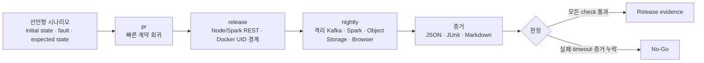

# ETL Full-stack E2E·장애 복구 하네스 계약

## 한눈에 보기

이 하네스는 단위 테스트를 모으는 도구가 아니라, ETL의 **정상 처리·장애 주입·복구·증거 보존**을
같은 시나리오로 검증하는 release evidence 체계입니다. 가장 가벼운 `pr`부터 시작하고,
환경이 준비된 경우에만 `release`, `nightly`로 확장합니다.



| 목적 | 실행 프로필 | 실행 환경 | 실행 명령 |
| --- | --- | --- | --- |
| 빠른 계약 회귀 | `pr` | 로컬 또는 GitHub-hosted CI | `npm run verify:etl-e2e-recovery` |
| process·container 경계 확인 | `release` | 로컬 Docker 또는 수동 dispatch | `npm run verify:etl-e2e-recovery:release` |
| 실제 장애·복구·browser evidence | `nightly` | `asklake-e2e` self-hosted 격리 runner | `npm run verify:etl-e2e-recovery:nightly` |

## 목적

이 계약은 개별 단위 테스트가 아니라 다음 수직 흐름과 복구 경계를 하나의 release evidence로 묶는다.

```text
ETL draft/source
  -> parsing/schema/rule/quality/schedule/permission/target/review
  -> Job create + command
  -> Kafka/Spark worker + checkpoint
  -> output + immutable manifest
  -> Catalog materialization
  -> Dashboard publication + frontend observation
```

제품 런타임에 테스트 전용 우회를 추가하지 않는다. 실제 runtime 경계는 profile 단계에 따라 확장한다.

## Source of truth

- 선언형 시나리오: `backend/scripts/etl-e2e-recovery-scenarios.json`
- 실행기: `backend/scripts/etl_e2e_recovery.py`
- CLI façade: `backend/scripts/verify-etl-e2e-recovery.py`
- registry/artifact 계약: `backend/tests/test_etl_e2e_recovery_harness.py`
- CI: `.github/workflows/refactor-e2e-recovery.yml`

각 시나리오는 `initialState`, `injection`, `expectedState`, `timeoutSeconds`, `recovery`,
`checks`, `evidence`를 가져야 한다. `recovery`는 `automatic` 또는 `operator`다.

고정 sleep으로 성공을 추정하지 않는다. 기존 live 검증기의 `waitFor` condition과 각 check의 timeout을 사용한다. 같은 check를 여러 시나리오가 참조해도 profile 실행에서는 한 번만 수행한다.

## 실행 전제와 프로필

공통 Node.js·Python 환경은 [Development Guide](../../04-development-guide.md)를 따른다.
`release`는 Docker를 요구한다. `nightly`는 필요한 dependency와 전체 stack이 사전에 준비된
`self-hosted + asklake-e2e` 격리 runner에서만 실행한다. workflow가 격리 stack을 자동으로 provisioning하지 않는다.

| 프로필 | 증명하는 것 | 증명하지 않는 것 |
|---|---|---|
| `pr` | application contract, ephemeral 저장소, frontend ordering, backward compatibility | 실제 process·container, Kafka·Spark·Object Storage |
| `release` | `pr` 범위, Node/Spark REST process, Docker UID·mount, production runtime contract | 실제 Kafka·Object Storage 전체 E2E와 운영 복구 |
| `nightly` | `pr+release` 범위, 격리 Kafka·Spark·Object Storage·API·Frontend·Browser, fault·soak | Production 배포 승인과 운영 환경 성능 보장 |

프로필은 누적된다. `release`는 `pr` checks를, `nightly`는 `pr+release` checks를 먼저 실행한다. 실패한 check가 하나라도 있으면 profile은 실패하고 JSON/JUnit의 관련 시나리오도 실패한다.

## 실행

```bash
cd backend

# PR 계약: 외부 stack 불필요
npm run verify:etl-e2e-recovery

# 실제 Node/Spark REST process와 Docker UID 185 경계
npm run verify:etl-e2e-recovery:release

# 사전에 격리 stack을 시작한 self-hosted runner 전용
ASKLAKE_E2E_ISOLATED_ENV=true \
ASKLAKE_CONTINUOUS_E2E_BASE_URL=http://127.0.0.1:8080 \
ASKLAKE_E2E_FRONTEND_URL=http://127.0.0.1:5174 \
ASKLAKE_FASTAPI_PYTHON=.venv/bin/python \
npm run verify:etl-e2e-recovery:nightly
```

CLI 선택과 artifact 형식만 확인할 때는 npm의 `--` 뒤에 option을 전달한다.

```bash
cd backend

npm run verify:etl-e2e-recovery -- --list
npm run verify:etl-e2e-recovery -- --dry-run
npm run verify:etl-e2e-recovery -- \
  --output-dir ../.artifacts/etl-e2e-recovery
```

`--list`는 scenario와 최소 profile을 출력한다. `--dry-run`은 check를 실행하지 않고 선택 결과와 artifact 형식을 검증하며,
report status는 실제 통과를 뜻하는 `passed`가 아니라 `planned`다. `--output-dir`은 artifact 저장 위치를 바꾼다.

## 안전 경계

- nightly는 `ASKLAKE_E2E_ISOLATED_ENV=true`가 없으면 실행하지 않는다.
- API와 frontend URL의 hostname은 loopback만 허용한다.
- runner는 AWS/MinIO static credential 환경변수를 child process에 전달하지 않는다.
- production data, production consumer group, 공유 topic/table/dashboard에 fault를 주입하지 않는다.
- test fault hook은 이미 존재하는 opt-in 변수만 사용하며 제품 기본값은 항상 비활성이다.
- 실패 cleanup은 생성한 Job/Dashboard/container/temp directory만 대상으로 한다. checkpoint나 운영 데이터를 포괄 삭제하지 않는다.
- live verifier는 고유 Job·Dashboard·Kafka topic을 best-effort 정리하고, 고유 Catalog/Iceberg target을 포함한 전체 저장소 정리는 격리 stack 폐기로 수행한다.

## 복구 판정

성공은 단순히 public status가 `running`인 것으로 판정하지 않는다.

1. desired state와 observed worker attempt가 같은 command/state revision에 수렴한다.
2. Kafka cursor와 checkpoint가 뒤로 이동하지 않는다.
3. `consumed = stored + quarantined - replayed`가 성립한다.
4. manifest source range와 Iceberg snapshot/table identity가 일치한다.
5. 같은 run/boundary 재시도에서 output, Catalog run, Dashboard publication이 중복되지 않는다.
6. report가 missing/corrupt/permission denied이면 상태를 구분하고 불확실한 증거로 destructive cleanup하지 않는다.
7. frontend는 더 오래된 `stateRevision/updatedAt` 응답을 버린다.
8. rollback reader는 additive field를 무시하면서 기존 public/persisted shape를 읽는다.

자동 복구 시나리오는 같은 evidence로 reconcile을 반복했을 때 추가 side effect 없이 같은 canonical state에 도달해야 한다.
`operator` 시나리오는 안전한 사용자 메시지와 correlation/diagnostic ID, 필요한 운영자 action을 남겨야 한다.

## 증거와 보존

각 실행은 동일한 `e2e-<uuid>`를 `ASKLAKE_E2E_CORRELATION_ID`와 `ASKLAKE_CORRELATION_ID`로 child process에 전달한다.

```text
.artifacts/etl-e2e-recovery/
├── recovery-report.json
├── recovery-junit.xml
└── recovery-summary.md
```

JSON은 check command, status, bounded/redacted stdout·stderr, 시나리오 판정을 포함한다.
JUnit은 CI test report용이고 Markdown은 운영자 handoff용이다.
secret-like key/value는 artifact 기록 전에 `[REDACTED]`로 바꾼다.
GitHub Actions는 성공·실패와 관계없이 artifact를 업로드한다.

Command exit code만으로 Go를 판정하지 않는다. report status, `failed`·`timed_out` check,
scenario evidence와 세 artifact의 존재를 함께 확인한다.

## Browser와 API 분리

API 수직 흐름은 Kafka E2E가 source→Job→worker→Catalog→Dashboard를 실제 endpoint로 검증한다.
browser 검증은 `frontend/scripts/verify-etl-browser-smoke.mjs`가 headless Chromium process로
격리 frontend의 `/login`을 열고 stable semantic selector를 확인한다.
UI selector는 CSS class나 화면 문구가 아니라 다음 값을 사용한다.

- `auth-login-form`
- `continuous-runtime-card`
- `continuous-diagnostic-id`

browser smoke는 API 수직 흐름의 대체물이 아니며, 두 결과가 모두 있는 nightly run만 full-stack browser evidence로 인정한다.

## Cleanup과 잔여 Resource

Verifier는 자신이 만든 고유 Job, Dashboard, Kafka topic, container와 temp directory만 best-effort 정리한다.
실패한 실행은 correlation ID를 기준으로 다음 항목을 확인한다.

- 고유 Job·Dashboard·Kafka topic이 남았는지
- 임시 container·directory와 미완료 worker가 남았는지
- checkpoint와 cursor가 마지막 증거와 일치하는지
- JSON·JUnit·Markdown artifact가 생성됐는지

Checkpoint, warehouse root, 공유 topic·table을 포괄 삭제하지 않는다.
고유 Catalog·Iceberg target을 포함한 전체 정리는 격리 stack 폐기 절차에서만 수행한다.

## Release 판정

- 일반 PR: `pr` profile과 기존 backend/frontend build·quality ratchet 통과
- 배포 후보: `release` profile 통과, artifact 첨부
- Kafka/Spark/Continuous 변경: 격리 runner의 최신 `nightly` profile 통과
- 실패/timeout/누락 artifact: No-Go
- operator recovery 시나리오의 runbook 또는 diagnostic ID 누락: No-Go
- production credential 또는 non-loopback target 감지: 실행 전 차단

이 계약은 Production 배포 승인을 자동으로 의미하지 않는다.
최종 Go/No-Go, 배포 순서와 rollback은 [Deployment Runbook](../../deployment-runbook.md)과 승인된 운영 절차에서 판단한다.

## 관련 문서

| 주제 | 문서 |
|---|---|
| 개발 환경과 대표 검증 | [Development Guide](../../04-development-guide.md) |
| Backend 준비 상태 | [Backend Integration Readiness](../../backend-integration-readiness.md) |
| MinIO·Spark 검증 | [MinIO·Spark Validation Harness](../../minio-100gb-spark-harness.md) |
| Realtime 운영 | [Realtime Production Runbook](../../realtime-2026/production-runbook.md) |
| 배포·health·rollback | [Deployment Runbook](../../deployment-runbook.md) |
| 리팩터링 이전 검증 결과 | [2026-07-16 Test Baseline](../baseline/test-command-map.md) |
