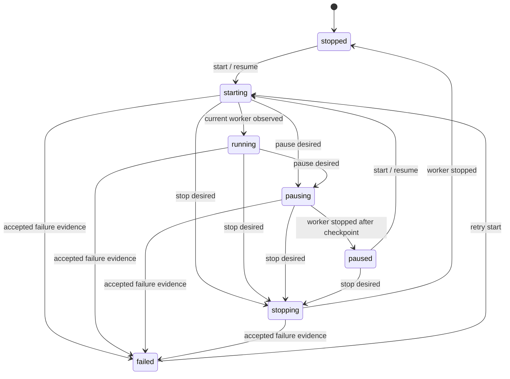

# Kafka Continuous runtime 상태·오류 소유권

- 계약 버전: `1.0`
- 적용 범위: Kafka `executionMode=continuous` control plane
- 호환 저장 위치: `kafka_continuous_runtimes.metrics.runtimeContract`
- 기존 API·DB field 제거: 없음

이 문서는 명령, worker 관찰, 공개 상태를 구분하는 canonical contract다. 브라우저 polling 결과, Docker 상태, Spark report 중 어느 하나도 단독 source of truth가 아니다.

## 상태 층위

| 층위 | 값 | canonical writer | 의미 |
|---|---|---|---|
| desired state | `running`, `paused`, `stopped` | backend command transaction | 사용자가 원하는 상태 |
| observed state | `unknown`, `starting`, `running`, `stopping`, `stopped`, `failed` | backend reconciler가 현재 worker 증거를 정규화 | Spark/container/report에서 확인한 물리 상태 |
| public status | 기존 7개 status | 순수 transition policy | desired + accepted observation의 API projection |



`backend/app/domain/continuous_runtime.py`의 정책은 side effect가 없는 순수 함수다. `etl_service.py`는 command와 observation을 이 정책에 입력하고 기존 `runtime.status`를 호환 projection으로 계속 저장한다.

## 사실별 canonical owner

| 사실 | canonical owner / writer | reader | recovery source | retention |
|---|---|---|---|---|
| Job definition | PostgreSQL `etl_jobs`, backend create/update transaction | API, Spark payload builder | DB row와 versioned Rule contract | Job 삭제까지 |
| desired runtime state | `metrics.runtimeContract.desiredState`, command transaction | reconciler, API mapper | 마지막 committed command | runtime row 삭제까지 |
| observed runtime state | `metrics.runtimeContract.observedState`, reconciler | API mapper, 운영 화면 | current worker attempt의 report/container 증거 | 최신 관찰 1개 |
| public status | domain transition policy + 기존 `runtime.status` projection | API/frontend | desired/observed 재계산 | 최신 projection |
| active session | PostgreSQL `kafka_continuous_sessions` | history API, reconciler | latest active session query | Job 삭제까지 |
| lease/fencing | `runtimeContract.activeWorkerAttemptId`; legacy mirror `currentWorkerAttemptId` | report reconciler | worker start response, session `worker_attempt_id` | active attempt 교체까지 |
| command revision | `runtimeContract.stateRevision` | API/frontend stale-response guard | committed runtime metrics | runtime row 삭제까지 |
| Spark submission identity | Spark REST runner result와 session worker attempt | backend runner adapter | durable Spark REST state/report | 운영 runner retention |
| micro-batch identity | completed batch manifest의 source boundary/Run ID | materializer, history API | S3/MinIO completed manifest | Lake retention 정책 |
| Kafka progress | Spark checkpoint + PostgreSQL partition cursor | worker/reconciler | checkpoint와 accepted Catalog cursor | checkpoint/Job 정책 |
| output manifest | completed S3/MinIO manifest | materializer | `_SUCCESS`와 identity 검증 | Lake retention 정책 |
| Catalog materialization | Catalog dataset/materialization transaction | Catalog/API/Trino | verified Iceberg snapshot + manifest | Catalog retention 정책 |
| Dashboard publication | dataset revision commit/widget result tables | Dashboard API | Catalog revision + source ranges | Dashboard revision 정책 |
| terminal error | `runtimeContract.lastError`; `last_error`는 문자열 호환 field | API/frontend/운영 화면 | accepted report, reconciler, publication 단계 | 다음 command/정상 관찰까지 |

## Command policy

| command | 허용 시작 상태 | desired | 즉시 public 상태 |
|---|---|---|---|
| `startContinuous`, `resumeContinuous` | `paused`, `stopped`, `failed` | `running` | `starting` |
| `pauseContinuous` | `starting`, `running` | `paused` | `pausing` |
| `stopContinuous` | `starting`, `running`, `pausing`, `paused`, `failed` | `stopped` | `stopping` |

중복 start/resume의 active 상태는 기존처럼 `409`; 잘못된 pause/stop 상태는 `422`다. Command가 commit될 때 `stateRevision`이 증가한다. Worker heartbeat와 batch 관찰은 같은 command revision 안에서 revision을 증가시키지 않는다.

## Fencing 규칙

1. worker start 응답의 `workerAttemptId`가 active fencing token이다.
2. report와 active token이 모두 존재하면 반드시 같아야 한다.
3. 다른 token의 report는 runtime counter, checkpoint, public status를 갱신하지 않고 `reconciliation/stale_worker_observation`으로 기록한다.
4. contract 도입 전 report처럼 한쪽 token이 없으면 하위 호환을 위해 허용한다.
5. 새 command revision과 worker attempt를 받은 frontend는 더 작은 revision의 polling response를 적용하지 않는다. 같은 revision은 서버 `updatedAt`이 더 최신일 때만 적용한다.

## 오류 계약

`continuousRuntime.lastError`는 기존 client용 문자열로 유지한다. 신규 `continuousRuntime.errorDetail`은 다음 additive shape다.

```ts
type ContinuousRuntimeErrorDetail = {
  stage:
    | "validation"
    | "runtime_storage"
    | "submission"
    | "execution"
    | "report"
    | "checkpoint"
    | "materialization"
    | "catalog"
    | "dashboard_publication"
    | "reconciliation";
  code: string;
  message: string;
  retryable: boolean;
  context?: Record<string, unknown>;
};
```

- 새 command는 이전 structured error를 지운다.
- 정상 report가 들어오고 별도 publication 오류가 없으면 report/reconciliation 오류를 지운다.
- Catalog/Dashboard의 canonical 성공 여부는 각 저장소가 소유한다. runtime error는 해당 단계의 실패 진단 projection일 뿐 성공 source of truth가 아니다.
- contract 도입 전 `lastError`는 read-time classifier로 stage/code를 보완하며 DB row를 일괄 rewrite하지 않는다.
- credential, 원문 payload, 전체 stack trace는 context에 넣지 않는다.

## 호환성과 rollback

- DB migration 없이 기존 nullable `metrics` JSON을 사용한다.
- 구버전 runtime은 현재 `status`, `currentWorkerAttemptId`, `lastError`에서 desired/observed/fence/error를 읽기 시점에 유도한다.
- 기존 `status`, `lastError`, command response와 checkpoint/report schema는 제거하거나 이름을 바꾸지 않는다.
- rollback은 domain mapper와 command/reconcile wiring, additive API field, frontend stale guard를 함께 되돌린다. 저장된 `runtimeContract` JSON은 구버전 코드가 무시하므로 삭제할 필요가 없다.
